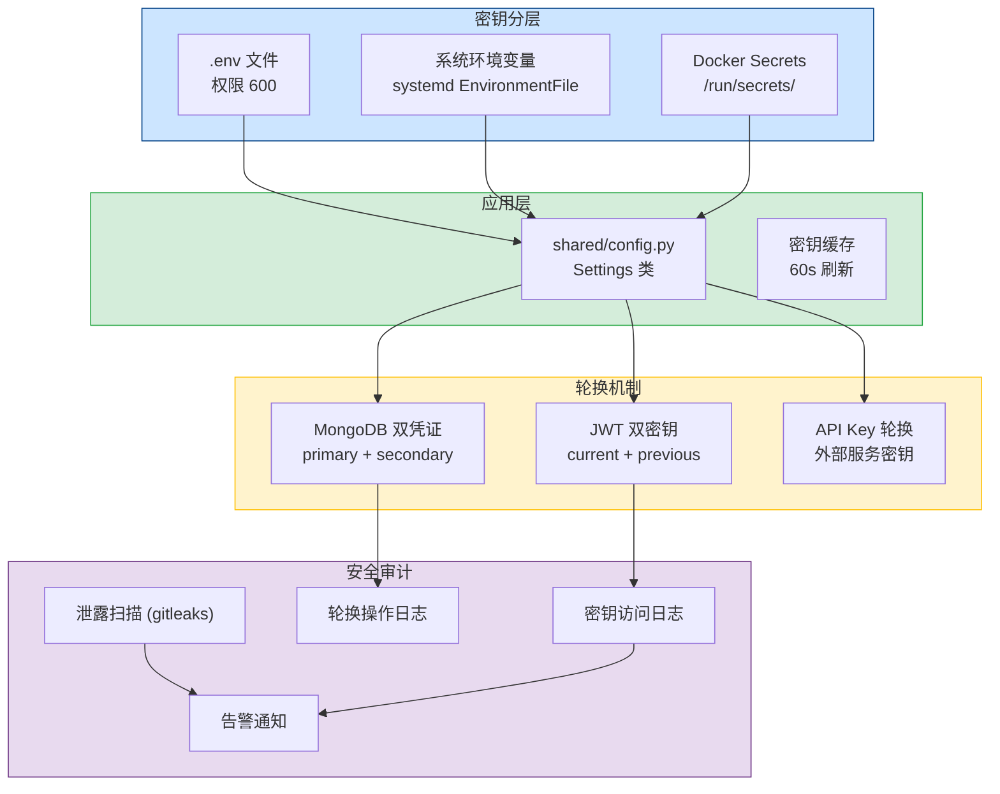
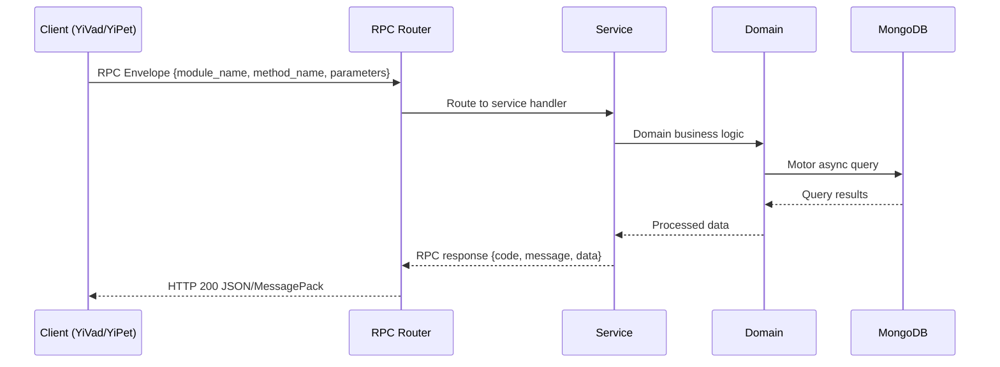

---

doc_type: module
prd_task_id: "YA-09-22"
title: "YA-09-22: 密钥管理与凭证轮换 — JWT + MongoDB + 泄露检测 — 开发方案"
status: 需求已编写
priority: P1
owner: 陈铭
roles: [engineer]
created: 2026-09-11
updated: 2026-09-14
project: YiAi
project_id: yiai
prd_month: "202609"
estimate_frontend: 1.5
source_prd: "139-需求-密钥管理与凭证轮换.md"
source_okr: [yiai-001]

type: task
---

# YA-09-22: 密钥管理与凭证轮换 — JWT + MongoDB + 泄露检测

> **文档职责**：本文档定义**怎么做、为什么这么做、实际做成什么样**（HOW），不含产品目标与测试用例。

> 来源 PRD：[139-需求-密钥管理与凭证轮换.md](../../prds/2026-09/139-需求-密钥管理与凭证轮换.md)
> 需求编号：YA-09-22 · 优先级：P1 · 人天：1.5 · 状态：需求已编写
> 类型：功能 · 依赖：无 · 前置需求：无

---

<a id="sec-1"></a>
## 一、架构概览 / Architecture Overview

YA-09-133: 密钥管理与凭证轮换 — JWT 密钥轮换 + MongoDB 凭证轮换 + 密钥审计 + 泄露检测


```mermaid
flowchart TD
  subgraph Secrets["密钥分层"]
    ENV_FILE[".env 文件<br/>权限 600"]
    SYS_ENV["系统环境变量<br/>systemd EnvironmentFile"]
    DOCKER_SECRET["Docker Secrets<br/>/run/secrets/"]
  end

  subgraph App["应用层"]
    CONFIG["shared/config.py<br/>Settings 类"]
    CACHE["密钥缓存<br/>60s 刷新"]
  end

  subgraph Rotation["轮换机制"]
    JWT_ROTATION["JWT 双密钥<br/>current + previous"]
    MONGO_ROTATION["MongoDB 双凭证<br/>primary + secondary"]
    API_ROTATION["API Key 轮换<br/>外部服务密钥"]
  end

  subgraph Audit["安全审计"]
    ACCESS_LOG["密钥访问日志"]
    ROTATION_LOG["轮换操作日志"]
    LEAK_SCAN["泄露扫描 (gitleaks)"]
    ALERT["告警通知"]
  end

  ENV_FILE --> CONFIG
  SYS_ENV --> CONFIG
  DOCKER_SECRET --> CONFIG
  CONFIG --> JWT_ROTATION
  CONFIG --> MONGO_ROTATION
  CONFIG --> API_ROTATION
  JWT_ROTATION --> ACCESS_LOG
  MONGO_ROTATION --> ROTATION_LOG
  LEAK_SCAN --> ALERT
  ACCESS_LOG --> ALERT

  style Secrets fill:#cce5ff,stroke:#004085
  style App fill:#d4edda,stroke:#28a745
  style Rotation fill:#fff3cd,stroke:#ffc107
  style Audit fill:#e8daef,stroke:#6c3483
```

<a id="sec-2"></a>
## 二、文件清单 / File Manifest

| 文件 / File | 操作 | 说明 / Description |
|-------------|------|--------------------|
| `YiAi/src/services/xxx/service.py` | 新增 | Core service logic
| `YiAi/src/services/xxx/rpc_handler.py` | 新增 | RPC route handler
| `YiAi/tests/test_xxx.py` | 新增 | Unit tests

> Source PRD: 139-需求-密钥管理与凭证轮换.md

<a id="sec-3"></a>
## 三、Python 签名与核心组件 / Python Signatures

### 3.1 核心组件

```python
import os
import secrets
from typing import Optional
from pydantic_settings import BaseSettings
from shared.logging import get_logger
class Settings(BaseSettings):
    """应用配置，支持密钥版本管理。"""
    # ============================================================
    # JWT 密钥（支持双密钥轮换）
    # ============================================================
    # ============================================================
    # MongoDB 凭证
    # ============================================================
    # ============================================================
    # Redis 凭证
    # ============================================================
    # ============================================================
    # 外部服务 API 密钥
    # ============================================================
    # ============================================================
    class Config:
    def get_jwt_secrets(self) -> list[str]:
    def get_mongo_uris(self) -> list[str]:
    def validate_secrets(self) -> list[str]:
```
### 3.2 组件 2

```python
import time
from typing import Optional
import jwt
from shared.config import settings
from shared.logging import get_logger
def verify_jwt_token(token: str) -> Optional[dict]:
    """验证 JWT token，支持双密钥（轮换过渡期）。"""
    # 先尝试当前密钥
            return payload
            return None  # token 过期，不需要尝试其他密钥
    return None
def create_jwt_token(user_id: str, expires_in: Optional[int] = None) -> str:
    """创建 JWT token，始终使用当前密钥签名。"""
    if expires_in is None:
    return jwt.encode(payload, settings.jwt_secret, algorithm=settings.jwt_algorithm)
def rotate_jwt_secret() -> dict:
    """轮换 JWT 密钥。"""
    import secrets
    # 保存旧密钥到 previous，新密钥为 current
    return {
def cleanup_old_jwt_secret():
```
### 3.3 组件 3

```python
import secrets
from motor.motor_asyncio import AsyncIOMotorClient
from shared.config import settings
from shared.logging import get_logger
async def rotate_mongo_credentials() -> dict:
    """
    """
    # 1. 解析当前 URI
    from urllib.parse import urlparse, urlunparse
    # 2. 生成新凭证
    # 3. 使用当前凭证连接 MongoDB，创建新用户
        if "already exists" in str(e):
        else:
    # 4. 构建新 URI
    # 5. 验证新凭证
        return {"status": "failed", "error": f"新凭证验证失败: {e}"}
    # 6. 更新配置（使用备用 URI 过渡）
    # 7. 删除旧用户（延迟执行，确保新凭证稳定）
    # 注意：此处不立即删除旧用户，留待运维确认后手动删除
    return {
async def rotate_redis_password() -> dict:
    import redis.asyncio as redis_lib
```

<a id="sec-4"></a>
## 四、数据流 / Data Flow


```mermaid
sequenceDiagram
    participant C as Client (YiVad/YiPet)
    participant R as RPC Router
    participant S as Service
    participant D as Domain
    participant M as MongoDB

    C->>R: RPC Envelope {module_name, method_name, parameters}
    R->>S: Route to service handler
    S->>D: Domain business logic
    D->>M: Motor async query
    M-->>D: Query results
    D-->>S: Processed data
    S-->>R: RPC response {code, message, data}
    R-->>C: HTTP 200 JSON/MessagePack
```

**Call chain**: `Client -> RPC Router -> Service -> Domain -> MongoDB`  
**Response format**: `{code: 0, message: "ok", data: ...}`  
**Async model**: Full-chain `async/await`, Motor async MongoDB driver.  
**Error propagation**: Service exceptions caught by middleware -> standard error codes (1001-9999).

<a id="sec-5"></a>
## 五、实施路线图 / Roadmap

**预估人天 / Estimated**: 1.5

| 步骤 / Step | 操作 / Action | 路径 / Path | 验证 / Verification | 人天 / Days |
|-------------|---------------|-------------|---------------------|-------------|
| 1 | 更新 `config.py` 支持双密钥和密钥版本管理 | `shared/config.py` | 新配置项可正常读取，`validate_secrets()` 返回警告 | 0.05 |
| 2 | 修改 `auth.py` 支持双密钥验证 + 轮换函数 | `shared/auth.py` | 新旧 token 均可通过验证，轮换函数生成新密钥 | 0.1 |
| 3 | 实现 MongoDB 凭证轮换服务 | `services/security/credential_rotation.py` | 双凭证平滑切换，零停机 | 0.1 |
| 4 | 实现密钥审计日志 | `services/security/audit_logger.py` | 密钥使用、轮换、访问拒绝均有日志 | 0.05 |
| 5 | 配置 GitLeaks 泄露检测 | `.gitleaks.toml` | `gitleaks detect` 扫描不误报，覆盖 JWT/MongoDB/Redis | 0.05 |
| 6 | 配置 pre-commit 检查 | `.pre-commit-config.yaml` | `git commit` 时自动检测密钥，阻止提交 | 0.05 |
| 7 | 更新 `.env.example` 和 `.gitignore` | `.env.example`, `.gitignore` | 确保 `.env` 排除，`.env.example` 提供模板 | 0.02 |
| 8 | 全链路测试：密钥轮换 + 泄露检测 | 全模块 | 轮换后服务正常，检测到泄露时告警 | 0.08 |
| 风险 | 概率 | 影响 | 等级 | 缓解措施 | 应急预案 |
| 密钥轮换后新密钥配置错误导致服务无法启动 | 低 | 高 | 中 | 轮换前验证新密钥可用性，保留旧密钥备份 | 回滚配置到旧密钥，重启服务 |
| JWT 过渡期内旧密钥未清除导致安全风险 | 中 | 中 | 低 | 过渡期设 24 小时，自动清除旧密钥 | 手动清除 `jwt_secret_previous` 配置 |
| `.env` 文件误提交到 git 仓库 | 中 | 高 | 高 | pre-commit + CI 双重检查，`.gitignore` 确保排除 | 发现后立即轮换所有密钥，重写 git 历史（`git filter-branch`） |

<a id="sec-6"></a>
## 六、代码审查检查清单 / Review Checklist

- [ ] `Settings` 类支持 `jwt_secret_previous` 和 `mongo_uri_secondary` 双密钥配置
- [ ] `verify_jwt_token()` 遍历所有有效密钥（`get_jwt_secrets()`）尝试验证
- [ ] `create_jwt_token()` 始终使用 `jwt_secret`（当前密钥）签名
- [ ] `rotate_jwt_secret()` 将旧密钥保存到 `previous`，新密钥设为 `current`
- [ ] `cleanup_old_jwt_secret()` 在过渡期结束后清除旧密钥
- [ ] MongoDB 凭证轮换先创建新用户再切换，验证通过后才更新配置
- [ ] 密钥审计日志仅记录 key_hash 和 operation，不记录密钥明文
- [ ] GitLeaks 配置排除 `.env.example`、测试文件、文档文件
- [ ] pre-commit 配置包含 `gitleaks` 和 `detect-private-key`
- [ ] `.env` 文件权限设置为 `600`（`chmod 600 .env`）
- [ ] `.gitignore` 确认 `.env` 已排除
- [ ] `settings.validate_secrets()` 在启动时检查默认密钥
- [ ] `ruff` 代码规范通过
- [ ] `mypy` 类型检查通过
---
## 十二、回归问题预测
| # | 问题 | 发现场景 | 根因 | 修复方式 |

<a id="sec-7"></a>
## 七、风险表 / Risk Table

| 风险 / Risk | 影响 / Impact | 缓解措施 / Mitigation | 应急预案 / Contingency |
|-------------|---------------|----------------------|------------------------|
| 密钥轮换后新密钥配置错误导致服务无法启动 | 低 | 高 | 中 |
| JWT 过渡期内旧密钥未清除导致安全风险 | 中 | 中 | 低 |
| `.env` 文件误提交到 git 仓库 | 中 | 高 | 高 |
| GitLeaks 扫描误报导致提交阻塞 | 中 | 低 | 低 |
| MongoDB 凭证轮换期间连接中断 | 低 | 高 | 中 |
| 密钥审计日志量过大 | 低 | 低 | 低 |
| 场景 | 回滚方式 | 回滚时间 | 风险 |
| JWT 密钥轮换后验证失败 | 恢复 `jwt_secret_previous` 为 `jwt_secret`，`jwt_secret` 为之前的值 | < 1min | 低：配置回滚，服务重启即可 |
| MongoDB 凭证轮换后连接失败 | 恢复 `mongo_uri` 为旧 URI，`mongo_uri_secondary` 设为 None | < 1min | 低：配置回滚，服务重启即可 |
| pre-commit 阻止合法提交 | 临时跳过：`SKIP=gitleaks git commit` | < 1min | 低：需确认跳过原因，事后修复 |
