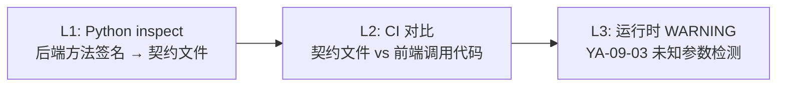

# YA-09-04: RPC 契约测试与前后端类型同步 — 参数名漂移自动检测 — 开发方案

> **文档职责**：本文档定义**怎么做、为什么这么做、实际做成什么样**（HOW），不含产品目标与测试用例。

> 来源 PRD：[14-需求-RPC契约测试与类型同步.md](../../prds/2026-09/14-需求-RPC契约测试与类型同步.md)
> 需求编号：YA-09-04 · 优先级：P0 · 人天：2.5d · 状态：需求已编写

---

<a id="sec-1"></a>
## 一、问题

`filter`/`query` 参数名不匹配是最常见的跨项目 bug——前端传 `query`，后端 `_build_filter` 静默忽略，导致全表查询。当前无任何自动化检测。

---

<a id="sec-2"></a>
## 二、方案：三层检测



### L1: Python → 契约文件

```python
# 自动从方法签名生成契约
import inspect

def extract_contract(method):
    sig = inspect.signature(method)
    return {
        "params": list(sig.parameters.keys()),
        "return_type": str(sig.return_annotation),
    }
```

### L2: CI 对比

CI 中运行脚本，对比后端契约文件与前端 TypeScript 调用代码中的参数名，不一致时报错。

### L3: 运行时

复用 [YA-09-03 API 契约校验](./08-prd-task-API契约校验.md) 的 WARNING 机制。

---

<a id="sec-3"></a>
## 三、实施步骤

| 步骤 | 内容 | 验证 | 人天 |
|------|------|------|------|
| 1 | Python 方法签名 → 契约文件导出 | 契约文件自动生成 | 0.75 |
| 2 | CI 中对比 TypeScript 调用代码 | PR 中参数名漂移被 CI 拦截 | 1.0 |
| 3 | 集成到 pre-commit + 测试 | 本地提交即可检测 | 0.75 |

**合计：2.5d**。

---

<a id="sec-4"></a>
## 四、关联模块

- 依赖：[YA-09-03 API 契约校验](./08-prd-task-API契约校验.md)

---

## 五、已知缺口与技术债

### 功能缺口

| # | 缺口 | 影响 | 建议 |
|---|------|------|------|
| 1 | 契约文件仅支持 Python→TS 单向导出 | TS 端参数变更无法自动同步到 Python | 双向契约同步 |

### 技术债

| # | 技术债 | 优先级 | 预计人天 | 说明 | 状态 |
|---|--------|--------|---------|------|------|
| 1 | 契约导出手动触发 | P3 | 0.1 | 非 CI 自动化 | 待实施 |
- 依赖：[YA-07-03 RPC 信封协议](../2026-07/03-prd-task-RPC信封协议.md)