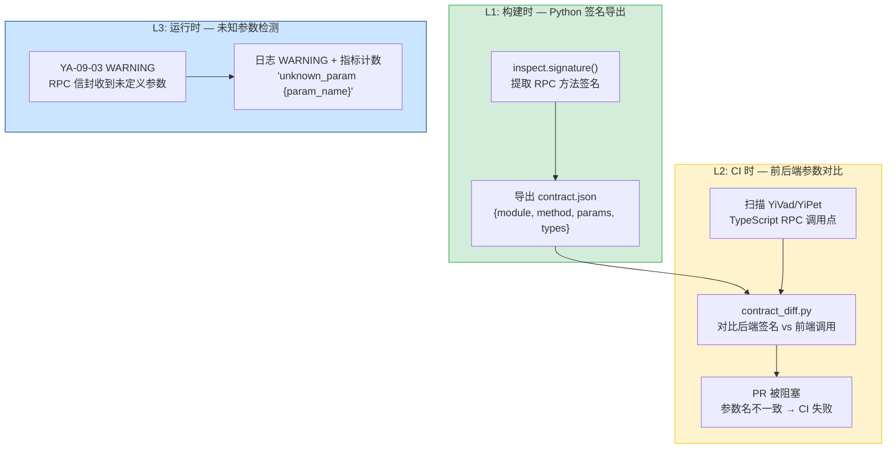

---

doc_type: module
prd_task_id: "YA-09-04"
title: "YA-09-04: RPC 契约测试与前后端类型同步 — Python inspect → CI 对比 → 运行时 WARNING 三层检测 — 开发方案"
status: 需求已编写
priority: P0
owner: 陈铭
roles: [engineer]
created: 2026-09-11
updated: 2026-09-23
project: YiAi
project_id: yiai
prd_month: "202609"
estimate_frontend: 2.5
source_prd: "14-需求-RPC契约测试与类型同步.md"
source_okr: [yiai-001]
related_tests: ["14-prd-test-RPC契约测试与类型同步"]

type: task
---

# YA-09-04: RPC 契约测试与前后端类型同步 — 参数名漂移自动检测 — 开发方案

> 来源 PRD：[14-需求-RPC契约测试与类型同步.md](../../prds/2026-09/14-需求-RPC契约测试与类型同步.md)
> 需求编号：YA-09-04 · 优先级：P0 · 人天：2.5d
> 类型：质量基础设施 · 状态：需求已编写

---

## 一、架构概述

`filter`/`query` 参数名不匹配是 YiAi 跨项目最常见的 bug 模式——前端传 `query`，后端 `_build_filter` 从 `filter` 读取、静默忽略 `query`，导致全表查询。当前无任何自动化检测。本方案建立三层检测体系：L1 (Python inspect 自动导出契约文件) → L2 (CI 对比前端 TypeScript 调用代码) → L3 (运行时 WARNING 未知参数检测)。


```mermaid
graph TD
  subgraph L1["L1: 构建时 — Python 签名导出"]
    INSPECT["inspect.signature()<br/>提取 RPC 方法签名"]
    EXPORT["导出 contract.json<br/>{module, method, params, types}"]
  end

  subgraph L2["L2: CI 时 — 前后端参数对比"]
    TS_SCAN["扫描 YiVad/YiPet<br/>TypeScript RPC 调用点"]
    DIFF["contract_diff.py<br/>对比后端签名 vs 前端调用"]
    BLOCK["PR 被阻塞<br/>参数名不一致 → CI 失败"]
  end

  subgraph L3["L3: 运行时 — 未知参数检测"]
    RUNTIME["YA-09-03 WARNING<br/>RPC 信封收到未定义参数"]
    ALERT["日志 WARNING + 指标计数<br/>'unknown_param {param_name}'"]
  end

  INSPECT --> EXPORT
  EXPORT --> DIFF
  TS_SCAN --> DIFF
  DIFF --> BLOCK
  RUNTIME --> ALERT

  style L1 fill:#d4edda,stroke:#28a745
  style L2 fill:#fff3cd,stroke:#ffc107
  style L3 fill:#cce5ff,stroke:#004085
```

---

## 二、文件清单

| # | 文件 | 操作 | 说明 | 预估行数 |
|---|------|------|------|----------|
| 1 | `scripts/export_rpc_contract.py` | 新增 | Python inspect 提取所有 RPC 方法签名 → `contract.json` | ~80 |
| 2 | `scripts/scan_ts_rpc_calls.py` | 新增 | AST 扫描 YiVad/YiPet 的 TypeScript RPC 调用 | ~100 |
| 3 | `scripts/contract_diff.py` | 新增 | 对比后端契约 vs 前端调用 → CI 报告 | ~70 |
| 4 | `contracts/rpc_contract.json` | 新增 | 自动生成的 RPC 契约文件 (检入 Git) | 自动生成 |
| 5 | `contracts/rpc_contract.schema.json` | 新增 | JSON Schema 验证契约文件格式 | ~40 |
| 6 | `.github/workflows/contract-check.yml` | 新增 | CI pipeline: export → scan → diff | ~30 |
| 7 | `config.yaml` | 修改 | 新增 `runtime.unknown_param_warning` 开关 | +5 |

**改动汇总：** 5 新增 + 2 修改 = **7 文件，~325 行**

---

## 三、模块设计

### 3.1 L1: Python 签名导出 — `scripts/export_rpc_contract.py`

```python
"""自动提取所有 RPC 方法的参数签名，导出为 contract.json。

运行: python scripts/export_rpc_contract.py

contract.json 结构:
{
  "version": "1.0",
  "generated_at": "2026-09-23T10:00:00",
  "services": {
    "services.database.data_service": {
      "methods": {
        "query_documents": {
          "parameters": ["filter", "cname", "page_size", "page_num"],
          "required": ["filter", "cname"],
          "parameter_types": {
            "filter": "dict", "cname": "str",
            "page_size": "int (default: 20)", "page_num": "int (default: 1)"
          }
        },
        "create_document": { ... },
        ...
      }
    },
    ...
  }
}
"""

import inspect
import json
import importlib
from pathlib import Path

RPC_SERVICE_MAP = {
    "services.database.data_service": "data_service.DataService",
    "services.ai.chat_service": "chat_service.ChatService",
    "services.ai.agent_service": "agent_service.AgentService",
    "services.rag.rag_service": "rag_service.RAGService",
    "services.search.search_service": "search_service.SearchService",
    "services.audit.audit_service": "audit_service.AuditService",
    "services.users.user_service": "user_service.UserService",
}


def extract_service_contract(module_path: str, class_path: str) -> dict:
    """使用 inspect.signature() 提取一个 Service 类的所有公开方法签名。"""
    module = importlib.import_module(module_path)
    cls = getattr(module, class_path.split(".")[-1])

    methods = {}
    for name, method in inspect.getmembers(cls, predicate=inspect.isfunction):
        if name.startswith("_"):
            continue

        sig = inspect.signature(method)
        params = list(sig.parameters.keys())
        # 排除 self 和内部参数
        public_params = [p for p in params if p not in ("self", "cls", "db", "config")]

        required = [
            p for p in public_params
            if sig.parameters[p].default is inspect.Parameter.empty
        ]

        param_types = {}
        for p in public_params:
            ann = sig.parameters[p].annotation
            if ann is not inspect.Parameter.empty:
                dtype = str(ann).replace("<class '", "").replace("'>", "")
            else:
                dtype = "Any"
            if sig.parameters[p].default is not inspect.Parameter.empty:
                dtype += f" (default: {sig.parameters[p].default})"
            param_types[p] = dtype

        methods[name] = {
            "parameters": public_params,
            "required": required,
            "parameter_types": param_types,
        }

    return {"methods": methods}


def export_contract(output_path: str = "contracts/rpc_contract.json"):
    """生成完整 RPC 契约文件。"""
    contract = {
        "version": "1.0",
        "generated_at": datetime.now().isoformat(),
        "services": {},
    }

    for module_name, class_name in RPC_SERVICE_MAP.items():
        try:
            contract["services"][module_name] = extract_service_contract(
                module_name.replace(".", "/"), class_name
            )
        except Exception as e:
            logger.warning(f"[Contract] 无法提取 {module_name}: {e}")

    Path(output_path).parent.mkdir(parents=True, exist_ok=True)
    with open(output_path, "w") as f:
        json.dump(contract, f, indent=2, ensure_ascii=False)
    logger.info(f"[Contract] 导出完成: {output_path}")
```

### 3.2 L2: TS 调用扫描 — `scripts/scan_ts_rpc_calls.py`

```python
"""AST 扫描 YiVad/YiPet 中所有 RPC 调用点，提取参数名。

扫描模式:
  1. requestHttp.post('/', { module_name: 'services.xxx', method_name: 'yyy', parameters: {...} })
  2. ApiClient.call('services.xxx', 'yyy', { ... })

输出:
  {
    "calls": [
      {
        "file": "YiVad/src/api/data.ts",
        "line": 42,
        "module": "services.database.data_service",
        "method": "query_documents",
        "parameters": ["query", "cname", "page_size"]  ← 注意: 前端用了 "query" 而非 "filter"
      },
      ...
    ]
  }
"""

import re
import json
from pathlib import Path

def scan_directory(root: str) -> list:
    """递归扫描目录，正则匹配 RPC 调用模式。"""
    calls = []
    root_path = Path(root)

    for ts_file in root_path.rglob("*.ts"):
        if "node_modules" in str(ts_file) or "dist" in str(ts_file):
            continue

        with open(ts_file) as f:
            content = f.read()

        # 模式: module_name: 'services.xxx.xxx', method_name: 'yyy'
        pattern = re.compile(
            r"module_name:\s*['\"]([^'\"]+)['\"].*?"
            r"method_name:\s*['\"]([^'\"]+)['\"].*?"
            r"parameters:\s*\{([^}]+)\}",
            re.DOTALL,
        )

        for match in pattern.finditer(content):
            module = match.group(1)
            method = match.group(2)
            params_block = match.group(3)

            # 提取参数键名
            param_keys = re.findall(r"(\w+)\s*:", params_block)

            # 计算行号
            line = content[:match.start()].count("\n") + 1

            calls.append({
                "file": str(ts_file.relative_to(root_path)),
                "line": line,
                "module": module,
                "method": method,
                "parameters": param_keys,
            })

    return calls
```

### 3.3 L2: CI 对比 — `scripts/contract_diff.py`

```python
"""对比后端契约 vs 前端调用——参数名不一致时报错。

退出码:
  0: 全部一致
  1: 存在不一致 (CI 失败)

输出: Markdown 格式的差异报告，PR comment 中展示。
"""

def diff(contract_path: str, frontend_calls_path: str) -> list:
    """对比契约，返回差异列表。"""
    with open(contract_path) as f:
        contract = json.load(f)
    with open(frontend_calls_path) as f:
        frontend = json.load(f)

    issues = []

    for call in frontend["calls"]:
        module = call["module"]
        method = call["method"]
        frontend_params = set(call["parameters"])

        # 查找后端契约
        service = contract["services"].get(module, {})
        method_contract = service.get("methods", {}).get(method)

        if not method_contract:
            issues.append({
                "severity": "error",
                "file": call["file"],
                "line": call["line"],
                "issue": f"模块 {module} 不存在于契约文件中",
            })
            continue

        backend_params = set(method_contract["parameters"])

        # 前端多传的参数 (后端未定义) → WARNING
        extra = frontend_params - backend_params
        for p in extra:
            issues.append({
                "severity": "warning",
                "file": call["file"],
                "line": call["line"],
                "issue": f"参数 '{p}' 在后端签名中未定义，可能被静默忽略",
                "suggestion": f"请检查是否为拼写错误。后端接受的参数: {sorted(backend_params)}",
            })

        # 前端缺少的参数 (后端 required) → ERROR
        missing = backend_params - frontend_params
        required_params = set(method_contract.get("required", []))
        missing_required = missing & required_params
        for p in missing_required:
            issues.append({
                "severity": "error",
                "file": call["file"],
                "line": call["line"],
                "issue": f"缺少必需参数 '{p}'",
                "suggestion": f"后端 required 参数: {sorted(required_params)}",
            })

    return issues
```

---

## 四、数据流

### 4.1 CI Pipeline (PR 提交时触发)

```
PR 创建/更新
  │
  ▼
CI: contract-check workflow
  │
  ├── Step 1: 导出后端契约
  │     └── python scripts/export_rpc_contract.py
  │         └── → contracts/rpc_contract.json
  │
  ├── Step 2: 检查契约文件是否被修改
  │     └── git diff --exit-code contracts/rpc_contract.json
  │         └── 有变更 → CI 失败: "请同步提交更新的契约文件"
  │
  ├── Step 3: 扫描前端 TS 调用
  │     └── python scripts/scan_ts_rpc_calls.py --root YiVad/src --root YiPet/src
  │         └── → contracts/frontend_rpc_calls.json
  │
  ├── Step 4: 对比
  │     └── python scripts/contract_diff.py contracts/rpc_contract.json contracts/frontend_rpc_calls.json
  │         └── 有差异 → CI 失败 + Markdown 报告
  │
  └── Step 5: (可选) 发布 Markdown 报告到 PR comment
```

---

## 五、实施路线图

| 步骤 | 内容 | 涉及文件 | 验证方式 | 人天 |
|------|------|---------|---------|------|
| 1 | Python inspect → `contract.json` 自动导出 | `export_rpc_contract.py` | 契约文件自动生成, 包含所有 Service 方法 | 0.5 |
| 2 | TypeScript AST/正则扫描 YiVad/YiPet RPC 调用 | `scan_ts_rpc_calls.py` | 扫描出所有 `module_name` + `parameters` 调用点 | 0.75 |
| 3 | CI `contract_diff.py` 对比脚本 | `contract_diff.py` | PR 中参数名漂移被 CI 拦截 | 0.5 |
| 4 | CI pipeline (GitHub Actions / pre-commit) | `.github/workflows/contract-check.yml` | 本地提交即可检测 (pre-commit) | 0.5 |
| 5 | JSON Schema 验证 + 集成测试 | `rpc_contract.schema.json` | 契约文件格式自动校验 | 0.25 |
| **合计** | | | | **2.5d** |

---

## 六、代码审查检查清单

- [ ] `export_rpc_contract.py` 覆盖所有 RPC Service 方法
- [ ] `contract.json` 自动检入 Git (每次修改 Service 签名后必须更新)
- [ ] `scan_ts_rpc_calls.py` 覆盖 YiVad `src/` + YiPet `src/`
- [ ] `contract_diff.py` 区分 ERROR (required 缺失) 和 WARNING (extra 参数)
- [ ] CI 在 PR 创建时自动运行 contract-check pipeline
- [ ] 已知误报模式 (如内部参数 `db`, `config`) 被排除
- [ ] ruff + mypy 通过

---

## 七、技术风险评估

| 风险 | 概率 | 影响 | 等级 | 缓解措施 | 应急预案 |
|------|------|------|------|---------|---------|
| Python inspect 无法提取所有参数 (类型擦除) | 低 | 中 | 低 | 使用 type hints + 手动标注不可提取的方法 | 对无法提取的方法标记 `"extraction": "manual_review"` |
| TS 正则扫描漏掉/误报部分调用 | 中 | 中 | 中 | 使用 TypeScript AST (`ts-morph`) 替代正则 | 降级为正则 + 人工审查可疑项 |
| 新增 Service 方法忘记更新 contract.json (CI 发现但开发流程繁琐) | 中 | 低 | 低 | CI 在 PR 中自动检测: `git diff contracts/rpc_contract.json` | — |
| 不同项目 (YiVad vs YiPet) 使用相同 module_name 但参数不同 | 低 | 高 | 中 | 契约文件以 YiAi 后端为准 (单一真相来源) | 特殊情况允许 `aliases` 映射 |

---

## 八、已知缺口与技术债务

| # | 技术债 | 优先级 | 预计人天 | 说明 | 状态 |
|---|--------|--------|---------|------|------|
| 1 | 契约文件仅支持 Python→TS 单向导出 | P2 | 0.3 | TS 端参数变更无法自动同步到 Python | 待设计 |
| 2 | TypeScript 扫描目前使用正则，应用 `ts-morph` AST | P2 | 0.2 | AST 更精确但依赖额外包 | 待实施 |
| 3 | 未包含响应类型校验 (仅检查参数名) | P3 | 0.5 | 响应类型不匹配同样导致 bug | 待设计 |
| 4 | 手动运行 `export_rpc_contract.py` 而非 pre-commit hook | P3 | 0.1 | 开发者在修改 Service 签名后可能忘记运行 | 待自动化 |

---

## 九、关联模块

- L3 运行时：[YA-09-03 API 契约校验](./08-prd-task-API契约校验.md)（未知参数 WARNING 机制）
- 基础设施：[YA-07-03 RPC 信封协议](../2026-07/03-prd-task-RPC信封协议.md)（被检测的目标协议）
- 所有 Service 文件——每次新增/修改 RPC 方法签名后需更新 `contract.json`