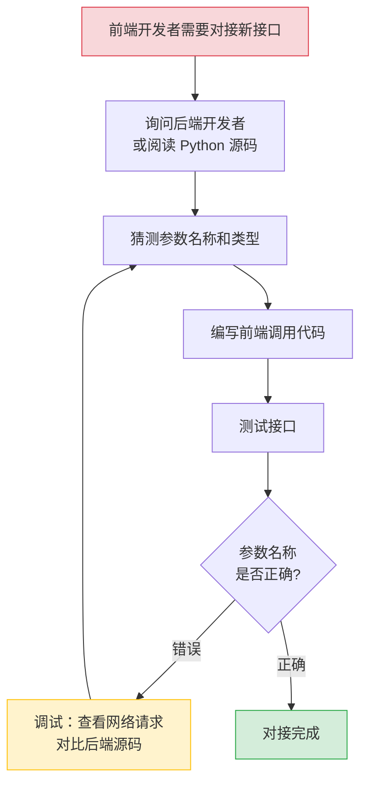
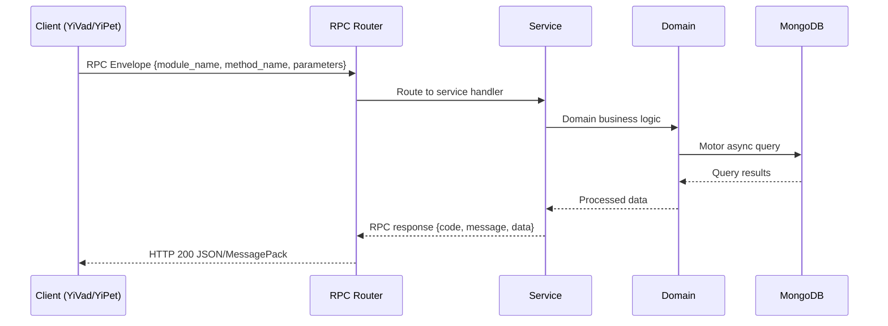

---

doc_type: module
prd_task_id: "YA-09-44"
title: "YA-09-44: API 文档自动生成 — OpenAPI + Scalar 控制台 — 开发方案"
status: 需求已编写
priority: P2
owner: 陈铭
roles: [engineer]
created: 2026-09-11
updated: 2026-09-14
project: YiAi
project_id: yiai
prd_month: "202609"
estimate_frontend: 0.5
source_prd: "140-需求-API文档自动生成.md"
source_okr: [yiai-002]

type: task
---

# YA-09-44: API 文档自动生成 — OpenAPI + Scalar 控制台

> **文档职责**：本文档定义**怎么做、为什么这么做、实际做成什么样**（HOW），不含产品目标与测试用例。

> 来源 PRD：[140-需求-API文档自动生成.md](../../prds/2026-09/140-需求-API文档自动生成.md)
> 需求编号：YA-09-44 · 优先级：P2 · 人天：0.5 · 状态：需求已编写
> 类型：功能 · 依赖：无 · 前置需求：无

---

<a id="sec-1"></a>
## 一、架构概览 / Architecture Overview

YA-09-134: API 文档自动生成 — OpenAPI 文档自动生成 + Pydantic Schema 展示 + RPC 端点目录 + 交互式控制台



<a id="sec-2"></a>
## 二、文件清单 / File Manifest

| 文件 / File | 操作 | 说明 / Description |
|-------------|------|--------------------|
| `YiAi/src/services/xxx/service.py` | 新增 | Core service logic
| `YiAi/src/services/xxx/rpc_handler.py` | 新增 | RPC route handler
| `YiAi/tests/test_xxx.py` | 新增 | Unit tests

> Source PRD: 140-需求-API文档自动生成.md

<a id="sec-3"></a>
## 三、Python 签名与核心组件 / Python Signatures

### 3.1 核心组件

```python
from fastapi import FastAPI
from fastapi.openapi.utils import get_openapi
## YiAi 后端 API 文档
### 认证方式
### RPC 协议
```
### 3.2 组件 2

```python
from dataclasses import dataclass, field
from typing import Any, Callable, Dict, List, Optional, Type
from pydantic import BaseModel
@dataclass
class RpcEndpointMeta:
    """RPC 端点元数据。"""
class RpcRegistry:
    """全局 RPC 端点注册表。"""
    def __new__(cls):
        if cls._instance is None:
        return cls._instance
    def register(self, meta: RpcEndpointMeta):
        self._endpoints[key] = meta
    def get_all(self) -> Dict[str, RpcEndpointMeta]:
        return dict(self._endpoints)
    def get_by_tag(self, tag: str) -> Dict[str, RpcEndpointMeta]:
        return {
            if tag in v.tags
def rpc_method(
    """装饰器：注册 RPC 端点的文档元数据。"""
    def decorator(func: Callable):
```
### 3.3 组件 3

```python
from shared.rpc_docs import rpc_method
from pydantic import BaseModel, Field
class ChatRequest(BaseModel):
    """聊天请求参数。"""
class ChatResponse(BaseModel):
    """聊天响应数据。"""
@rpc_method(
async def chat(params: ChatRequest) -> ChatResponse:
    ...
```

<a id="sec-4"></a>
## 四、数据流 / Data Flow



**Call chain**: `Client -> RPC Router -> Service -> Domain -> MongoDB`  
**Response format**: `{code: 0, message: "ok", data: ...}`  
**Async model**: Full-chain `async/await`, Motor async MongoDB driver.  
**Error propagation**: Service exceptions caught by middleware -> standard error codes (1001-9999).

<a id="sec-5"></a>
## 五、实施路线图 / Roadmap

**预估人天 / Estimated**: 0.5

| 步骤 / Step | 操作 / Action | 路径 / Path | 验证 / Verification | 人天 / Days |
|-------------|---------------|-------------|---------------------|-------------|
| 1 | 增强 FastAPI 应用配置（title, description, version, tags） | `main.py` | 访问 `/docs` 看到 API 标题和描述 | 0.05 |
| 2 | 实现 `@rpc_method` 装饰器和 `RpcRegistry` | `shared/rpc_docs.py` | 注册表可正确收集端点元数据 | 0.1 |
| 3 | 实现 OpenAPI Schema 扩展（注入 RPC 端点） | `shared/openapi_extensions.py` | `/openapi.json` 包含 `x-rpc-endpoints` | 0.1 |
| 4 | 为核心 RPC 端点添加 `@rpc_method` 装饰器 | `services/*/` | 注册表包含所有核心端点 | 0.1 |
| 5 | 实现 Markdown 文档生成脚本 | `scripts/generate_api_docs.py` | 生成 `api-reference.md` 并验证内容 | 0.05 |
| 6 | 集成 Scalar UI | `main.py` | 访问 `/scalar` 看到现代化 API 文档 | 0.05 |
| 7 | 端到端验证（Swagger UI + Scalar + Markdown） | 全模块 | 所有文档入口可正常访问，内容准确 | 0.05 |
| 操作 | 数据量 | 耗时 | 资源消耗 | 说明 |
| OpenAPI Schema 生成 | 30+ 端点 | < 50ms | CPU 5%, 内存 +2MB | 首次请求时生成，后续缓存 |
| Swagger UI 页面加载 | 静态资源 ~1MB | < 500ms | 网络带宽 | CDN 加载，首次较慢 |
| Scalar UI 页面加载 | 静态资源 ~500KB | < 300ms | 网络带宽 | CDN 加载 |
| Markdown 文档生成 | 30+ 端点 | < 100ms | CPU 10%, 内存 +5MB | 独立脚本，按需运行 |

<a id="sec-6"></a>
## 六、代码审查检查清单 / Review Checklist

- [ ] FastAPI 应用配置了 `title`、`description`、`version`、`docs_url`、`redoc_url`
- [ ] `@rpc_method` 装饰器正确收集 `module_name`、`method_name`、`description`、`tags`
- [ ] `RpcRegistry` 使用单例模式，确保全局唯一
- [ ] OpenAPI Schema 扩展正确注入 `x-rpc-endpoints` 自定义字段
- [ ] 所有核心 RPC 端点（chat、data、knowledge、rag、agent）都添加了 `@rpc_method` 装饰器
- [ ] 每个 RPC 端点包含 `example_request` 和 `example_response`
- [ ] Markdown 生成脚本输出到正确的 YiKnowledge 路径
- [ ] 生成的 Markdown 文档包含正确的 YAML frontmatter
- [ ] 代码示例包含 Python、TypeScript、curl 三种语言
- [ ] `/docs`（Swagger UI）、`/redoc`、`/scalar` 三个端点均可正常访问
- [ ] `/openapi.json` 返回有效的 OpenAPI 3.0+ Schema
- [ ] `ruff` 代码规范通过
- [ ] `mypy` 类型检查通过
---
## 十三、回归问题预测
| # | 问题 | 发现场景 | 根因 | 修复方式 |
|---|------|---------|------|---------|

<a id="sec-7"></a>
## 七、风险表 / Risk Table

| 风险 / Risk | 影响 / Impact | 缓解措施 / Mitigation | 应急预案 / Contingency |
|-------------|---------------|----------------------|------------------------|
| 文档与代码不同步 | 中 | 高 | 高 |
| @rpc_method 装饰器遗漏 | 高 | 中 | 中 |
| OpenAPI Schema 过大导致加载慢 | 低 | 低 | 低 |
| Scalar CDN 不可用 | 低 | 低 | 低 |
| Markdown 文档生成脚本失败 | 低 | 中 | 低 |
| 场景 | 回滚方式 | 回滚时间 | 风险 |
| 文档端点异常影响服务 | 移除 `/scalar` 端点 + 关闭 `docs_url` | < 1min | 低：不影响核心 RPC 功能 |
| 装饰器注册导致启动失败 | 移除装饰器导入，registry 使用空实现 | < 1min | 低：装饰器为可选功能 |
| Markdown 生成覆盖错误文件 | 恢复 YiKnowledge 中备份的旧版本文档 | < 1min | 低：仅影响文档文件 |
| OpenAPI Schema 过大导致内存问题 | 关闭 `openapi_url`，禁用 Schema 生成 | < 1min | 低：不影响核心功能 |
