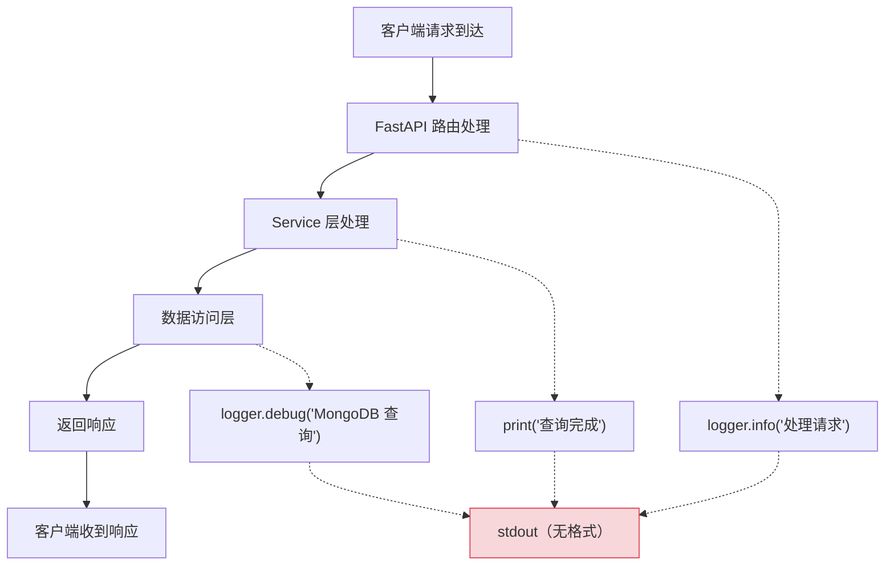
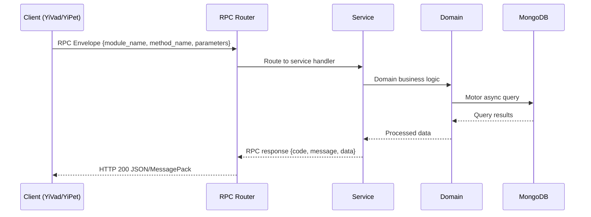

---

doc_type: module
prd_task_id: "YA-09-23"
title: "YA-09-23: 请求响应日志中间件 — 结构化 + 脱敏 + 慢请求 — 开发方案"
status: 需求已编写
priority: P2
owner: 陈铭
roles: [engineer]
created: 2026-09-11
updated: 2026-09-14
project: YiAi
project_id: yiai
prd_month: "202609"
estimate_frontend: 1.0
source_prd: "141-需求-请求响应日志中间件.md"
source_okr: [yiai-001]

type: task
---

# YA-09-23: 请求响应日志中间件 — 结构化 + 脱敏 + 慢请求

> **文档职责**：本文档定义**怎么做、为什么这么做、实际做成什么样**（HOW），不含产品目标与测试用例。

> 来源 PRD：[141-需求-请求响应日志中间件.md](../../prds/2026-09/141-需求-请求响应日志中间件.md)
> 需求编号：YA-09-23 · 优先级：P2 · 人天：1.0 · 状态：需求已编写
> 类型：功能 · 依赖：无 · 前置需求：无

---

<a id="sec-1"></a>
## 一、架构概览 / Architecture Overview

YA-09-135: 请求响应日志中间件 — 结构化日志 + 敏感字段脱敏 + 慢请求检测 + 关联 ID 传播



<a id="sec-2"></a>
## 二、文件清单 / File Manifest

| 文件 / File | 操作 | 说明 / Description |
|-------------|------|--------------------|
| `YiAi/src/services/xxx/service.py` | 新增 | Core service logic
| `YiAi/src/services/xxx/rpc_handler.py` | 新增 | RPC route handler
| `YiAi/tests/test_xxx.py` | 新增 | Unit tests

> Source PRD: 141-需求-请求响应日志中间件.md

<a id="sec-3"></a>
## 三、Python 签名与核心组件 / Python Signatures

### 3.1 核心组件

```python
import hashlib
import json
import logging
import re
import time
import uuid
from typing import Any, Callable, Dict, List, Optional, Set
from starlette.types import ASGIApp, Message, Receive, Scope, Send
# 敏感字段名列表（大小写不敏感）
# 敏感字段正则模式（值匹配）
# 请求体大小阈值（超过此值截断）
# 慢请求阈值（毫秒）
# 日志级别不记录 body 的端点前缀
class RequestLoggingMiddleware:
    """ASGI 请求响应日志中间件。"""
    def __init__(self, app: ASGIApp):
        self.app = app
    async def __call__(self, scope: Scope, receive: Receive, send: Send):
        if scope["type"] != "http":
            return
        async def wrapped_receive() -> Message:
        async def wrapped_send(message: Message):
    def _get_or_create_request_id(self, scope: Scope) -> str:
    def _get_header(self, scope: Scope, name: str, default: str = "") -> str:
    def _get_client_ip(self, scope: Scope) -> str:
```
### 3.2 组件 2

```python
import logging
import logging.handlers
import os
import sys
from pathlib import Path
from typing import Optional
def setup_logging(
    """配置统一日志系统。
    """
    # 清除已有 handlers
    # stdout handler（始终启用）
    if enable_json:
    else:
    # 文件 handler（生产环境）
    if enable_file and log_dir:
        # 错误日志单独文件
    # 设置第三方库日志级别
    # 创建 access logger
class HumanReadableFormatter(logging.Formatter):
    """人类可读的日志格式（开发环境）。"""
    def __init__(self):
class JsonFormatter(logging.Formatter):
    def format(self, record: logging.LogRecord) -> str:
        import json
        from datetime import datetime
```
### 3.3 组件 3

```python
from shared.logging_middleware import RequestLoggingMiddleware
from shared.logging_config import setup_logging
# 初始化日志系统
# 注册日志中间件（必须在其他中间件之前）
```

<a id="sec-4"></a>
## 四、数据流 / Data Flow



**Call chain**: `Client -> RPC Router -> Service -> Domain -> MongoDB`  
**Response format**: `{code: 0, message: "ok", data: ...}`  
**Async model**: Full-chain `async/await`, Motor async MongoDB driver.  
**Error propagation**: Service exceptions caught by middleware -> standard error codes (1001-9999).

<a id="sec-5"></a>
## 五、实施路线图 / Roadmap

**预估人天 / Estimated**: 1.0

| 步骤 / Step | 操作 / Action | 路径 / Path | 验证 / Verification | 人天 / Days |
|-------------|---------------|-------------|---------------------|-------------|
| 1 | 实现 ASGI 日志中间件核心逻辑 | `shared/logging_middleware.py` | 启动服务，检查请求日志输出 | 0.2 |
| 2 | 实现敏感字段脱敏（字段名 + 正则） | `shared/logging_middleware.py` | 发送包含 password/token 的请求，验证日志中为 `[MASKED]` | 0.1 |
| 3 | 实现慢请求检测（500ms/2s 阈值） | `shared/logging_middleware.py` | 模拟慢请求，验证 WARNING/ERROR 日志 | 0.05 |
| 4 | 实现统一日志配置（stdout + 文件轮转） | `shared/logging_config.py` | 检查日志文件生成和轮转 | 0.05 |
| 5 | 实现关联 ID 传播（X-Request-ID） | `shared/logging_middleware.py` | 发送带 X-Request-ID 的请求，验证响应头和日志 | 0.05 |
| 6 | 注册中间件到 FastAPI 应用 | `main.py` | 所有请求自动记录日志 | 0.05 |
| 操作 | 数据量 | 耗时 | 资源消耗 | 说明 |
| 请求体收集 | 平均 1KB | < 0.1ms | 内存 +1KB | 读取 ASGI receive 流 |
| 敏感字段脱敏 | 平均 1KB JSON | < 0.05ms | CPU 1% | 字段名遍历 + 正则匹配 |
| 日志写入（stdout） | 平均 200B | < 0.1ms | IO | 同步写入 |
| 日志写入（文件） | 平均 200B | < 0.2ms | IO | RotatingFileHandler |
| 大请求体截断 | 100KB | < 0.5ms | CPU 2%, 内存 +10KB | sha256 + 截断 |

<a id="sec-6"></a>
## 六、代码审查检查清单 / Review Checklist

- [ ] `RequestLoggingMiddleware` 使用纯 ASGI 协议实现，不依赖 `BaseHTTPMiddleware`
- [ ] 请求 ID 生成使用 `uuid4()`，优先使用客户端的 `X-Request-ID`
- [ ] `X-Request-ID` 正确注入到响应头中
- [ ] 敏感字段名列表 `SENSITIVE_FIELD_NAMES` 大小写不敏感匹配
- [ ] 敏感字段正则模式 `SENSITIVE_PATTERNS` 覆盖常见格式
- [ ] 请求体超过 `BODY_SIZE_LIMIT`（10KB）时正确截断并附带 sha256
- [ ] 慢请求检测正确使用 `time.perf_counter()`（单调时钟）
- [ ] 日志中间件在最外层注册（在其他中间件之前）
- [ ] 生产环境使用 JSON 格式 + 文件轮转
- [ ] 开发环境使用人类可读格式 + stdout
- [ ] 第三方库日志级别设置为 WARNING（减少噪音）
- [ ] `ruff` 代码规范通过
- [ ] `mypy` 类型检查通过
- [ ] 日志中间件性能开销 < 1ms per request（基准测试验证）
---
## 十三、回归问题预测
| # | 问题 | 发现场景 | 根因 | 修复方式 |

<a id="sec-7"></a>
## 七、风险表 / Risk Table

| 风险 / Risk | 影响 / Impact | 缓解措施 / Mitigation | 应急预案 / Contingency |
|-------------|---------------|----------------------|------------------------|
| 日志中间件增加请求延迟 | 中 | 中 | 中 |
| 日志文件占满磁盘 | 中 | 高 | 高 |
| 敏感字段脱敏遗漏 | 中 | 高 | 中 |
| 日志 JSON 格式错误 | 低 | 低 | 低 |
| 高并发下日志写入阻塞 | 低 | 中 | 低 |
| 场景 | 回滚方式 | 回滚时间 | 风险 |
| 日志中间件导致性能下降 | 移除 `app.add_middleware(RequestLoggingMiddleware)` | < 1min | 低：回退到无请求日志状态 |
| 日志文件占满磁盘 | 删除旧日志文件 + 调整 `maxBytes` 和 `backupCount` | < 5min | 低：不影响服务运行 |
| 敏感字段脱敏误匹配 | 更新 `SENSITIVE_FIELD_NAMES` 集合，移除误匹配字段 | < 1min | 低：热更新配置 |
| 关联 ID 传播异常 | 禁用 X-Request-ID 注入，仅使用生成的 UUID | < 1min | 低：不影响核心功能 |
