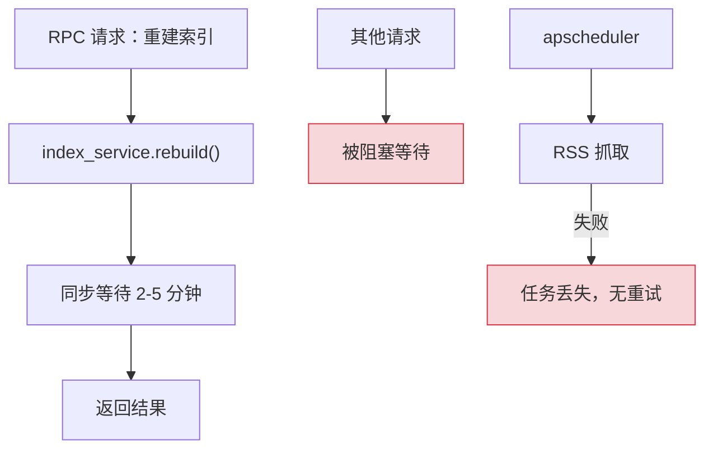
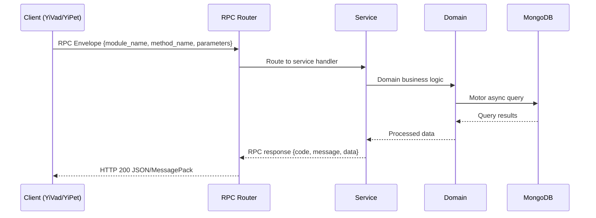

---

doc_type: module
prd_task_id: "YA-09-93"
title: "YA-09-93: 后台任务队列 (ARQ) — Redis 持久化 + 优先级 + 进度追踪 — 开发方案"
status: 需求已编写
priority: P2
owner: 陈铭
roles: [engineer]
created: 2026-09-11
updated: 2026-09-14
project: YiAi
project_id: yiai
prd_month: "202609"
estimate_frontend: 1.5
source_prd: "142-需求-后台任务队列.md"
source_okr: [yiai-001]

type: task
---

# YA-09-93: 后台任务队列 (ARQ) — Redis 持久化 + 优先级 + 进度追踪

> **文档职责**：本文档定义**怎么做、为什么这么做、实际做成什么样**（HOW），不含产品目标与测试用例。

> 来源 PRD：[142-需求-后台任务队列.md](../../prds/2026-09/142-需求-后台任务队列.md)
> 需求编号：YA-09-93 · 优先级：P2 · 人天：1.5 · 状态：需求已编写
> 类型：功能 · 依赖：Redis 服务 · 前置需求：无

---

<a id="sec-1"></a>
## 一、架构概览 / Architecture Overview

YA-09-136: 后台任务队列 — ARQ 异步任务队列 + 定时调度 + 优先级 + 重试 + 进度追踪 + 管理面板



<a id="sec-2"></a>
## 二、文件清单 / File Manifest

| 文件 / File | 操作 | 说明 / Description |
|-------------|------|--------------------|
| `YiAi/src/services/xxx/service.py` | 新增 | Core service logic
| `YiAi/src/services/xxx/rpc_handler.py` | 新增 | RPC route handler
| `YiAi/tests/test_xxx.py` | 新增 | Unit tests

> Source PRD: 142-需求-后台任务队列.md

<a id="sec-3"></a>
## 三、Python 签名与核心组件 / Python Signatures

### 3.1 核心组件

```python
from arq import create_pool
from arq.connections import RedisSettings, ArqRedis
from arq.worker import Worker, run_worker
from typing import Any, Optional
from shared.config import settings
from shared.logging import get_logger
# Redis 配置
# Worker 配置
async def startup(ctx: dict):
    """Worker 启动时的初始化。"""
    from motor.motor_asyncio import AsyncIOMotorClient
async def shutdown(ctx: dict):
    """Worker 关闭时的清理。"""
    if "mongo" in ctx:
# --- 任务函数定义 ---
async def rebuild_rag_index(ctx: dict, force: bool = False) -> dict:
    """重建 RAG 索引（高优先级）。"""
    # ... 索引重建逻辑
    return {"status": "success", "documents_indexed": 500}
async def scan_knowledge_files(ctx: dict, full_scan: bool = False) -> dict:
async def fetch_rss_feeds(ctx: dict, feed_ids: Optional[list] = None) -> dict:
async def execute_backup(ctx: dict, backup_type: str = "full") -> dict:
async def cleanup_audit_logs(ctx: dict, older_than_days: int = 90) -> dict:
async def generate_report(ctx: dict, report_type: str, params: dict) -> dict:
async def send_notification(ctx: dict, channel: str, message: dict) -> dict:
```
### 3.2 组件 2

```python
from arq import ArqRedis
from arq.connections import RedisSettings
from arq.jobs import Job, JobStatus
from datetime import datetime, timedelta
from typing import Any, Dict, List, Optional
from shared.config import settings
from shared.logging import get_logger
# 任务优先级映射
# 任务类型配置
class TaskService:
    """任务队列管理服务。"""
    def __init__(self):
        self._redis: Optional[ArqRedis] = None
        self._concurrent_counters: Dict[str, int] = {}
    async def _get_redis(self) -> ArqRedis:
        """获取 Redis 连接池。"""
        if self._redis is None:
            self._redis = await ArqRedis.from_url(
        return self._redis
    async def enqueue(
            from motor.motor_asyncio import AsyncIOMotorClient
    async def get_status(self, job_id: str) -> Dict[str, Any]:
    async def cancel(self, job_id: str) -> Dict[str, Any]:
    async def list_tasks(
        from motor.motor_asyncio import AsyncIOMotorClient
```
### 3.3 组件 3

```python
from arq.cron import cron
# ARQ 定时任务配置
    # 每小时 RSS 抓取
    # 每日备份（凌晨 2:00）
    # 每日审计日志清理（凌晨 3:00）
    # 每周报告生成（周一 8:00）
```

<a id="sec-4"></a>
## 四、数据流 / Data Flow



**Call chain**: `Client -> RPC Router -> Service -> Domain -> MongoDB`  
**Response format**: `{code: 0, message: "ok", data: ...}`  
**Async model**: Full-chain `async/await`, Motor async MongoDB driver.  
**Error propagation**: Service exceptions caught by middleware -> standard error codes (1001-9999).

<a id="sec-5"></a>
## 五、实施路线图 / Roadmap

**预估人天 / Estimated**: 1.5

| 步骤 / Step | 操作 / Action | 路径 / Path | 验证 / Verification | 人天 / Days |
|-------------|---------------|-------------|---------------------|-------------|
| 1 | 安装 ARQ 依赖 + 配置 Redis 连接 | `requirements.txt`, `shared/config.py` | ARQ 可连接 Redis | 0.1 |
| 2 | 实现 ARQ Worker 配置和基础任务函数 | `services/task_queue/worker.py` | Worker 启动成功，可执行简单任务 | 0.3 |
| 3 | 实现任务入队服务（优先级、并发控制） | `services/task_queue/task_service.py` | 任务入队成功，优先级正确 | 0.3 |
| 4 | 实现任务状态追踪（MongoDB 持久化） | `services/task_queue/task_service.py` | 任务状态可查询，进度可追踪 | 0.2 |
| 5 | 实现任务取消和重试逻辑 | `services/task_queue/task_service.py`, `worker.py` | 取消成功，重试次数正确 | 0.15 |
| 6 | 配置定时任务（cron） | `services/task_queue/scheduler.py` | 定时任务按时触发 | 0.15 |
| 7 | 实现 RPC 端点（入队/查询/取消/列表/统计） | `services/task_queue/task_routes.py` | API 端点正常调用 | 0.15 |
| 8 | 迁移 RAG 索引重建到任务队列 | `services/rag/` | 索引重建不阻塞请求 | 0.1 |
| 9 | 端到端验证（入队 → 执行 → 完成 → 查询） | 全模块 | 完整任务生命周期验证 | 0.05 |
| 操作 | 数据量 | 耗时 | 资源消耗 | 说明 |
| 任务入队（enqueue） | 1 个任务 | < 5ms | Redis 内存 +1KB | 写入 Redis 列表 |
| 任务出队（worker 拾取） | 1 个任务 | < 1ms | Redis CPU | BRPOP 阻塞读取 |

<a id="sec-6"></a>
## 六、代码审查检查清单 / Review Checklist

- [ ] ARQ Worker 配置正确（`max_jobs`, `job_timeout`, `allow_abort_jobs`）
- [ ] 所有任务函数定义为 `async`，使用 `ctx` 参数获取 MongoDB 连接
- [ ] 任务类型配置 `TASK_CONFIG` 包含所有任务类型的优先级、重试、超时设置
- [ ] 任务入队时检查并发限制（`max_concurrent`）
- [ ] 任务进度通过 `_update_task_status` 更新到 MongoDB
- [ ] 任务重试使用指数退避策略（`retry_delay * 2^retry_count`）
- [ ] 任务取消通过 `job.abort()` 实现，支持队列中和执行中两种状态
- [ ] 死信队列（失败任务）保留 7 天，支持手动重新入队
- [ ] 定时任务 cron 配置使用 `unique=True` 防止重复执行
- [ ] RPC 端点包含入队、状态查询、取消、列表、统计 5 个接口
- [ ] Redis 连接配置可环境变量覆盖
- [ ] `ruff` 代码规范通过
- [ ] `mypy` 类型检查通过
---
## 十三、回归问题预测
| # | 问题 | 发现场景 | 根因 | 修复方式 |
|---|------|---------|------|---------|

<a id="sec-7"></a>
## 七、风险表 / Risk Table

| 风险 / Risk | 影响 / Impact | 缓解措施 / Mitigation | 应急预案 / Contingency |
|-------------|---------------|----------------------|------------------------|
| Redis 不可用导致任务队列瘫痪 | 中 | 高 | 高 |
| Worker 进程崩溃导致任务丢失 | 中 | 高 | 中 |
| 长时间任务耗尽 Worker 池 | 中 | 中 | 中 |
| 任务结果占用 Redis 内存过多 | 低 | 低 | 低 |
| 定时任务重复执行 | 低 | 中 | 低 |
| 场景 | 回滚方式 | 回滚时间 | 风险 |
| ARQ Worker 异常 | 停止 Worker 进程，关键任务回退到 apscheduler | < 1min | 低：apscheduler 兜底 |
| Redis 不稳定 | 降级为同步执行（RAG 索引重建在请求中执行） | < 1min | 中：长时间任务阻塞请求 |
| 任务队列积压 | 暂停非关键任务入队，扩充 Worker 数量 | < 5min | 低：关键任务不受影响 |
| MongoDB 任务记录异常 | 停止任务状态持久化，仅使用 Redis 状态 | < 1min | 低：任务仍可执行，仅状态不可查询 |
