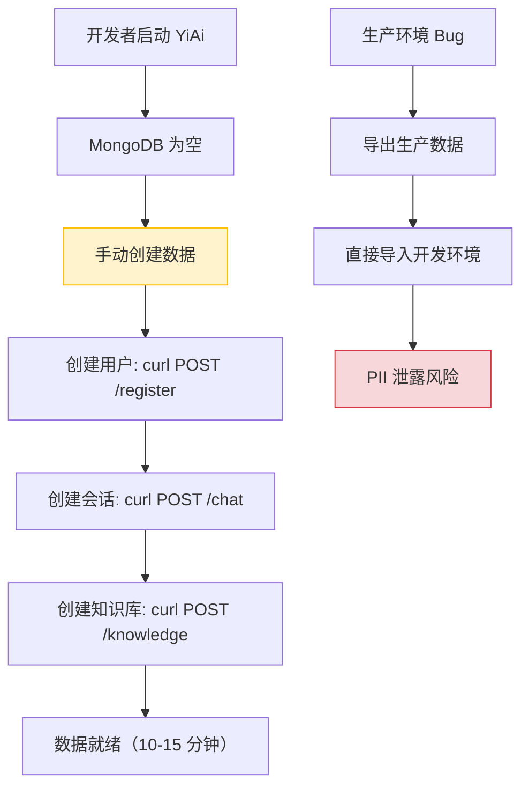
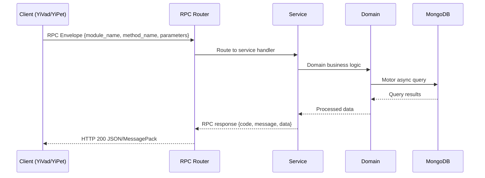

---

doc_type: module
prd_task_id: "YA-09-66"
title: "YA-09-66: 数据脱敏与测试数据 — Faker 假数据 + CI 播种 — 开发方案"
status: 需求已编写
priority: P2
owner: 陈铭
roles: [engineer]
created: 2026-09-11
updated: 2026-09-14
project: YiAi
project_id: yiai
prd_month: "202609"
estimate_frontend: 0.5
source_prd: "143-需求-数据脱敏与测试数据生成.md"
source_okr: [yiai-001]

type: task
---

# YA-09-66: 数据脱敏与测试数据 — Faker 假数据 + CI 播种

> **文档职责**：本文档定义**怎么做、为什么这么做、实际做成什么样**（HOW），不含产品目标与测试用例。

> 来源 PRD：[143-需求-数据脱敏与测试数据生成.md](../../prds/2026-09/143-需求-数据脱敏与测试数据生成.md)
> 需求编号：YA-09-66 · 优先级：P2 · 人天：0.5 · 状态：需求已编写
> 类型：功能 · 依赖：无 · 前置需求：无

---

<a id="sec-1"></a>
## 一、架构概览 / Architecture Overview

YA-09-137: 数据脱敏与测试数据生成 — 生产数据脱敏 + 测试数据生成 + Faker 假数据 + CI/CD 数据播种



<a id="sec-2"></a>
## 二、文件清单 / File Manifest

| 文件 / File | 操作 | 说明 / Description |
|-------------|------|--------------------|
| `YiAi/src/services/xxx/service.py` | 新增 | Core service logic
| `YiAi/src/services/xxx/rpc_handler.py` | 新增 | RPC route handler
| `YiAi/tests/test_xxx.py` | 新增 | Unit tests

> Source PRD: 143-需求-数据脱敏与测试数据生成.md

<a id="sec-3"></a>
## 三、Python 签名与核心组件 / Python Signatures

### 3.1 核心组件

```python
import hashlib
import json
import os
import re
import sys
from pathlib import Path
from typing import Any, Dict, List, Optional, Set
from faker import Faker
from motor.motor_asyncio import AsyncIOMotorClient
from pymongo import MongoClient
# 敏感字段配置
# 需要保持引用一致性的字段（通过哈希映射表）
# PII 扫描正则模式
class DataAnonymizer:
    """生产数据脱敏器。"""
    def __init__(self, mongo_uri: str, db_name: str):
        self.client = MongoClient(mongo_uri)
        self.db = self.client[db_name]
        self.hash_map: Dict[str, str] = {}  # 原始值 → 哈希值
        self.faker = Faker("zh_CN")
    def anonymize_collection(self, collection_name: str, output_dir: Path):
    def _anonymize_document(
    def _apply_rule(self, field: str, value: Any, rule: str) -> Any:
    def _hash_value(self, value: str, salt: str = "") -> str:
    def _hash_ref(self, value: str) -> str:
```
### 3.2 组件 2

```python
import asyncio
import hashlib
import os
import random
import sys
from datetime import datetime, timedelta
from pathlib import Path
from typing import Any, Dict, List
from faker import Faker
from motor.motor_asyncio import AsyncIOMotorClient
# 数据量配置
# 批量插入大小
def generate_users(count: int) -> List[Dict[str, Any]]:
    """生成用户数据。"""
    return users
def generate_sessions(count: int, user_ids: List[str]) -> List[Dict[str, Any]]:
    """生成会话数据。"""
    return sessions
def generate_bugs(count: int, user_ids: List[str]) -> List[Dict[str, Any]]:
    """生成缺陷数据。"""
def generate_knowledge_files(count: int) -> List[Dict[str, Any]]:
def generate_audit_logs(count: int, user_ids: List[str]) -> List[Dict[str, Any]]:
async def seed_database(
def main():
```

<a id="sec-4"></a>
## 四、数据流 / Data Flow



**Call chain**: `Client -> RPC Router -> Service -> Domain -> MongoDB`  
**Response format**: `{code: 0, message: "ok", data: ...}`  
**Async model**: Full-chain `async/await`, Motor async MongoDB driver.  
**Error propagation**: Service exceptions caught by middleware -> standard error codes (1001-9999).

<a id="sec-5"></a>
## 五、实施路线图 / Roadmap

**预估人天 / Estimated**: 0.5

| 步骤 / Step | 操作 / Action | 路径 / Path | 验证 / Verification | 人天 / Days |
|-------------|---------------|-------------|---------------------|-------------|
| 1 | 安装 Faker 依赖，配置数据播种环境变量 | `requirements.txt`, `shared/config.py` | Faker 可正常生成中文数据 | 0.05 |
| 2 | 实现测试数据生成器（users, sessions, bugs, knowledge_files, audit_logs） | `scripts/seed_data.py` | 生成的数据格式正确，可插入 MongoDB | 0.15 |
| 3 | 实现数据量级别控制（small/medium/large） | `scripts/seed_data.py` | 三种级别生成对应数量的数据 | 0.05 |
| 4 | 实现生产数据脱敏脚本（哈希 + 掩码 + Faker） | `scripts/anonymize_data.py` | 脱敏后数据无 PII，引用一致性保持 | 0.15 |
| 5 | 集成到开发环境启动流程（可选播种） | `main.py` | 设置 `SEED_DATA=true` 后启动自动播种 | 0.05 |
| 6 | 集成到 CI/CD 流水线 | `.github/workflows/` | CI 测试运行在有数据的数据库上 | 0.05 |
| 操作 | 数据量 | 耗时 | 资源消耗 | 说明 |
| 数据播种（small） | 100 条/集合 | ~2s | CPU 20%, 内存 50MB | 适合开发环境快速启动 |
| 数据播种（medium） | 1K 条/集合 | ~15s | CPU 30%, 内存 100MB | 适合测试环境 |
| 数据播种（large） | 10K 条/集合 | ~120s | CPU 50%, 内存 300MB | 适合性能测试 |
| 生产数据脱敏（500MB） | 500MB | ~60s | CPU 40%, 内存 200MB | 遍历所有集合和文档 |
| 脱敏数据导入 | 500MB | ~90s | CPU 30%, IO 50MB/s | mongorestore |

<a id="sec-6"></a>
## 六、代码审查检查清单 / Review Checklist

- [ ] `seed_data.py` 支持 small/medium/large 三种数据量级别
- [ ] 数据生成器使用 Faker("zh_CN") 中文语言环境
- [ ] 生成的数据格式与真实 Schema 一致（字段名、类型、约束）
- [ ] 会话中的 `user_id` 引用实际存在的用户 ID
- [ ] 缺陷中的 `reporter` 和 `assignee` 引用实际存在的用户 ID
- [ ] 批量插入使用 `insert_many`，批次大小 500
- [ ] `SEED_DATA` 环境变量默认 `false`，生产环境不播种
- [ ] `anonymize_data.py` 覆盖所有敏感字段（PII + 凭据）
- [ ] 脱敏使用哈希映射表保持引用一致性
- [ ] 脱敏脚本支持 `--collections` 选择性脱敏
- [ ] 脱敏输出为 JSON 文件，可安全提交到版本控制
- [ ] CI 流水线在测试前执行 `seed_data.py`
- [ ] `ruff` 代码规范通过
- [ ] `mypy` 类型检查通过
---
## 十三、回归问题预测
| # | 问题 | 发现场景 | 根因 | 修复方式 |

<a id="sec-7"></a>
## 七、风险表 / Risk Table

| 风险 / Risk | 影响 / Impact | 缓解措施 / Mitigation | 应急预案 / Contingency |
|-------------|---------------|----------------------|------------------------|
| 脱敏规则遗漏导致 PII 泄露 | 中 | 高 | 高 |
| 数据播种在生产环境误执行 | 低 | 高 | 高 |
| Faker 生成的数据格式与实际不符 | 低 | 中 | 低 |
| 大批量播种（10K）导致 MongoDB 内存不足 | 中 | 低 | 低 |
| 哈希碰撞导致引用关联错误 | 极低 | 中 | 低 |
| 场景 | 回滚方式 | 回滚时间 | 风险 |
| 播种数据错误 | 执行 `SEED_CLEAR=true python scripts/seed_data.py` 重新播种 | < 2min | 低：仅影响开发/测试环境 |
| 生产环境误播种 | 从备份恢复生产数据库 | < 10min | 高：需快速恢复 |
| 脱敏脚本错误 | 修复脚本后重新执行脱敏 | < 5min | 低：仅影响脱敏输出 |
| 脱敏数据泄露 | 删除脱敏数据文件，轮换生产凭据 | < 30min | 高：需立即处理 |
