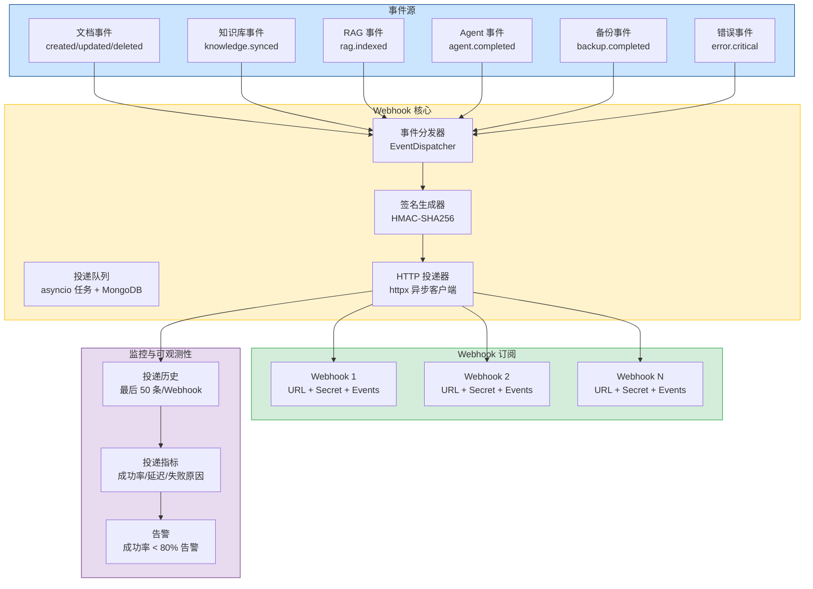
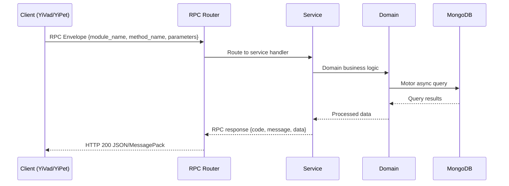

---

doc_type: module
prd_task_id: "YA-09-89"
title: "YA-09-89: Webhook 集成系统 — 事件注册 + HMAC 签名 + 重试 — 开发方案"
status: 需求已编写
priority: P2
owner: 陈铭
roles: [engineer]
created: 2026-09-11
updated: 2026-09-14
project: YiAi
project_id: yiai
prd_month: "202609"
estimate_frontend: 1.5
source_prd: "144-需求-Webhook集成系统.md"
source_okr: [yiai-001]

type: task
---

# YA-09-89: Webhook 集成系统 — 事件注册 + HMAC 签名 + 重试

> **文档职责**：本文档定义**怎么做、为什么这么做、实际做成什么样**（HOW），不含产品目标与测试用例。

> 来源 PRD：[144-需求-Webhook集成系统.md](../../prds/2026-09/144-需求-Webhook集成系统.md)
> 需求编号：YA-09-89 · 优先级：P2 · 人天：1.5 · 状态：需求已编写
> 类型：功能 · 依赖：无 · 前置需求：无

---

<a id="sec-1"></a>
## 一、架构概览 / Architecture Overview

YA-09-138: Webhook 集成系统 — 事件注册管理 + 签名验证 + 重试投递 + 健康监控



<a id="sec-2"></a>
## 二、文件清单 / File Manifest

| 文件 / File | 操作 | 说明 / Description |
|-------------|------|--------------------|
| `YiAi/src/services/xxx/service.py` | 新增 | Core service logic
| `YiAi/src/services/xxx/rpc_handler.py` | 新增 | RPC route handler
| `YiAi/tests/test_xxx.py` | 新增 | Unit tests

> Source PRD: 144-需求-Webhook集成系统.md

<a id="sec-3"></a>
## 三、Python 签名与核心组件 / Python Signatures

### 3.1 核心组件

```python
from datetime import datetime
from enum import Enum
from typing import Optional
from pydantic import BaseModel, Field, HttpUrl
class EventType(str, Enum):
    """Webhook 事件类型枚举。"""
class WebhookCreate(BaseModel):
    """创建 Webhook 请求体。"""
class WebhookUpdate(BaseModel):
    """更新 Webhook 请求体。"""
class WebhookInDB(BaseModel):
    """Webhook 数据库文档。"""
class DeliveryStatus(str, Enum):
class WebhookDelivery(BaseModel):
    """Webhook 投递记录。"""
```
### 3.2 组件 2

```python
import asyncio
import hashlib
import hmac
import json
import secrets
from datetime import datetime, timezone
from typing import Optional
import httpx
from bson import ObjectId
from motor.motor_asyncio import AsyncIOMotorDatabase
from shared.logging import get_logger
from shared.config import settings
from services.webhook.models import (
# 指数退避间隔（秒）
class WebhookService:
    """Webhook 注册、投递、监控服务。"""
    def __init__(self, db: AsyncIOMotorDatabase):
        self.db = db
        self.webhooks_col = db.webhooks
        self.deliveries_col = db.webhook_deliveries
    async def _get_client(self) -> httpx.AsyncClient:
    async def create_webhook(self, data: WebhookCreate) -> dict:
    async def update_webhook(self, webhook_id: str, data: WebhookUpdate) -> Optional[dict]:
    async def delete_webhook(self, webhook_id: str) -> bool:
    async def list_webhooks(self) -> list[dict]:
```
### 3.3 组件 3

```python
from fastapi import APIRouter, Depends
from motor.motor_asyncio import AsyncIOMotorDatabase
from services.webhook.models import WebhookCreate, WebhookUpdate
from services.webhook.webhook_service import WebhookService
from shared.dependencies import get_db
def get_webhook_service(db: AsyncIOMotorDatabase = Depends(get_db)) -> WebhookService:
    return WebhookService(db)
@router.post("/")
async def create_webhook(
    """创建 Webhook 订阅。"""
    return {"code": 0, "message": "ok", "data": result}
@router.get("/")
async def list_webhooks(
    """列出所有 Webhook 订阅。"""
    return {"code": 0, "message": "ok", "data": {"webhooks": result}}
@router.patch("/{webhook_id}")
async def update_webhook(
    """更新 Webhook 订阅。"""
    if result is None:
        return {"code": 1002, "message": "Webhook 不存在", "data": None}
@router.delete("/{webhook_id}")
async def delete_webhook(
@router.get("/{webhook_id}/health")
async def get_webhook_health(
@router.get("/{webhook_id}/deliveries")
```

<a id="sec-4"></a>
## 四、数据流 / Data Flow



**Call chain**: `Client -> RPC Router -> Service -> Domain -> MongoDB`  
**Response format**: `{code: 0, message: "ok", data: ...}`  
**Async model**: Full-chain `async/await`, Motor async MongoDB driver.  
**Error propagation**: Service exceptions caught by middleware -> standard error codes (1001-9999).

<a id="sec-5"></a>
## 五、实施路线图 / Roadmap

**预估人天 / Estimated**: 1.5

| 步骤 / Step | 操作 / Action | 路径 / Path | 验证 / Verification | 人天 / Days |
|-------------|---------------|-------------|---------------------|-------------|
| 1 | 定义数据模型和事件类型枚举 | `models.py` | Pydantic 模型验证通过，事件类型枚举完整 | 0.05 |
| 2 | 实现 Webhook CRUD 操作 | `webhook_service.py` | 创建/更新/删除/列表 API 可正常调用 | 0.15 |
| 3 | 实现 HMAC-SHA256 签名和验证逻辑 | `webhook_service.py` | 签名计算正确，可通过外部工具验证 | 0.1 |
| 4 | 实现异步投递 + 指数退避重试 | `webhook_service.py` | 模拟失败场景，验证重试次数和间隔 | 0.2 |
| 5 | 实现速率限制（令牌桶） | `webhook_service.py` | 高频投递验证速率限制生效 | 0.1 |
| 6 | 实现投递历史记录和健康监控 | `webhook_service.py` | 查看投递记录和健康状态 API | 0.1 |
| 7 | 实现 RPC 端点（CRUD + 健康 + 历史 + 测试） | `webhook_routes.py` | 所有端点可正常调用 | 0.1 |
| 8 | 在业务模块中集成事件发射 | 各业务 service 文件 | 文档 CRUD、备份等操作后触发 Webhook 投递 | 0.1 |
| 9 | 集成测试和端到端验证 | 全部 | 模拟外部接收端，验证完整投递流程 | 0.1 |
| 操作 | 数据量 | 耗时 | 资源消耗 | 说明 |
| 事件发射（emit） | 1 个事件 | < 1ms | CPU < 1% | 异步创建任务，不阻塞主流程 |
| 单次 HTTP 投递 | 1 个 Webhook | 10-500ms | 网络 IO | 取决于下游响应速度 |

<a id="sec-6"></a>
## 六、代码审查检查清单 / Review Checklist

- [ ] `EventType` 枚举包含所有 8 种事件类型，值与规格一致
- [ ] `WebhookCreate` 模型验证 URL 格式、事件列表非空
- [ ] `WebhookService` 创建 Webhook 时自动生成 secret（若无提供）
- [ ] secret 使用 SHA256 哈希存储，仅创建时返回明文
- [ ] `emit` 方法异步执行，不阻塞业务主流程
- [ ] 投递使用 `asyncio.create_task`，不等待结果
- [ ] 重试策略为指数退避（1s, 2s, 4s, 8s, 16s），最多 5 次
- [ ] 每次投递包含 `X-Webhook-Signature` 头部
- [ ] 速率限制器（令牌桶）正确限制每 URL 10 次/秒
- [ ] 投递记录持久化到 MongoDB `webhook_deliveries` 集合
- [ ] 每个 Webhook 最多保留 50 条投递记录，超出的自动清理
- [ ] 投递成功/失败后正确更新 Webhook 统计计数
- [ ] 健康检查 API 返回成功率、平均延迟、失败原因
- [ ] 测试事件 API 可直接验证 Webhook 配置
- [ ] 删除 Webhook 时同时清理关联的投递记录
- [ ] 业务模块中集成 `emit` 调用，覆盖所有事件类型
- [ ] `ruff` 代码规范通过
- [ ] `mypy` 类型检查通过

<a id="sec-7"></a>
## 七、风险表 / Risk Table

| 风险 / Risk | 影响 / Impact | 缓解措施 / Mitigation | 应急预案 / Contingency |
|-------------|---------------|----------------------|------------------------|
| 下游服务不可用导致大量投递失败 | 中 | 中 | 中 |
| Webhook secret 泄露 | 低 | 高 | 高 |
| 投递队列积压导致内存增长 | 低 | 中 | 中 |
| 投递目标 URL 为恶意地址 | 低 | 高 | 高 |
| 重试风暴导致下游过载 | 中 | 中 | 中 |
| 事件类型变更导致下游解析失败 | 低 | 中 | 低 |
| 场景 | 回滚方式 | 回滚时间 | 风险 |
| Webhook 投递影响主业务性能 | 全局禁用 Webhook 投递 `ENABLE_WEBHOOK=false` | < 1min | 低：事件通知中断，不影响核心业务 |
| 特定 Webhook 导致下游异常 | 禁用该 Webhook `PATCH /webhooks/:id {enabled: false}` | < 1min | 低：仅影响该订阅者 |
| 新 Webhook 功能有 bug | 回滚代码到上一版本 | < 5min | 低：不影响已有数据，仅 Webhook 功能不可用 |
