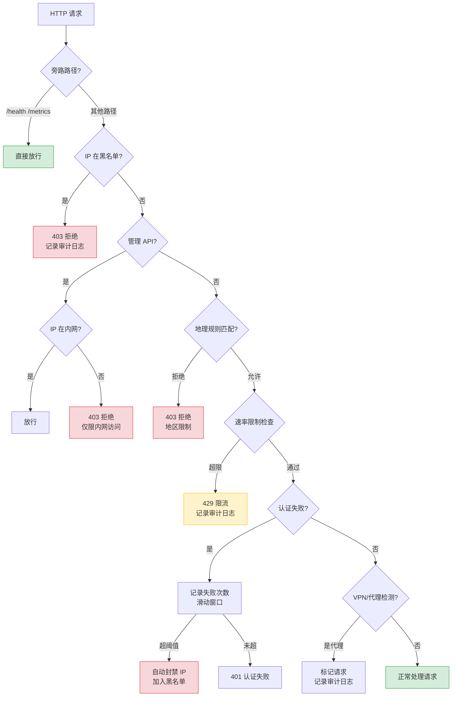
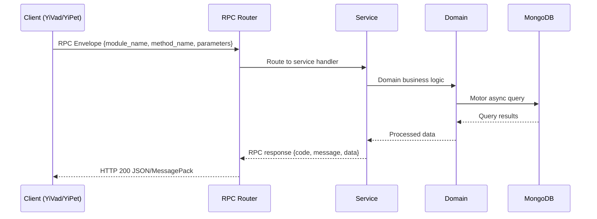

---

doc_type: module
prd_task_id: "YA-09-84"
title: "YA-09-84: IP 白名单与访问控制 — 中间件 + 动态黑名单 — 开发方案"
status: 需求已编写
priority: P2
owner: 陈铭
roles: [engineer]
created: 2026-09-11
updated: 2026-09-14
project: YiAi
project_id: yiai
prd_month: "202609"
estimate_frontend: 0.5
source_prd: "145-需求-IP白名单与访问控制.md"
source_okr: [yiai-001]

type: task
---

# YA-09-84: IP 白名单与访问控制 — 中间件 + 动态黑名单

> **文档职责**：本文档定义**怎么做、为什么这么做、实际做成什么样**（HOW），不含产品目标与测试用例。

> 来源 PRD：[145-需求-IP白名单与访问控制.md](../../prds/2026-09/145-需求-IP白名单与访问控制.md)
> 需求编号：YA-09-84 · 优先级：P2 · 人天：0.5 · 状态：需求已编写
> 类型：功能 · 依赖：无 · 前置需求：无

---

<a id="sec-1"></a>
## 一、架构概览 / Architecture Overview

YA-09-139: IP 白名单与访问控制 — IP 白名单中间件 + 速率限制 + 地理访问规则 + 动态黑名单



<a id="sec-2"></a>
## 二、文件清单 / File Manifest

| 文件 / File | 操作 | 说明 / Description |
|-------------|------|--------------------|
| `YiAi/src/services/xxx/service.py` | 新增 | Core service logic
| `YiAi/src/services/xxx/rpc_handler.py` | 新增 | RPC route handler
| `YiAi/tests/test_xxx.py` | 新增 | Unit tests

> Source PRD: 145-需求-IP白名单与访问控制.md

<a id="sec-3"></a>
## 三、Python 签名与核心组件 / Python Signatures

### 3.1 核心组件

```python
from dataclasses import dataclass, field
from enum import Enum
from ipaddress import IPv4Network, IPv4Address, ip_network, ip_address
from typing import Optional
class RuleAction(str, Enum):
class GeoAction(str, Enum):
@dataclass
class IPRule:
    """IP 访问规则（白名单/黑名单）。"""
    def matches(self, ip: str) -> bool:
        return ip_address(ip) in self.cidr
@dataclass
class GeoRule:
    """地理访问规则。"""
@dataclass
class AdminAPIPattern:
    """管理 API 路径模式。"""
    def is_admin_path(self, path: str) -> bool:
        return any(path.startswith(p) for p in self.patterns)
    def is_internal_ip(self, ip: str) -> bool:
@dataclass
class RateLimitRule:
@dataclass
class IPControlConfig:
```
### 3.2 组件 2

```python
import time
from collections import defaultdict
from datetime import datetime, timezone
from typing import Optional
from starlette.middleware.base import BaseHTTPMiddleware
from starlette.requests import Request
from starlette.responses import JSONResponse
from shared.logging import get_logger
from services.ip_control.models import (
class IPControlMiddleware(BaseHTTPMiddleware):
    """IP 白名单/黑名单/速率限制/地理控制中间件。"""
    def __init__(self, app, config: Optional[IPControlConfig] = None):
        self.config = config or IPControlConfig()
        self._rate_counters: dict[str, list[float]] = defaultdict(list)
        self._auth_failures: dict[str, list[float]] = defaultdict(list)
        self._dynamic_blacklist: dict[str, float] = {}  # ip -> unban_timestamp
        self._geoip_reader = None
        if self.config.enable_geoip:
            self._init_geoip()
    def _init_geoip(self):
            import geoip2.database
    async def dispatch(self, request: Request, call_next):
    def record_auth_failure(self, ip: str):
    def reload_config(self, config: IPControlConfig):
    def _get_client_ip(self, request: Request) -> str:
```
### 3.3 组件 3

```python
from fastapi import APIRouter, Request
from services.ip_control.middleware import IPControlMiddleware
from services.ip_control.models import IPControlConfig
# 全局中间件引用（由 main.py 设置）
def set_ip_control_middleware(mw: IPControlMiddleware):
@router.post("/reload")
async def reload_config():
    """热更新 IP 控制配置。"""
    if _middleware is None:
        return {"code": 9999, "message": "IP 控制中间件未初始化", "data": None}
    # 从配置文件重新加载
    from shared.config import settings
    # 可以从 settings 中读取配置覆盖
    return {"code": 0, "message": "配置已重载", "data": {"reloaded_at": str(config)}}
@router.get("/blacklist")
async def list_blacklist():
    """列出当前黑名单（静态 + 动态）。"""
    if _middleware is None:
        return {"code": 9999, "message": "IP 控制中间件未初始化", "data": None}
    return {"code": 0, "message": "ok", "data": {"static": static, "dynamic": dynamic}}
@router.post("/blacklist/add")
async def add_to_blacklist(ip: str, description: str = ""):
    from ipaddress import ip_network
    from services.ip_control.models import IPRule, RuleAction
@router.post("/blacklist/remove")
```

<a id="sec-4"></a>
## 四、数据流 / Data Flow



**Call chain**: `Client -> RPC Router -> Service -> Domain -> MongoDB`  
**Response format**: `{code: 0, message: "ok", data: ...}`  
**Async model**: Full-chain `async/await`, Motor async MongoDB driver.  
**Error propagation**: Service exceptions caught by middleware -> standard error codes (1001-9999).

<a id="sec-5"></a>
## 五、实施路线图 / Roadmap

**预估人天 / Estimated**: 0.5

| 步骤 / Step | 操作 / Action | 路径 / Path | 验证 / Verification | 人天 / Days |
|-------------|---------------|-------------|---------------------|-------------|
| 1 | 定义 IP 控制数据模型和配置结构 | `models.py` | 模型实例化正确，CIDR 匹配测试通过 | 0.05 |
| 2 | 实现 IP 控制中间件（白名单/黑名单/管理 API 保护） | `middleware.py` | 内网 IP 可访问管理 API，外网 IP 被拒绝 | 0.1 |
| 3 | 实现滑动窗口速率限制 | `middleware.py` | 超限请求返回 429，时间窗口内正确计数 | 0.1 |
| 4 | 实现动态黑名单（认证失败自动封禁） | `middleware.py` | 多次认证失败触发自动封禁，到期自动解封 | 0.1 |
| 5 | 实现管理 API（重载配置/黑名单管理/解封/统计） | `routes.py` | API 端点可正常调用 | 0.05 |
| 6 | 实现配置热更新（API 触发 + 定时轮询） | `middleware.py`, `routes.py` | 配置变更后即时生效 | 0.05 |
| 7 | 集成测试 | 全部 | 模拟各种场景，验证访问控制正确性 | 0.05 |
| 操作 | 耗时 | 资源消耗 | 说明 |
| IP 黑名单检查（100 条规则） | < 0.1ms | CPU < 1% | 线性匹配，预计算 CIDR |
| IP 白名单检查（20 条规则） | < 0.02ms | CPU < 1% | 少量规则 |
| 管理 API 路径匹配 | < 0.01ms | CPU < 1% | 简单字符串前缀匹配 |
| 速率限制检查（滑动窗口） | < 0.05ms | 内存 < 1KB/IP | 维护时间戳列表 |

<a id="sec-6"></a>
## 六、代码审查检查清单 / Review Checklist

- [ ] `IPRule` 正确预计算 CIDR 网络地址，匹配使用 `ip_address in network`
- [ ] `AdminAPIPattern` 默认内网 CIDR 包含所有 RFC 1918 私有地址 + 127.0.0.0/8
- [ ] 旁路路径 (`/health`, `/metrics`, `/ready`) 不受任何 IP 限制
- [ ] 白名单 IP 跳过所有后续检查（黑名单、限流、地理控制）
- [ ] 动态黑名单在封禁到期后自动清理
- [ ] 认证失败计数器使用滑动窗口，过期记录自动清理
- [ ] 分级阈值按顺序检查（15 分钟 → 1 小时 → 24 小时）
- [ ] 内网 IP 不被自动封禁（`is_internal_ip` 检查）
- [ ] 速率限制计数器定期清理过期时间戳
- [ ] 配置热更新使用 `reload_config` 方法，原子替换配置对象
- [ ] 管理 API 端点仅内网 IP 可访问
- [ ] 被拒绝请求记录完整审计日志（IP、路径、方法、原因、UA）
- [ ] `X-Forwarded-For` 头部正确解析，取第一个 IP
- [ ] Geo-IP 功能可选，`enable_geoip=False` 时不加载数据库
- [ ] `ruff` 代码规范通过
- [ ] `mypy` 类型检查通过
---
<a id="sec-7"></a>
## 七、风险表 / Risk Table

| 风险 / Risk | 影响 / Impact | 缓解措施 / Mitigation | 应急预案 / Contingency |
|-------------|---------------|----------------------|------------------------|
| 误封正常用户 IP | 中 | 高 | 高 |
| 内网 CIDR 配置错误导致管理 API 不可用 | 低 | 高 | 中 |
| 速率限制器内存泄漏 | 低 | 中 | 低 |
| Geo-IP 数据库过期导致误判 | 低 | 低 | 低 |
| 配置热更新引入错误配置 | 低 | 高 | 中 |
| 场景 | 回滚方式 | 回滚时间 | 风险 |
| 中间件阻塞正常请求 | 移除中间件注册 `app.add_middleware` 行注释 | < 1min | 低：移除后无 IP 控制，但认证仍然有效 |
| 速率限制过于严格 | 调整配置 `max_requests` 值 + 热重载 | < 1min | 低：即时生效 |
| 动态黑名单误封 | 调用 `POST /admin/ip-control/unban/{ip}` | < 1min | 低：即时解封 |
| 配置错误导致服务不可用 | 回滚配置文件到上一版本 + 重启 | < 2min | 中：重启期间服务短暂不可用 |
