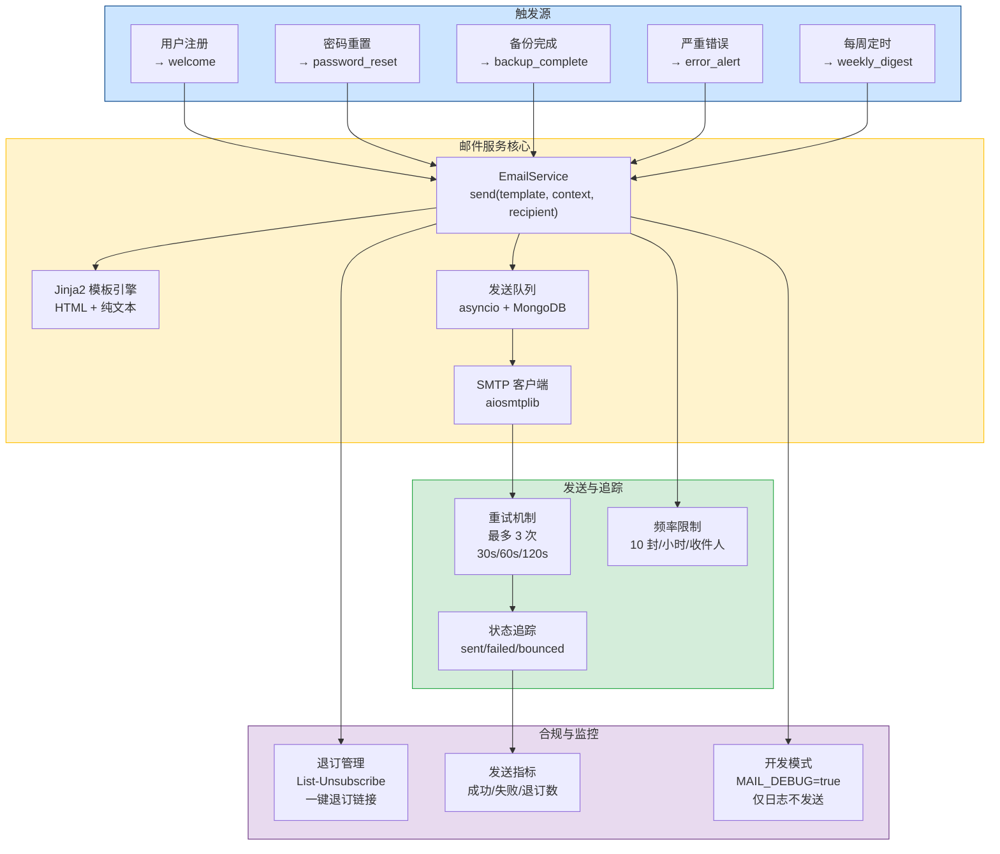
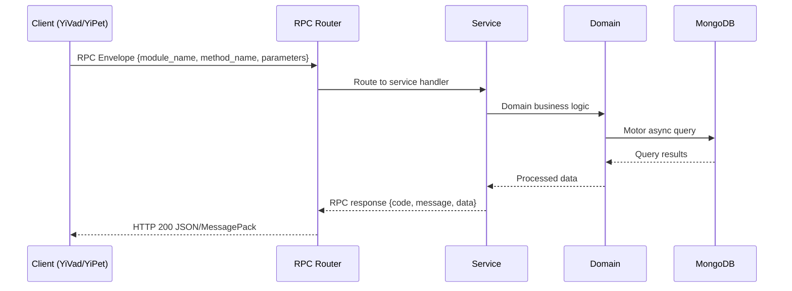

---

doc_type: module
prd_task_id: "YA-09-74"
title: "YA-09-74: 邮件通知服务 — SMTP + Jinja2 模板 + 队列重试 — 开发方案"
status: 需求已编写
priority: P2
owner: 陈铭
roles: [engineer]
created: 2026-09-11
updated: 2026-09-14
project: YiAi
project_id: yiai
prd_month: "202609"
estimate_frontend: 1.0
source_prd: "146-需求-邮件通知服务.md"
source_okr: [yiai-001]

type: task
---

# YA-09-74: 邮件通知服务 — SMTP + Jinja2 模板 + 队列重试

> **文档职责**：本文档定义**怎么做、为什么这么做、实际做成什么样**（HOW），不含产品目标与测试用例。

> 来源 PRD：[146-需求-邮件通知服务.md](../../prds/2026-09/146-需求-邮件通知服务.md)
> 需求编号：YA-09-74 · 优先级：P2 · 人天：1.0 · 状态：需求已编写
> 类型：功能 · 依赖：无 · 前置需求：无

---

<a id="sec-1"></a>
## 一、架构概览 / Architecture Overview

YA-09-140: 邮件通知服务 — SMTP 异步发送 + Jinja2 模板 + 邮件队列重试 + 退订机制



<a id="sec-2"></a>
## 二、文件清单 / File Manifest

| 文件 / File | 操作 | 说明 / Description |
|-------------|------|--------------------|
| `YiAi/src/services/xxx/service.py` | 新增 | Core service logic
| `YiAi/src/services/xxx/rpc_handler.py` | 新增 | RPC route handler
| `YiAi/tests/test_xxx.py` | 新增 | Unit tests

> Source PRD: 146-需求-邮件通知服务.md

<a id="sec-3"></a>
## 三、Python 签名与核心组件 / Python Signatures

### 3.1 核心组件

```python
from datetime import datetime
from enum import Enum
from typing import Optional
from pydantic import BaseModel, EmailStr, Field
class EmailTemplate(str, Enum):
    """邮件模板类型枚举。"""
class EmailStatus(str, Enum):
class EmailDelivery(BaseModel):
    """邮件发送记录。"""
class EmailContext(BaseModel):
    """邮件模板上下文。"""
```
### 3.2 组件 2

```python
import asyncio
import secrets
from datetime import datetime, timezone, timedelta
from email.mime.multipart import MIMEMultipart
from email.mime.text import MIMEText
from email.mime.base import MIMEBase
from email import encoders
from pathlib import Path
from typing import Optional
import aiosmtplib
from jinja2 import Environment, FileSystemLoader, select_autoescape
from motor.motor_asyncio import AsyncIOMotorDatabase
from shared.logging import get_logger
from shared.config import settings
from services.email.models import (
# 重试延迟（秒）
# 频率限制：每收件人每小时最多 10 封
class EmailService:
    """异步邮件发送服务。"""
    def __init__(self, db: AsyncIOMotorDatabase):
    async def _get_smtp(self) -> aiosmtplib.SMTP:
    async def send(self, ctx: EmailContext) -> dict:
    async def send_sync(self, ctx: EmailContext) -> dict:
    async def unsubscribe(self, email: str, token: str) -> bool:
    async def resubscribe(self, email: str) -> bool:
```
### 3.3 组件 3

```python
from fastapi import APIRouter, Depends, Query
from motor.motor_asyncio import AsyncIOMotorDatabase
from services.email.email_service import EmailService
from services.email.models import EmailContext, EmailTemplate
from shared.dependencies import get_db
def get_email_service(db: AsyncIOMotorDatabase = Depends(get_db)) -> EmailService:
    return EmailService(db)
@router.get("/unsubscribe")
async def unsubscribe(
    """邮件退订（一键退订）。"""
    if success:
        return {"code": 0, "message": "您已成功退订邮件通知", "data": None}
    return {"code": 1001, "message": "退订链接无效或已过期", "data": None}
@router.post("/resubscribe")
async def resubscribe(
    """重新订阅邮件。"""
    if success:
        return {"code": 0, "message": "您已重新订阅邮件通知", "data": None}
    return {"code": 1002, "message": "该邮箱不在退订列表中", "data": None}
@router.get("/deliveries")
async def get_delivery_history(
```

<a id="sec-4"></a>
## 四、数据流 / Data Flow



**Call chain**: `Client -> RPC Router -> Service -> Domain -> MongoDB`  
**Response format**: `{code: 0, message: "ok", data: ...}`  
**Async model**: Full-chain `async/await`, Motor async MongoDB driver.  
**Error propagation**: Service exceptions caught by middleware -> standard error codes (1001-9999).

<a id="sec-5"></a>
## 五、实施路线图 / Roadmap

**预估人天 / Estimated**: 1.0

| 步骤 / Step | 操作 / Action | 路径 / Path | 验证 / Verification | 人天 / Days |
|-------------|---------------|-------------|---------------------|-------------|
| 1 | 定义数据模型和 SMTP 配置项 | `models.py`, `config.py` | 模型验证通过，配置项可读取 | 0.05 |
| 2 | 创建 Jinja2 邮件模板（5 种 HTML + 纯文本） | `templates/*.html`, `templates/*.txt` | 模板渲染正确，HTML 结构完整 | 0.1 |
| 3 | 实现邮件服务核心（渲染 + SMTP 发送 + 重试） | `email_service.py` | 开发模式日志输出正确，生产模式邮件送达 | 0.15 |
| 4 | 实现退订管理（List-Unsubscribe + 一键退订） | `email_service.py` | 退订链接可用，退订后不再发送 | 0.05 |
| 5 | 实现频率限制（10 封/小时/收件人） | `email_service.py` | 超额发送被拒绝 | 0.05 |
| 6 | 实现 RPC 端点（退订/重新订阅/发送历史） | `email_routes.py` | API 端点可正常调用 | 0.05 |
| 7 | 集成测试（开发模式 + 真实 SMTP） | 全部 | 开发模式日志正确，SMTP 邮件送达 | 0.05 |
| 操作 | 耗时 | 资源消耗 | 说明 |
| 模板渲染 | < 5ms | CPU < 1% | Jinja2 渲染 5KB 模板 |
| SMTP 连接 | 100-500ms | 网络 IO | 取决于 SMTP 服务器距离 |
| 邮件发送 | 200-1000ms | 网络 IO | 取决于邮件大小和 SMTP 服务器 |
| 重试全流程（3 次） | 最大 210s | 网络 IO | 30s+60s+120s=210s 总等待 |

<a id="sec-6"></a>
## 六、代码审查检查清单 / Review Checklist

- [ ] `EmailTemplate` 枚举包含所有 5 种模板类型
- [ ] `EmailContext` 模型验证收件人邮箱格式
- [ ] Jinja2 模板引擎使用 `FileSystemLoader` 从 `templates/` 加载
- [ ] 每种模板同时提供 `.html` 和 `.txt` 版本
- [ ] 邮件使用 `MIMEMultipart("alternative")` 包含纯文本和 HTML
- [ ] `List-Unsubscribe` 和 `List-Unsubscribe-Post` 头部正确设置
- [ ] 退订 token 使用 HMAC-SHA256 生成，有时效性验证
- [ ] 开发模式（`MAIL_DEBUG=true`）仅记录日志，不连接 SMTP
- [ ] SMTP 连接使用 `use_tls` 参数（根据配置）
- [ ] 重试延迟为 30s/60s/120s，最多 3 次重试
- [ ] 发送记录持久化到 MongoDB `email_deliveries` 集合
- [ ] 频率限制正确（10 封/小时/收件人，滑动窗口）
- [ ] 退订后正确跳过发送，返回 `skipped` 状态
- [ ] 同步发送 (`send_sync`) 等待 SMTP 确认后返回
- [ ] 异步发送 (`send`) 立即返回，使用 `asyncio.create_task`
- [ ] 模板变量包含 `unsubscribe_url`、`app_name`、`current_year`
- [ ] `ruff` 代码规范通过
- [ ] `mypy` 类型检查通过

<a id="sec-7"></a>
## 七、风险表 / Risk Table

| 风险 / Risk | 影响 / Impact | 缓解措施 / Mitigation | 应急预案 / Contingency |
|-------------|---------------|----------------------|------------------------|
| SMTP 服务器不可用 | 中 | 中 | 中 |
| SMTP 凭据泄露 | 低 | 高 | 高 |
| 邮件被标记为垃圾邮件 | 中 | 中 | 中 |
| 模板渲染异常 | 低 | 中 | 低 |
| 退订链接被滥用 | 低 | 低 | 低 |
| 场景 | 回滚方式 | 回滚时间 | 风险 |
| 邮件发送影响主业务 | 设置 `MAIL_DEBUG=true` 停止实际发送 | < 1min | 低：邮件通知中断，不影响核心业务 |
| SMTP 配置错误导致大量失败 | 修正配置 + 热重载 | < 1min | 低：失败邮件有记录，可补发 |
| 邮件模板有 bug | 修复模板文件 + 无需重启 | < 1min | 低：模板文件热加载 |
| 退订功能异常 | 关闭退订检查 `bypass_unsubscribe_check=true` | < 1min | 低：退订功能暂时不可用 |
