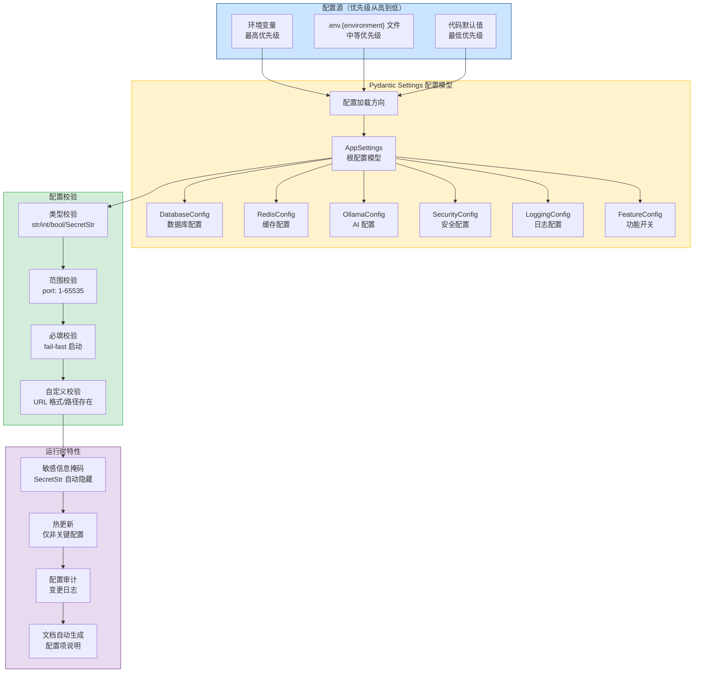
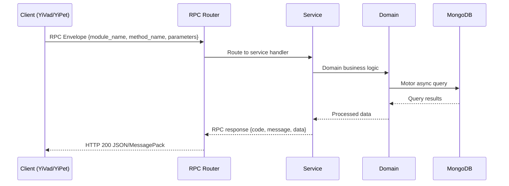

---

doc_type: module
prd_task_id: "YA-09-61"
title: "YA-09-61: 多环境配置管理 — 环境分层 + 热更新 + 校验 — 开发方案"
status: 需求已编写
priority: P2
owner: 陈铭
roles: [engineer]
created: 2026-09-11
updated: 2026-09-14
project: YiAi
project_id: yiai
prd_month: "202609"
estimate_frontend: 1.0
source_prd: "147-需求-多环境配置管理.md"
source_okr: [yiai-001]

type: task
---

# YA-09-61: 多环境配置管理 — 环境分层 + 热更新 + 校验

> **文档职责**：本文档定义**怎么做、为什么这么做、实际做成什么样**（HOW），不含产品目标与测试用例。

> 来源 PRD：[147-需求-多环境配置管理.md](../../prds/2026-09/147-需求-多环境配置管理.md)
> 需求编号：YA-09-61 · 优先级：P2 · 人天：1.0 · 状态：需求已编写
> 类型：功能 · 依赖：无 · 前置需求：无

---

<a id="sec-1"></a>
## 一、架构概览 / Architecture Overview

YA-09-141: 多环境配置管理 — 环境分层 + Pydantic Settings 校验 + 敏感信息保护 + 配置热更新



<a id="sec-2"></a>
## 二、文件清单 / File Manifest

| 文件 / File | 操作 | 说明 / Description |
|-------------|------|--------------------|
| `YiAi/src/services/xxx/service.py` | 新增 | Core service logic
| `YiAi/src/services/xxx/rpc_handler.py` | 新增 | RPC route handler
| `YiAi/tests/test_xxx.py` | 新增 | Unit tests

> Source PRD: 147-需求-多环境配置管理.md

<a id="sec-3"></a>
## 三、Python 签名与核心组件 / Python Signatures

### 3.1 核心组件

```python
from enum import Enum
from pathlib import Path
from typing import Optional, Literal
from pydantic import (
from pydantic_settings import BaseSettings, SettingsConfigDict
class Environment(str, Enum):
    """部署环境枚举。"""
# ─── 配置子模型 ────────────────────────────────────────
class DatabaseConfig(BaseModel):
    """数据库配置。"""
    @field_validator("uri")
    @classmethod
    def uri_must_start_with_mongodb(cls, v: str) -> str:
        if not v.startswith("mongodb://") and not v.startswith("mongodb+srv://"):
        return v
class RedisConfig(BaseModel):
    """Redis 配置（可选）。"""
class OllamaConfig(BaseModel):
    """Ollama AI 配置。"""
class SecurityConfig(BaseModel):
class LoggingConfig(BaseModel):
class FeatureFlags(BaseModel):
class BackupConfig(BaseModel):
class SMTPConfig(BaseModel):
class AppSettings(BaseSettings):
```
### 3.2 组件 2

```python
import copy
from datetime import datetime, timezone
from typing import Any
from motor.motor_asyncio import AsyncIOMotorDatabase
from shared.config import AppSettings, load_settings
from shared.logging import get_logger
class ConfigService:
    """配置管理服务。"""
    def __init__(self, db: AsyncIOMotorDatabase, settings: AppSettings):
        self.db = db
        self.settings = settings
        self.audit_col = db.config_audit
        self._reloadable_cache: dict[str, Any] = {}
        self._init_reloadable_cache()
    def _init_reloadable_cache(self):
        """初始化可热更新配置缓存。"""
        self._reloadable_cache = self.settings.reloadable_config()
    async def reload(self, source: str = "api") -> dict:
        """重新加载配置（仅可热更新的部分）。"""
        # 重新加载配置
    async def get_audit_log(self, limit: int = 50) -> list[dict]:
    def get_current_config(self, safe: bool = True) -> dict:
    def _mask_value(self, value: Any) -> str:
```
### 3.3 组件 3

```python
from fastapi import APIRouter, Depends
from motor.motor_asyncio import AsyncIOMotorDatabase
from services.config.config_service import ConfigService
from shared.dependencies import get_db, get_settings
def get_config_service(
    return ConfigService(db, settings)
@router.get("/")
async def get_config(
    """获取当前配置。"""
    return {"code": 0, "message": "ok", "data": config}
@router.post("/reload")
async def reload_config(
    """热更新非关键配置。"""
    return {"code": 0, "message": "ok", "data": result}
@router.get("/audit")
async def get_config_audit(
    """获取配置变更审计日志。"""
    return {"code": 0, "message": "ok", "data": {"audit_logs": logs}}
@router.get("/reloadable")
async def get_reloadable_keys(
@router.get("/docs")
async def generate_config_docs(
```

<a id="sec-4"></a>
## 四、数据流 / Data Flow



**Call chain**: `Client -> RPC Router -> Service -> Domain -> MongoDB`  
**Response format**: `{code: 0, message: "ok", data: ...}`  
**Async model**: Full-chain `async/await`, Motor async MongoDB driver.  
**Error propagation**: Service exceptions caught by middleware -> standard error codes (1001-9999).

<a id="sec-5"></a>
## 五、实施路线图 / Roadmap

**预估人天 / Estimated**: 1.0

| 步骤 / Step | 操作 / Action | 路径 / Path | 验证 / Verification | 人天 / Days |
|-------------|---------------|-------------|---------------------|-------------|
| 1 | 定义配置子模型（Database/Redis/Ollama/Security/Logging/Features/Backup/SMTP） | `config.py` | 模型实例化正确，类型校验通过 | 0.1 |
| 2 | 定义 AppSettings 根模型 + 配置源优先级 | `config.py` | 环境变量 > .env 文件 > 默认值 | 0.05 |
| 3 | 实现 fail-fast 校验（启动时验证必填配置） | `config.py` | 缺失必填配置时启动失败，错误信息清晰 | 0.05 |
| 4 | 实现敏感信息掩码（SecretStr + model_dump_safe） | `config.py` | 日志中不出现密码等敏感信息 | 0.05 |
| 5 | 创建环境配置文件（.env.development/.env.staging/.env.production.example） | `.env.*` 文件 | 各环境配置可正常加载 | 0.05 |
| 6 | 实现配置热更新服务（仅非关键配置） | `config_service.py` | 日志级别、功能开关等可热更新 | 0.1 |
| 7 | 实现配置审计日志 | `config_service.py` | 配置变更记录到 MongoDB | 0.05 |
| 8 | 实现配置管理 API（查看/重载/审计/文档） | `config_routes.py` | 所有端点可正常调用 | 0.05 |
| 操作 | 耗时 | 资源消耗 | 说明 |
| 配置加载（启动时） | < 10ms | CPU < 1% | Pydantic 解析 + 校验 |
| 配置热更新 | < 5ms | CPU < 1% | 仅重新加载可热更新部分 |
| 配置掩码（model_dump_safe） | < 1ms | CPU < 1% | 递归遍历配置字典 |

<a id="sec-6"></a>
## 六、代码审查检查清单 / Review Checklist

- [ ] `AppSettings` 继承 `BaseSettings`，配置 `env_nested_delimiter="__"`
- [ ] 所有配置子模型使用 Pydantic `BaseModel`，字段有 `Field(description=...)` 说明
- [ ] `DatabaseConfig.uri` 校验以 `mongodb://` 或 `mongodb+srv://` 开头
- [ ] 端口类字段使用 `ge=1, le=65535` 范围校验
- [ ] 所有密码/密钥字段使用 `SecretStr` 类型
- [ ] `model_dump_safe` 方法递归掩码所有 `SecretStr` 字段
- [ ] 启动时根据 `ENVIRONMENT` 环境变量加载对应 `.env.{env}` 文件
- [ ] 生产环境额外校验：`secret_key != "changeme"`，`database.uri` 非默认值
- [ ] `extra="forbid"` 禁止未定义的配置项
- [ ] 配置加载失败时服务拒绝启动（fail-fast），日志输出清晰错误信息
- [ ] `ConfigService` 支持 `reload()` 热更新非关键配置
- [ ] 配置变更记录到 MongoDB `config_audit` 集合
- [ ] 配置管理 API 仅内网 IP 可访问（复用 IP 白名单中间件）
- [ ] `.env.production` 加入 `.gitignore`，仅提交 `.env.production.example` 模板
- [ ] 配置文档 API 自动生成所有配置项说明
- [ ] `ruff` 代码规范通过
- [ ] `mypy` 类型检查通过
---

<a id="sec-7"></a>
## 七、风险表 / Risk Table

| 风险 / Risk | 影响 / Impact | 缓解措施 / Mitigation | 应急预案 / Contingency |
|-------------|---------------|----------------------|------------------------|
| 生产环境 secret_key 使用默认值 | 中 | 高 | 高 |
| 配置文件被误提交到代码仓库 | 中 | 高 | 高 |
| 热更新引入错误配置导致服务异常 | 低 | 中 | 中 |
| Pydantic Settings 与现有 `os.getenv` 调用冲突 | 中 | 中 | 中 |
| 配置模型字段过多影响启动速度 | 低 | 低 | 低 |
| 场景 | 回滚方式 | 回滚时间 | 风险 |
| 新配置模型有 bug | 回退到旧 `settings.py` 代码 | < 5min | 低：配置文件不变，仅代码回滚 |
| 热更新导致服务异常 | 调用 `POST /admin/config/reload` 重新加载原始配置 | < 1min | 低：热更新即时生效 |
| .env 文件配置错误 | 修正 .env 文件 + 热更新 | < 1min | 低：非关键配置即时生效 |
| 生产环境配置错误导致启动失败 | 修正环境变量 + 重启服务 | < 2min | 中：重启期间服务短暂不可用 |
