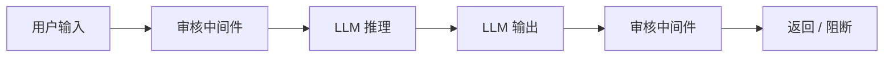

# YA-09-77: 内容审核与安全检测 — AI 审核管线 + 多类别 — 开发方案

> **文档职责**：本文档定义**怎么做、为什么这么做、实际做成什么样**（HOW），不含产品目标与测试用例。

> 来源 PRD：[148-需求-内容审核与安全检测.md](../../prds/2026-09/148-需求-内容审核与安全检测.md)
> 需求编号：YA-09-77 · 优先级：P2 · 人天：1.5d · 状态：需求已编写

---

<a id="sec-1"></a>
## 一、方案

在 LLM 请求/响应链路中插入内容审核中间件——检测敏感内容、Prompt 注入、数据泄露，根据策略阻断或标记。



### 检测类别

| 类别 | 检测方式 | 动作 |
|------|---------|------|
| 敏感词 | 关键词库 + 正则 | 阻断 |
| Prompt 注入 | LLM 分类器 | 阻断 + 审计 |
| 数据泄露 | 正则 + NER | 脱敏后放行 |
| 恶意代码 | AST 分析 | 阻断 |
| 色情/暴力 | LLM 安全分类器 | 阻断 |

```python
async def content_audit(text: str, direction: "input" | "output") -> dict:
    results = {}
    for checker in [KeywordChecker(), InjectionChecker(), LeakChecker()]:
        result = await checker.check(text)
        results[checker.name] = result
    return results
```

---

<a id="sec-2"></a>
## 二、实施步骤

| 步骤 | 验证 | 人天 |
|------|------|------|
| 1 | 关键词 + Prompt 注入检测 | 已知注入模式被拦截 | 0.5 |
| 2 | LLM 安全分类器 + 审计 + 测试 | 敏感内容正确判定 | 1.0 |

**合计：1.5d**。