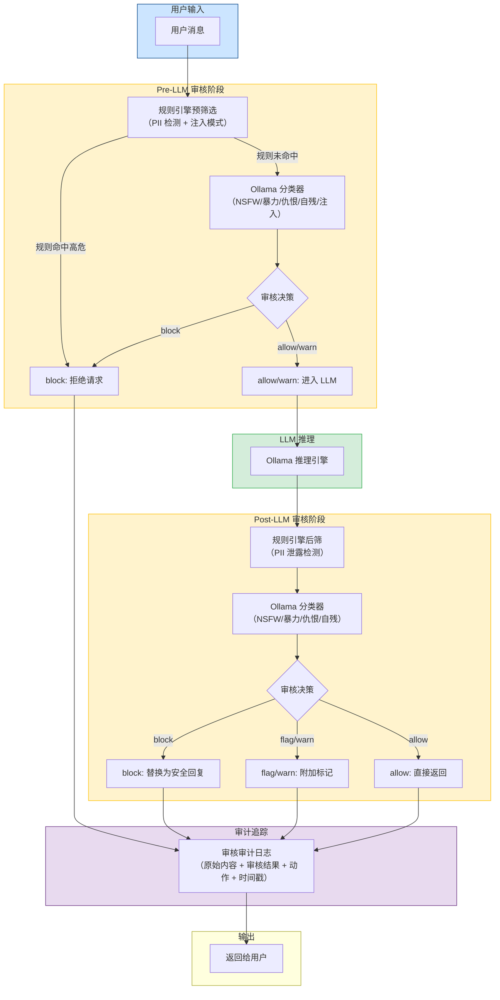
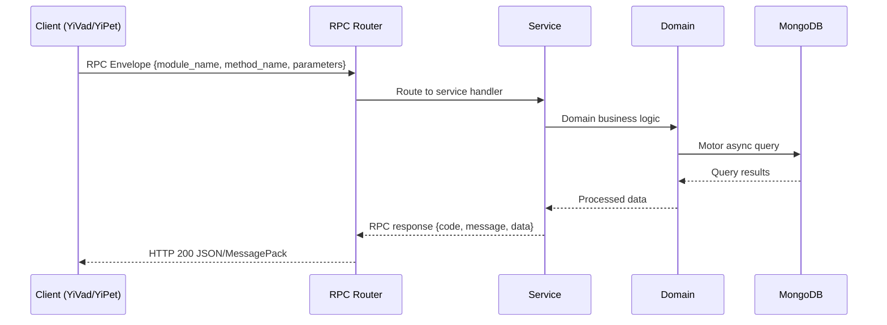

---

doc_type: module
prd_task_id: "YA-09-77"
title: "YA-09-77: 内容审核与安全检测 — AI 审核管线 + 多类别 — 开发方案"
status: 需求已编写
priority: P2
owner: 陈铭
roles: [engineer]
created: 2026-09-11
updated: 2026-09-14
project: YiAi
project_id: yiai
prd_month: "202609"
estimate_frontend: 1.5
source_prd: "148-需求-内容审核与安全检测.md"
source_okr: [yiai-001]

type: task
---

# YA-09-77: 内容审核与安全检测 — AI 审核管线 + 多类别

> **文档职责**：本文档定义**怎么做、为什么这么做、实际做成什么样**（HOW），不含产品目标与测试用例。

> 来源 PRD：[148-需求-内容审核与安全检测.md](../../prds/2026-09/148-需求-内容审核与安全检测.md)
> 需求编号：YA-09-77 · 优先级：P2 · 人天：1.5 · 状态：需求已编写
> 类型：功能 · 依赖：无 · 前置需求：无

---

<a id="sec-1"></a>
## 一、架构概览 / Architecture Overview

YA-09-142: 内容审核与安全检测 — AI 内容审核管线 + 多类别检测 + 审计追踪 + 隐私保护


```mermaid
flowchart TD
  subgraph Input["用户输入"]
    USER_IN["用户消息"]
  end

  subgraph PreLLM["Pre-LLM 审核阶段"]
    RULE_PRE["规则引擎预筛选<br/>（PII 检测 + 注入模式）"]
    CLASSIFY_PRE["Ollama 分类器<br/>（NSFW/暴力/仇恨/自残/注入）"]
    DECISION_PRE{"审核决策"}
    BLOCK_PRE["block: 拒绝请求"]
    PASS_PRE["allow/warn: 进入 LLM"]
  end

  subgraph LLM["LLM 推理"]
    OLLAMA["Ollama 推理引擎"]
  end

  subgraph PostLLM["Post-LLM 审核阶段"]
    RULE_POST["规则引擎后筛<br/>（PII 泄露检测）"]
    CLASSIFY_POST["Ollama 分类器<br/>（NSFW/暴力/仇恨/自残）"]
    DECISION_POST{"审核决策"}
    BLOCK_POST["block: 替换为安全回复"]
    FLAG_POST["flag/warn: 附加标记"]
    PASS_POST["allow: 直接返回"]
  end

  subgraph Audit["审计追踪"]
    AUDIT_LOG["审核审计日志<br/>（原始内容 + 审核结果 + 动作 + 时间戳）"]
  end

  subgraph Output["输出"]
    USER_OUT["返回给用户"]
  end

  USER_IN --> RULE_PRE
  RULE_PRE -->|规则命中高危| BLOCK_PRE
  RULE_PRE -->|规则未命中| CLASSIFY_PRE
  CLASSIFY_PRE --> DECISION_PRE
  DECISION_PRE -->|block| BLOCK_PRE
  DECISION_PRE -->|allow/warn| PASS_PRE
  PASS_PRE --> OLLAMA
  OLLAMA --> RULE_POST
  RULE_POST --> CLASSIFY_POST
  CLASSIFY_POST --> DECISION_POST
  DECISION_POST -->|block| BLOCK_POST
  DECISION_POST -->|flag/warn| FLAG_POST
  DECISION_POST -->|allow| PASS_POST
  BLOCK_PRE --> AUDIT_LOG
  BLOCK_POST --> AUDIT_LOG
  FLAG_POST --> AUDIT_LOG
  PASS_POST --> AUDIT_LOG
  AUDIT_LOG --> USER_OUT

  style Input fill:#cce5ff,stroke:#004085
  style PreLLM fill:#fff3cd,stroke:#ffc107
  style LLM fill:#d4edda,stroke:#28a745
  style PostLLM fill:#fff3cd,stroke:#ffc107
  style Audit fill:#e8daef,stroke:#6c3483
```

<a id="sec-2"></a>
## 二、文件清单 / File Manifest

| 文件 / File | 操作 | 说明 / Description |
|-------------|------|--------------------|
| `YiAi/src/services/xxx/service.py` | 新增 | Core service logic
| `YiAi/src/services/xxx/rpc_handler.py` | 新增 | RPC route handler
| `YiAi/tests/test_xxx.py` | 新增 | Unit tests

> Source PRD: 148-需求-内容审核与安全检测.md

<a id="sec-3"></a>
## 三、Python 签名与核心组件 / Python Signatures

### 3.1 核心组件

```python
import asyncio
import re
import json
from datetime import datetime
from dataclasses import dataclass, field
from enum import Enum
from typing import Optional
from shared.config import settings
from shared.logging import get_logger
class ModerationAction(str, Enum):
class ModerationCategory(str, Enum):
@dataclass
class ModerationResult:
# PII 检测正则模式
# Prompt 注入检测模式
class ModerationService:
    """AI 内容审核与安全检测服务。"""
    def __init__(self):
        self.thresholds = {
        self.moderation_model = settings.moderation_model or "llama-guard3:1b"
    async def moderate_input(self, content: str, user_id: str = "") -> ModerationResult:
    async def moderate_output(self, content: str, user_id: str = "") -> ModerationResult:
    def _rule_engine_check(self, content: str, skip_injection: bool = False) -> ModerationResult:
    async def _ollama_classify(self, content: str, skip_injection: bool = False) -> ModerationResult:
                from shared.ollama_client import ollama_client
```
### 3.2 组件 2

```python
from fastapi import Request
from services.moderation.moderation_service import ModerationService, ModerationAction
from shared.logging import get_logger
async def moderation_pre_llm_hook(content: str, user_id: str, user_roles: list[str]) -> dict:
    """Pre-LLM 审核钩子，在聊天请求进入 LLM 前调用。"""
    if moderation_service.should_bypass(user_roles):
        return {"action": "bypass", "bypassed_by": "admin_role"}
    return {
async def moderation_post_llm_hook(content: str, user_id: str, user_roles: list[str]) -> dict:
    """Post-LLM 审核钩子，在 AI 输出返回前调用。"""
    if moderation_service.should_bypass(user_roles):
        return {"action": "bypass", "bypassed_by": "admin_role"}
    return {
```
### 3.3 组件 3

```python
from datetime import datetime
from typing import Optional
from data.repository import Repository
from shared.logging import get_logger
async def log_moderation_event(
    """记录审核事件到审计日志。"""
def _hash_content(content: str) -> str:
    import hashlib
    return hashlib.sha256(content.encode()).hexdigest()[:16]
```

<a id="sec-4"></a>
## 四、数据流 / Data Flow


```mermaid
sequenceDiagram
    participant C as Client (YiVad/YiPet)
    participant R as RPC Router
    participant S as Service
    participant D as Domain
    participant M as MongoDB

    C->>R: RPC Envelope {module_name, method_name, parameters}
    R->>S: Route to service handler
    S->>D: Domain business logic
    D->>M: Motor async query
    M-->>D: Query results
    D-->>S: Processed data
    S-->>R: RPC response {code, message, data}
    R-->>C: HTTP 200 JSON/MessagePack
```

**Call chain**: `Client -> RPC Router -> Service -> Domain -> MongoDB`  
**Response format**: `{code: 0, message: "ok", data: ...}`  
**Async model**: Full-chain `async/await`, Motor async MongoDB driver.  
**Error propagation**: Service exceptions caught by middleware -> standard error codes (1001-9999).

<a id="sec-5"></a>
## 五、实施路线图 / Roadmap

**预估人天 / Estimated**: 1.5

| 步骤 / Step | 操作 / Action | 路径 / Path | 验证 / Verification | 人天 / Days |
|-------------|---------------|-------------|---------------------|-------------|
| 1 | 定义审核数据模型（ModerationResult, ModerationAction, ModerationCategory） | `services/moderation/moderation_service.py` | 类型定义正确，枚举值完整 | 0.05 |
| 2 | 实现规则引擎（PII 检测 + Prompt 注入模式匹配） | `services/moderation/moderation_service.py` | 已知 PII 和注入模式可被正确检测 | 0.15 |
| 3 | 实现 Ollama 分类器集成（构建分类 prompt + 解析响应） | `services/moderation/moderation_service.py` | 分类 prompt 格式正确，响应解析健壮 | 0.2 |
| 4 | 实现审核决策逻辑（四级响应 + 置信度阈值） | `services/moderation/moderation_service.py` | 不同置信度区间返回对应动作 | 0.1 |
| 5 | 实现 Pre/Post LLM 审核钩子（中间件集成） | `services/moderation/moderation_middleware.py` | 钩子在 LLM 调用前后正确触发 | 0.15 |
| 6 | 实现审核审计日志 | `services/moderation/audit.py` | 审核事件正确写入 MongoDB | 0.1 |
| 7 | 实现管理员绕过机制 | `services/moderation/moderation_service.py` | admin 角色用户请求绕过审核 | 0.05 |
| 8 | 实现误报反馈接口 | `services/moderation/moderation_service.py` | 反馈可记录到 moderation_feedback 集合 | 0.05 |
| 9 | 集成到 chat_service SSE 流式处理 | `services/ai/chat_service.py` | Pre-LLM 审核在流式前执行，Post-LLM 审核在流式后执行 | 0.1 |
| 10 | 添加配置项 + 更新 config.py | `shared/config.py` | 配置项可读取，默认值可用 | 0.05 |
| 风险 | 概率 | 影响 | 等级 | 缓解措施 | 应急预案 |
| Ollama 分类模型不可用 | 中 | 高 | 高 | 规则引擎独立运行，分类失败时降级为 warn | 暂时禁用 Ollama 分类，仅使用规则引擎 |

<a id="sec-6"></a>
## 六、代码审查检查清单 / Review Checklist

- [ ] `ModerationService` 正确实现 Pre-LLM 和 Post-LLM 两个阶段
- [ ] 规则引擎 PII 检测覆盖主流格式（身份证、手机号、邮箱、IP、信用卡）
- [ ] 规则引擎 Prompt 注入检测覆盖常见攻击模式
- [ ] Ollama 分类器使用独立模型（`llama-guard3:1b` 或类似）
- [ ] 分类 prompt 包含明确的 JSON 格式输出指令
- [ ] 响应解析有容错处理（JSON 提取失败不崩溃）
- [ ] 四级审核决策逻辑正确（block > 0.9, flag > 0.7, warn > 0.5, else allow）
- [ ] 管理员绕过检查在中间件中执行，ROLES 数组匹配不区分大小写
- [ ] 审核审计日志包含内容哈希（不存储完整内容）
- [ ] 误报反馈接口正确写入 `moderation_feedback` 集合
- [ ] 审核超时设置为 500ms，超时后降级为 warn
- [ ] 并发限制（Semaphore）防止 Ollama 过载
- [ ] Pre-LLM 审核在 SSE 流式响应开始前执行
- [ ] Post-LLM 审核在 SSE 流式响应完成后执行
- [ ] `ruff` 代码规范通过
- [ ] `mypy` 类型检查通过
---
## 回归问题预测

<a id="sec-7"></a>
## 七、风险表 / Risk Table

| 风险 / Risk | 影响 / Impact | 缓解措施 / Mitigation | 应急预案 / Contingency |
|-------------|---------------|----------------------|------------------------|
| Ollama 分类模型不可用 | 中 | 高 | 高 |
| 分类延迟超过 200ms | 中 | 中 | 中 |
| 误报率过高导致用户体验差 | 中 | 中 | 中 |
| 规则引擎漏报新型注入攻击 | 高 | 中 | 中 |
| 审计日志数据量过大 | 中 | 低 | 低 |
| PII 检测漏报非标准格式 | 中 | 中 | 中 |
| 场景 | 回滚方式 | 回滚时间 | 风险 |
| 审核功能导致大量误拦 | 设置 `moderation_enabled = false` 禁用审核 | < 1min | 低：审核完全禁用，回到无审核状态 |
| 特定类别误报严重 | 设置对应 `moderation_threshold_xxx = 1.0`（从不触发） | < 1min | 低：仅禁用特定类别，其他类别继续工作 |
| Ollama 分类模型性能问题 | 设置 `moderation_model = ""` 仅使用规则引擎 | < 1min | 低：规则引擎继续运行，分类器停用 |
