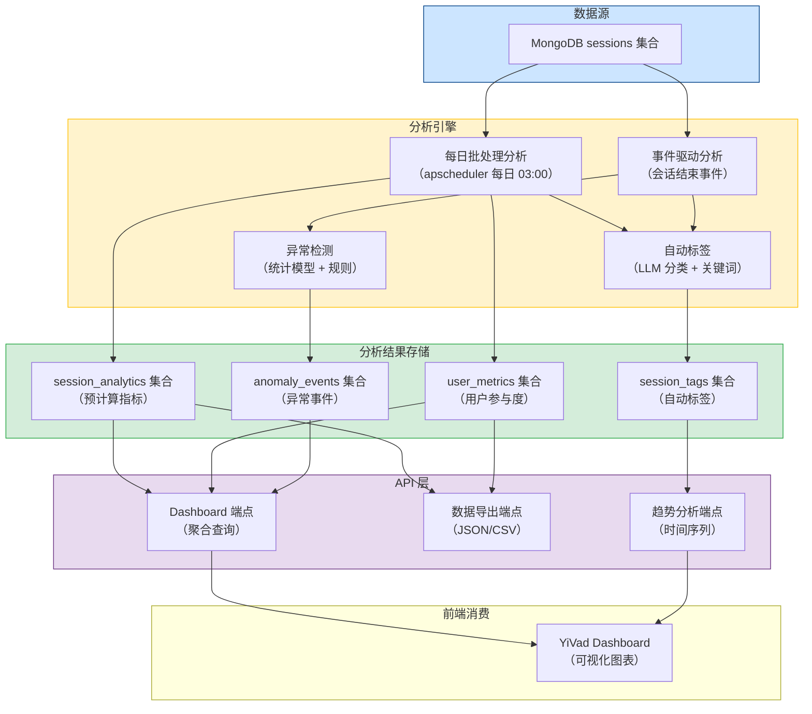
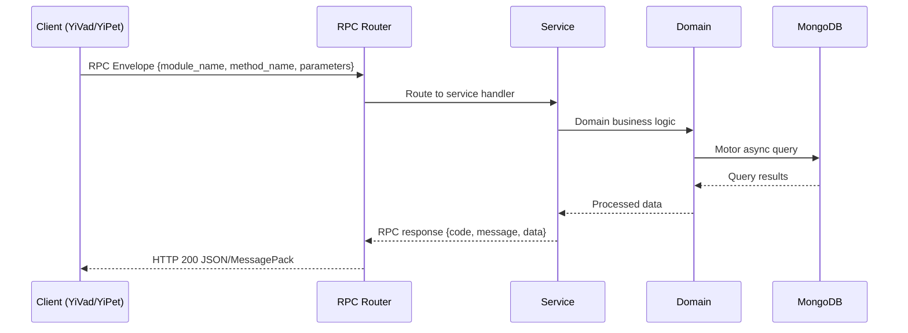

---

doc_type: module
prd_task_id: "YA-09-143"
title: "YA-09-143: Session 分析与洞察 — 会话分析 + 自动标签 + 用户参与度 + 异常检测 + 数据导出 — 开发任务"
status: 需求已编写
priority: P2
owner: 陈铭
roles: [engineer]
created: 2026-09-11
updated: 2026-09-11
project: YiAi
project_id: yiai
prd_month: "202609"
estimate_frontend: 0.5
source_prd: "149-需求-Session分析与洞察.md"
source_okr: [yiai-001]

type: task
---

# YA-09-143: Session 分析与洞察 — 会话分析 + 自动标签 + 用户参与度 + 异常检测 + 数据导出

> **文档职责**：本文档定义**怎么做、为什么这么做、实际做成什么样**（HOW），不含产品目标与测试用例。

> 来源 PRD：[149-需求-Session分析与洞察.md](../../prds/2026-09/149-需求-Session分析与洞察.md)
> 需求编号：YA-09-143 · 优先级：P2 · 人天：0.5 · 状态：需求已编写
> 类型：功能 · 依赖：无 · 前置需求：无

---

<a id="sec-1"></a>
## 一、架构概览 / Architecture Overview

YA-09-143: Session 分析与洞察 — 会话分析 + 自动标签 + 用户参与度 + 异常检测 + 数据导出



<a id="sec-2"></a>
## 二、文件清单 / File Manifest

| 文件 / File | 操作 | 说明 / Description |
|-------------|------|--------------------|
| `YiAi/src/services/xxx/service.py` | 新增 | Core service logic
| `YiAi/src/services/xxx/rpc_handler.py` | 新增 | RPC route handler
| `YiAi/tests/test_xxx.py` | 新增 | Unit tests

> Source PRD: 149-需求-Session分析与洞察.md

<a id="sec-3"></a>
## 三、Python 签名与核心组件 / Python Signatures

### 3.1 核心组件

```python
import asyncio
import hashlib
from datetime import datetime, timedelta
from collections import Counter
from dataclasses import dataclass, field
from typing import Optional
from shared.config import settings
from shared.logging import get_logger
@dataclass
class SessionMetrics:
    """会话级指标。"""
@dataclass
class UserMetrics:
    """用户级指标。"""
class SessionAnalyticsService:
    """会话分析与洞察服务。"""
    # 预定义话题标签列表
    def __init__(self):
        self.anonymize = settings.analytics_anonymize or True
    async def analyze_session(self, session: dict) -> SessionMetrics:
    async def auto_tag_session(self, session: dict, metrics: SessionMetrics) -> list[str]:
    def _keyword_tagging(self, content: str) -> list[str]:
    async def _llm_tagging(self, content: str) -> list[str]:
            from shared.ollama_client import ollama_client
            import json
```
### 3.2 组件 2

```python
from apscheduler.schedulers.asyncio import AsyncIOScheduler
from services.analytics.session_analytics import SessionAnalyticsService
from shared.logging import get_logger
def setup_analytics_scheduler():
    """配置分析调度任务。"""
    # 每日分析：凌晨 3:00
```
### 3.3 组件 3

```python
from fastapi import APIRouter, Query
from services.analytics.session_analytics import SessionAnalyticsService
@router.get("/analytics/dashboard")
async def get_dashboard():
    """获取 Dashboard 概览数据。"""
    from data.repository import Repository
    # 全局统计
    return {
@router.get("/analytics/trends")
async def get_trends(days: int = Query(default=7, ge=1, le=90)):
    """获取话题趋势数据。"""
    return {"code": 0, "data": {"topics": trending, "period_days": days}}
@router.get("/analytics/anomalies")
async def get_anomalies(limit: int = Query(default=50, ge=1, le=500)):
    """获取异常事件列表。"""
    from data.repository import Repository
    return {"code": 0, "data": {"anomalies": anomalies}}
@router.get("/analytics/export")
async def export_analytics(
    """导出分析数据。"""
@router.post("/analytics/run")
async def trigger_analysis():
```

<a id="sec-4"></a>
## 四、数据流 / Data Flow



**Call chain**: `Client -> RPC Router -> Service -> Domain -> MongoDB`  
**Response format**: `{code: 0, message: "ok", data: ...}`  
**Async model**: Full-chain `async/await`, Motor async MongoDB driver.  
**Error propagation**: Service exceptions caught by middleware -> standard error codes (1001-9999).

<a id="sec-5"></a>
## 五、实施路线图 / Roadmap

**预估人天 / Estimated**: 0.5

| 步骤 / Step | 操作 / Action | 路径 / Path | 验证 / Verification | 人天 / Days |
|-------------|---------------|-------------|---------------------|-------------|
| 1 | 定义数据模型（SessionMetrics, UserMetrics） | `session_analytics.py` | 数据类定义正确，字段完整 | 0.03 |
| 2 | 实现会话分析（消息统计、Token 估算、时长、质量评分） | `session_analytics.py` | 单个会话分析结果正确 | 0.1 |
| 3 | 实现自动标签（关键词 + LLM 分类） | `session_analytics.py` | 测试会话标签准确率 > 70% | 0.1 |
| 4 | 实现用户级指标计算（活跃度、留存率、偏好） | `session_analytics.py` | 用户指标计算正确 | 0.05 |
| 5 | 实现异常检测（4 条规则） | `session_analytics.py` | 异常会话可被正确检测 | 0.05 |
| 6 | 实现每日批处理主流程 | `session_analytics.py` | 批量分析执行成功，数据写入正确 | 0.05 |
| 7 | 配置调度器 | `scheduler.py` | 定时任务触发正常 | 0.02 |
| 8 | 实现 RPC 端点（Dashboard、趋势、异常、导出） | `analytics_routes.py` | API 端点返回正确数据 | 0.05 |
| 9 | 实现数据导出（JSON/CSV） | `session_analytics.py` | 导出文件格式正确 | 0.03 |
| 10 | 添加配置项 | `config.py` | 配置项可读取 | 0.02 |
| 风险 | 概率 | 影响 | 等级 | 缓解措施 | 应急预案 |
| 每日分析耗时过长，影响 MongoDB 性能 | 中 | 中 | 中 | 分析在凌晨执行，使用游标分批处理 | 调整分析频率为每周，或仅分析最近 7 天 |

<a id="sec-6"></a>
## 六、代码审查检查清单 / Review Checklist

- [ ] `SessionMetrics` 和 `UserMetrics` 数据类字段完整，类型注解正确
- [ ] `analyze_session` 正确处理空消息列表、单条消息等边界情况
- [ ] Token 估算公式正确（中英文混合场景）
- [ ] 会话时长计算支持字符串和 datetime 两种时间戳格式
- [ ] 质量评分 clamped 在 [0, 1] 范围内
- [ ] 关键词标签映射覆盖所有预定义标签
- [ ] LLM 标签分类使用轻量模型（0.5B-1B），temperature=0.0
- [ ] LLM 标签分类有超时和异常处理
- [ ] 异常检测规则阈值合理
- [ ] 伪匿名化使用 SHA256 + secret_key 盐值
- [ ] 每日批处理使用游标分批处理，避免内存溢出
- [ ] 数据导出支持 JSON 和 CSV 格式
- [ ] `ruff` 代码规范通过
- [ ] `mypy` 类型检查通过
---
## 回归问题预测
| # | 问题 | 发现场景 | 根因 | 修复方式 |
|---|------|---------|------|---------|

<a id="sec-7"></a>
## 七、风险表 / Risk Table

| 风险 / Risk | 影响 / Impact | 缓解措施 / Mitigation | 应急预案 / Contingency |
|-------------|---------------|----------------------|------------------------|
| 每日分析耗时过长，影响 MongoDB 性能 | 中 | 中 | 中 |
| LLM 自动标签准确率低 | 中 | 低 | 低 |
| 用户隐私数据泄露 | 低 | 高 | 高 |
| 分析数据存储膨胀 | 中 | 低 | 低 |
| 异常检测误报率过高 | 中 | 低 | 低 |
| 场景 | 回滚方式 | 回滚时间 | 风险 |
| 分析计算影响 MongoDB 性能 | 停止调度器 `scheduler.pause_job("daily_analytics")` | < 1min | 低：暂停期间无新分析数据 |
| 自动标签准确率过低 | 禁用 LLM 标签，仅使用关键词匹配 | < 1min | 低：关键词标签仍可工作 |
| 分析数据存储空间不足 | 清理旧分析数据 + 缩短保留期 | < 5min | 低：分析数据可重建 |
| 数据导出被滥用 | 限流导出端点或暂时禁用 | < 1min | 低：不影响核心功能 |
