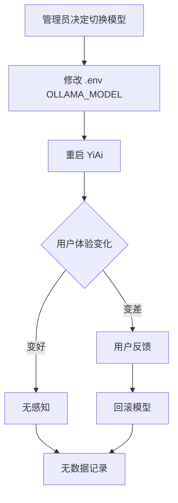
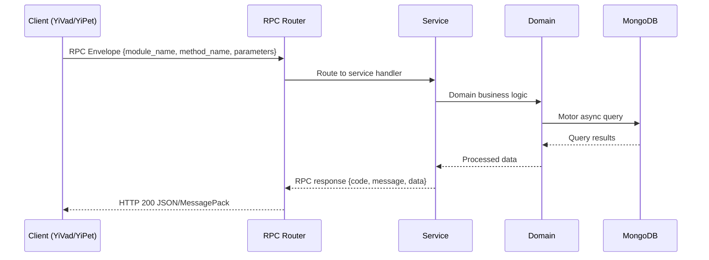

---

doc_type: module
prd_task_id: "YA-09-121"
title: "YA-09-121: 模型性能对比与盲测 — 多模型 A/B 评估框架 — 开发方案"
status: 需求已编写
priority: P2
owner: 陈铭
roles: [engineer]
created: 2026-09-11
updated: 2026-09-14
project: YiAi
project_id: yiai
prd_month: "202609"
estimate_frontend: 1.0
source_prd: "150-需求-模型性能对比与盲测评估.md"
source_okr: [yiai-002]

type: task
---

# YA-09-121: 模型性能对比与盲测 — 多模型 A/B 评估框架

> **文档职责**：本文档定义**怎么做、为什么这么做、实际做成什么样**（HOW），不含产品目标与测试用例。

> 来源 PRD：[150-需求-模型性能对比与盲测评估.md](../../prds/2026-09/150-需求-模型性能对比与盲测评估.md)
> 需求编号：YA-09-121 · 优先级：P2 · 人天：1.0 · 状态：需求已编写
> 类型：功能 · 依赖：YA-09-11（ModelRuntime 抽象层）

---

<a id="sec-1"></a>
## 一、架构概览 / Architecture Overview

YA-09-144: 模型性能对比与盲测评估



<a id="sec-2"></a>
## 二、文件清单 / File Manifest

| 文件 / File | 操作 | 说明 / Description |
|-------------|------|--------------------|
| `YiAi/src/services/xxx/service.py` | 新增 | Core service logic
| `YiAi/src/services/xxx/rpc_handler.py` | 新增 | RPC route handler
| `YiAi/tests/test_xxx.py` | 新增 | Unit tests

> Source PRD: 150-需求-模型性能对比与盲测评估.md

<a id="sec-3"></a>
## 三、Python 签名与核心组件 / Python Signatures

### 3.1 核心组件

```python
from dataclasses import dataclass
from enum import Enum
from datetime import datetime
import hashlib
class ExperimentStatus(Enum):
@dataclass
class ExperimentConfig:
class ExperimentRouter:
    """会话级 A/B 实验路由器"""
    def __init__(self, config: ExperimentConfig):
        self.config = config
    def get_model(self, session_id: str) -> str:
        """基于会话 ID 的一致性哈希分配"""
        if bucket < self.config.traffic_split * 100:
            return self.config.treatment_model
        return self.config.control_model
    def get_group(self, session_id: str) -> str:
        return "treatment" if model == self.config.treatment_model else "control"
```
### 3.2 组件 2

```python
from motor.motor_asyncio import AsyncIOMotorDatabase
from datetime import datetime
class ExperimentMetricsCollector:
    def __init__(self, db: AsyncIOMotorDatabase):
        self.db = db
    async def record_request(self, experiment: str, session_id: str,
    async def record_rating(self, session_id: str, rating: str, message_id: str):
    async def get_results(self, experiment: str) -> dict:
        """聚合 A/B 测试结果"""
        # 加入评分数据
        return {
```

<a id="sec-4"></a>
## 四、数据流 / Data Flow



**Call chain**: `Client -> RPC Router -> Service -> Domain -> MongoDB`  
**Response format**: `{code: 0, message: "ok", data: ...}`  
**Async model**: Full-chain `async/await`, Motor async MongoDB driver.  
**Error propagation**: Service exceptions caught by middleware -> standard error codes (1001-9999).

<a id="sec-5"></a>
## 五、实施路线图 / Roadmap

**预估人天 / Estimated**: 1.0

| 步骤 / Step | 操作 / Action | 路径 / Path | 验证 / Verification | 人天 / Days |
|-------------|---------------|-------------|---------------------|-------------|
| 1 | 实现 ExperimentRouter | 一致性哈希分配正确 | 0.15 |
| 2 | 实现指标采集器 | 延迟/Token/评分正确记录 | 0.2 |
| 3 | 集成到 Chat Service | A/B 分流正常工作 | 0.15 |
| 4 | 实现结果聚合 API | 按组别统计数据正确 | 0.15 |
| 5 | 实现管理 API | 创建/启停/查看实验 | 0.15 |
| 6 | 添加 👍👎 UI 支持 | 评分数据回传 | 0.1 |
| 7 | 端到端验证 | 完整 A/B 测试流程 | 0.1 |
| 风险 | 概率 | 影响 | 缓解措施 |
| 实验组模型质量显著差 | 中 | 高 | 自动熔断：👍率 < 30% → 自动停止实验 |
| 样本量不足 | 中 | 中 | 延长实验时间或增大流量比例 |
| 用户感知模型切换 | 低 | 低 | 会话级分配保证单会话内一致 |
| 场景 | 回滚操作 |  |

<a id="sec-6"></a>
## 六、代码审查检查清单 / Review Checklist

- [ ] ExperimentRouter 一致性哈希分配正确
- [ ] 指标采集不阻塞 LLM 调用主流程
- [ ] 实验结果按组别正确聚合
- [ ] 实验启停不影响正常服务
- [ ] 实验数据带 TTL 自动清理
- [ ] 单元测试覆盖路由、采集、聚合
---
## 回归问题预测
| # | 预测问题 | 原因 | 验证方法 |
|---|---------|------|---------|
| 1 | 一致性哈希在 session_id 变更时分配到不同组 | 会话刷新后 session_id 改变 | 验证同用户不同 session 的分配一致性 |
| 2 | 指标采集异步写入阻塞请求 | MongoDB 写入延迟 | 压力测试下验证 TTFT 不受影响 |
| 3 | LLM Judge 评分与用户评分不一致 | Judge 模型偏好与用户不同 | 计算评分相关性，调整 Judge prompt |
| 4 | traffic_split 为 0 时仍有实验组流量 | 边界条件 bug | 单元测试 traffic_split=0 场景 |
| 5 | 多实验并行时分流冲突 | 多个实验同时运行 | 限制同时运行实验数 ≤ 2 |
| 6 | 实验历史数据积累占用存储 | 无 TTL 清理 | 验证 experiment_events 30 天自动清理 |
---
## 性能分析

<a id="sec-7"></a>
## 七、风险表 / Risk Table

| 风险 / Risk | 影响 / Impact | 缓解措施 / Mitigation | 应急预案 / Contingency |
|-------------|---------------|----------------------|------------------------|
| 实验组模型质量显著差 | 中 | 高 | 自动熔断：👍率 < 30% → 自动停止实验 |
| 样本量不足 | 中 | 中 | 延长实验时间或增大流量比例 |
| 用户感知模型切换 | 低 | 低 | 会话级分配保证单会话内一致 |
| # | 预测问题 | 原因 | 验证方法 |
| 1 | 一致性哈希在 session_id 变更时分配到不同组 | 会话刷新后 session_id 改变 | 验证同用户不同 session 的分配一致性 |
| 2 | 指标采集异步写入阻塞请求 | MongoDB 写入延迟 | 压力测试下验证 TTFT 不受影响 |
| 3 | LLM Judge 评分与用户评分不一致 | Judge 模型偏好与用户不同 | 计算评分相关性，调整 Judge prompt |
| 4 | traffic_split 为 0 时仍有实验组流量 | 边界条件 bug | 单元测试 traffic_split=0 场景 |
| 5 | 多实验并行时分流冲突 | 多个实验同时运行 | 限制同时运行实验数 ≤ 2 |
| 6 | 实验历史数据积累占用存储 | 无 TTL 清理 | 验证 experiment_events 30 天自动清理 |
