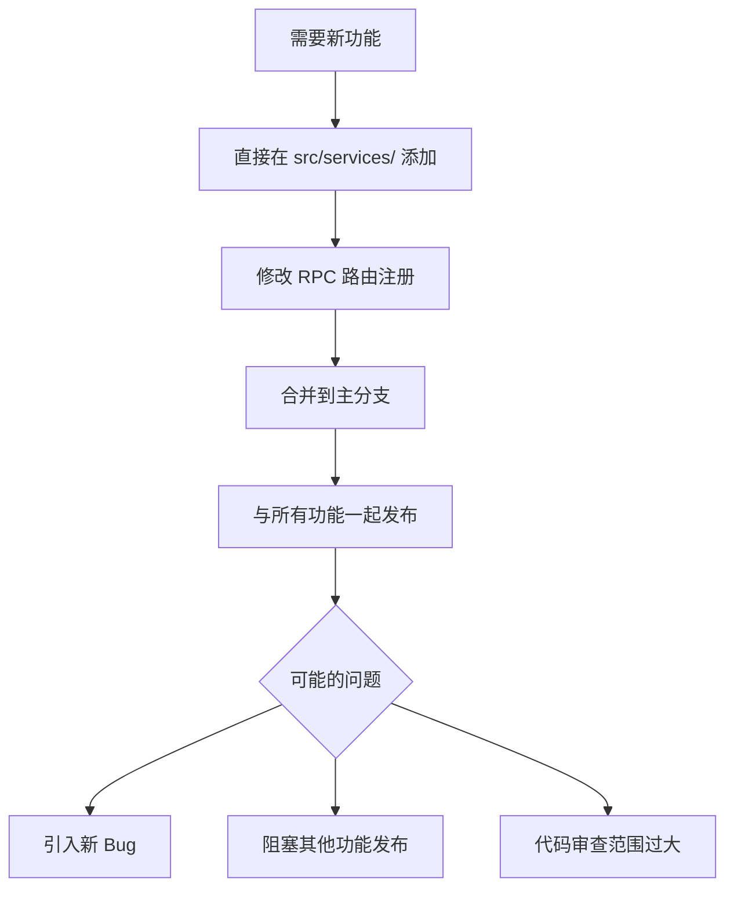
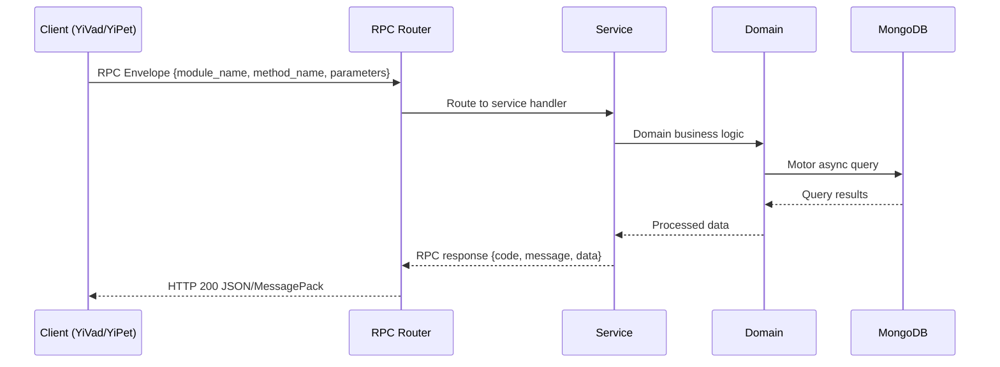

---

doc_type: module
prd_task_id: "YA-09-145"
title: "YA-09-145: 插件化扩展系统 — Hook 机制与动态模块加载 — 开发任务"
status: 需求已编写
priority: P2
owner: 陈铭
roles: [engineer]
created: 2026-09-11
updated: 2026-09-11
project: YiAi
project_id: yiai
prd_month: "202609"
estimate_frontend: 1.5
source_prd: "151-需求-插件化扩展系统.md"
source_okr: [yiai-003]

type: task
---

# YA-09-145: 插件化扩展系统 — Hook 机制与动态模块加载

> **文档职责**：本文档定义**怎么做、为什么这么做、实际做成什么样**（HOW），不含产品目标与测试用例。

> 来源 PRD：[151-需求-插件化扩展系统.md](../../prds/2026-09/151-需求-插件化扩展系统.md)
> 需求编号：YA-09-145 · 优先级：P2 · 人天：1.5 · 状态：需求已编写
> 类型：功能 · 依赖：YA-09-18 (Agent 工具链插件化)

---

<a id="sec-1"></a>
## 一、架构概览 / Architecture Overview

YA-09-145: 插件化扩展系统 — Hook 机制与动态模块加载



<a id="sec-2"></a>
## 二、文件清单 / File Manifest

| 文件 / File | 操作 | 说明 / Description |
|-------------|------|--------------------|
| `YiAi/src/services/xxx/service.py` | 新增 | Core service logic
| `YiAi/src/services/xxx/rpc_handler.py` | 新增 | RPC route handler
| `YiAi/tests/test_xxx.py` | 新增 | Unit tests

> Source PRD: 151-需求-插件化扩展系统.md

<a id="sec-3"></a>
## 三、Python 签名与核心组件 / Python Signatures

### 3.1 核心组件

```python
import os
import yaml
import importlib.util
from typing import Optional
from dataclasses import dataclass, field
@dataclass
class PluginManifest:
class HookRegistry:
    """Hook 注册中心"""
    def __init__(self):
        self._event_handlers: dict[str, list] = {}  # hook_name → [handler, ...]
        self._filter_handlers: dict[str, list] = {}
    def register_event(self, hook_name: str, handler):
        self._event_handlers.setdefault(hook_name, []).append(handler)
    def register_filter(self, hook_name: str, handler):
        self._filter_handlers.setdefault(hook_name, []).append(handler)
    async def emit_event(self, hook_name: str, **kwargs):
        """并行触发所有事件处理器（fire-and-forget）"""
        import asyncio
        # 不等待完成，不阻塞主流程
    async def apply_filters(self, hook_name: str, value, **kwargs):
class PluginManager:
    def __init__(self, hook_registry: HookRegistry):
    def discover(self) -> list[str]:
    def load_manifest(self, plugin_dir: str) -> PluginManifest:
```

<a id="sec-4"></a>
## 四、数据流 / Data Flow



**Call chain**: `Client -> RPC Router -> Service -> Domain -> MongoDB`  
**Response format**: `{code: 0, message: "ok", data: ...}`  
**Async model**: Full-chain `async/await`, Motor async MongoDB driver.  
**Error propagation**: Service exceptions caught by middleware -> standard error codes (1001-9999).

<a id="sec-5"></a>
## 五、实施路线图 / Roadmap

**预估人天 / Estimated**: 1.5

| 步骤 / Step | 操作 / Action | 路径 / Path | 验证 / Verification | 人天 / Days |
|-------------|---------------|-------------|---------------------|-------------|
| 1 | 实现 PluginManifest 数据模型 | manifest 正确解析 | 0.15 |
| 2 | 实现 HookRegistry | 事件/过滤器注册和触发 | 0.2 |
| 3 | 实现 PluginManager | 插件发现、加载、生命周期 | 0.3 |
| 4 | 定义内置 Hook 点 | 10+ Hook 覆盖核心流程 | 0.2 |
| 5 | 集成到 RPC 路由 | before/after RPC Hook 生效 | 0.2 |
| 6 | 创建示例插件 | Slack 通知器可正常工作 | 0.2 |
| 7 | 集成到启动流程 | 启动时自动加载插件 | 0.15 |
| 8 | 测试覆盖 | PluginManager + Hook 集成测试 | 0.1 |
| 风险 | 概率 | 影响 | 缓解措施 |
| 插件异常导致服务崩溃 | 中 | 高 | 每个 Hook 调用 try/catch，异常隔离 |
| 插件间 Hook 冲突 | 低 | 中 | Hook 执行顺序可配置 |
| 恶意插件数据泄露 | 低 | 高 | permissions 声明 + manifest 审查 |

<a id="sec-6"></a>
## 六、代码审查检查清单 / Review Checklist

- [ ] PluginManager 正确扫描并发现所有插件
- [ ] Manifest 解析包含完整字段校验
- [ ] Event Hook fire-and-forget 不阻塞主流程
- [ ] Filter Hook 链式执行顺序可预测
- [ ] 插件异常隔离（不传播到核心服务）
- [ ] 版本兼容性检查生效
- [ ] 权限声明在 manifest 中明确
- [ ] 示例插件可正常运行
---
## 回归问题预测
| # | 预测问题 | 原因 | 验证方法 |
|---|---------|------|---------|
| 1 | 多个插件注册同名 Filter Hook 时执行顺序不确定 | dict 遍历顺序在 Python 3.7+ 为插入序，但跨插件加载顺序可能影响 Filter 结果 | 验证 Filter 链结果与插件加载顺序解耦（引入 priority 字段） |
| 2 | 插件中 import 核心模块形成循环引用 | 插件 import src.services.*，核心 importlib 加载插件模块，可能触发循环 | madge 检查循环依赖 |
| 3 | manifest 中 permissions 字段被忽略 | 当前版本仅记录但未校验 | 验证安装时打印权限摘要供审查 |
| 4 | 插件热加载时旧 Hook 未注销 | 重载插件时仅注册新 Hook，旧 Hook 残留 | 重载前先 unregister 所有旧 Hook |
| 5 | 插件模块卸载后 __pycache__ 缓存导致旧代码执行 | Python 字节码缓存 | 插件路径独立于 src/，不受缓存影响 |
| 6 | config 中的 secret 字段在日志中泄露 | PluginManager 打印 config 用于调试 | 验证 secret=True 的字段在日志中显示为 *** |

<a id="sec-7"></a>
## 七、风险表 / Risk Table

| 风险 / Risk | 影响 / Impact | 缓解措施 / Mitigation | 应急预案 / Contingency |
|-------------|---------------|----------------------|------------------------|
| 插件异常导致服务崩溃 | 中 | 高 | 每个 Hook 调用 try/catch，异常隔离 |
| 插件间 Hook 冲突 | 低 | 中 | Hook 执行顺序可配置 |
| 恶意插件数据泄露 | 低 | 高 | permissions 声明 + manifest 审查 |
| 插件加载拖慢启动 | 低 | 低 | 懒加载（按需激活插件） |
| # | 预测问题 | 原因 | 验证方法 |
| 1 | 多个插件注册同名 Filter Hook 时执行顺序不确定 | dict 遍历顺序在 Python 3.7+ 为插入序，但跨插件加载顺序可能影响 Filter 结果 | 验证 Filter 链结果与插件加载顺序解耦（引入 priority 字段） |
| 2 | 插件中 import 核心模块形成循环引用 | 插件 import src.services.*，核心 importlib 加载插件模块，可能触发循环 | madge 检查循环依赖 |
| 3 | manifest 中 permissions 字段被忽略 | 当前版本仅记录但未校验 | 验证安装时打印权限摘要供审查 |
| 4 | 插件热加载时旧 Hook 未注销 | 重载插件时仅注册新 Hook，旧 Hook 残留 | 重载前先 unregister 所有旧 Hook |
| 5 | 插件模块卸载后 __pycache__ 缓存导致旧代码执行 | Python 字节码缓存 | 插件路径独立于 src/，不受缓存影响 |
