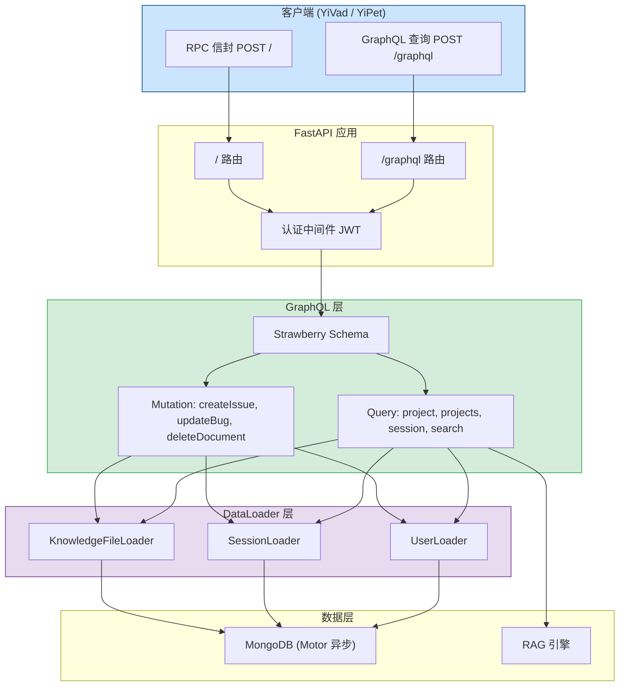
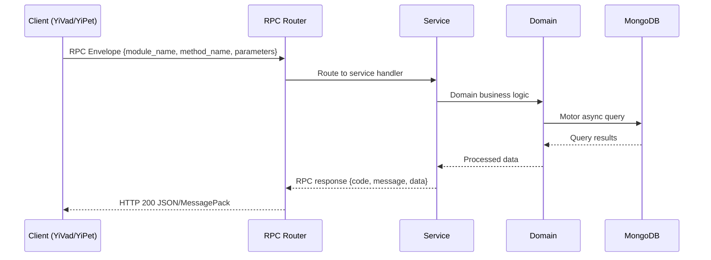

---

doc_type: module
prd_task_id: "YA-09-146"
title: "YA-09-146: GraphQL 查询接口 — Strawberry 集成 + Schema 自动生成 + DataLoader 防 N+1 — 开发任务"
status: 需求已编写
priority: P2
owner: 陈铭
roles: [engineer]
created: 2026-09-11
updated: 2026-09-11
project: YiAi
project_id: yiai
prd_month: "202609"
estimate_frontend: 1.5
source_prd: "152-需求-GraphQL查询接口.md"
source_okr: [yiai-001]

type: task
---

# YA-09-146: GraphQL 查询接口 — Strawberry 集成 + Schema 自动生成 + DataLoader 防 N+1

> **文档职责**：本文档定义**怎么做、为什么这么做、实际做成什么样**（HOW），不含产品目标与测试用例。

> 来源 PRD：[152-需求-GraphQL查询接口.md](../../prds/2026-09/152-需求-GraphQL查询接口.md)
> 需求编号：YA-09-146 · 优先级：P2 · 人天：1.5 · 状态：需求已编写
> 类型：功能 · 依赖：无 · 前置需求：无

---

<a id="sec-1"></a>
## 一、架构概览 / Architecture Overview

YA-09-146: GraphQL 查询接口 — Strawberry 集成 + Schema 自动生成 + DataLoader 防 N+1



<a id="sec-2"></a>
## 二、文件清单 / File Manifest

| 文件 / File | 操作 | 说明 / Description |
|-------------|------|--------------------|
| `YiAi/src/services/xxx/service.py` | 新增 | Core service logic
| `YiAi/src/services/xxx/rpc_handler.py` | 新增 | RPC route handler
| `YiAi/tests/test_xxx.py` | 新增 | Unit tests

> Source PRD: 152-需求-GraphQL查询接口.md

<a id="sec-3"></a>
## 三、Python 签名与核心组件 / Python Signatures

### 3.1 核心组件

```python
import strawberry
from typing import Optional, List
from datetime import datetime
@strawberry.type
class PageInfo:
@strawberry.input
class FilterInput:
@strawberry.input
class SortInput:
@strawberry.input
class PageInput:
@strawberry.type
class User:
@strawberry.type
class Session:
    @strawberry.field
    async def creator(self, info: strawberry.Info) -> Optional[User]:
        return await loader.load(self.creator_key) if self.creator_key else None
@strawberry.type
class KnowledgeFile:
    @strawberry.field
    async def uploader(self, info: strawberry.Info) -> Optional[User]:
@strawberry.type
class Bug:
    @strawberry.field
```
### 3.2 组件 2

```python
from typing import List, Optional
from motor.motor_asyncio import AsyncIOMotorDatabase
from shared.logging import get_logger
class UserLoader:
    """批量加载用户信息。收集单次查询中的所有 user key，合并为一次 $in 查询。"""
    def __init__(self, db: AsyncIOMotorDatabase):
        self._db = db
        self._pending: List[str] = []
        self._cache: dict = {}
    async def load(self, key: str) -> Optional[dict]:
        if key in self._cache:
            return self._cache[key]
        self._pending.append(key)
        return None
    async def dispatch(self):
        if not self._pending:
            return
            self._cache[doc["key"]] = doc
            if key not in self._cache:
                self._cache[key] = None
```
### 3.3 组件 3

```python
from typing import List, Optional
import strawberry
from strawberry.types import Info
from services.graphql.types import *
from shared.logging import get_logger
def _build_mongo_filter(filters: Optional[List[FilterInput]]) -> dict:
    if not filters:
        return {}
    return {f.field: op_map.get(f.operator, lambda v: v)(f.value) for f in filters}
async def _paginated_query(collection, filter_dict, sort_list, page, page_size):
    return await cursor.to_list(length=page_size), total
@strawberry.type
class Query:
    @strawberry.field
    async def session(self, info: Info, key: str) -> Optional[Session]:
        if not doc:
            return None
        return Session(
    @strawberry.field
    async def sessions(
    @strawberry.field
    async def projects(self, info: Info) -> List[str]:
    @strawberry.field
    async def bugs(
    @strawberry.field
```

<a id="sec-4"></a>
## 四、数据流 / Data Flow



**Call chain**: `Client -> RPC Router -> Service -> Domain -> MongoDB`  
**Response format**: `{code: 0, message: "ok", data: ...}`  
**Async model**: Full-chain `async/await`, Motor async MongoDB driver.  
**Error propagation**: Service exceptions caught by middleware -> standard error codes (1001-9999).

<a id="sec-5"></a>
## 五、实施路线图 / Roadmap

**预估人天 / Estimated**: 1.5

| 步骤 / Step | 操作 / Action | 路径 / Path | 验证 / Verification | 人天 / Days |
|-------------|---------------|-------------|---------------------|-------------|
| 1 | 安装 Strawberry 依赖，创建模块目录 | `requirements.txt` | `pip list \ | grep strawberry` 确认安装成功 | 0.05 |
| 2 | 定义 GraphQL 类型（Session, User, Bug, KnowledgeFile, RAGResult） | `types.py` | Python 导入无错误，类型检查通过 | 0.25 |
| 3 | 实现 DataLoader（UserLoader, SessionLoader, KnowledgeFileLoader） | `dataloaders.py` | 单元测试：批量加载 20 个用户仅 1 次 MongoDB 查询 | 0.25 |
| 4 | 实现 Query Resolver（session, sessions, projects, bugs, search） | `schema.py` | GraphiQL 中执行查询返回正确结果 | 0.35 |
| 5 | 实现 Mutation Resolver（createIssue, updateBug, deleteDocument） | `schema.py` | GraphiQL 中执行变更，MongoDB 数据正确更新 | 0.2 |
| 6 | 集成 FastAPI GraphQL 路由 + 认证中间件 | `routes.py`, `main.py` | POST /graphql 返回正确结果 | 0.15 |
| 7 | 配置 GraphiQL 开发工具 | `routes.py` | GET /graphql 显示 GraphiQL 界面 | 0.05 |
| 8 | 编写集成测试（6 个查询 + 3 个变更场景） | `tests/graphql/` | 所有测试通过 | 0.2 |
| 风险 | 概率 | 影响 | 等级 | 缓解措施 | 应急预案 |
| GraphQL 查询复杂度失控（深层嵌套） | 中 | 高 | 高 | 限制查询深度（最大 5 层），复杂度分数上限 1000 | 超限查询返回 400，提示简化 |
| DataLoader 缓存未命中导致 N+1 回退 | 低 | 中 | 低 | DataLoader 在 resolver 中正确收集 key | 监控 N+1 查询次数，超过阈值告警 |
| GraphiQL 在生产环境暴露 | 低 | 高 | 中 | 环境变量 `ENABLE_GRAPHIQL` 控制，生产默认关闭 | 发现后设置环境变量关闭 |

<a id="sec-6"></a>
## 六、代码审查检查清单 / Review Checklist

- [ ] Strawberry 依赖版本锁定（`strawberry-graphql>=0.200,<1.0`）
- [ ] 所有 GraphQL 类型定义包含 `@strawberry.type` 装饰器
- [ ] DataLoader 在请求上下文中正确初始化，请求结束后自动释放
- [ ] Query Resolver 中所有 MongoDB 查询使用 `await`（异步）
- [ ] `deleteDocument` Mutation 限制允许的集合白名单
- [ ] GraphiQL 通过环境变量 `ENABLE_GRAPHIQL` 控制开关
- [ ] GraphQL 端点使用与 RPC 相同的 JWT 认证中间件
- [ ] 查询深度限制（最大 5 层）已配置
- [ ] 分页参数有默认值和上限（pageSize 默认 20，最大 100）
- [ ] `ruff` 代码规范通过 · `mypy` 类型检查通过
---
## 回归问题预测
| # | 问题 | 发现场景 | 根因 | 修复方式 |
|---|------|---------|------|---------|
| 1 | `creator` 字段返回 `null`，`DataLoader.dispatch` 未被调用 | 查询 `sessions { creator { username } }` 时 creator 始终为 null | `load` 返回 None 占位，但 `dispatch` 在 resolver 返回后才执行 | 使用 Strawberry 的 DataLoader 扩展，在字段解析完成后统一 dispatch |
| 2 | `search` 查询中 `title` 为空的文档导致 `snippet` 为 `None` | 搜索返回结果中 `snippet` 为 null | `snippet` 取 `doc.get("title")` 但某些文档 title 为空 | 使用 `doc.get("title") or doc.get("path") or "(无标题)"` 兜底 |
| 3 | `createIssue` 创建的文档缺少可选字段，查询返回 `null` | 查询新 Issue 时 `project` 字段为 null | `input.project` 为 `None` 时未写入文档 | 在查询时使用 `doc.get("project")` 安全访问 |
| 4 | GraphQL 端点被 RPC 路由 `/` 捕获 | 访问 `/graphql` 返回 RPC 信封错误 | RPC 路由可能捕获了 `/graphql` 的 POST 请求 | 确保 GraphQL 路由在 RPC 路由之前注册 |

<a id="sec-7"></a>
## 七、风险表 / Risk Table

| 风险 / Risk | 影响 / Impact | 缓解措施 / Mitigation | 应急预案 / Contingency |
|-------------|---------------|----------------------|------------------------|
| GraphQL 查询复杂度失控（深层嵌套） | 中 | 高 | 高 |
| DataLoader 缓存未命中导致 N+1 回退 | 低 | 中 | 低 |
| GraphiQL 在生产环境暴露 | 低 | 高 | 中 |
| Strawberry 版本升级不兼容 | 低 | 中 | 低 |
| 大查询导致内存溢出 | 中 | 中 | 中 |
| 场景 | 回滚方式 | 回滚时间 | 风险 |
| GraphQL 端点异常影响服务 | 在 `main.py` 中注释 GraphQL 路由注册，重启 | < 1min | 低：RPC 端点不受影响 |
| GraphQL 查询导致 MongoDB 压力大 | 环境变量 `ENABLE_GRAPHQL=false` 临时禁用 | < 1min | 低：RPC 端点不受影响 |
| Schema 定义错误 | 修复 Schema 定义，重新部署 | < 30min | 低：RPC 端点作为降级方案 |
| 指标 | 采集方式 | 告警阈值 | 说明 |
