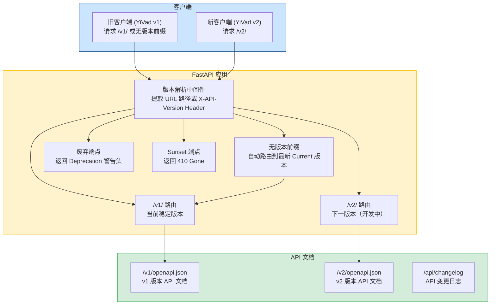
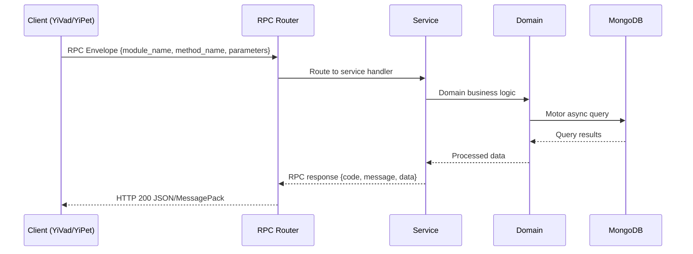

---

doc_type: module
prd_task_id: "YA-09-147"
title: "YA-09-147: API 版本化策略 — 多版本共存 + 废弃生命周期 + 迁移指南自动生成 — 开发任务"
status: 需求已编写
priority: P2
owner: 陈铭
roles: [engineer]
created: 2026-09-11
updated: 2026-09-11
project: YiAi
project_id: yiai
prd_month: "202609"
estimate_frontend: 0.5
source_prd: "153-需求-API版本化策略.md"
source_okr: [yiai-002]

type: task
---

# YA-09-147: API 版本化策略 — 多版本共存 + 废弃生命周期 + 迁移指南自动生成

> **文档职责**：本文档定义**怎么做、为什么这么做、实际做成什么样**（HOW），不含产品目标与测试用例。

> 来源 PRD：[153-需求-API版本化策略.md](../../prds/2026-09/153-需求-API版本化策略.md)
> 需求编号：YA-09-147 · 优先级：P2 · 人天：0.5 · 状态：需求已编写
> 类型：功能 · 依赖：无 · 前置需求：无

---

<a id="sec-1"></a>
## 一、架构概览 / Architecture Overview

YA-09-147: API 版本化策略 — 多版本共存 + 废弃生命周期 + 迁移指南自动生成



<a id="sec-2"></a>
## 二、文件清单 / File Manifest

| 文件 / File | 操作 | 说明 / Description |
|-------------|------|--------------------|
| `YiAi/src/services/xxx/service.py` | 新增 | Core service logic
| `YiAi/src/services/xxx/rpc_handler.py` | 新增 | RPC route handler
| `YiAi/tests/test_xxx.py` | 新增 | Unit tests

> Source PRD: 153-需求-API版本化策略.md

<a id="sec-3"></a>
## 三、Python 签名与核心组件 / Python Signatures

### 3.1 核心组件

```python
from enum import Enum
from datetime import datetime, timedelta
from typing import Optional, Dict, List
from dataclasses import dataclass, field
class VersionStatus(str, Enum):
    """API 版本状态。"""
@dataclass
class VersionInfo:
    """版本信息。"""
@dataclass
class VersionConfig:
    """全局版本配置。"""
    def get_version(self, version: str) -> Optional[VersionInfo]:
        return self.versions.get(version)
    def get_current(self) -> VersionInfo:
        return self.versions[self.current_version]
    def get_deprecated_versions(self) -> List[VersionInfo]:
        return [v for v in self.versions.values() if v.status == VersionStatus.DEPRECATED]
    def get_sunset_versions(self) -> List[VersionInfo]:
        return [v for v in self.versions.values() if v.status == VersionStatus.SUNSET]
    def is_version_supported(self, version: str) -> bool:
```
### 3.2 组件 2

```python
from fastapi import Request, HTTPException
from starlette.middleware.base import BaseHTTPMiddleware
from starlette.responses import JSONResponse
from datetime import datetime
from shared.api_version import version_config, VersionStatus
from shared.logging import get_logger
class ApiVersioningMiddleware(BaseHTTPMiddleware):
    """API 版本化中间件。
    """
    async def dispatch(self, request: Request, call_next):
        # 跳过非 API 路径（如 /health, /docs）
        if not path.startswith(("/v1", "/v2", "/api", "/read-file", "/write-file", "/knowledge", "/rag", "/graphql")):
            return await call_next(request)
        # 解析版本
        # 检查版本状态
        if version_info is None:
            # 未知版本，回退到当前版本
        if version_info.status == VersionStatus.SUNSET:
            return JSONResponse(
        # 添加版本响应头
    def _extract_version(self, request: Request) -> str:
```
### 3.3 组件 3

```python
from fastapi import APIRouter, FastAPI
from typing import List, Optional
from shared.api_version import version_config, VersionInfo, VersionStatus
def create_versioned_router(version: str, prefix: str = "", tags: Optional[List[str]] = None) -> APIRouter:
    """创建带版本前缀的 APIRouter。
        @v1_router.post("/query")
        async def query_sessions_v1(...): ...
        @v2_router.post("/query")
        async def query_sessions_v2(...): ...
    """
    return APIRouter(prefix=full_prefix, tags=tags or [])
def register_versioned_routers(
    """批量注册版本化路由。
    """
        # 如果路由前缀以当前版本开头，同时注册无版本前缀的兼容路由
        if router.prefix.startswith(f"/{current_version}"):
            # 复制路由
```

<a id="sec-4"></a>
## 四、数据流 / Data Flow



**Call chain**: `Client -> RPC Router -> Service -> Domain -> MongoDB`  
**Response format**: `{code: 0, message: "ok", data: ...}`  
**Async model**: Full-chain `async/await`, Motor async MongoDB driver.  
**Error propagation**: Service exceptions caught by middleware -> standard error codes (1001-9999).

<a id="sec-5"></a>
## 五、实施路线图 / Roadmap

**预估人天 / Estimated**: 0.5

| 步骤 / Step | 操作 / Action | 路径 / Path | 验证 / Verification | 人天 / Days |
|-------------|---------------|-------------|---------------------|-------------|
| 1 | 创建版本配置模块（VersionConfig, VersionInfo, VersionStatus） | `shared/api_version.py` | 单元测试：版本状态枚举和配置正确 | 0.05 |
| 2 | 实现版本解析中间件（URL 路径 + Header 解析） | `middleware/versioning.py` | 请求 `/v1/test` 正确解析为 v1，废弃版本返回 Deprecation 头 | 0.1 |
| 3 | 实现版本化路由注册辅助函数 | `services/versioned_routes.py` | 创建 v1 和 v2 版本路由，无版本前缀请求路由到 v1 | 0.1 |
| 4 | 实现 API 变更日志端点（/api/versions, /api/changelog） | `services/versioning/changelog.py` | GET /api/versions 返回版本列表，GET /api/changelog 返回变更日志 | 0.1 |
| 5 | 实现多版本 OpenAPI 文档生成 | `main.py` | GET /v1/openapi.json 返回 v1 文档，与 /openapi.json 当前版本文档一致 | 0.05 |
| 6 | 编写版本化策略文档并添加到 YiKnowledge | YiKnowledge | 文档包含版本生命周期、破坏性变更定义、迁移指南模板 | 0.05 |
| 7 | 集成测试：多版本共存 + 废弃响应 + Sunset 410 | `tests/versioning/` | 所有测试通过 | 0.05 |
| 风险 | 概率 | 影响 | 等级 | 缓解措施 | 应急预案 |
| 中间件影响所有请求性能 | 低 | 中 | 低 | 版本解析中间件仅做简单的字符串匹配和字典查找，无 IO 操作 | 性能回归测试中监控 P95 延迟变化 |
| 版本配置错误导致所有请求路由到错误版本 | 低 | 高 | 中 | 版本配置在应用启动时加载和验证，错误配置阻止启动 | 回滚版本配置，重启服务 |
| 废弃版本被过早 Sunset（配置错误） | 低 | 中 | 低 | Sunset 日期在配置中明确指定，变更需 Code Review | 将版本状态改回 Deprecated，延长 Sunset 日期 |
| 客户端不更新导致大量请求使用废弃版本 | 高 | 低 | 低 | 通过 `X-API-Version` 响应头告知客户端当前版本，废弃版本日志中记录使用量 | 在废弃版本接近 Sunset 时主动通知客户端团队 |

<a id="sec-6"></a>
## 六、代码审查检查清单 / Review Checklist

- [ ] 版本配置 `VersionConfig` 在应用启动时加载并验证
- [ ] 版本解析中间件仅处理 API 路径，跳过 `/health`、`/docs` 等非 API 路径
- [ ] `X-API-Version` Header 优先于 URL 路径版本
- [ ] 无版本前缀请求正确路由到 `current_version`
- [ ] 废弃版本响应包含 `Deprecation`、`Sunset`、`Link` 响应头
- [ ] Sunset 版本返回 HTTP 410 + JSON 响应体（含迁移指南链接）
- [ ] 版本化路由注册函数 `create_versioned_router` 正确拼接前缀
- [ ] API 变更日志端点支持按版本和变更类型筛选
- [ ] 多版本 OpenAPI 文档路径不冲突（`/v1/openapi.json`, `/v2/openapi.json`）
- [ ] 中间件不在响应体中修改业务数据，仅添加响应头
- [ ] `ruff` 代码规范通过
- [ ] `mypy` 类型检查通过
---
## 回归问题预测
| # | 问题 | 发现场景 | 根因 | 修复方式 |
|---|------|---------|------|---------|
| 1 | 版本中间件拦截了 `/docs` 和 `/openapi.json` 路径，导致 API 文档无法访问 | 部署后访问 `/docs` 返回 410 Gone 或版本错误 | 中间件的路径匹配规则过于宽泛，将 `/docs` 和 `/openapi.json` 也当作 API 路径处理 | 在中间件的 `dispatch` 方法中显式排除 `/docs`、`/openapi.json`、`/redoc` 等 FastAPI 内置路径 |
| 2 | 无版本前缀请求路由到当前版本，但 `X-API-Version` 响应头在 CORS 配置中未暴露 | 前端无法读取 `X-API-Version` 响应头，无法获取当前版本信息 | FastAPI CORS 中间件默认不暴露自定义响应头，前端 `fetch` 无法通过 `response.headers.get()` 读取 | 在 CORS 配置的 `expose_headers` 中添加 `X-API-Version`、`Deprecation`、`Sunset`、`Link` |

<a id="sec-7"></a>
## 七、风险表 / Risk Table

| 风险 / Risk | 影响 / Impact | 缓解措施 / Mitigation | 应急预案 / Contingency |
|-------------|---------------|----------------------|------------------------|
| 中间件影响所有请求性能 | 低 | 中 | 低 |
| 版本配置错误导致所有请求路由到错误版本 | 低 | 高 | 中 |
| 废弃版本被过早 Sunset（配置错误） | 低 | 中 | 低 |
| 客户端不更新导致大量请求使用废弃版本 | 高 | 低 | 低 |
| 多版本共存导致代码库膨胀 | 中 | 中 | 中 |
| 场景 | 回滚方式 | 回滚时间 | 风险 |
| 版本中间件导致请求失败 | 在 `main.py` 中移除中间件注册，重启服务 | < 1min | 低：移除后请求恢复为无版本模式 |
| 版本配置错误导致路由异常 | 修正 `api_version.py` 中的配置，重启服务 | < 2min | 低：配置热修复 |
| 新版本端点有 Bug | 将新版本状态改为 `deprecated`，客户端回退到旧版本 | < 5min | 低：旧版本端点不受影响 |
| Sunset 版本误触发 | 将版本状态从 `sunset` 改回 `deprecated` 或 `current` | < 1min | 低：配置修改即时生效 |
