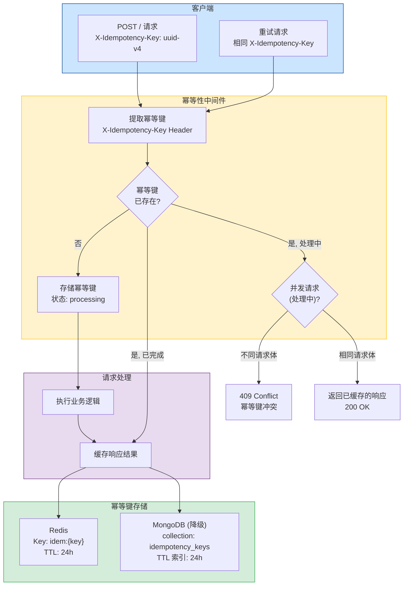
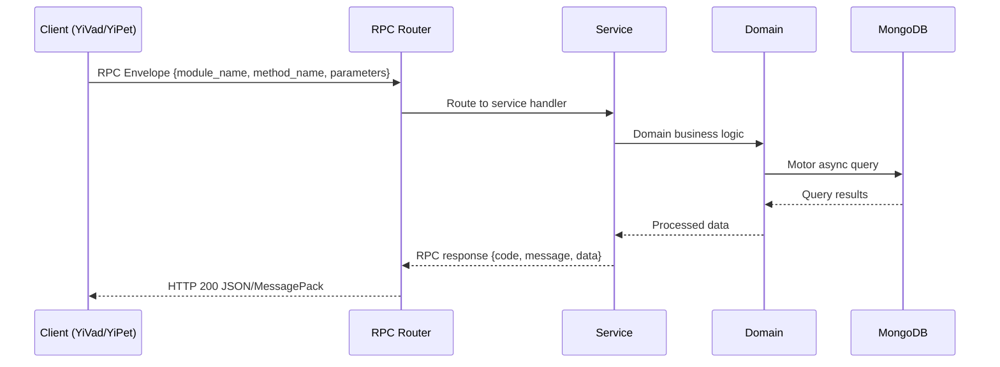

---

doc_type: module
prd_task_id: "YA-09-48"
title: "YA-09-48: 请求幂等性保护 — Idempotency-Key + 缓存结果 — 开发方案"
status: 需求已编写
priority: P2
owner: 陈铭
roles: [engineer]
created: 2026-09-11
updated: 2026-09-14
project: YiAi
project_id: yiai
prd_month: "202609"
estimate_frontend: 1.0
source_prd: "154-需求-请求重放与幂等性保护.md"
source_okr: [yiai-001]

type: task
---

# YA-09-48: 请求幂等性保护 — Idempotency-Key + 缓存结果

> **文档职责**：本文档定义**怎么做、为什么这么做、实际做成什么样**（HOW），不含产品目标与测试用例。

> 来源 PRD：[154-需求-请求重放与幂等性保护.md](../../prds/2026-09/154-需求-请求重放与幂等性保护.md)
> 需求编号：YA-09-48 · 优先级：P2 · 人天：1.0 · 状态：需求已编写
> 类型：功能 · 依赖：Redis（如未部署，可使用 MongoDB 替代） · 前置需求：无

---

<a id="sec-1"></a>
## 一、架构概览 / Architecture Overview

YA-09-148: 请求重放与幂等性保护 — 幂等键机制 + Redis 缓存 + 并发冲突检测



<a id="sec-2"></a>
## 二、文件清单 / File Manifest

| 文件 / File | 操作 | 说明 / Description |
|-------------|------|--------------------|
| `YiAi/src/services/xxx/service.py` | 新增 | Core service logic
| `YiAi/src/services/xxx/rpc_handler.py` | 新增 | RPC route handler
| `YiAi/tests/test_xxx.py` | 新增 | Unit tests

> Source PRD: 154-需求-请求重放与幂等性保护.md

<a id="sec-3"></a>
## 三、Python 签名与核心组件 / Python Signatures

### 3.1 核心组件

```python
import hashlib
import json
from abc import ABC, abstractmethod
from datetime import datetime, timedelta
from typing import Optional, Dict, Any
from enum import Enum
from shared.logging import get_logger
class IdempotencyStatus(str, Enum):
class IdempotencyRecord:
    """幂等键记录。"""
    def __init__(
        self.key = key
        self.status = status
        self.response = response
        self.request_fingerprint = request_fingerprint
        self.created_at = created_at or datetime.now()
    def to_dict(self) -> dict:
        return {
    @classmethod
    def from_dict(cls, data: dict) -> "IdempotencyRecord":
class IdempotencyStore(ABC):
    @abstractmethod
    async def get(self, key: str) -> Optional[IdempotencyRecord]:
    @abstractmethod
    async def set(self, record: IdempotencyRecord, ttl_seconds: int = 86400) -> bool:
```
### 3.2 组件 2

```python
import hashlib
import json
from fastapi import Request, HTTPException
from starlette.middleware.base import BaseHTTPMiddleware
from starlette.responses import JSONResponse
from services.idempotency.store import (
from shared.logging import get_logger
def compute_request_fingerprint(request: Request) -> str:
    """计算请求指纹（用于检测不同请求使用相同幂等键）。
    """
    return hashlib.sha256(fingerprint_input.encode()).hexdigest()[:16]
class IdempotencyMiddleware(BaseHTTPMiddleware):
    """幂等性保护中间件。
    """
    def __init__(self, app, store: IdempotencyStore):
        self.store = store
    async def dispatch(self, request: Request, call_next):
        # 仅对数据变更类请求启用幂等性保护
        if request.method not in ("POST", "PUT", "PATCH", "DELETE"):
            return await call_next(request)
```
### 3.3 组件 3

```python
from services.idempotency.store import (
from shared.logging import get_logger
async def create_idempotency_store(app) -> IdempotencyStore:
    """根据可用资源创建幂等键存储实例。
    """
    # 尝试 Redis
        from redis.asyncio import Redis
        return RedisIdempotencyStore(redis_client)
    # 降级到 MongoDB
        if db is not None:
            return MongoIdempotencyStore(db)
    # 最终降级到内存
    return MemoryIdempotencyStore()
```

<a id="sec-4"></a>
## 四、数据流 / Data Flow



**Call chain**: `Client -> RPC Router -> Service -> Domain -> MongoDB`  
**Response format**: `{code: 0, message: "ok", data: ...}`  
**Async model**: Full-chain `async/await`, Motor async MongoDB driver.  
**Error propagation**: Service exceptions caught by middleware -> standard error codes (1001-9999).

<a id="sec-5"></a>
## 五、实施路线图 / Roadmap

**预估人天 / Estimated**: 1.0

| 步骤 / Step | 操作 / Action | 路径 / Path | 验证 / Verification | 人天 / Days |
|-------------|---------------|-------------|---------------------|-------------|
| 1 | 实现幂等键存储抽象层（IdempotencyStore, Redis/MongoDB/Memory 实现） | `services/idempotency/store.py` | 单元测试：各存储后端的 CRUD 操作 | 0.15 |
| 2 | 实现幂等性中间件（幂等键提取、状态检查、响应缓存） | `middleware/idempotency.py` | 单元测试：首次请求、重复请求、并发冲突 | 0.15 |
| 3 | 实现存储初始化工厂（自动选择 Redis/MongoDB/Memory） | `services/idempotency/__init__.py` | 集成测试：不同后端可用性下的自动降级 | 0.05 |
| 4 | 注册中间件到 FastAPI 应用 | `main.py` | 启动应用，日志确认中间件和存储已初始化 | 0.05 |
| 5 | 编写集成测试（6 个幂等性场景） | `tests/idempotency/` | 所有测试通过 | 0.1 |
| 风险 | 概率 | 影响 | 等级 | 缓解措施 | 应急预案 |
| Redis 不可用导致幂等性保护失效 | 中 | 中 | 中 | 自动降级到 MongoDB 或内存存储 | 监控存储降级事件，及时修复 Redis |
| 幂等键 TTL 过短，合法重试时键已过期 | 低 | 低 | 低 | 24 小时 TTL 覆盖绝大多数重试场景（客户端重试通常在分钟级） | 调整 TTL 配置 |
| 缓存响应体过大导致 Redis 内存压力 | 低 | 中 | 低 | 仅缓存响应状态码和关键元数据，不缓存完整响应体（对大型响应仅返回状态确认） | 设置 Redis 最大内存限制 + 淘汰策略 |
| 客户端未生成幂等键导致请求不受保护 | 高 | 低 | 低 | 在 API 文档中标注需要幂等键的关键操作，前端 SDK 自动生成幂等键 | 服务端对关键操作检查幂等键是否存在，缺失时返回 428 Precondition Required |
| 恶意客户端使用固定幂等键进行 DoS 攻击 | 低 | 中 | 中 | 幂等键与用户 ID 绑定，不同用户使用相同幂等键不会冲突 | 限流中间件独立运作，与幂等键机制互不干扰 |
| 中间件读取请求体导致流式请求无法处理 | 低 | 中 | 低 | 中间件仅计算请求体哈希，不缓存完整请求体；对 SSE 流式请求跳过幂等性检查 | 文件上传等大请求体场景跳过幂等性检查 |

<a id="sec-6"></a>
## 六、代码审查检查清单 / Review Checklist

- [ ] `IdempotencyStore` 抽象基类定义了完整的 CRUD 接口
- [ ] `RedisIdempotencyStore` 使用 `SET NX` 确保原子性
- [ ] `MongoIdempotencyStore` 使用唯一索引 + TTL 索引
- [ ] `MemoryIdempotencyStore` 仅用于开发环境，有明确的过期清理逻辑
- [ ] 中间件仅对 `POST/PUT/PATCH/DELETE` 方法启用幂等性检查
- [ ] 幂等键为空或长度 < 8 时跳过检查
- [ ] 并发冲突检测比较请求指纹（不完全依赖幂等键）
- [ ] 业务失败时删除幂等键（允许客户端重试）
- [ ] 中间件不对流式请求（SSE）启用幂等性检查
- [ ] 存储初始化工厂按优先级自动选择后端（Redis > MongoDB > Memory）
- [ ] 响应中包含 `X-Idempotency-Status` 头部（`completed` / `processing`）
- [ ] `ruff` 代码规范通过
- [ ] `mypy` 类型检查通过
---
## 回归问题预测
| # | 问题 | 发现场景 | 根因 | 修复方式 |
|---|------|---------|------|---------|
| 1 | 中间件读取请求体后，下游 handler 无法再次读取请求体 | POST 请求到达 handler 时 `await request.body()` 返回空字节 | Starlette 的 `Request.body()` 只能读取一次，中间件读取后流位置已到末尾 | 在中间件中读取 `request.body()` 后，将 body 缓存到 `request.state.body_bytes`，下游 handler 从 `request.state` 读取 |

<a id="sec-7"></a>
## 七、风险表 / Risk Table

| 风险 / Risk | 影响 / Impact | 缓解措施 / Mitigation | 应急预案 / Contingency |
|-------------|---------------|----------------------|------------------------|
| Redis 不可用导致幂等性保护失效 | 中 | 中 | 中 |
| 幂等键 TTL 过短，合法重试时键已过期 | 低 | 低 | 低 |
| 缓存响应体过大导致 Redis 内存压力 | 低 | 中 | 低 |
| 客户端未生成幂等键导致请求不受保护 | 高 | 低 | 低 |
| 恶意客户端使用固定幂等键进行 DoS 攻击 | 低 | 中 | 中 |
| 中间件读取请求体导致流式请求无法处理 | 低 | 中 | 低 |
| 场景 | 回滚方式 | 回滚时间 | 风险 |
| 幂等性中间件导致请求失败 | 在 `main.py` 中移除中间件注册，重启服务 | < 1min | 低：移除后请求恢复正常处理 |
| Redis 存储故障导致大量 409 | 临时禁用幂等性中间件（通过环境变量 `ENABLE_IDEMPOTENCY=false`） | < 1min | 低：幂等性保护暂时失效，但服务可用 |
| 幂等键存储泄漏（内存/磁盘） | 手动清理 Redis 中的 `idem:*` 键或 MongoDB 的 `idempotency_keys` 集合 | < 5min | 低：清理后服务恢复正常 |
