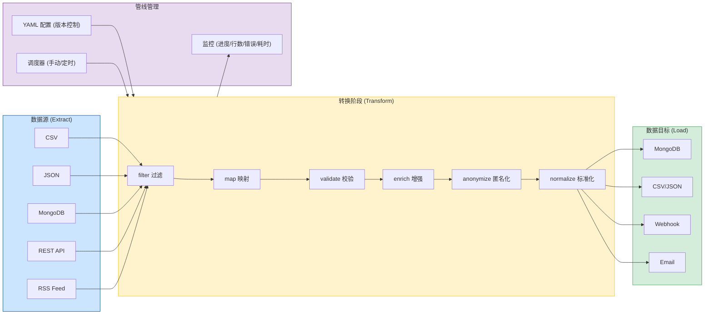
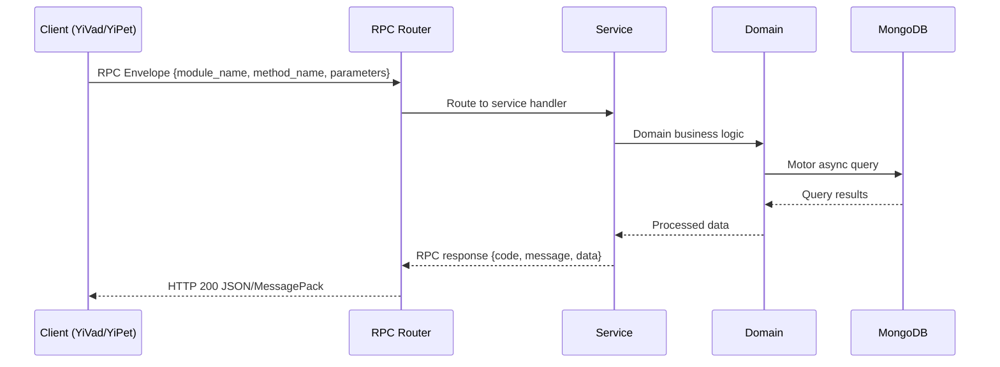

---

doc_type: module
prd_task_id: "YA-09-122"
title: "YA-09-122: 数据管线与 ETL — 声明式管道 + 多源连接器 — 开发方案"
status: 需求已编写
priority: P2
owner: 陈铭
roles: [engineer]
created: 2026-09-11
updated: 2026-09-14
project: YiAi
project_id: yiai
prd_month: "202609"
estimate_frontend: 1.0
source_prd: "155-需求-数据管线与ETL.md"
source_okr: [yiai-001]

type: task
---

# YA-09-122: 数据管线与 ETL — 声明式管道 + 多源连接器

> **文档职责**：本文档定义**怎么做、为什么这么做、实际做成什么样**（HOW），不含产品目标与测试用例。

> 来源 PRD：[155-需求-数据管线与ETL.md](../../prds/2026-09/155-需求-数据管线与ETL.md)
> 需求编号：YA-09-122 · 优先级：P2 · 人天：1.0 · 状态：需求已编写
> 类型：功能 · 依赖：无 · 前置需求：无

---

<a id="sec-1"></a>
## 一、架构概览 / Architecture Overview

YA-09-149: 数据管线与 ETL — 声明式管道 + 多源连接器 + 数据转换与校验



<a id="sec-2"></a>
## 二、文件清单 / File Manifest

| 文件 / File | 操作 | 说明 / Description |
|-------------|------|--------------------|
| `YiAi/src/services/xxx/service.py` | 新增 | Core service logic
| `YiAi/src/services/xxx/rpc_handler.py` | 新增 | RPC route handler
| `YiAi/tests/test_xxx.py` | 新增 | Unit tests

> Source PRD: 155-需求-数据管线与ETL.md

<a id="sec-3"></a>
## 三、Python 签名与核心组件 / Python Signatures

### 3.1 核心组件

```python
from abc import ABC, abstractmethod
from typing import AsyncIterator, Any, Dict
class SourceConnector(ABC):
    @abstractmethod
    async def connect(self, config: Dict[str, Any]): ...
    @abstractmethod
    async def extract(self) -> AsyncIterator[Dict[str, Any]]: ...
    @abstractmethod
    async def close(self): ...
class SinkConnector(ABC):
    @abstractmethod
    async def connect(self, config: Dict[str, Any]): ...
    @abstractmethod
    async def write(self, record: Dict[str, Any]) -> Dict[str, Any]: ...
    @abstractmethod
    async def write_batch(self, records: list) -> Dict[str, Any]: ...
    @abstractmethod
    async def close(self): ...
```
### 3.2 组件 2

```python
import csv, json, io
from typing import AsyncIterator, Any, Dict
from pathlib import Path
import aiohttp, feedparser
from services.etl.connectors.base import SourceConnector
from shared.logging import get_logger
class CsvSourceConnector(SourceConnector):
    async def connect(self, config):
        self._filepath = Path(config["filepath"])
        if not self._filepath.exists():
    async def extract(self) -> AsyncIterator[Dict[str, Any]]:
    async def close(self): pass
class JsonSourceConnector(SourceConnector):
    """JSON 文件数据源。支持 data_path 嵌套路径（如 data.items）。"""
    async def connect(self, config):
        self._filepath = Path(config["filepath"]); self._data_path = config.get("data_path", "")
    async def extract(self) -> AsyncIterator[Dict[str, Any]]:
        if self._data_path:
        if isinstance(items, list):
        elif isinstance(items, dict): yield items
    async def close(self): pass
class MongoSourceConnector(SourceConnector):
    async def connect(self, config):
        from motor.motor_asyncio import AsyncIOMotorClient
    async def extract(self) -> AsyncIterator[Dict[str, Any]]:
```
### 3.3 组件 3

```python
import csv, json
from typing import Any, Dict, List
from pathlib import Path
from datetime import datetime
import aiohttp
from services.etl.connectors.base import SinkConnector
from shared.logging import get_logger
class MongoSinkConnector(SinkConnector):
    """MongoDB 目标。支持 insert/upsert/replace 三种模式。"""
    async def connect(self, config):
        from motor.motor_asyncio import AsyncIOMotorClient
        self._db = AsyncIOMotorClient(config["uri"])[config["database"]]
        self._collection = config["collection"]
        self._mode = config.get("mode", "insert")
        self._upsert_key = config.get("upsert_key", "key")
    async def write(self, record: Dict[str, Any]) -> Dict[str, Any]:
        if self._mode == "upsert" and self._upsert_key in record:
            return {"status": "upserted" if result.upserted_id else "updated"}
        else:
            return {"status": "inserted"}
    async def write_batch(self, records: list) -> Dict[str, Any]:
    async def close(self): pass
class FileSinkConnector(SinkConnector):
    async def connect(self, config):
    async def write(self, record): self._buffer.append(record); return {"status": "buffered"}
```

<a id="sec-4"></a>
## 四、数据流 / Data Flow



**Call chain**: `Client -> RPC Router -> Service -> Domain -> MongoDB`  
**Response format**: `{code: 0, message: "ok", data: ...}`  
**Async model**: Full-chain `async/await`, Motor async MongoDB driver.  
**Error propagation**: Service exceptions caught by middleware -> standard error codes (1001-9999).

<a id="sec-5"></a>
## 五、实施路线图 / Roadmap

**预估人天 / Estimated**: 1.0

| 步骤 / Step | 操作 / Action | 路径 / Path | 验证 / Verification | 人天 / Days |
|-------------|---------------|-------------|---------------------|-------------|
| 1 | 实现连接器抽象基类 | `connectors/base.py` | 抽象类定义完整，子类可正常继承 | 0.05 |
| 2 | 实现 5 个数据源连接器 | `connectors/sources.py` | 每个连接器读取真实数据源返回正确数据 | 0.2 |
| 3 | 实现 5 个数据目标连接器 | `connectors/sinks.py` | 每个连接器写入数据到目标成功 | 0.15 |
| 4 | 实现 6 个转换阶段 | `transforms.py` | 每个阶段独立测试，转换结果正确 | 0.2 |
| 5 | 实现管线引擎（YAML 加载、阶段编排、错误处理） | `engine.py` | 加载 YAML 配置执行完整管线 | 0.15 |
| 6 | 实现 RPC 端点 | `routes.py` | API 端点可正常调用 | 0.1 |
| 7 | 创建 3 个示例管线 YAML 配置 | `pipelines/` | 每个管线可成功执行 | 0.1 |
| 8 | 编写集成测试 | `tests/etl/` | 所有测试通过 | 0.05 |
| 风险 | 概率 | 影响 | 等级 | 缓解措施 | 应急预案 |
| YAML 配置中的 `eval()` 执行恶意代码 | 低 | 高 | 高 | `eval()` 使用受限命名空间 `{"__builtins__": {}}` | 替换为 `simpleeval` 库 |
| 大文件导入导致内存溢出 | 中 | 中 | 中 | 异步迭代器逐行处理，不一次性加载 | 分片处理，增加 `batch_size` 配置 |
| 管线执行时间过长阻塞 API 线程 | 中 | 中 | 中 | 后台执行，API 即时返回 run_id，客户端轮询 | 添加管线超时配置（默认 30 分钟） |

<a id="sec-6"></a>
## 六、代码审查检查清单 / Review Checklist

- [ ] `SourceConnector` 和 `SinkConnector` 抽象基类定义完整
- [ ] 所有连接器实现 `connect()`, `extract()`/`write()`, `close()` 方法
- [ ] `RssSourceConnector` 使用 `run_in_executor` 避免阻塞事件循环
- [ ] `MongoSinkConnector` 支持 insert/upsert/replace 三种模式
- [ ] `CsvSinkConnector` 和 `JsonSinkConnector` 在 `close()` 时写入文件
- [ ] `ValidateStage` 覆盖必填、类型、长度、正则四种校验
- [ ] `AnonymizeStage` 支持 mask/hash/remove 三种脱敏方式
- [ ] `PipelineEngine` 使用异步迭代器逐行处理，避免内存溢出
- [ ] `eval()` 使用受限命名空间 `{"__builtins__": {}}` 防止代码注入
- [ ] 管线执行有 `max_errors` 阈值保护
- [ ] `PipelineRun` 记录完整的运行统计
- [ ] `ruff` 代码规范通过 · `mypy` 类型检查通过
---
## 回归问题预测
| # | 问题 | 发现场景 | 根因 | 修复方式 |
|---|------|---------|------|---------|
| 1 | Windows 上 CSV 编码问题导致中文乱码 | CSV 导入管线在 Windows 环境执行时中文显示乱码 | CSV 文件默认编码为系统编码（GBK），`open()` 默认 UTF-8 | 支持 `encoding` 配置项 |
| 2 | `insert_many(ordered=False)` 部分失败时，成功文档已写入但计数不准确 | 批量导入 100 条，第 50 条唯一索引冲突，前 49 条已写入 | `BulkWriteError` 中成功文档已写入但未被计数 | 捕获 `BulkWriteError`，从 `details` 中提取成功/失败详情 |

<a id="sec-7"></a>
## 七、风险表 / Risk Table

| 风险 / Risk | 影响 / Impact | 缓解措施 / Mitigation | 应急预案 / Contingency |
|-------------|---------------|----------------------|------------------------|
| YAML 配置中的 `eval()` 执行恶意代码 | 低 | 高 | 高 |
| 大文件导入导致内存溢出 | 中 | 中 | 中 |
| 管线执行时间过长阻塞 API 线程 | 中 | 中 | 中 |
| 管线配置错误导致数据丢失 | 低 | 高 | 中 |
| 并发执行同一管线导致数据重复 | 低 | 中 | 低 |
| 场景 | 回滚方式 | 回滚时间 | 风险 |
| 管线引擎有 Bug 导致数据错误 | 从 MongoDB 备份恢复目标集合，或使用 `_etl_imported_at` 字段回滚 | < 30min | 中：依赖备份可用性 |
| 管线 YAML 配置错误 | 修复 YAML 配置，重新执行管线 | < 5min | 低：仅影响单次执行 |
| 连接器性能问题 | 管线在后台执行，不影响 API；如仍影响，禁用 ETL 路由 | < 1min | 低：ETL 独立于核心 API |
| 指标 | 采集方式 | 告警阈值 | 说明 |
