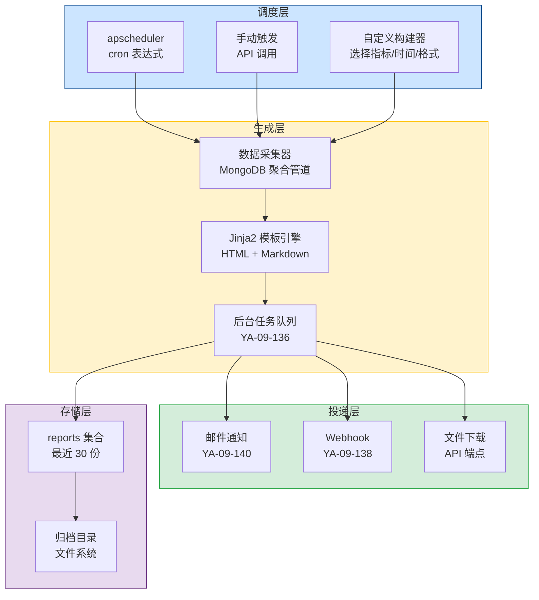
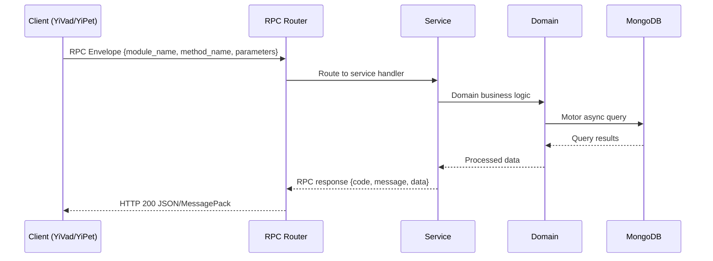

---

doc_type: module
prd_task_id: "YA-09-123"
title: "YA-09-123: 定时报告生成 — Jinja2 渲染 + 企微/邮件投递 — 开发方案"
status: 需求已编写
priority: P2
owner: 陈铭
roles: [engineer]
created: 2026-09-11
updated: 2026-09-14
project: YiAi
project_id: yiai
prd_month: "202609"
estimate_frontend: 0.5
source_prd: "156-需求-定时报告生成.md"
source_okr: [yiai-001]

type: task
---

# YA-09-123: 定时报告生成 — Jinja2 渲染 + 企微/邮件投递

> **文档职责**：本文档定义**怎么做、为什么这么做、实际做成什么样**（HOW），不含产品目标与测试用例。

> 来源 PRD：[156-需求-定时报告生成.md](../../prds/2026-09/156-需求-定时报告生成.md)
> 需求编号：YA-09-123 · 优先级：P2 · 人天：0.5 · 状态：需求已编写
> 类型：功能 · 依赖：YA-09-136（后台任务队列）、YA-09-138（Webhook）、YA-09-140（邮件通知） · 前置需求：YA-09-101（监控体系）

---

<a id="sec-1"></a>
## 一、架构概览 / Architecture Overview

YA-09-150: 定时报告生成 — 多类型报告 + Jinja2 双格式渲染 + 多通道投递 + 异步队列



<a id="sec-2"></a>
## 二、文件清单 / File Manifest

| 文件 / File | 操作 | 说明 / Description |
|-------------|------|--------------------|
| `YiAi/src/services/xxx/service.py` | 新增 | Core service logic
| `YiAi/src/services/xxx/rpc_handler.py` | 新增 | RPC route handler
| `YiAi/tests/test_xxx.py` | 新增 | Unit tests

> Source PRD: 156-需求-定时报告生成.md

<a id="sec-3"></a>
## 三、Python 签名与核心组件 / Python Signatures

### 3.1 核心组件

```python
from datetime import datetime
from enum import Enum
from typing import Optional
from pydantic import BaseModel, Field
class ReportType(str, Enum):
    """报告类型枚举。"""
class ReportFormat(str, Enum):
    """报告格式枚举。"""
class ReportPeriod(str, Enum):
    """报告周期枚举。"""
class DeliveryChannel(str, Enum):
    """投递通道枚举。"""
class ReportTaskCreate(BaseModel):
    """创建报告任务请求体。"""
class ReportTaskUpdate(BaseModel):
    """更新报告任务请求体。"""
class ReportRecord(BaseModel):
    """报告记录。"""
```
### 3.2 组件 2

```python
from datetime import datetime, timedelta
from typing import Any
from motor.motor_asyncio import AsyncIOMotorDatabase
from shared.logging import get_logger
class DataCollector:
    """从 MongoDB 聚合管道采集报告数据。"""
    def __init__(self, db: AsyncIOMotorDatabase):
        self.db = db
    async def collect_system_health(self, time_range_days: int = 1) -> dict[str, Any]:
        """采集系统健康数据。"""
        # 请求统计
        # 错误统计
        # 系统资源（从监控集合获取）
        return {
    async def collect_usage_stats(self, time_range_days: int = 7) -> dict[str, Any]:
        """采集使用统计数据。"""
        # 会话统计
        return {
    async def collect_rag_quality(self, time_range_days: int = 7) -> dict[str, Any]:
        """采集 RAG 质量数据。"""
    async def collect_error_summary(self, time_range_days: int = 1) -> dict[str, Any]:
    async def collect_storage_usage(self, time_range_days: int = 30) -> dict[str, Any]:
    async def _run_pipeline(self, collection: str, pipeline: list[dict]) -> list[dict]:
```
### 3.3 组件 3

```python
import os
from datetime import datetime
from typing import Optional
from jinja2 import Environment, FileSystemLoader
from motor.motor_asyncio import AsyncIOMotorDatabase
from shared.logging import get_logger
from services.report.models import (
from services.report.collectors import DataCollector
# 默认 cron 表达式
# 模板目录
class ReportService:
    """报告生成、调度、投递服务。"""
    def __init__(self, db: AsyncIOMotorDatabase):
        self.db = db
        self.collector = DataCollector(db)
        self.tasks_col = db.report_tasks
        self.reports_col = db.reports
        self._jinja_env = Environment(
    # ─── 报告任务 CRUD ─────────────────────────────────
    async def create_task(self, data: ReportTaskCreate) -> dict:
    async def list_tasks(self) -> list[dict]:
    async def update_task(self, task_id: str, data: ReportTaskUpdate) -> Optional[dict]:
        from bson import ObjectId
    async def delete_task(self, task_id: str) -> bool:
        from bson import ObjectId
```

<a id="sec-4"></a>
## 四、数据流 / Data Flow



**Call chain**: `Client -> RPC Router -> Service -> Domain -> MongoDB`  
**Response format**: `{code: 0, message: "ok", data: ...}`  
**Async model**: Full-chain `async/await`, Motor async MongoDB driver.  
**Error propagation**: Service exceptions caught by middleware -> standard error codes (1001-9999).

<a id="sec-5"></a>
## 五、实施路线图 / Roadmap

**预估人天 / Estimated**: 0.5

| 步骤 / Step | 操作 / Action | 路径 / Path | 验证 / Verification | 人天 / Days |
|-------------|---------------|-------------|---------------------|-------------|
| 1 | 定义报告数据模型和枚举类型 | `models.py` | Pydantic 模型验证通过，枚举类型完整 | 0.03 |
| 2 | 实现 MongoDB 聚合管道数据采集器 | `collectors.py` | 5 种报告类型数据采集正常返回 | 0.1 |
| 3 | 创建 Jinja2 模板（HTML 格式） | `templates/*.html.j2` | 模板渲染输出正确 HTML | 0.1 |
| 4 | 实现报告生成核心逻辑（采集 + 渲染） | `report_service.py` | 生成报告内容非空，HTML 结构完整 | 0.08 |
| 5 | 实现报告任务 CRUD 和 apscheduler 调度 | `report_service.py` | 创建/编辑/删除任务，定时触发正常 | 0.08 |
| 6 | 实现报告投递（邮件 + Webhook + 文件下载） | `report_service.py` | 三种通道投递均可正常执行 | 0.05 |
| 7 | 实现报告历史管理和归档 | `report_service.py` | 历史记录查询正常，超过 30 份自动清理 | 0.03 |
| 8 | 实现 RPC 端点 | `report_routes.py` | 所有端点可正常调用 | 0.03 |
| 风险 | 概率 | 影响 | 等级 | 缓解措施 | 应急预案 |
| 聚合管道在大数据集上执行缓慢 | 中 | 中 | 中 | 限制时间范围，使用索引优化聚合查询 | 减小报告时间范围，拆分为多个小报告 |
| Jinja2 模板语法错误导致渲染失败 | 低 | 中 | 低 | 模板变更需通过测试验证，提供模板语法检查工具 | 回滚模板到上一个可用版本 |
| 邮件投递失败导致报告无法送达 | 中 | 中 | 中 | 支持多通道投递，邮件失败时 Webhook 仍可投递 | 手动从报告历史中下载报告 |

<a id="sec-6"></a>
## 六、代码审查检查清单 / Review Checklist

- [ ] `ReportType` 枚举包含 5 种报告类型，值与规格一致
- [ ] `ReportFormat` 枚举包含 HTML 和 Markdown
- [ ] `DeliveryChannel` 枚举包含 email、webhook、file_download
- [ ] `DataCollector` 中每种报告类型对应一个采集方法
- [ ] 聚合管道使用 `$match` + `$group` 模式，避免全表扫描
- [ ] 聚合管道执行失败时返回空列表，不抛出异常
- [ ] Jinja2 模板目录路径正确，模板文件存在
- [ ] 模板渲染失败时返回错误信息 HTML，不抛出异常
- [ ] 报告生成通过后台任务队列异步执行
- [ ] 邮件投递复用 `EmailService`（YA-09-140）
- [ ] Webhook 投递复用 `emit` 函数（YA-09-138）
- [ ] 每种报告类型保留最近 30 份，自动清理旧报告
- [ ] 报告列表 API 不返回完整 `content` 字段
- [ ] 报告详情 API 返回完整 `content` 字段
- [ ] 自定义报告构建器校验 metrics 参数白名单
- [ ] `ruff` 代码规范通过
- [ ] `mypy` 类型检查通过
---

<a id="sec-7"></a>
## 七、风险表 / Risk Table

| 风险 / Risk | 影响 / Impact | 缓解措施 / Mitigation | 应急预案 / Contingency |
|-------------|---------------|----------------------|------------------------|
| 聚合管道在大数据集上执行缓慢 | 中 | 中 | 中 |
| Jinja2 模板语法错误导致渲染失败 | 低 | 中 | 低 |
| 邮件投递失败导致报告无法送达 | 中 | 中 | 中 |
| 大报告生成阻塞事件循环 | 低 | 高 | 中 |
| 报告存储占用过大 | 中 | 低 | 低 |
| 自定义报告构建器参数校验不足 | 低 | 中 | 低 |
| 场景 | 回滚方式 | 回滚时间 | 风险 |
| 报告生成影响主业务性能 | 全局禁用报告调度 `ENABLE_REPORTS=false` | < 1min | 低：报告暂停，不影响核心业务 |
| 特定报告类型模板有问题 | 禁用该报告任务 `PATCH /report-tasks/:id {enabled: false}` | < 1min | 低：仅影响该类型报告 |
| 新报告功能有 bug | 回滚代码到上一版本 | < 5min | 低：不影响已有数据 |
