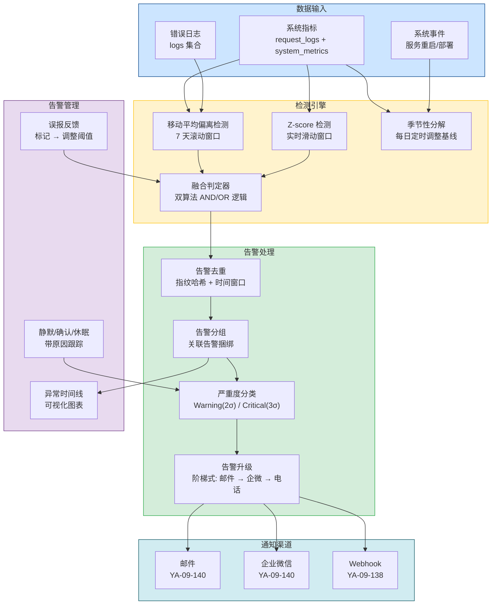
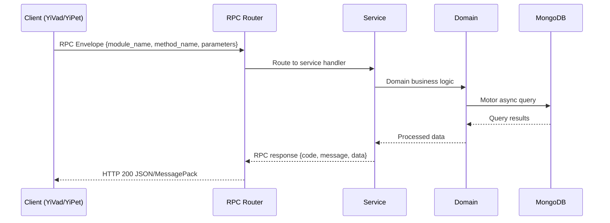

---

doc_type: module
prd_task_id: "YA-09-126"
title: "YA-09-126: 异常检测与智能告警 — 统计基线 + 多算法融合 — 开发方案"
status: 需求已编写
priority: P2
owner: 陈铭
roles: [engineer]
created: 2026-09-11
updated: 2026-09-14
project: YiAi
project_id: yiai
prd_month: "202609"
estimate_frontend: 1.0
source_prd: "157-需求-异常检测与智能告警.md"
source_okr: [yiai-001]

type: task
---

# YA-09-126: 异常检测与智能告警 — 统计基线 + 多算法融合

> **文档职责**：本文档定义**怎么做、为什么这么做、实际做成什么样**（HOW），不含产品目标与测试用例。

> 来源 PRD：[157-需求-异常检测与智能告警.md](../../prds/2026-09/157-需求-异常检测与智能告警.md)
> 需求编号：YA-09-126 · 优先级：P2 · 人天：1.0 · 状态：需求已编写
> 类型：功能 · 依赖：YA-09-101（监控体系）、YA-09-140（邮件通知） · 前置需求：无

---

<a id="sec-1"></a>
## 一、架构概览 / Architecture Overview

YA-09-151: 异常检测与智能告警 — 统计异常检测 + 多算法融合 + 告警去重升级 + 误报反馈



<a id="sec-2"></a>
## 二、文件清单 / File Manifest

| 文件 / File | 操作 | 说明 / Description |
|-------------|------|--------------------|
| `YiAi/src/services/xxx/service.py` | 新增 | Core service logic
| `YiAi/src/services/xxx/rpc_handler.py` | 新增 | RPC route handler
| `YiAi/tests/test_xxx.py` | 新增 | Unit tests

> Source PRD: 157-需求-异常检测与智能告警.md

<a id="sec-3"></a>
## 三、Python 签名与核心组件 / Python Signatures

### 3.1 核心组件

```python
from datetime import datetime
from enum import Enum
from typing import Optional
from pydantic import BaseModel, Field
class MetricName(str, Enum):
    """监控指标名称。"""
class DetectionAlgorithm(str, Enum):
    """检测算法。"""
class AnomalySeverity(str, Enum):
    """异常严重度。"""
class AlertStatus(str, Enum):
    """告警状态。"""
class EscalationLevel(str, Enum):
    """告警升级级别。"""
class AnomalyEvent(BaseModel):
    """异常事件。"""
class Alert(BaseModel):
    """告警记录。"""
class AlertSilenceRequest(BaseModel):
    """告警静默请求。"""
class FalsePositiveFeedback(BaseModel):
```
### 3.2 组件 2

```python
import hashlib
import math
from collections import deque
from datetime import datetime, timedelta
from typing import Optional
from motor.motor_asyncio import AsyncIOMotorDatabase
from shared.logging import get_logger
from services.anomaly.models import (
# 滑动窗口大小（数据点数量）
# 基线窗口（天数）
# 异常阈值
# 告警去重窗口（秒）
# 告警升级时间（秒）
class AnomalyDetector:
    """统计异常检测引擎。"""
    def __init__(self, db: AsyncIOMotorDatabase):
        self.db = db
        self.alerts_col = db.anomaly_alerts
        self.metrics_col = db.system_metrics
        # 滑动窗口缓存 (metric -> deque of values)
    async def detect_moving_average(
    async def detect_z_score(
    async def evaluate(
    async def _get_baseline(self, metric: MetricName) -> Optional[tuple[float, float]]:
    def _get_sliding_window(self, metric: MetricName) -> deque:
```
### 3.3 组件 3

```python
from datetime import datetime, timedelta
from typing import Optional
from bson import ObjectId
from motor.motor_asyncio import AsyncIOMotorDatabase
from shared.logging import get_logger
from services.anomaly.models import (
class AlertService:
    """告警生命周期管理。"""
    def __init__(self, db: AsyncIOMotorDatabase):
        self.db = db
        self.alerts_col = db.anomaly_alerts
    async def acknowledge(self, alert_id: str, user: str) -> Optional[dict]:
        """确认告警。"""
            return_document=True,
        if result:
        return result
    async def resolve(self, alert_id: str) -> Optional[dict]:
        """解决告警。"""
            return_document=True,
        if result:
    async def silence(self, request: AlertSilenceRequest) -> Optional[dict]:
    async def mark_false_positive(self, feedback: FalsePositiveFeedback) -> Optional[dict]:
    async def _adjust_threshold(self, alert: dict):
    async def check_escalation(self) -> list[dict]:
    async def get_alert_history(
```

<a id="sec-4"></a>
## 四、数据流 / Data Flow



**Call chain**: `Client -> RPC Router -> Service -> Domain -> MongoDB`  
**Response format**: `{code: 0, message: "ok", data: ...}`  
**Async model**: Full-chain `async/await`, Motor async MongoDB driver.  
**Error propagation**: Service exceptions caught by middleware -> standard error codes (1001-9999).

<a id="sec-5"></a>
## 五、实施路线图 / Roadmap

**预估人天 / Estimated**: 1.0

| 步骤 / Step | 操作 / Action | 路径 / Path | 验证 / Verification | 人天 / Days |
|-------------|---------------|-------------|---------------------|-------------|
| 1 | 定义异常检测数据模型和枚举 | `models.py` | Pydantic 模型验证通过 | 0.05 |
| 2 | 实现移动平均偏离检测算法 | `detector.py` | 模拟异常数据，验证偏离检测正确 | 0.15 |
| 3 | 实现 Z-score 滑动窗口检测算法 | `detector.py` | 模拟突增数据，验证 Z-score 检测正确 | 0.15 |
| 4 | 实现双算法融合判定和去重逻辑 | `detector.py` | 单一算法异常不触发告警，双算法异常触发 | 0.1 |
| 5 | 实现基线自动计算（7 天滚动窗口） | `detector.py` | 基线数据从 MongoDB 聚合正确获取 | 0.1 |
| 6 | 实现告警管理（确认/静默/休眠/解决） | `alert_service.py` | 告警状态流转正确 | 0.1 |
| 7 | 实现告警升级引擎（阶梯式） | `alert_service.py` | 超时未确认的告警自动升级 | 0.1 |
| 8 | 实现误报反馈和阈值调整 | `alert_service.py` | 标记误报后阈值自动调整 | 0.1 |
| 9 | 实现异常时间线可视化 API | `alert_service.py` | 返回结构化时间线数据 | 0.05 |
| 10 | 实现 apscheduler 定时任务（升级检查/自动解决） | `scheduler.py` | 定时任务正常执行 | 0.05 |
| 11 | 实现 RPC 端点 | `anomaly_routes.py` | 所有端点可正常调用 | 0.05 |
| 风险 | 概率 | 影响 | 等级 | 缓解措施 | 应急预案 |

<a id="sec-6"></a>
## 六、代码审查检查清单 / Review Checklist

- [ ] `MetricName` 枚举包含 6 种监控指标
- [ ] `DetectionAlgorithm` 枚举包含 3 种算法
- [ ] `AnomalySeverity` 包含 Warning(2σ) 和 Critical(3σ)
- [ ] `AlertStatus` 包含 5 种状态（firing/acknowledged/resolved/suppressed/false_positive）
- [ ] 移动平均偏离检测使用 7 天滚动窗口计算基线和标准差
- [ ] Z-score 检测使用 60 分钟滑动窗口
- [ ] 双算法 AND 融合判定：两者都异常才触发告警
- [ ] 单一算法异常仅记录 INFO 日志，不触发告警
- [ ] 告警去重使用 MD5 指纹 + 5 分钟时间窗口
- [ ] 告警确认后记录 `acknowledged_at` 和 `acknowledged_by`
- [ ] 告警静默支持自定义时长和原因记录
- [ ] 告警升级为阶梯式：email → wechat_work → phone_call（预留）
- [ ] 指标恢复正常后自动解决告警（偏离 < 2σ）
- [ ] 误报反馈支持阈值调整，调整记录写入 `threshold_adjustments`
- [ ] 异常时间线 API 返回结构化数据供前端可视化
- [ ] `ruff` 代码规范通过
- [ ] `mypy` 类型检查通过
---

<a id="sec-7"></a>
## 七、风险表 / Risk Table

| 风险 / Risk | 影响 / Impact | 缓解措施 / Mitigation | 应急预案 / Contingency |
|-------------|---------------|----------------------|------------------------|
| 基线数据不足导致检测失效 | 中 | 中 | 中 |
| 双算法 AND 逻辑导致漏报 | 低 | 高 | 中 |
| 告警升级导致通知风暴 | 低 | 中 | 低 |
| 误报反馈导致阈值过度调整 | 低 | 中 | 低 |
| 滑动窗口内存占用过大 | 低 | 低 | 低 |
| 季节性分解计算开销大 | 低 | 中 | 低 |
| 场景 | 回滚方式 | 回滚时间 | 风险 |
| 异常检测误报率过高 | 全局禁用异常检测 `ENABLE_ANOMALY_DETECTION=false` | < 1min | 低：回退到固定阈值告警 |
| 特定指标检测不准确 | 禁用该指标检测 `exclude_metrics: [error_rate]` | < 1min | 低：仅影响该指标 |
| 告警升级导致通知风暴 | 暂停升级 `ENABLE_ESCALATION=false` | < 1min | 低：告警停留在当前级别 |
