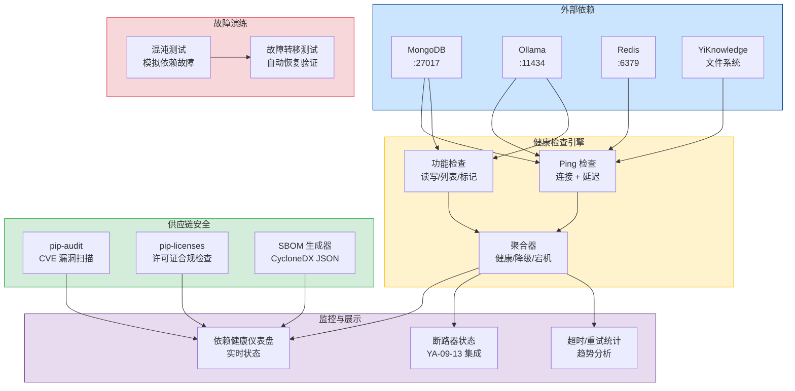
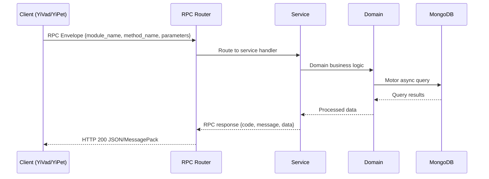

---

doc_type: module
prd_task_id: "YA-09-152"
title: "YA-09-152: 依赖健康检查与供应链安全 — 外部依赖监控 + 漏洞扫描 + 许可证合规 + SBOM — 开发任务"
status: 需求已编写
priority: P2
owner: 陈铭
roles: [engineer]
created: 2026-09-11
updated: 2026-09-11
project: YiAi
project_id: yiai
prd_month: "202609"
estimate_frontend: 0.5
source_prd: "158-需求-依赖健康检查与供应链安全.md"
source_okr: [yiai-001]

type: task
---

# YA-09-152: 依赖健康检查与供应链安全 — 外部依赖监控 + 漏洞扫描 + 许可证合规 + SBOM

> **文档职责**：本文档定义**怎么做、为什么这么做、实际做成什么样**（HOW），不含产品目标与测试用例。

> 来源 PRD：[158-需求-依赖健康检查与供应链安全.md](../../prds/2026-09/158-需求-依赖健康检查与供应链安全.md)
> 需求编号：YA-09-152 · 优先级：P2 · 人天：0.5 · 状态：需求已编写
> 类型：功能 · 依赖：YA-09-13（断路器）、YA-09-101（监控体系） · 前置需求：无

---

<a id="sec-1"></a>
## 一、架构概览 / Architecture Overview

YA-09-152: 依赖健康检查与供应链安全 — 外部依赖监控 + 漏洞扫描 + 许可证合规 + SBOM



<a id="sec-2"></a>
## 二、文件清单 / File Manifest

| 文件 / File | 操作 | 说明 / Description |
|-------------|------|--------------------|
| `YiAi/src/services/xxx/service.py` | 新增 | Core service logic
| `YiAi/src/services/xxx/rpc_handler.py` | 新增 | RPC route handler
| `YiAi/tests/test_xxx.py` | 新增 | Unit tests

> Source PRD: 158-需求-依赖健康检查与供应链安全.md

<a id="sec-3"></a>
## 三、Python 签名与核心组件 / Python Signatures

### 3.1 核心组件

```python
from datetime import datetime
from enum import Enum
from typing import Optional
from pydantic import BaseModel, Field
class DependencyType(str, Enum):
    """依赖类型。"""
class DependencyStatus(str, Enum):
    """依赖健康状态。"""
class AggregateStatus(str, Enum):
    """聚合健康状态。"""
class HealthCheckResult(BaseModel):
    """单次健康检查结果。"""
class DependencyHealth(BaseModel):
    """依赖健康状态。"""
class VulnerabilityInfo(BaseModel):
    """漏洞信息。"""
class LicenseInfo(BaseModel):
    """许可证信息。"""
class SBOMInfo(BaseModel):
    """SBOM 信息。"""
```
### 3.2 组件 2

```python
import os
import time
import asyncio
from datetime import datetime, timedelta
from typing import Optional
import httpx
from motor.motor_asyncio import AsyncIOMotorDatabase
from shared.logging import get_logger
from services.dependency.models import (
# 健康检查超时（秒）
# 连续失败阈值
# 关键依赖列表
class DependencyHealthChecker:
    """外部依赖健康检查服务。"""
    def __init__(self, db: AsyncIOMotorDatabase):
        self.db = db
        self.health_col = db.dependency_health
        self.check_results_col = db.dependency_check_results
        self._http_client: Optional[httpx.AsyncClient] = None
    async def _get_http_client(self) -> httpx.AsyncClient:
    async def check_mongodb(self) -> HealthCheckResult:
    async def check_ollama(self) -> HealthCheckResult:
    async def check_redis(self) -> HealthCheckResult:
            import redis.asyncio as aioredis
    async def check_filesystem(self) -> HealthCheckResult:
```
### 3.3 组件 3

```python
import asyncio
import json
import subprocess
from datetime import datetime, timedelta
from typing import Optional
from motor.motor_asyncio import AsyncIOMotorDatabase
from shared.logging import get_logger
from services.dependency.models import VulnerabilityInfo, LicenseInfo, SBOMInfo
# 漏洞扫描缓存时间（秒）
class SecurityScanner:
    """供应链安全扫描服务。"""
    def __init__(self, db: AsyncIOMotorDatabase):
        self.db = db
        self.vuln_cache_col = db.vulnerability_cache
        self.sbom_col = db.sbom_records
    # ─── 漏洞扫描 ─────────────────────────────────────
    async def scan_vulnerabilities(self, force: bool = False) -> list[VulnerabilityInfo]:
        """使用 pip-audit 扫描 Python 依赖漏洞。"""
        # 检查缓存
        if not force:
    async def _get_cached_vulnerabilities(self) -> Optional[list[VulnerabilityInfo]]:
    async def _cache_vulnerabilities(self, vulnerabilities: list[VulnerabilityInfo]):
    async def check_licenses(self) -> list[LicenseInfo]:
    async def generate_sbom(self) -> SBOMInfo:
    async def get_sbom_history(self, limit: int = 10) -> list[dict]:
```

<a id="sec-4"></a>
## 四、数据流 / Data Flow



**Call chain**: `Client -> RPC Router -> Service -> Domain -> MongoDB`  
**Response format**: `{code: 0, message: "ok", data: ...}`  
**Async model**: Full-chain `async/await`, Motor async MongoDB driver.  
**Error propagation**: Service exceptions caught by middleware -> standard error codes (1001-9999).

<a id="sec-5"></a>
## 五、实施路线图 / Roadmap

**预估人天 / Estimated**: 0.5

| 步骤 / Step | 操作 / Action | 路径 / Path | 验证 / Verification | 人天 / Days |
|-------------|---------------|-------------|---------------------|-------------|
| 1 | 定义依赖健康和安全数据模型 | `models.py` | Pydantic 模型验证通过 | 0.03 |
| 2 | 实现依赖健康检查引擎（MongoDB/Ollama/Redis/文件系统） | `health_checker.py` | 4 种依赖 ping 检查正常 | 0.1 |
| 3 | 实现健康状态聚合逻辑（关键依赖优先） | `health_checker.py` | 模拟依赖故障，验证聚合状态正确 | 0.05 |
| 4 | 实现依赖统计（超时/重试/延迟趋势） | `health_checker.py` | 24 小时统计数据正确 | 0.05 |
| 5 | 实现漏洞扫描（pip-audit 集成） | `security_scanner.py` | 漏洞扫描返回结果，缓存生效 | 0.08 |
| 6 | 实现许可证合规检查（pip-licenses 集成） | `security_scanner.py` | 许可证列表返回，高风险标记正确 | 0.05 |
| 7 | 实现 SBOM 生成（CycloneDX 格式） | `security_scanner.py` | SBOM JSON 格式正确，包含包和漏洞信息 | 0.07 |
| 8 | 实现 apscheduler 定时任务（健康检查 + 安全扫描） | `scheduler.py` | 定时任务正常执行 | 0.04 |
| 9 | 实现 RPC 端点 | `dependency_routes.py` | 所有端点可正常调用 | 0.03 |
| 风险 | 概率 | 影响 | 等级 | 缓解措施 | 应急预案 |
| pip-audit 扫描超时（大型项目） | 中 | 低 | 低 | 设置 120s 超时，结果缓存 24 小时 | 手动执行离线扫描 |
| 健康检查过于频繁消耗依赖资源 | 低 | 低 | 低 | 30 秒间隔，仅 ping 不执行重型操作 | 降低检查频率为 60 秒 |

<a id="sec-6"></a>
## 六、代码审查检查清单 / Review Checklist

- [ ] `DependencyType` 枚举包含 mongodb、ollama、redis、filesystem
- [ ] `DependencyStatus` 枚举包含 healthy/degraded/unhealthy/unknown
- [ ] `AggregateStatus` 枚举包含 all_healthy/degraded/down
- [ ] 4 种依赖的 ping 检查方法均实现超时保护
- [ ] 健康状态聚合使用关键依赖优先策略
- [ ] 连续失败/成功计数器正确递增/重置
- [ ] 检查结果持久化到 `dependency_check_results` 集合
- [ ] 漏洞扫描集成 pip-audit，支持 JSON 格式输出解析
- [ ] 漏洞结果缓存 24 小时，支持 `force=True` 刷新
- [ ] 许可证检查标记高风险许可证（GPL/AGPL）为不合规
- [ ] SBOM 生成 CycloneDX JSON 格式，包含包、漏洞、许可证信息
- [ ] 健康检查定时任务 30 秒间隔
- [ ] 安全扫描定时任务每日执行
- [ ] Redis 作为非关键依赖，故障仅标记为降级
- [ ] `ruff` 代码规范通过
- [ ] `mypy` 类型检查通过
---
## 回归问题预测

<a id="sec-7"></a>
## 七、风险表 / Risk Table

| 风险 / Risk | 影响 / Impact | 缓解措施 / Mitigation | 应急预案 / Contingency |
|-------------|---------------|----------------------|------------------------|
| pip-audit 扫描超时（大型项目） | 中 | 低 | 低 |
| 健康检查过于频繁消耗依赖资源 | 低 | 低 | 低 |
| MongoDB 聚合管道统计耗时 | 中 | 低 | 低 |
| 许可证检查结果不准确 | 低 | 中 | 低 |
| 混沌测试导致生产中断 | 低 | 高 | 高 |
| 场景 | 回滚方式 | 回滚时间 | 风险 |
| 健康检查影响依赖性能 | 全局禁用健康检查 `ENABLE_DEPENDENCY_CHECK=false` | < 1min | 低：监控暂停，不影响核心业务 |
| 漏洞扫描误报过多 | 禁用自动扫描，依赖手动触发 | < 1min | 低：安全扫描暂停 |
| 新功能有 bug | 回滚代码到上一版本 | < 5min | 低：不影响核心业务 |
| 指标 | 采集方式 | 告警阈值 | 说明 |
