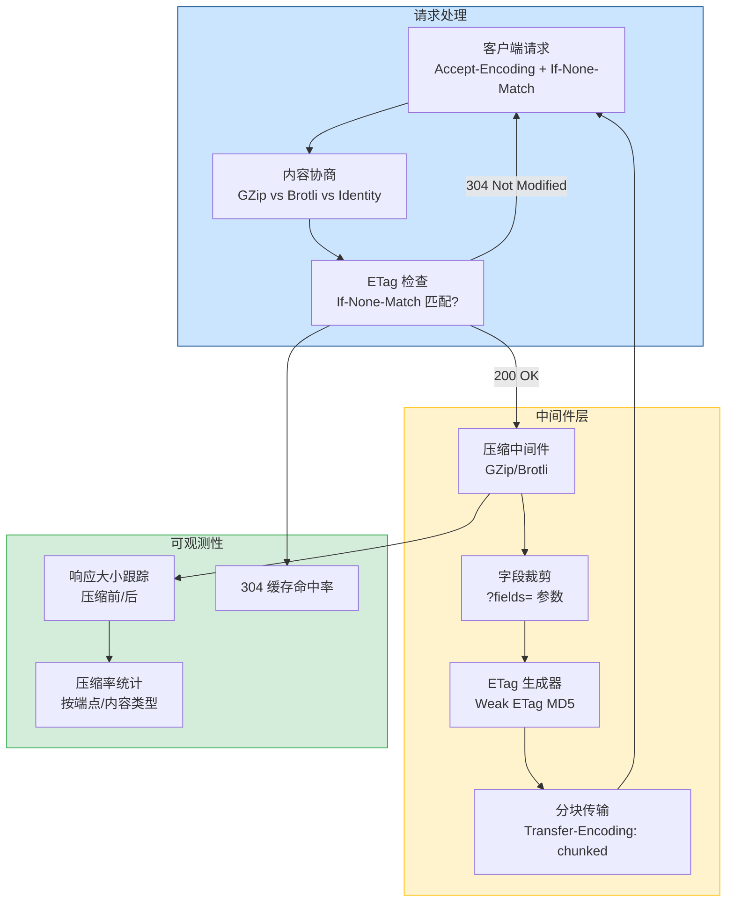
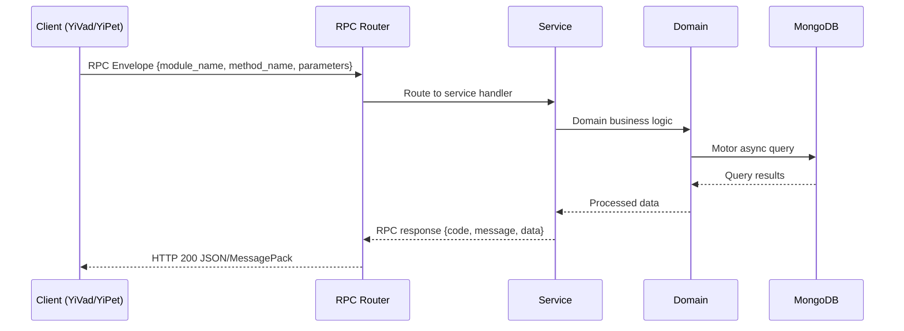

---

doc_type: module
prd_task_id: "YA-09-153"
title: "YA-09-153: 响应压缩与传输优化 — GZip/Brotli 中间件 + 字段裁剪 + ETag 缓存 + 传输指标 — 开发任务"
status: 需求已编写
priority: P2
owner: 陈铭
roles: [engineer]
created: 2026-09-11
updated: 2026-09-11
project: YiAi
project_id: yiai
prd_month: "202609"
estimate_frontend: 0.3
source_prd: "159-需求-响应压缩与传输优化.md"
source_okr: [yiai-001]

type: task
---

# YA-09-153: 响应压缩与传输优化 — GZip/Brotli 中间件 + 字段裁剪 + ETag 缓存 + 传输指标

> **文档职责**：本文档定义**怎么做、为什么这么做、实际做成什么样**（HOW），不含产品目标与测试用例。

> 来源 PRD：[159-需求-响应压缩与传输优化.md](../../prds/2026-09/159-需求-响应压缩与传输优化.md)
> 需求编号：YA-09-153 · 优先级：P2 · 人天：0.3 · 状态：需求已编写
> 类型：功能 · 依赖：无 · 前置需求：无

---

<a id="sec-1"></a>
## 一、架构概览 / Architecture Overview

YA-09-153: 响应压缩与传输优化 — GZip/Brotli 中间件 + 字段裁剪 + ETag 缓存 + 传输指标



<a id="sec-2"></a>
## 二、文件清单 / File Manifest

| 文件 / File | 操作 | 说明 / Description |
|-------------|------|--------------------|
| `YiAi/src/services/xxx/service.py` | 新增 | Core service logic
| `YiAi/src/services/xxx/rpc_handler.py` | 新增 | RPC route handler
| `YiAi/tests/test_xxx.py` | 新增 | Unit tests

> Source PRD: 159-需求-响应压缩与传输优化.md

<a id="sec-3"></a>
## 三、Python 签名与核心组件 / Python Signatures

### 3.1 核心组件

```python
import gzip
import hashlib
import time
from typing import Optional, Callable
from starlette.middleware.base import BaseHTTPMiddleware
from starlette.requests import Request
from starlette.responses import Response, StreamingResponse
from shared.logging import get_logger
# 最小压缩阈值（字节）
# 压缩级别
# 不压缩的内容类型
# 不压缩的路径前缀
class CompressionMiddleware(BaseHTTPMiddleware):
    """响应压缩中间件：GZip/Brotli，内容类型感知，最小阈值。"""
    async def dispatch(self, request: Request, call_next: Callable) -> Response:
        # 检查是否跳过压缩
        if self._should_skip(request):
            return await call_next(request)
        # 获取客户端支持的编码
        # 仅压缩 200 响应
    def _should_skip(self, request: Request) -> bool:
    def _should_skip_content_type(self, content_type: str) -> bool:
    async def _get_response_body(self, response: Response) -> Optional[bytes]:
    def _compress(
                import brotli
```
### 3.2 组件 2

```python
from typing import Any, Callable, Optional
import json
from starlette.middleware.base import BaseHTTPMiddleware
from starlette.requests import Request
from starlette.responses import Response
from shared.logging import get_logger
# 字段裁剪查询参数名
class FieldFilterMiddleware(BaseHTTPMiddleware):
    """响应字段裁剪中间件：支持 ?fields=id,name,metadata.size 稀疏字段集。"""
    async def dispatch(self, request: Request, call_next: Callable) -> Response:
        if not fields_param or fields_param == "*":
            return await call_next(request)
        # 仅处理 JSON 响应
        if "application/json" not in content_type:
            return response
        # 获取响应体
        if body is None:
            return response
            return response
        # 提取字段列表
    async def _get_body(self, response: Response) -> Optional[bytes]:
    def _filter_fields(self, data: Any, fields: list[str]) -> Any:
```
### 3.3 组件 3

```python
import hashlib
import json
from typing import Callable, Optional
from starlette.middleware.base import BaseHTTPMiddleware
from starlette.requests import Request
from starlette.responses import Response
from shared.logging import get_logger
# ETag 缓存（内存 LRU，生产环境建议 Redis）
class ETagMiddleware(BaseHTTPMiddleware):
    """ETag 条件请求中间件：生成 Weak ETag，处理 If-None-Match，返回 304。"""
    async def dispatch(self, request: Request, call_next: Callable) -> Response:
        # 仅处理 GET/HEAD 请求
        if request.method not in ("GET", "HEAD"):
            return await call_next(request)
        # 仅处理 200 响应
        if response.status_code != 200:
            return response
        # 获取响应体
        if body is None:
            return response
    async def _get_body(self, response: Response) -> Optional[bytes]:
    def _compute_etag(self, body: bytes, path: str) -> str:
    def _etag_match(self, current_etag: str, if_none_match: str) -> bool:
```

<a id="sec-4"></a>
## 四、数据流 / Data Flow



**Call chain**: `Client -> RPC Router -> Service -> Domain -> MongoDB`  
**Response format**: `{code: 0, message: "ok", data: ...}`  
**Async model**: Full-chain `async/await`, Motor async MongoDB driver.  
**Error propagation**: Service exceptions caught by middleware -> standard error codes (1001-9999).

<a id="sec-5"></a>
## 五、实施路线图 / Roadmap

**预估人天 / Estimated**: 0.3

| 步骤 / Step | 操作 / Action | 路径 / Path | 验证 / Verification | 人天 / Days |
|-------------|---------------|-------------|---------------------|-------------|
| 1 | 实现 GZip/Brotli 压缩中间件 | `compression.py` | 请求带 Accept-Encoding，响应被压缩 | 0.08 |
| 2 | 实现内容类型感知和最小阈值逻辑 | `compression.py` | 图片/视频不压缩，< 1KB 不压缩 | 0.03 |
| 3 | 实现字段裁剪中间件 | `field_filter.py` | `?fields=id,name` 返回仅含指定字段 | 0.05 |
| 4 | 实现 ETag 条件请求中间件 | `etag.py` | If-None-Match 匹配时返回 304 | 0.05 |
| 5 | 实现传输指标收集中间件 | `transport_metrics.py` | 指标 API 返回压缩率、缓存命中率 | 0.04 |
| 6 | 在 main.py 中注册中间件 | `main.py` | 中间件栈顺序正确，功能正常 | 0.02 |
| 7 | 验证 SSE 流不被压缩 | `main.py` | SSE 端点响应无 Content-Encoding 头 | 0.03 |
| 风险 | 概率 | 影响 | 等级 | 缓解措施 | 应急预案 |
| Brotli 压缩增加 CPU 开销 | 中 | 低 | 低 | 仅对可缓存响应使用 Brotli，动态响应使用 GZip | 回退到 GZip only |
| 字段裁剪破坏响应结构 | 低 | 中 | 中 | 仅对 `data` 字段裁剪，保留 `code`/`message` 信封 | 禁用字段裁剪，返回完整响应 |
| ETag 计算对大响应开销大 | 中 | 低 | 低 | 大响应（> 1MB）使用弱 ETag（仅哈希前 64KB） | 对超大响应跳过 ETag |
| 中间件叠加导致响应延迟 | 低 | 中 | 低 | 中间件顺序优化，压缩在最后执行 | 选择性禁用非关键中间件 |

<a id="sec-6"></a>
## 六、代码审查检查清单 / Review Checklist

- [ ] `CompressionMiddleware` 支持 GZip 和 Brotli 两种算法
- [ ] 内容类型感知：图片/视频/音频/PDF 等不压缩
- [ ] 路径感知：SSE/WebSocket 路径不压缩
- [ ] 最小压缩阈值 1KB，小于阈值跳过
- [ ] 压缩后体积增大时跳过压缩
- [ ] `Accept-Encoding` 协商：Brotli 优先，GZip 兜底
- [ ] `Content-Encoding` 响应头正确设置
- [ ] `Vary: Accept-Encoding` 响应头正确设置
- [ ] `FieldFilterMiddleware` 支持 `?fields=` 参数
- [ ] 嵌套字段裁剪（`metadata.size`）正常工作
- [ ] `fields=*` 返回所有字段
- [ ] `ETagMiddleware` 生成 Weak ETag
- [ ] `If-None-Match` 匹配时返回 304 Not Modified
- [ ] `TransportMetricsMiddleware` 收集压缩率、缓存命中率、响应大小
- [ ] 中间件注册顺序：ETag → 字段裁剪 → 压缩 → 指标
- [ ] SSE 端点响应无 `Content-Encoding` 头
- [ ] `ruff` 代码规范通过
- [ ] `mypy` 类型检查通过

<a id="sec-7"></a>
## 七、风险表 / Risk Table

| 风险 / Risk | 影响 / Impact | 缓解措施 / Mitigation | 应急预案 / Contingency |
|-------------|---------------|----------------------|------------------------|
| Brotli 压缩增加 CPU 开销 | 中 | 低 | 低 |
| 字段裁剪破坏响应结构 | 低 | 中 | 中 |
| ETag 计算对大响应开销大 | 中 | 低 | 低 |
| 中间件叠加导致响应延迟 | 低 | 中 | 低 |
| SSE 流被意外压缩导致实时性下降 | 低 | 中 | 低 |
| 场景 | 回滚方式 | 回滚时间 | 风险 |
| 压缩导致 CPU 过高 | 全局禁用压缩 `ENABLE_COMPRESSION=false` | < 1min | 低：带宽消耗增加，不影响功能 |
| 字段裁剪导致客户端解析错误 | 禁用字段裁剪中间件 | < 1min | 低：数据传输量增加 |
| ETag 304 导致客户端缓存过期数据 | 禁用 ETag 中间件 | < 1min | 低：每次全量传输 |
| 新中间件有 bug | 回滚代码到上一版本 | < 5min | 低：不影响核心业务 |
