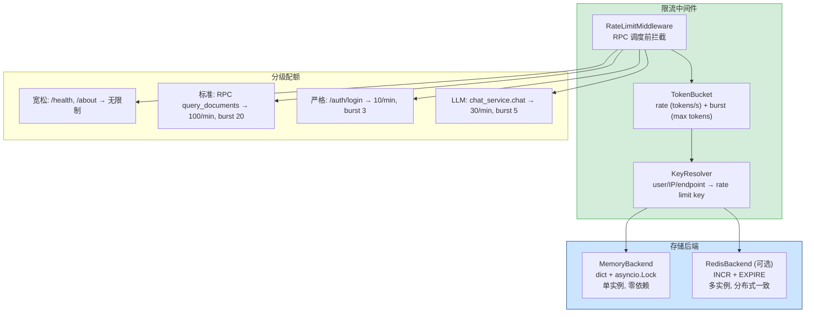

---

doc_type: module
prd_task_id: "YA-09-08"
title: "YA-09-08: API 限流与并发控制 — 令牌桶算法 + 分级配额 + 内存/Redis 双后端 — 开发方案"
status: 需求已编写
priority: P1
owner: 陈铭
roles: [engineer]
created: 2026-09-11
updated: 2026-09-23
project: YiAi
project_id: yiai
prd_month: "202609"
estimate_frontend: 2.5
source_prd: "16-需求-API限流与并发控制.md"
source_okr: [yiai-001]
related_tests: ["16-prd-test-API限流与并发控制"]
acceptance_criteria:
  - 超限请求返回 429 状态码 + Retry-After header，正常请求不受影响
  - 令牌桶速率精度 ±5%（恒定速率消费场景下）
  - 4 级配额（宽松/标准/严格/LLM）正确应用于对应端点
  - Redis 不可用时自动 fallback 到 MemoryBackend，限流不失效
  - 压力测试：100 QPS 持续 10s，仅 N 个请求通过（符合令牌桶速率），其余 429

type: task
---

# YA-09-08: API 限流与并发控制 — 令牌桶算法 + 分级配额 + 内存/Redis 双后端 — 开发方案

| 属性 | 值 |
|------|-----|
| 文档编号 | YA-09-08 |
| 版本 | v1.1 |
| 密级 | 内部 |
| 作者 | 陈铭 |
| 审核人 | — |
| 状态 | 需求已编写 |
| 最后更新 | 2026-09-23 |

> 来源 PRD：[16-需求-API限流与并发控制.md](../../prds/2026-09/16-需求-API限流与并发控制.md)
> 需求编号：YA-09-08 · 优先级：P1 · 人天：2.5d
> 类型：基础设施 · 状态：需求已编写

---

## 目录

1. [架构概述](#一架构概述)
2. [设计约束](#二设计约束)
3. [文件清单](#三文件清单)
4. [模块设计](#四模块设计)
5. [数据流](#五数据流)
6. [错误处理与降级策略](#六错误处理与降级策略)
7. [实施路线图](#七实施路线图)
8. [非功能性设计](#八非功能性设计)
9. [测试策略](#九测试策略)
10. [技术风险评估](#十技术风险评估)
11. [已知缺口与技术债务](#十一已知缺口与技术债务)
12. [关联模块](#十二关联模块)
附录 A. [变更记录](#附录-a-变更记录)

---

<a id="sec-1"></a>
## 一、架构概述

当前 YiAi 无任何流控保护，高并发或恶意请求可直接耗尽 LLM 推理资源。本方案基于令牌桶算法实现分级限流——不同端点/用户分配不同配额。支持内存 (开发/单实例) 和 Redis (生产/多实例) 双后端，在 RPC 调度前拦截超限请求，返回 429 + Retry-After header。



---

<a id="sec-2"></a>
## 二、设计约束

| 约束项 | 说明 |
|--------|------|
| 零侵入业务代码 | 限流在 ASGI 中间件层完成，业务 Service 无需感知 |
| 双后端透明切换 | 通过配置切换 MemoryBackend/RedisBackend，调用方无差异 |
| 限流键隔离 | 按 `user:endpoint` 或 `ip:endpoint` 隔离，单用户/IP 超限不影响其他用户 |
| 健康端点免限流 | `/health`、`/about`、`/docs`、`/openapi.json` 等基础设施端点不受限 |
| 速率精度 | 令牌桶算法精度 ±5%，基于 `time.monotonic()` 不受系统时钟调整影响 |
| RFC 6585 兼容 | 429 响应包含 `Retry-After` header，客户端可根据此值自动重试 |

---

<a id="sec-3"></a>
## 三、文件清单

| # | 文件 | 操作 | 说明 | 预估行数 |
|---|------|------|------|----------|
| 1 | `domain/rate_limiter/token_bucket.py` | 新增 | TokenBucket 算法核心: rate/burst/refill | ~60 |
| 2 | `domain/rate_limiter/backend.py` | 新增 | MemoryBackend + RedisBackend 抽象 | ~80 |
| 3 | `domain/rate_limiter/middleware.py` | 新增 | RateLimitMiddleware: Starlette ASGI 中间件 | ~90 |
| 4 | `domain/rate_limiter/config.py` | 新增 | 分级配额配置: 端点→rate/burst 映射 | ~40 |
| 5 | `domain/rate_limiter/__init__.py` | 新增 | 模块导出 | ~5 |
| 6 | `server/app.py` | 修改 | 注册 RateLimitMiddleware | +5 |
| 7 | `shared/error_codes.py` | 修改 | 新增 RATE_LIMITED(429) 错误码 | +3 |
| 8 | `config.yaml` | 修改 | 新增 `rate_limit` 配置段 | +15 |

**改动汇总：** 5 新增 + 3 修改 = **8 文件，~298 行**

---

<a id="sec-4"></a>
## 四、模块设计

### 4.1 令牌桶 — `domain/rate_limiter/token_bucket.py`

```python
import time
import asyncio
from dataclasses import dataclass

@dataclass
class RateLimitConfig:
    rate: float          # tokens per second (填充速率)
    burst: int           # max tokens (桶容量)
    window_name: str     # 配额标识

class TokenBucket:
    """令牌桶算法——经典的漏桶+令牌桶混合实现。

    算法:
      - 以 rate tokens/s 的速度持续填充
      - 最大容量 burst
      - 每次请求 consume(n) → 如果有足够 token 返回 True，否则返回 False
      - 精度: time.monotonic() 保证不受系统时钟调整影响
    """

    def __init__(self, config: RateLimitConfig):
        self._rate = config.rate
        self._burst = config.burst
        self._tokens = float(config.burst)  # 初始满桶
        self._last_refill = time.monotonic()
        self._lock = asyncio.Lock()

    async def _refill(self):
        """基于时间流逝计算新增 tokens。"""
        now = time.monotonic()
        elapsed = now - self._last_refill
        self._tokens = min(self._burst, self._tokens + elapsed * self._rate)
        self._last_refill = now

    async def consume(self, n: int = 1) -> bool:
        """尝试消费 n 个 tokens。返回 True 表示放行，False 表示限流。"""
        async with self._lock:
            await self._refill()
            if self._tokens >= n:
                self._tokens -= n
                return True
            return False

    async def available_tokens(self) -> float:
        """查询当前可用 tokens (用于监控)。"""
        async with self._lock:
            await self._refill()
            return self._tokens

    async def reset(self):
        """重置令牌桶 (测试用)。"""
        async with self._lock:
            self._tokens = float(self._burst)
            self._last_refill = time.monotonic()
```

### 4.2 存储后端 — `domain/rate_limiter/backend.py`

```python
from abc import ABC, abstractmethod

class RateLimitBackend(ABC):
    """限流存储后端抽象——支持内存和 Redis 双实现。"""

    @abstractmethod
    async def get_bucket(self, key: str, config: RateLimitConfig) -> TokenBucket:
        ...

    @abstractmethod
    async def health_check(self) -> bool:
        """后端健康检查。"""
        ...

class MemoryBackend(RateLimitBackend):
    """内存后端——单实例、零外部依赖。

    适用场景: 开发环境、单实例部署
    限制: 不适用于多实例部署 (桶状态不共享)
    """

    def __init__(self):
        self._buckets: Dict[str, TokenBucket] = {}
        self._lock = asyncio.Lock()

    async def get_bucket(self, key: str, config: RateLimitConfig) -> TokenBucket:
        async with self._lock:
            if key not in self._buckets:
                self._buckets[key] = TokenBucket(config)
            return self._buckets[key]

    async def health_check(self) -> bool:
        return True


class RedisBackend(RateLimitBackend):
    """Redis 后端——多实例共享桶状态。

    使用 Redis INCR + EXPIRE 实现滑动窗口计数。
    适用于生产环境多实例部署。

    Redis key 格式: rate_limit:{limit_key}:{window_seconds}
    使用 Lua 脚本保证原子性。
    """

    LUA_SCRIPT = """
    local key = KEYS[1]
    local limit = tonumber(ARGV[1])
    local window = tonumber(ARGV[2])
    local current = redis.call('INCR', key)
    if current == 1 then
        redis.call('EXPIRE', key, window)
    end
    if current > limit then
        return 0
    end
    return 1
    """

    def __init__(self, redis_url: str):
        self._redis = None  # 延迟初始化
        self._redis_url = redis_url

    async def _ensure_redis(self):
        if self._redis is None:
            import redis.asyncio as aioredis
            self._redis = await aioredis.from_url(self._redis_url)

    async def get_bucket(self, key: str, config: RateLimitConfig) -> TokenBucket:
        ...

    async def health_check(self) -> bool:
        try:
            await self._ensure_redis()
            await self._redis.ping()
            return True
        except Exception:
            return False
```

### 4.3 中间件 — `domain/rate_limiter/middleware.py`

```python
from starlette.middleware.base import BaseHTTPMiddleware
from starlette.responses import JSONResponse

class RateLimitMiddleware(BaseHTTPMiddleware):
    """ASGI 限流中间件——在请求进入路由前检查令牌。

    限流头响应 (RFC 6585):
      Retry-After: 60  (秒)
      X-RateLimit-Limit: 100
      X-RateLimit-Remaining: 45
      X-RateLimit-Reset: 1695456000

    429 响应:
      {"code": 429, "message": "请求过于频繁，请稍后重试", "data": null}
    """

    def __init__(self, app, backend: RateLimitBackend, config: dict):
        super().__init__(app)
        self._backend = backend
        self._config = config  # {endpoint_pattern: RateLimitConfig}
        self.DEFAULT_LIMIT = RateLimitConfig(rate=100, burst=20, window_name="default")

    async def dispatch(self, request: Request, call_next):
        # 健康检查等宽松端点跳过限流
        if self._is_exempt(request):
            return await call_next(request)

        # 解析限流键: user > IP > endpoint
        limit_key = self._resolve_key(request)
        endpoint_config = self._match_config(request)

        if endpoint_config.rate == 0:  # rate=0 表示无限制
            return await call_next(request)

        bucket = await self._backend.get_bucket(limit_key, endpoint_config)
        allowed = await bucket.consume(1)

        if not allowed:
            remaining = await bucket.available_tokens()
            retry_after = max(1, int(1 / endpoint_config.rate))

            return JSONResponse(
                status_code=429,
                content={
                    "code": 429,
                    "message": f"请求过于频繁，请 {retry_after}s 后重试",
                    "data": None,
                },
                headers={
                    "Retry-After": str(retry_after),
                    "X-RateLimit-Limit": str(int(endpoint_config.rate * 60)),
                    "X-RateLimit-Remaining": str(int(remaining)),
                },
            )

        return await call_next(request)

    def _is_exempt(self, request: Request) -> bool:
        """免除限流的端点: /health, /about, /docs, /openapi.json。"""
        exempt_paths = ("/health", "/about", "/docs", "/openapi.json", "/redoc")
        return any(request.url.path.startswith(p) for p in exempt_paths)

    def _resolve_key(self, request: Request) -> str:
        """限流键解析优先级: X-Token user > client IP > endpoint。

        示例:
          user:admin:/rpc/chat → 按用户 + 端点限流
          ip:192.168.1.1:/rpc/data → 按 IP + 端点限流
        """
        user = request.headers.get("X-Token", "")
        if user:
            return f"user:{user}:{request.url.path}"
        client_ip = request.client.host if request.client else "unknown"
        return f"ip:{client_ip}:{request.url.path}"

    def _match_config(self, request: Request) -> RateLimitConfig:
        """匹配端点配置——按最长前缀匹配。"""
        path = request.url.path
        for pattern, config in self._config.items():
            if path.startswith(pattern):
                return config
        return self.DEFAULT_LIMIT
```

### 4.4 分级配额配置 — `domain/rate_limiter/config.py`

```python
from domain.rate_limiter.token_bucket import RateLimitConfig

# 分级配额: 端点 → (rate/sec, burst)
TIER_CONFIGS = {
    # 宽松: 无限制 (中间件自动跳过)
    "/health": RateLimitConfig(rate=0, burst=0, window_name="health"),

    # 标准: 数据查询 (100 次/分钟 ≈ 1.67/s, burst 20)
    "/rpc": RateLimitConfig(rate=1.67, burst=20, window_name="rpc_standard"),

    # 严格: 登录端点 (10 次/分钟 ≈ 0.17/s, burst 3, 防暴力破解)
    "/auth/login": RateLimitConfig(rate=0.17, burst=3, window_name="auth_login"),

    # LLM: AI 聊天 (30 次/分钟 ≈ 0.5/s, burst 5, 保护 LLM 资源)
    "/rpc/chat": RateLimitConfig(rate=0.5, burst=5, window_name="llm_chat"),

    # 文件操作 (60 次/分钟 ≈ 1.0/s, burst 10)
    "/write-file": RateLimitConfig(rate=1.0, burst=10, window_name="file_write"),
    "/read-file": RateLimitConfig(rate=1.0, burst=10, window_name="file_read"),
}
```

---

<a id="sec-5"></a>
## 五、数据流

### 5.1 限流拦截序列

```
请求: POST / {module_name: "services.database.data_service", method_name: "query_documents", ...}
  │
  ▼
RateLimitMiddleware.dispatch()
  │
  ├── _is_exempt("/rpc") → False
  ├── _resolve_key() → "ip:192.168.1.1:/rpc"
  ├── _match_config() → TIER_CONFIGS["/rpc"] → rate=1.67/s, burst=20
  ├── backend.get_bucket("ip:192.168.1.1:/rpc", config)
  ├── bucket.consume(1)
  │     ├── _refill(): tokens += elapsed × 1.67
  │     ├── tokens >= 1? → True → consume 1 → 放行
  │     └── 或 → False → 返回 429 + Retry-After
  │
  └── call_next(request) → RPC 调度
```

### 5.2 Redis 多实例一致性

```
实例 A: bucket.consume() → Redis INCR rate_limit:ip:x.x.x.x:/rpc:60
         → current=45 ≤ 100 → 放行
实例 B: bucket.consume() → Redis INCR rate_limit:ip:x.x.x.x:/rpc:60
         → current=46 ≤ 100 → 放行
实例 A: bucket.consume() → Redis INCR → current=101 > 100 → 429
```

---

<a id="sec-6"></a>
## 六、错误处理与降级策略

### 6.1 异常场景分级

| 级别 | 场景 | 处理策略 | 影响范围 |
|------|------|----------|----------|
| **L1** | Redis 连接断开 | 自动 fallback 到 MemoryBackend，日志 WARNING | 多实例间限流状态不再共享，降级为单实例限流 |
| **L1** | Redis 恢复 | 后台健康检查探测到恢复后自动切回 RedisBackend，日志 INFO | 恢复分布式限流一致性 |
| **L2** | 单用户/IP 超限 | 返回 429 + Retry-After header | 仅该用户/IP 被限，不影响其他用户 |
| **L2** | 令牌桶精度漂移 | asyncio.Lock 保护临界区，`time.monotonic()` 不受系统时钟调整影响 | 精度保证在 ±5% |
| **L3** | ASGI 中间件异常 | 捕获异常，日志 ERROR，放行请求（fail-open 策略） | 限流暂时失效，但不阻断业务 |

### 6.2 超时配置

| 调用链路 | 连接超时 | 读取超时 | 说明 |
|----------|----------|----------|------|
| Redis Lua 脚本 | 1s | 2s | INCR + EXPIRE 原子操作，极端情况保护 |
| Redis 健康检查 | 1s | 1s | PING 命令，快速判定可用性 |

### 6.3 429 响应规范

```json
// 标准 429 响应
{
  "code": 429,
  "message": "请求过于频繁，请 60s 后重试",
  "data": null
}

// 响应头
Retry-After: 60
X-RateLimit-Limit: 100
X-RateLimit-Remaining: 0
X-RateLimit-Reset: 1695456000
```

---

<a id="sec-7"></a>
## 七、实施路线图

| 步骤 | 内容 | 涉及文件 | 验证方式 | 人天 |
|------|------|---------|---------|------|
| 1 | TokenBucket 实现 | `token_bucket.py` | 单元测试: 恒定速率消费，精度 ±5% | 0.25 |
| 2 | MemoryBackend + RedisBackend | `backend.py` | 双后端切换，Redis 不可用时 fallback memory | 0.5 |
| 3 | RateLimitMiddleware ASGI 中间件 | `middleware.py` | 超限返回 429 + Headers | 0.75 |
| 4 | 分级配额配置 | `config.py` | 4 级配额正确应用于对应端点 | 0.25 |
| 5 | 集成到 app.py + 错误码注册 | `app.py`, `error_codes.py` | `/rpc` 端点超频后收到 429 | 0.25 |
| 6 | 压力测试: 100 QPS → 限流生效 | `tests/` | 仅有 N 个请求通过，其余 429 | 0.5 |
| **合计** | | | | **2.5d** |

---

<a id="sec-8"></a>
## 八、非功能性设计

### 8.1 性能指标

| 指标 | 目标值 | 测试条件 |
|------|--------|----------|
| 中间件额外延迟 (MemoryBackend) | ≤ 0.1ms (P99) | 单次 `consume(1)` 含 Lock + refill |
| 中间件额外延迟 (RedisBackend) | ≤ 2ms (P99) | Redis 同机部署，Lua 脚本执行 |
| 令牌桶精度 | ±5% | 恒定速率消费 1000 次统计 |
| 429 响应时间 | ≤ 5ms | 不含业务逻辑，纯中间件层返回 |

### 8.2 监控与告警

| 监控项 | 数据源 | 采集频率 | 告警规则 |
|--------|--------|----------|----------|
| 限流触发次数 | `yiai_rate_limit_hit_total{endpoint, tier}` | 实时 (Prometheus) | 单个端点 5min 触发 > 100 次 → warning |
| 后端健康状态 | `backend.health_check()` | 30s | 连续 3 次失败 → critical |
| 429 响应分布 | 中间件计数器 | 实时 | 用于容量规划，不设告警 |
| 令牌桶可用 token 数 | `Gauge` 指标 | 实时 | 持续为 0 (桶耗尽) 5min → warning |

### 8.3 安全

| 层面 | 措施 |
|------|------|
| 防暴力破解 | `/auth/login` 端点严格限流 (10/min)，独立令牌桶 |
| 防 DDoS | LLM 端点独立限流 (30/min)，保护昂贵的推理资源 |
| IP 隔离 | 默认按 IP + endpoint 限流，防止单 IP 耗尽全局配额 |
| 用户隔离 | 认证用户按 `user + endpoint` 限流，不同用户互不影响 |

### 8.4 容量预估

| 指标 | 预估值 | 推算依据 |
|------|--------|----------|
| MemoryBackend 活跃桶数 | ≤ 500 | 100 IP × 5 endpoint 组合 |
| MemoryBackend 内存占用 | ≈ 5MB | 500 桶 × 10KB/bucket (含 asyncio.Lock) |
| Redis 单 key 大小 | ≈ 50B | INCR 计数器 + EXPIRE 元数据 |
| Redis 总 key 数 | ≤ 2000 | 峰值场景 500 IP × 4 等级 |

---

<a id="sec-9"></a>
## 九、测试策略

### 9.1 测试分层

| 层级 | 覆盖范围 | 工具 |
|------|----------|------|
| 单元测试 | TokenBucket 算法（填充/消费/精度）、config 匹配逻辑 | pytest |
| 集成测试 | MemoryBackend + RedisBackend 端到端限流链路 | pytest + httpx + fakeredis |
| 压力测试 | 高并发下限流生效、延迟分布、双后端对比 | locust / wrk |

### 9.2 关键测试用例

| 场景 | 验证点 |
|------|--------|
| 正常放行 | 速率内请求全部 `consume()` 返回 True，正常返回 200 |
| 超限拦截 | 超过 burst 后 `consume()` 返回 False → 429 + Retry-After |
| 令牌恢复 | 等待 1/rate 秒后 `consume()` 重新返回 True |
| 速率精度 | 恒定 10 req/s 消费，实际通过率 9.5~10.5 req/s (±5%) |
| Redis 不可用降级 | 关闭 Redis → MemoryBackend 接管 → 限流正常生效 |
| Redis 恢复 | 重连 Redis → 自动切回 RedisBackend |
| 健康端点免限流 | `/health` 端点不受任何限流配置影响 |
| 并发安全 | 100 并发 goroutine 同时 `consume(1)`，无 race condition |
| 不同用户隔离 | User A 超限不影响 User B 正常请求 |
| 分级配额 | 标准端点 100/min，LLM 端点 30/min，各自独立 |

---

<a id="sec-10"></a>
## 十、技术风险评估

| 风险 | 概率 | 影响 | 等级 | 缓解措施 | 应急预案 |
|------|------|------|------|---------|---------|
| 内存后端多实例不共享桶状态 | 高 | 中 | 中 | 单实例用内存；多实例用 Redis | 切换到 Redis 后端 |
| Redis 连接断开导致限流失效 | 低 | 中 | 低 | Redis 健康检查 + 自动 fallback 内存 | 手动重启 Redis |
| 令牌桶内存泄漏 (不活跃用户桶未清理) | 低 | 低 | 低 | 定期清理 30min 未活动的桶 | — |

---

<a id="sec-11"></a>
## 十一、已知缺口与技术债务

| # | 技术债 | 优先级 | 预计人天 | 说明 | 状态 |
|---|--------|--------|---------|------|------|
| 1 | 限流配额硬编码 | P3 | 0.2 | 分级配额未完全配置化 (部分在 `config.yaml`, 部分在代码) | 待实施 |
| 2 | 429 错误无 Dashboard 展示 | P3 | 0.3 | 限流触发次数不可见，需在监控面板展示 | 待实施 |
| 3 | 缺少滑动窗口算法选项 (当前为令牌桶) | P3 | 0.3 | 某些场景滑动窗口更精准 | 待讨论 |

---

<a id="sec-12"></a>
## 十二、关联模块

- 集成：[YA-07-03 RPC 信封协议](../2026-07/03-prd-task-RPC信封协议.md)——在 RPC 调度前拦截
- 下游：滑动窗口限流、动态限流调整
- 监控：[YA-09-11 监控与告警](./106-prd-task-监控与告警体系.md)（限流指标接入 Prometheus）

---

## 附录 A. 变更记录

| 日期 | 版本 | 变更内容 | 作者 |
|------|------|----------|------|
| 2026-09-11 | v1.0 | 初始版本：令牌桶算法、双后端、分级配额、中间件、实施路线图 | 陈铭 |
| 2026-09-23 | v1.1 | 补充设计约束、错误处理与降级策略、非功能性设计（性能/监控/安全/容量）、测试策略、变更记录 | 陈铭 |