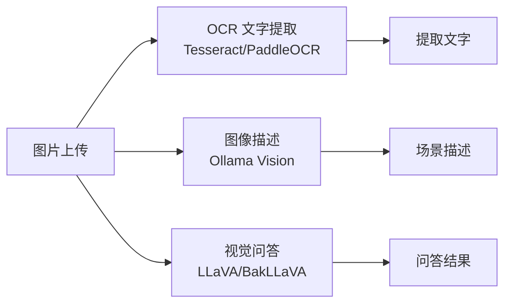

# YA-09-69: 多模态支持 — 图像理解 + 视觉 LLM 集成 — 开发方案

> **文档职责**：本文档定义**怎么做、为什么这么做、实际做成什么样**（HOW），不含产品目标与测试用例。

> 来源 PRD：[160-需求-多模态支持-图像理解.md](../../prds/2026-09/160-需求-多模态支持-图像理解.md)
> 需求编号：YA-09-69 · 优先级：P2 · 人天：2.0d · 状态：需求已编写

---

## 一、方案

YiAi 已有 base64 图片支持（`domain/ai/chat.py:_resolve_images`）。升级为完整的多模态管线——OCR 文字提取、图像描述、视觉问答。

### 模型选择

| 能力 | 模型 | 部署 |
|------|------|------|
| OCR | PaddleOCR / Tesseract | 本地 pip |
| 图像描述 | Ollama `llava:13b` | 自托管 |
| 视觉问答 | Ollama `bakllava` | 自托管 |
| 文档解析 | `unstructured` 库 | pip |

---

## 二、实施步骤

| 步骤 | 验证 | 人天 |
|------|------|------|
| 1 | Ollama Vision 集成 | 图片 → 文字描述 | 0.75 |
| 2 | OCR 管线 (PaddleOCR) | 截图文字提取 | 0.75 |
| 3 | 视觉问答 + Agent 工具 + 测试 | "图中有什么？" | 0.5 |

**合计：2.0d**。