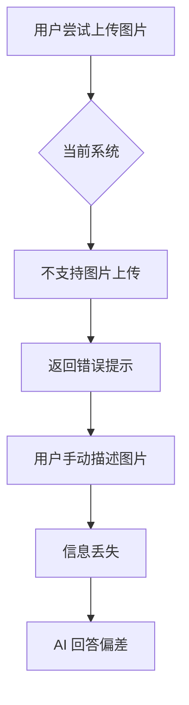
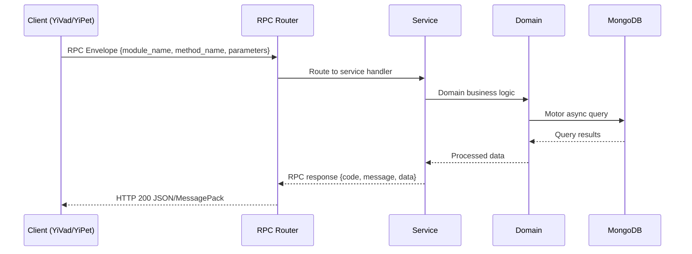

---

doc_type: module
prd_task_id: "YA-09-69"
title: "YA-09-69: 多模态支持 — 图像理解 + 视觉 LLM 集成 — 开发方案"
status: 需求已编写
priority: P2
owner: 陈铭
roles: [engineer]
created: 2026-09-11
updated: 2026-09-14
project: YiAi
project_id: yiai
prd_month: "202609"
estimate_frontend: 2.0
source_prd: "160-需求-多模态支持-图像理解.md"
source_okr: [yiai-002]

type: task
---

# YA-09-69: 多模态支持 — 图像理解 + 视觉 LLM 集成

> **文档职责**：本文档定义**怎么做、为什么这么做、实际做成什么样**（HOW），不含产品目标与测试用例。

> 来源 PRD：[160-需求-多模态支持-图像理解.md](../../prds/2026-09/160-需求-多模态支持-图像理解.md)
> 需求编号：YA-09-69 · 优先级：P2 · 人天：2.0 · 状态：需求已编写
> 类型：功能 · 依赖：YA-09-11（ModelRuntime 抽象层）· 前置需求：无

---

<a id="sec-1"></a>
## 一、架构概览 / Architecture Overview

YA-09-154: 多模态支持 — 图像理解与视觉 LLM 集成


```mermaid
graph TD
    A[用户尝试上传图片] --> B{当前系统}
    B --> C[不支持图片上传]
    C --> D[返回错误提示]
    D --> E[用户手动描述图片]
    E --> F[信息丢失]
    F --> G[AI 回答偏差]
```

<a id="sec-2"></a>
## 二、文件清单 / File Manifest

| 文件 / File | 操作 | 说明 / Description |
|-------------|------|--------------------|
| `YiAi/src/services/xxx/service.py` | 新增 | Core service logic
| `YiAi/src/services/xxx/rpc_handler.py` | 新增 | RPC route handler
| `YiAi/tests/test_xxx.py` | 新增 | Unit tests

> Source PRD: 160-需求-多模态支持-图像理解.md

<a id="sec-3"></a>
## 三、Python 签名与核心组件 / Python Signatures

### 3.1 核心组件

```python
from dataclasses import dataclass
from enum import Enum
from pathlib import Path
from PIL import Image, ImageOps
import io
import os
class ImageFormat(Enum):
class ImageTask(Enum):
@dataclass
class ImageConstraints:
class ImageProcessor:
    """图片预处理管线"""
    def __init__(self, storage_dir: str, constraints: ImageConstraints = None):
        self.storage_dir = Path(storage_dir)
        self.constraints = constraints or ImageConstraints()
        self.storage_dir.mkdir(parents=True, exist_ok=True)
    def validate(self, file_data: bytes, filename: str) -> tuple[bool, str]:
        """验证图片格式和大小"""
        if ext not in self.constraints.supported_formats:
            return False, f"不支持的文件格式: {ext}，支持: {self.constraints.supported_formats}"
    def preprocess(self, file_data: bytes, filename: str) -> dict:
    def _resize_long_edge(self, image: Image.Image, max_size: int) -> Image.Image:
    def save(self, image_id: str, original: bytes, processed: dict) -> dict:
```
### 3.2 组件 2

```python
import base64
import httpx
from dataclasses import dataclass
from typing import Optional
@dataclass
class VisionRequest:
@dataclass
class VisionResponse:
class VisionService:
    """视觉 LLM 服务"""
    def __init__(self, ollama_base_url: str = "http://localhost:11434"):
        self.ollama_base_url = ollama_base_url
    async def understand(self, request: VisionRequest) -> VisionResponse:
        """调用 Ollama 视觉模型进行图片理解"""
            import time
        return VisionResponse(
```
### 3.3 组件 3

```python
import numpy as np
from PIL import Image
class VisionEmbeddingService:
    """图片嵌入服务 — 为 RAG 提供视觉向量"""
    def __init__(self, clip_model_name: str = "clip-ViT-B-32"):
        self.clip_model_name = clip_model_name
    async def embed_image(self, image_data: bytes) -> list[float]:
        """使用 CLIP 风格模型生成图片嵌入向量"""
        # 降级：使用图片像素特征作为嵌入
        return arr.flatten().tolist()
    async def embed_image_with_text(self, image_data: bytes, alt_text: str) -> list[float]:
        """多模态嵌入：融合图片和文本特征"""
        return await self.embed_image(image_data)
```

<a id="sec-4"></a>
## 四、数据流 / Data Flow


```mermaid
sequenceDiagram
    participant C as Client (YiVad/YiPet)
    participant R as RPC Router
    participant S as Service
    participant D as Domain
    participant M as MongoDB

    C->>R: RPC Envelope {module_name, method_name, parameters}
    R->>S: Route to service handler
    S->>D: Domain business logic
    D->>M: Motor async query
    M-->>D: Query results
    D-->>S: Processed data
    S-->>R: RPC response {code, message, data}
    R-->>C: HTTP 200 JSON/MessagePack
```

**Call chain**: `Client -> RPC Router -> Service -> Domain -> MongoDB`  
**Response format**: `{code: 0, message: "ok", data: ...}`  
**Async model**: Full-chain `async/await`, Motor async MongoDB driver.  
**Error propagation**: Service exceptions caught by middleware -> standard error codes (1001-9999).

<a id="sec-5"></a>
## 五、实施路线图 / Roadmap

**预估人天 / Estimated**: 2.0

| 步骤 / Step | 操作 / Action | 路径 / Path | 验证 / Verification | 人天 / Days |
|-------------|---------------|-------------|---------------------|-------------|
| 1 | 实现 ImageProcessor 预处理管线 | 各格式图片 resize/compress 正确 | 0.25 |
| 2 | 实现 VisionService 视觉 LLM 调用 | LLaVA 可正常返回图片描述 | 0.25 |
| 3 | 实现 ImageCache 缓存层 | 相同图片命中缓存，TTL 过期清理 | 0.15 |
| 4 | 实现 MultimodalChatService 路由 | 文本+图片混合输入正常工作 | 0.2 |
| 5 | 实现 VisionEmbeddingService | 图片嵌入向量写入向量索引 | 0.15 |
| 6 | 实现上传 API 端点 | POST /upload-image 返回处理结果 | 0.15 |
| 7 | 集成到 Chat Service | 多模态消息在聊天中正常流转 | 0.15 |
| 8 | 添加 alt 文本无障碍支持 | 所有图片自动生成 alt 描述 | 0.1 |
| 9 | 端到端测试 | 完整上传→理解→响应流程 | 0.1 |
| 风险 | 概率 | 影响 | 缓解措施 |
| 视觉模型加载失败 | 中 | 高 | 健康检查 + 降级为纯文本模式 |
| 大图导致 LLM 超时 | 中 | 中 | 预处理 resize 到 1024px + 120s 超时 |

<a id="sec-6"></a>
## 六、代码审查检查清单 / Review Checklist

- [ ] ImageProcessor 支持所有声明格式（PNG/JPEG/WebP/GIF/BMP）
- [ ] GIF 动图仅取第一帧，不报错
- [ ] 大文件（>10MB）在上传阶段即被拒绝
- [ ] 图片 resize 保持宽高比
- [ ] 视觉 LLM 调用有超时控制（120s）
- [ ] 图片缓存 TTL 过期自动清理
- [ ] alt 文本生成不阻塞主响应
- [ ] 视觉模型不可用时降级为纯文本模式
- [ ] 图片数据不记录到普通日志中（隐私保护）
- [ ] 单元测试覆盖所有图片格式和边界条件
---
## 回归问题预测
| # | 预测问题 | 原因 | 验证方法 |
|---|---------|------|---------|
| 1 | RGBA 图片转 RGB 时背景色异常 | 透明通道处理不当 | 上传透明 PNG 验证背景为白色 |
| 2 | 大分辨率图片 resize 后模糊 | 压缩过大导致细节丢失 | 对比原图和 resize 后的清晰度 |
| 3 | 视觉 LLM 非流式响应超时 | 大图 + 复杂 prompt 推理慢 | 设置 120s 超时，记录超时频率 |
| 4 | 图片缓存 key 冲突 | SHA256 碰撞（概率极低） | 缓存 key 追加文件大小信息 |

<a id="sec-7"></a>
## 七、风险表 / Risk Table

| 风险 / Risk | 影响 / Impact | 缓解措施 / Mitigation | 应急预案 / Contingency |
|-------------|---------------|----------------------|------------------------|
| 视觉模型加载失败 | 中 | 高 | 健康检查 + 降级为纯文本模式 |
| 大图导致 LLM 超时 | 中 | 中 | 预处理 resize 到 1024px + 120s 超时 |
| 图片缓存占用磁盘 | 高 | 中 | TTL 30 天自动清理 + 磁盘使用率告警 |
| GIF 动图处理异常 | 低 | 低 | 仅取第一帧，记录警告日志 |
| 视觉模型幻觉 | 中 | 中 | 置信度阈值 + 用户可标记图片描述错误 |
| Ollama 视觉 API 变更 | 低 | 中 | 版本锁定 + 兼容性测试 |
| # | 预测问题 | 原因 | 验证方法 |
| 1 | RGBA 图片转 RGB 时背景色异常 | 透明通道处理不当 | 上传透明 PNG 验证背景为白色 |
| 2 | 大分辨率图片 resize 后模糊 | 压缩过大导致细节丢失 | 对比原图和 resize 后的清晰度 |
| 3 | 视觉 LLM 非流式响应超时 | 大图 + 复杂 prompt 推理慢 | 设置 120s 超时，记录超时频率 |
