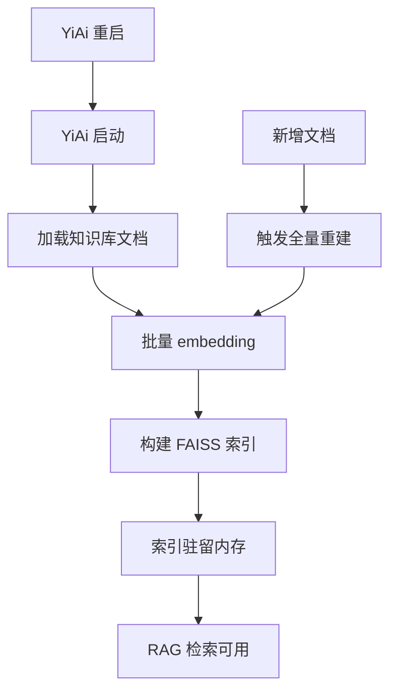
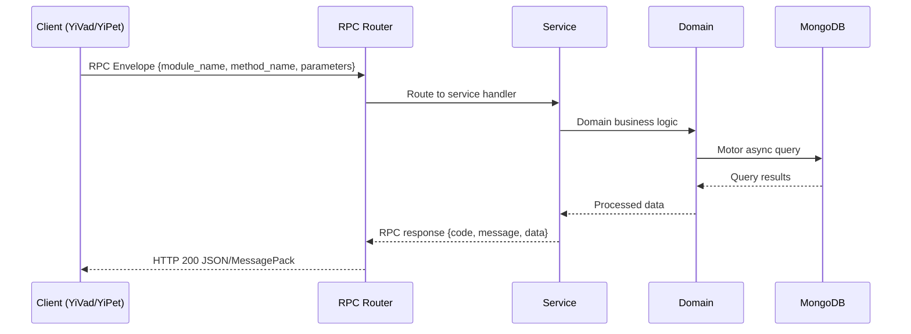

---

doc_type: module
prd_task_id: "YA-09-134"
title: "YA-09-134: 向量数据库迁移 — FAISS → ChromaDB/Qdrant — 开发方案"
status: 需求已编写
priority: P2
owner: 陈铭
roles: [engineer]
created: 2026-09-11
updated: 2026-09-14
project: YiAi
project_id: yiai
prd_month: "202609"
estimate_frontend: 1.0
source_prd: "161-需求-向量数据库迁移.md"
source_okr: [yiai-001]

type: task
---

# YA-09-134: 向量数据库迁移 — FAISS → ChromaDB/Qdrant

> **文档职责**：本文档定义**怎么做、为什么这么做、实际做成什么样**（HOW），不含产品目标与测试用例。

> 来源 PRD：[161-需求-向量数据库迁移.md](../../prds/2026-09/161-需求-向量数据库迁移.md)
> 需求编号：YA-09-134 · 优先级：P2 · 人天：1.0 · 状态：需求已编写
> 类型：基础设施 · 依赖：YA-09-01（RAG 引擎）· 前置需求：无

---

<a id="sec-1"></a>
## 一、架构概览 / Architecture Overview

YA-09-155: 向量数据库迁移 — FAISS 内存索引 → 持久化向量数据库



<a id="sec-2"></a>
## 二、文件清单 / File Manifest

| 文件 / File | 操作 | 说明 / Description |
|-------------|------|--------------------|
| `YiAi/src/services/xxx/service.py` | 新增 | Core service logic
| `YiAi/src/services/xxx/rpc_handler.py` | 新增 | RPC route handler
| `YiAi/tests/test_xxx.py` | 新增 | Unit tests

> Source PRD: 161-需求-向量数据库迁移.md

<a id="sec-3"></a>
## 三、Python 签名与核心组件 / Python Signatures

### 3.1 核心组件

```python
from typing import Optional
from qdrant_client import QdrantClient
from qdrant_client.models import (
import numpy as np
class QdrantVectorStore:
    """Qdrant 向量存储实现"""
    def __init__(self, url: str = "http://localhost:6333",
        self.client = QdrantClient(url=url)
        self.collection_name = collection_name
        self.vector_size = vector_size
        self.distance = Distance.COSINE if distance == "Cosine" else Distance.DOT
    async def ensure_collection(self):
        if self.collection_name not in names:
            self.client.create_collection(
    async def upsert(self, doc_id: str, embedding: list[float], metadata: dict):
        self.client.upsert(collection_name=self.collection_name, points=[point])
    async def batch_upsert(self, points: list[dict]):
        self.client.upsert(collection_name=self.collection_name, points=qdrant_points)
    async def query(self, query_vector: list[float], top_k: int = 10,
        if filter_conditions:
    async def delete(self, doc_id: str):
    async def delete_by_filter(self, filter_conditions: dict):
    async def count(self) -> int:
    async def get_collection_info(self) -> dict:
```
### 3.2 组件 2

```python
import logging
from typing import Optional
class DualWriteVectorStore:
    """双写向量存储适配器 — FAISS + Qdrant 并行"""
    def __init__(self, primary_store, secondary_store, write_mode: str = "both"):
        """
        """
        self.primary = primary_store
        self.secondary = secondary_store
        self.write_mode = write_mode
    async def upsert(self, doc_id: str, embedding: list[float], metadata: dict):
        """双写：同时写入 Qdrant 和 FAISS"""
        if self.write_mode in ("both", "primary_only"):
        if self.write_mode in ("both", "secondary_only"):
        if errors:
    async def query(self, query_vector: list[float], top_k: int = 10,
        """查询：优先 Qdrant，失败时降级到 FAISS"""
            return await self.primary.query(query_vector, top_k, filter_conditions)
                return results
    async def delete(self, doc_id: str):
    async def health_check(self) -> dict:
```
### 3.3 组件 3

```python
import asyncio
import logging
from datetime import datetime
class IndexRebuildService:
    """索引重建管线 — 批量 embedding + upsert"""
    def __init__(
        self.vector_store = vector_store
        self.embedding_service = embedding_service
        self.knowledge_repository = knowledge_repository
        self.batch_size = batch_size
    async def rebuild_index(self, collection_name: str = None) -> dict:
        """从 MongoDB 重新构建向量索引"""
            if not docs:
        return {
    async def verify_index(self) -> dict:
        """验证索引一致性"""
        return {
```

<a id="sec-4"></a>
## 四、数据流 / Data Flow



**Call chain**: `Client -> RPC Router -> Service -> Domain -> MongoDB`  
**Response format**: `{code: 0, message: "ok", data: ...}`  
**Async model**: Full-chain `async/await`, Motor async MongoDB driver.  
**Error propagation**: Service exceptions caught by middleware -> standard error codes (1001-9999).

<a id="sec-5"></a>
## 五、实施路线图 / Roadmap

**预估人天 / Estimated**: 1.0

| 步骤 / Step | 操作 / Action | 路径 / Path | 验证 / Verification | 人天 / Days |
|-------------|---------------|-------------|---------------------|-------------|
| 1 | 部署 Qdrant（Docker Compose） | Qdrant Dashboard 可访问 :6333 | 0.1 |
| 2 | 实现 QdrantVectorStore | 基本 CRUD 测试通过 | 0.2 |
| 3 | 实现 DualWriteVectorStore 适配器 | 双写 + 降级逻辑正常 | 0.15 |
| 4 | 实现 IndexRebuildService | 从 MongoDB 重建索引成功 | 0.15 |
| 5 | 集成到 RAG Service | 查询切换到 Qdrant | 0.1 |
| 6 | 批量重建索引 | 300 篇文档全量导入 | 0.1 |
| 7 | 性能对比测试 | 对比 FAISS vs Qdrant 延迟 | 0.1 |
| 8 | 观察期 + 清理 | 30 天观察后移除 FAISS 代码 | 0.1 |
| 风险 | 概率 | 影响 | 缓解措施 |
| Qdrant 部署失败 | 低 | 高 | 提供 Docker Compose 一键部署 + 健康检查 |
| 索引重建超时 | 中 | 中 | 分批次处理（50 篇/批），可中断续传 |
| Qdrant 查询延迟高于 FAISS | 低 | 中 | 预加载 + 连接池 + 本地部署（无网络延迟） |

<a id="sec-6"></a>
## 六、代码审查检查清单 / Review Checklist

- [ ] QdrantVectorStore 实现所有 VectorStore 接口方法
- [ ] DualWriteVectorStore 降级逻辑正确（主失败 → 备）
- [ ] 双写异常不影响主流程（try/except 包裹）
- [ ] 索引重建支持断点续传（offset 持久化）
- [ ] 批量 upsert 大小可配置（batch_size）
- [ ] 查询结果的 score 与 FAISS 一致（距离度量相同）
- [ ] Docker Compose 中 Qdrant 配置持久化卷
- [ ] 健康检查端点返回向量存储状态
- [ ] 单元测试覆盖 Qdrant 不可用时的降级行为
- [ ] 集成测试覆盖索引重建全流程
---
## 回归问题预测
| # | 预测问题 | 原因 | 验证方法 |
|---|---------|------|---------|
| 1 | Qdrant 查询返回结果的 score 含义与 FAISS 不同 | 距离度量实现差异 | 同向量查询对比 score 排序一致性 |
| 2 | 双写时 Qdrant 写入失败导致数据不一致 | 异常被吞掉，无告警 | 定期一致性校验 + 自动修复 |
| 3 | 索引重建期间 embedding 服务过载 | 批量 embedding 并发过高 | 限制并发数 + 批次间延迟 |
| 4 | Docker Qdrant 数据卷未挂载导致重启数据丢失 | docker-compose 配置遗漏 | 验证重启后数据持久化 |

<a id="sec-7"></a>
## 七、风险表 / Risk Table

| 风险 / Risk | 影响 / Impact | 缓解措施 / Mitigation | 应急预案 / Contingency |
|-------------|---------------|----------------------|------------------------|
| Qdrant 部署失败 | 低 | 高 | 提供 Docker Compose 一键部署 + 健康检查 |
| 索引重建超时 | 中 | 中 | 分批次处理（50 篇/批），可中断续传 |
| Qdrant 查询延迟高于 FAISS | 低 | 中 | 预加载 + 连接池 + 本地部署（无网络延迟） |
| 双写期间数据不一致 | 中 | 中 | 定期一致性校验（每 6 小时）+ 自动修复 |
| embedding 模型变更导致维度不匹配 | 低 | 中 | 向量维度记录在 metadata 中，变更时重建索引 |
| Qdrant 磁盘空间不足 | 低 | 低 | 监控磁盘使用率，设置告警阈值 |
| # | 预测问题 | 原因 | 验证方法 |
| 1 | Qdrant 查询返回结果的 score 含义与 FAISS 不同 | 距离度量实现差异 | 同向量查询对比 score 排序一致性 |
| 2 | 双写时 Qdrant 写入失败导致数据不一致 | 异常被吞掉，无告警 | 定期一致性校验 + 自动修复 |
| 3 | 索引重建期间 embedding 服务过载 | 批量 embedding 并发过高 | 限制并发数 + 批次间延迟 |
