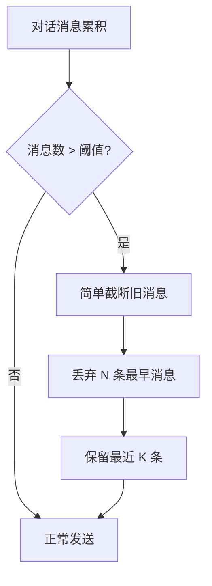
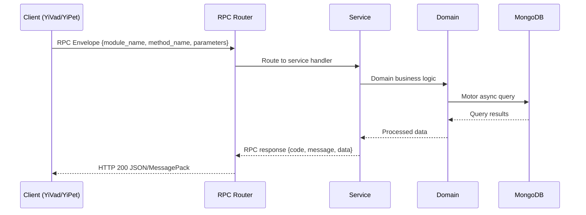

---

doc_type: module
prd_task_id: "YA-09-156"
title: "YA-09-156: Prompt 压缩与优化服务 — 智能上下文压缩 + 关键信息保留 + 长对话优化 — 开发任务"
status: 需求已编写
priority: P2
owner: 陈铭
roles: [engineer]
created: 2026-09-11
updated: 2026-09-11
project: YiAi
project_id: yiai
prd_month: "202609"
estimate_frontend: 0.5
source_prd: "162-需求-Prompt压缩与优化服务.md"
source_okr: [yiai-002]

type: task
---

# YA-09-156: Prompt 压缩与优化服务 — 智能上下文压缩 + 关键信息保留 + 长对话优化

> **文档职责**：本文档定义**怎么做、为什么这么做、实际做成什么样**（HOW），不含产品目标与测试用例。

> 来源 PRD：[162-需求-Prompt压缩与优化服务.md](../../prds/2026-09/162-需求-Prompt压缩与优化服务.md)
> 需求编号：YA-09-156 · 优先级：P2 · 人天：0.5 · 状态：需求已编写
> 类型：功能 · 依赖：YA-09-09（上下文压缩服务）· 前置需求：YA-09-09

---

<a id="sec-1"></a>
## 一、架构概览 / Architecture Overview

YA-09-156: Prompt 压缩与优化服务 — 智能上下文压缩 + 关键信息保留 + 长对话优化



<a id="sec-2"></a>
## 二、文件清单 / File Manifest

| 文件 / File | 操作 | 说明 / Description |
|-------------|------|--------------------|
| `YiAi/src/services/xxx/service.py` | 新增 | Core service logic
| `YiAi/src/services/xxx/rpc_handler.py` | 新增 | RPC route handler
| `YiAi/tests/test_xxx.py` | 新增 | Unit tests

> Source PRD: 162-需求-Prompt压缩与优化服务.md

<a id="sec-3"></a>
## 三、Python 签名与核心组件 / Python Signatures

### 3.1 核心组件

```python
import re
from enum import Enum
from dataclasses import dataclass
class ContentType(Enum):
@dataclass
class ClassifiedMessage:
class ContentClassifier:
    """内容分类器 — 识别消息类型以决定压缩策略"""
```
### 3.2 组件 2

```python
import logging
from dataclasses import dataclass
from typing import Optional
@dataclass
class CompressionResult:
class PromptCompressor:
    """Prompt 压缩器 — 混合提取式 + 生成式压缩"""
    def __init__(
        self.classifier = classifier
        self.llm_service = llm_service
        self.compression_model = compression_model
        self.window_ratio_threshold = window_ratio_threshold
        self.max_context_tokens = max_context_tokens
    def should_compress(self, messages: list[dict]) -> tuple[bool, int]:
        """判断是否需要压缩"""
            self.classifier._estimate_tokens(m.get("content", ""))
        return total_tokens >= threshold, total_tokens
    async def compress(self, messages: list[dict]) -> CompressionResult:
        """执行智能压缩"""
            if cm.content_type in (ContentType.CODE, ContentType.SYSTEM_INSTRUCTION, ContentType.USER_QUESTION):
    def _extractive_compress(self, messages: list[ClassifiedMessage]) -> str:
    def _keyword_score(self, text: str) -> float:
    async def _generate_summary(self, extractive_text: str) -> str:
```
### 3.3 组件 3

```python
from dataclasses import dataclass
@dataclass
class CompressionPreview:
    """压缩预览 — 告知用户被压缩的内容"""
class CompressionPreviewService:
    """压缩预览服务 — 生成用户可见的压缩通知"""
    def generate_preview(self, result: CompressionResult) -> CompressionPreview:
        return CompressionPreview(
    def format_user_message(self, preview: CompressionPreview) -> str:
        """生成展示给用户的压缩通知"""
        return (
```

<a id="sec-4"></a>
## 四、数据流 / Data Flow



**Call chain**: `Client -> RPC Router -> Service -> Domain -> MongoDB`  
**Response format**: `{code: 0, message: "ok", data: ...}`  
**Async model**: Full-chain `async/await`, Motor async MongoDB driver.  
**Error propagation**: Service exceptions caught by middleware -> standard error codes (1001-9999).

<a id="sec-5"></a>
## 五、实施路线图 / Roadmap

**预估人天 / Estimated**: 0.5

| 步骤 / Step | 操作 / Action | 路径 / Path | 验证 / Verification | 人天 / Days |
|-------------|---------------|-------------|---------------------|-------------|
| 1 | 实现 ContentClassifier | 各类型消息正确分类 | 0.1 |
| 2 | 实现 PromptCompressor 提取式压缩 | 关键词提取 + 权重排序正确 | 0.1 |
| 3 | 实现 PromptCompressor 生成式压缩 | 小模型生成摘要质量可接受 | 0.1 |
| 4 | 实现 CompressionPreview 服务 | 压缩预览消息格式正确 | 0.05 |
| 5 | 实现 CompressionQualityEvaluator | 压缩质量指标计算正确 | 0.05 |
| 6 | 集成到 Chat Service | 压缩触发逻辑正确，不影响正常对话 | 0.05 |
| 7 | 与 YA-09-09 Compaction Service 协作 | 两个服务不冲突，协同工作 | 0.05 |
| 风险 | 概率 | 影响 | 缓解措施 |
| 压缩摘要丢失关键信息 | 中 | 高 | 保留最近 3 轮用户问题 + 提供压缩预览 |
| 小模型生成摘要质量差 | 中 | 中 | 降级为提取式压缩（纯文本截断） |
| 压缩增加额外延迟 | 中 | 低 | 使用小模型（0.5B），目标 < 2s |
| 压缩触发过于频繁 | 低 | 低 | 增量压缩 + 冷却期（5 分钟内不重复触发） |

<a id="sec-6"></a>
## 六、代码审查检查清单 / Review Checklist

- [ ] ContentClassifier 正确识别所有 5 种内容类型
- [ ] 代码块（```）不被压缩
- [ ] 系统指令（role=system）原样保留
- [ ] 最近 3 轮用户问题不被压缩
- [ ] 压缩阈值按上下文窗口占比计算（非固定值）
- [ ] 压缩预览消息正确展示给用户
- [ ] 禁用压缩时正确回退到 YA-09-09 Compaction Service
- [ ] 小模型不可用时降级为提取式压缩
- [ ] 压缩质量指标正确记录
- [ ] 单元测试覆盖所有内容类型和压缩策略
---
## 回归问题预测
| # | 预测问题 | 原因 | 验证方法 |
|---|---------|------|---------|
| 1 | 代码块中嵌套 ``` 标记导致误判 | 代码块内包含 markdown 示例 | 测试嵌套代码块分类 |
| 2 | 压缩摘要与后续对话产生矛盾 | 摘要遗漏了关键约束条件 | LLM Judge 评分 + 人工抽检 |
| 3 | 小模型摘要生成超时阻塞主流程 | 小模型推理异常 | 设置 3s 超时 + 降级到提取式 |
| 4 | 压缩后 Tool 调用结果丢失 | 工具结果被分类为对话 | 增强 Tool 结果识别模式 |

<a id="sec-7"></a>
## 七、风险表 / Risk Table

| 风险 / Risk | 影响 / Impact | 缓解措施 / Mitigation | 应急预案 / Contingency |
|-------------|---------------|----------------------|------------------------|
| 压缩摘要丢失关键信息 | 中 | 高 | 保留最近 3 轮用户问题 + 提供压缩预览 |
| 小模型生成摘要质量差 | 中 | 中 | 降级为提取式压缩（纯文本截断） |
| 压缩增加额外延迟 | 中 | 低 | 使用小模型（0.5B），目标 < 2s |
| 压缩触发过于频繁 | 低 | 低 | 增量压缩 + 冷却期（5 分钟内不重复触发） |
| 代码块被误判为对话 | 低 | 中 | 增强 Code 检测模式（``` 标记 + 缩进检测） |
| # | 预测问题 | 原因 | 验证方法 |
| 1 | 代码块中嵌套 ``` 标记导致误判 | 代码块内包含 markdown 示例 | 测试嵌套代码块分类 |
| 2 | 压缩摘要与后续对话产生矛盾 | 摘要遗漏了关键约束条件 | LLM Judge 评分 + 人工抽检 |
| 3 | 小模型摘要生成超时阻塞主流程 | 小模型推理异常 | 设置 3s 超时 + 降级到提取式 |
| 4 | 压缩后 Tool 调用结果丢失 | 工具结果被分类为对话 | 增强 Tool 结果识别模式 |
