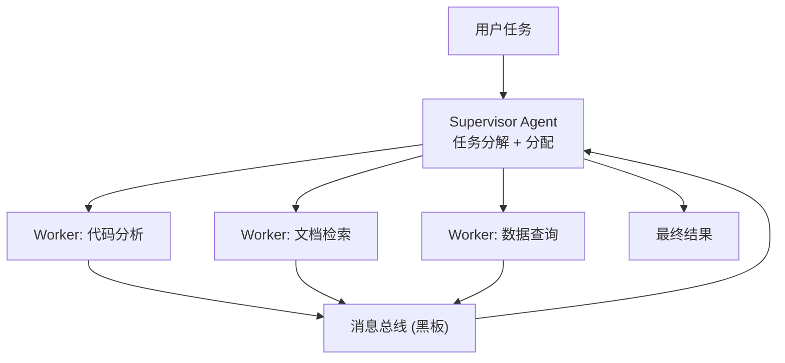

# YA-09-94: 多 Agent 编排 — Supervisor + Worker + 消息总线 — 开发方案

> **文档职责**：本文档定义**怎么做、为什么这么做、实际做成什么样**（HOW），不含产品目标与测试用例。

> 来源 PRD：[163-需求-多Agent编排框架.md](../../prds/2026-09/163-需求-多Agent编排框架.md)
> 需求编号：YA-09-94 · 优先级：P2 · 人天：2.5d · 状态：需求已编写

---

<a id="sec-1"></a>
## 一、方案



```python
class SupervisorAgent:
    async def execute(self, task: str) -> str:
        plan = await self.plan(task)  # LLM 分解子任务
        results = {}
        for subtask in plan["subtasks"]:
            worker = self.workers[subtask["type"]]
            results[subtask["id"]] = await worker.execute(subtask, self.blackboard)
        return await self.synthesize(task, results)  # LLM 合成
```

### 角色分工

| Agent | 工具 | 职责 |
|-------|------|------|
| Supervisor | 所有 Worker 注册信息 | 任务规划、分配、结果合成 |
| CodeWorker | AST 解析、git diff | 代码分析和审查 |
| DocWorker | RAG 检索 | 文档和知识库查询 |
| DataWorker | RPC data_service | 数据库查询和统计 |

---

<a id="sec-2"></a>
## 二、实施步骤

| 步骤 | 验证 | 人天 |
|------|------|------|
| 1 | Supervisor + 3 Worker + 黑板 | 复杂任务分解执行 | 1.5 |
| 2 | 并发 Worker + 错误隔离 + 测试 | 单 Worker 失败不影响其他 | 1.0 |

**合计：2.5d**。