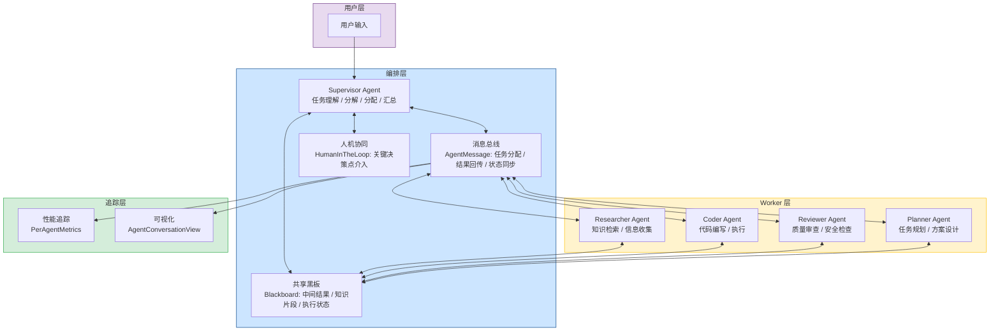
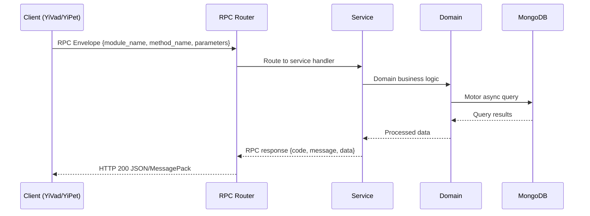

---

doc_type: module
prd_task_id: "YA-09-94"
title: "YA-09-94: 多 Agent 编排 — Supervisor + Worker + 消息总线 — 开发方案"
status: 需求已编写
priority: P2
owner: 陈铭
roles: [engineer]
created: 2026-09-11
updated: 2026-09-14
project: YiAi
project_id: yiai
prd_month: "202609"
estimate_frontend: 2.5
source_prd: "163-需求-多Agent编排框架.md"
source_okr: [yiai-003]

type: task
---

# YA-09-94: 多 Agent 编排 — Supervisor + Worker + 消息总线

> **文档职责**：本文档定义**怎么做、为什么这么做、实际做成什么样**（HOW），不含产品目标与测试用例。

> 来源 PRD：[163-需求-多Agent编排框架.md](../../prds/2026-09/163-需求-多Agent编排框架.md)
> 需求编号：YA-09-94 · 优先级：P2 · 人天：2.5 · 状态：需求已编写
> 类型：功能 · 依赖：YA-09-03（Agent 循环） · 前置需求：YA-09-03（Agent 循环）

---

<a id="sec-1"></a>
## 一、架构概览 / Architecture Overview

YA-09-157: 多 Agent 编排框架 — Supervisor + Worker 角色分工 + 消息总线 + 黑板模式 + 人机协同


```mermaid
flowchart TD
  subgraph UserLayer["用户层"]
    USER["用户输入"]
  end

  subgraph Orchestration["编排层"]
    SUP["Supervisor Agent<br/>任务理解 / 分解 / 分配 / 汇总"]
    BUS["消息总线<br/>AgentMessage: 任务分配 / 结果回传 / 状态同步"]
    BB["共享黑板<br/>Blackboard: 中间结果 / 知识片段 / 执行状态"]
    HITL["人机协同<br/>HumanInTheLoop: 关键决策点介入"]
  end

  subgraph Workers["Worker 层"]
    RESEARCHER["Researcher Agent<br/>知识检索 / 信息收集"]
    CODER["Coder Agent<br/>代码编写 / 执行"]
    REVIEWER["Reviewer Agent<br/>质量审查 / 安全检查"]
    PLANNER["Planner Agent<br/>任务规划 / 方案设计"]
  end

  subgraph Tracking["追踪层"]
    PERF["性能追踪<br/>PerAgentMetrics"]
    VIZ["可视化<br/>AgentConversationView"]
  end

  USER --> SUP
  SUP <--> BUS
  SUP <--> BB
  SUP <--> HITL
  BUS <--> RESEARCHER
  BUS <--> CODER
  BUS <--> REVIEWER
  BUS <--> PLANNER
  RESEARCHER <--> BB
  CODER <--> BB
  REVIEWER <--> BB
  PLANNER <--> BB
  BUS --> PERF
  BUS --> VIZ

  style Orchestration fill:#cce5ff,stroke:#004085
  style Workers fill:#fff3cd,stroke:#ffc107
  style Tracking fill:#d4edda,stroke:#28a745
  style UserLayer fill:#e8daef,stroke:#6c3483
```

<a id="sec-2"></a>
## 二、文件清单 / File Manifest

| 文件 / File | 操作 | 说明 / Description |
|-------------|------|--------------------|
| `YiAi/src/services/xxx/service.py` | 新增 | Core service logic
| `YiAi/src/services/xxx/rpc_handler.py` | 新增 | RPC route handler
| `YiAi/tests/test_xxx.py` | 新增 | Unit tests

> Source PRD: 163-需求-多Agent编排框架.md

<a id="sec-3"></a>
## 三、Python 签名与核心组件 / Python Signatures

### 3.1 核心组件

```python
class AgentLoop:
    async def run(self, user_input: str, session_id: str) -> AsyncGenerator[AgentEvent, None]:
        """执行 Agent 循环，yield 事件流。"""
        ...
    async def execute_tool(self, tool_name: str, params: dict) -> ToolResult:
        """执行工具调用。"""
        ...
    async def think(self, context: list[Message]) -> Thought:
        """LLM 推理步骤。"""
        ...
```
### 3.2 组件 2

```python
from enum import Enum
from dataclasses import dataclass, field
from typing import Optional
class AgentRole(str, Enum):
    """Agent 角色枚举。"""
@dataclass
class RoleConfig:
    """Agent 角色配置。"""
# 预定义角色配置
```
### 3.3 组件 3

```python
import asyncio
from datetime import datetime
from enum import Enum
from typing import Any, Callable, Optional
from dataclasses import dataclass, field
from collections import defaultdict
from shared.logging import get_logger
class MessageType(str, Enum):
    """消息类型枚举。"""
@dataclass
class AgentMessage:
    """Agent 间消息。"""
class MessageBus:
    """Agent 消息总线。
    """
    def __init__(self):
        self._subscribers: dict[str, list[Callable]] = defaultdict(list)
        self._message_history: list[AgentMessage] = []
        self._pending_responses: dict[str, asyncio.Event] = {}
        self._response_messages: dict[str, AgentMessage] = {}
    def subscribe(self, agent_id: str, callback: Callable[[AgentMessage], Any]):
    def unsubscribe(self, agent_id: str, callback: Callable[[AgentMessage], Any]):
    async def publish(self, message: AgentMessage):
    async def request_response(
    def resolve_response(self, request_id: str, response: AgentMessage):
```

<a id="sec-4"></a>
## 四、数据流 / Data Flow


```mermaid
sequenceDiagram
    participant C as Client (YiVad/YiPet)
    participant R as RPC Router
    participant S as Service
    participant D as Domain
    participant M as MongoDB

    C->>R: RPC Envelope {module_name, method_name, parameters}
    R->>S: Route to service handler
    S->>D: Domain business logic
    D->>M: Motor async query
    M-->>D: Query results
    D-->>S: Processed data
    S-->>R: RPC response {code, message, data}
    R-->>C: HTTP 200 JSON/MessagePack
```

**Call chain**: `Client -> RPC Router -> Service -> Domain -> MongoDB`  
**Response format**: `{code: 0, message: "ok", data: ...}`  
**Async model**: Full-chain `async/await`, Motor async MongoDB driver.  
**Error propagation**: Service exceptions caught by middleware -> standard error codes (1001-9999).

<a id="sec-5"></a>
## 五、实施路线图 / Roadmap

**预估人天 / Estimated**: 2.5

| 步骤 / Step | 操作 / Action | 路径 / Path | 验证 / Verification | 人天 / Days |
|-------------|---------------|-------------|---------------------|-------------|
| 1 | 定义 Agent 角色枚举和配置 | `roles.py` | 5 种角色配置完整，system prompt 可正常加载 | 0.15 |
| 2 | 实现消息总线（发布/订阅/请求-响应） | `message_bus.py` | 消息发送和接收正常，超时机制生效 | 0.3 |
| 3 | 实现共享黑板（读写/版本/订阅/过期） | `blackboard.py` | 并发读写安全，TTL 过期清理正常 | 0.25 |
| 4 | 实现 Worker 基类 | `worker.py` | 消息处理、任务执行、黑板写入流程正常 | 0.2 |
| 5 | 实现 4 种 Worker Agent | `workers/*.py` | 各 Worker 正常接收任务并返回结果 | 0.3 |
| 6 | 实现 Supervisor Agent（任务分解/分配/汇总） | `supervisor.py` | 4 种协作模式均正常执行 | 0.4 |
| 7 | 实现性能追踪器 | `tracker.py` | 各角色指标正确记录 | 0.1 |
| 8 | 集成到现有 Agent 循环 | `agent_loop.py` | 现有单 Agent 模式不受影响，多 Agent 模式可切换 | 0.2 |
| 9 | 添加 RPC 端点和事件类型 | `agent_routes.py` | SSE 事件流包含编排事件 | 0.1 |
| 风险 | 概率 | 影响 | 等级 | 缓解措施 | 应急预案 |
| 消息总线成为性能瓶颈 | 中 | 高 | 高 | 使用 asyncio 异步处理，消息队列不阻塞 | 限制消息历史大小，添加背压机制 |
| Supervisor 单点故障 | 低 | 高 | 中 | Supervisor 状态持久化到 MongoDB，支持故障恢复 | 降级为单 Agent 模式 |

<a id="sec-6"></a>
## 六、代码审查检查清单 / Review Checklist

- [ ] `AgentRole` 枚举包含 5 种角色（SUPERVISOR, RESEARCHER, CODER, REVIEWER, PLANNER）
- [ ] `RoleConfig` 中每种角色定义了 system_prompt 和 available_tools
- [ ] `MessageBus` 支持点对点、广播、请求-响应三种通信模式
- [ ] `MessageBus.request_response` 有超时机制，超时返回 None
- [ ] `Blackboard` 支持版本控制，写入时自动递增版本号
- [ ] `Blackboard` 支持 TTL 过期和清理
- [ ] `Blackboard` 读写操作使用 asyncio.Lock 保证并发安全
- [ ] `SupervisorAgent` 支持 4 种协作模式（SEQUENTIAL, PARALLEL, DEBATE, VOTING）
- [ ] `SupervisorAgent._plan_task` 优先使用 Planner Worker，无 Planner 时降级为简单分解
- [ ] `BaseWorker` 的消息处理流程完整（接收 → 执行 → 写黑板 → 回传结果）
- [ ] `BaseWorker` 执行失败时发送 TASK_ERROR 消息
- [ ] `AgentPerformanceTracker` 按角色统计成功率、平均耗时、token 消耗
- [ ] 所有 Worker 在 `_execute` 中捕获异常，不向消息总线抛出未处理异常
- [ ] 现有 `AgentLoop` 可配置切换单 Agent / 多 Agent 模式
- [ ] `ruff` 代码规范通过
- [ ] `mypy` 类型检查通过
---
## 回归问题预测

<a id="sec-7"></a>
## 七、风险表 / Risk Table

| 风险 / Risk | 影响 / Impact | 缓解措施 / Mitigation | 应急预案 / Contingency |
|-------------|---------------|----------------------|------------------------|
| 消息总线成为性能瓶颈 | 中 | 高 | 高 |
| Supervisor 单点故障 | 低 | 高 | 中 |
| Worker 间上下文同步不一致 | 中 | 中 | 中 |
| 多 Agent 并发导致 token 消耗激增 | 高 | 中 | 中 |
| 辩论模式陷入死循环 | 低 | 中 | 低 |
| 与现有 Agent 循环集成冲突 | 中 | 高 | 高 |
| 场景 | 回滚方式 | 回滚时间 | 风险 |
| 多 Agent 模式不稳定 | 配置开关 `AGENT_MODE=single` 降级为单 Agent | < 1min | 低：不影响现有功能 |
| 消息总线异常 | 重启消息总线服务，清理积压消息 | < 2min | 低：进行中的编排任务失败 |
| 黑板数据污染 | 清理指定 key 的黑板数据 | < 1min | 低：仅影响当前任务 |
