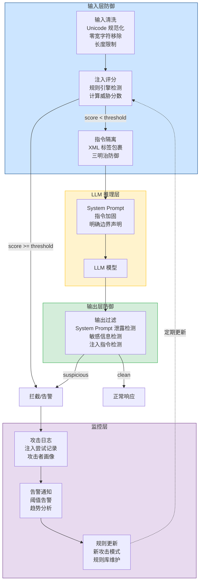
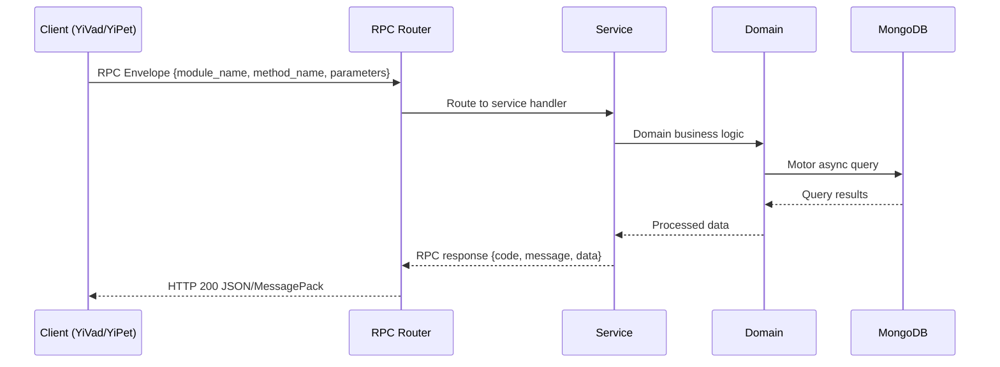

---

doc_type: module
prd_task_id: "YA-09-97"
title: "YA-09-97: Prompt 注入防御 — 多层防护 + 三明治模式 — 开发方案"
status: 需求已编写
priority: P2
owner: 陈铭
roles: [engineer]
created: 2026-09-11
updated: 2026-09-14
project: YiAi
project_id: yiai
prd_month: "202609"
estimate_frontend: 1.0
source_prd: "164-需求-Prompt注入防御.md"
source_okr: [yiai-003]

type: task
---

# YA-09-97: Prompt 注入防御 — 多层防护 + 三明治模式

> **文档职责**：本文档定义**怎么做、为什么这么做、实际做成什么样**（HOW），不含产品目标与测试用例。

> 来源 PRD：[164-需求-Prompt注入防御.md](../../prds/2026-09/164-需求-Prompt注入防御.md)
> 需求编号：YA-09-97 · 优先级：P2 · 人天：1.0 · 状态：需求已编写
> 类型：安全 · 依赖：YA-09-142（内容审核管道） · 前置需求：YA-09-03（Agent 循环）

---

<a id="sec-1"></a>
## 一、架构概览 / Architecture Overview

YA-09-158: Prompt 注入防御 — 多层防御体系 + 三明治防护 + 注入评分 + 攻击日志告警


```mermaid
flowchart TD
  subgraph Input["输入层防御"]
    SANITIZE["输入清洗<br/>Unicode 规范化<br/>零宽字符移除<br/>长度限制"]
    SCORE["注入评分<br/>规则引擎检测<br/>计算威胁分数"]
    ISOLATE["指令隔离<br/>XML 标签包裹<br/>三明治防御"]
  end

  subgraph LLM["LLM 推理层"]
    SYSTEM["System Prompt<br/>指令加固<br/>明确边界声明"]
    MODEL["LLM 模型"]
  end

  subgraph Output["输出层防御"]
    OUTPUT_FILTER["输出过滤<br/>System Prompt 泄露检测<br/>敏感信息检测<br/>注入指令检测"]
  end

  subgraph Monitor["监控层"]
    LOG["攻击日志<br/>注入尝试记录<br/>攻击者画像"]
    ALERT["告警通知<br/>阈值告警<br/>趋势分析"]
    UPDATE["规则更新<br/>新攻击模式<br/>规则库维护"]
  end

  SANITIZE --> SCORE
  SCORE -->|score < threshold| ISOLATE
  SCORE -->|score >= threshold| BLOCK["拦截/告警"]
  ISOLATE --> SYSTEM
  SYSTEM --> MODEL
  MODEL --> OUTPUT_FILTER
  OUTPUT_FILTER -->|clean| RESPONSE["正常响应"]
  OUTPUT_FILTER -->|suspicious| BLOCK
  BLOCK --> LOG
  LOG --> ALERT
  ALERT --> UPDATE
  UPDATE -.->|定期更新| SCORE

  style Input fill:#cce5ff,stroke:#004085
  style LLM fill:#fff3cd,stroke:#ffc107
  style Output fill:#d4edda,stroke:#28a745
  style Monitor fill:#e8daef,stroke:#6c3483
```

<a id="sec-2"></a>
## 二、文件清单 / File Manifest

| 文件 / File | 操作 | 说明 / Description |
|-------------|------|--------------------|
| `YiAi/src/services/xxx/service.py` | 新增 | Core service logic
| `YiAi/src/services/xxx/rpc_handler.py` | 新增 | RPC route handler
| `YiAi/tests/test_xxx.py` | 新增 | Unit tests

> Source PRD: 164-需求-Prompt注入防御.md

<a id="sec-3"></a>
## 三、Python 签名与核心组件 / Python Signatures

### 3.1 核心组件

```python
import re
import unicodedata
from enum import Enum
from typing import Optional
from dataclasses import dataclass, field
from shared.logging import get_logger
class ThreatLevel(str, Enum):
    """威胁等级。"""
@dataclass
class DetectionResult:
    """检测结果。"""
class InjectionDetector:
    """Prompt 注入检测器。
    """
    # 规则权重配置
    # 指令覆盖模式
    # 角色混淆模式
    # 编码欺骗模式
        # Base64 字符串特征（40+ 字符的 base64 字母集）
        # 明显的编码数据
```
### 3.2 组件 2

```python
from typing import Optional
class SandwichBuilder:
    """三明治防御 Prompt 构建器。
    """
    # 前置提醒模板
    # 后置提醒模板
    # 用户输入 XML 标签
    def __init__(self):
    def build(
        """构建三明治防御 prompt。
        """
        if include_pre_reminder:
        if include_post_reminder:
        return "\n\n".join(parts)
    def build_messages(
        """构建消息格式（用于 Chat API）。
        """
        # 系统消息 = system prompt + 前置提醒
        # 用户消息 = 输入 + 后置提醒
        if history:
    def harden_system_prompt(self, original_prompt: str) -> str:
```
### 3.3 组件 3

```python
import re
from typing import Optional
from dataclasses import dataclass
from shared.logging import get_logger
@dataclass
class OutputFilterResult:
    """输出过滤结果。"""
class OutputFilter:
    """LLM 输出过滤器。
    """
    # System Prompt 泄露检测模式
    # 敏感信息模式
    # 注入传播模式（输出中包含对其他 LLM 的注入指令）
    def __init__(self, system_prompt: str = ""):
        self.system_prompt = system_prompt
        self._compile_patterns()
    def _compile_patterns(self):
        """编译所有检测模式。"""
        self._compiled_prompt_leak = [re.compile(p) for p in self.PROMPT_LEAK_PATTERNS]
        self._compiled_sensitive = [re.compile(p) for p in self.SENSITIVE_PATTERNS]
    def filter(self, output: str) -> OutputFilterResult:
    def _check_prompt_leak(self, output: str) -> bool:
    def _check_sensitive(self, output: str) -> Optional[str]:
    def _check_injection_propagation(self, output: str) -> Optional[str]:
    def _sanitize_sensitive(self, output: str) -> str:
```

<a id="sec-4"></a>
## 四、数据流 / Data Flow


```mermaid
sequenceDiagram
    participant C as Client (YiVad/YiPet)
    participant R as RPC Router
    participant S as Service
    participant D as Domain
    participant M as MongoDB

    C->>R: RPC Envelope {module_name, method_name, parameters}
    R->>S: Route to service handler
    S->>D: Domain business logic
    D->>M: Motor async query
    M-->>D: Query results
    D-->>S: Processed data
    S-->>R: RPC response {code, message, data}
    R-->>C: HTTP 200 JSON/MessagePack
```

**Call chain**: `Client -> RPC Router -> Service -> Domain -> MongoDB`  
**Response format**: `{code: 0, message: "ok", data: ...}`  
**Async model**: Full-chain `async/await`, Motor async MongoDB driver.  
**Error propagation**: Service exceptions caught by middleware -> standard error codes (1001-9999).

<a id="sec-5"></a>
## 五、实施路线图 / Roadmap

**预估人天 / Estimated**: 1.0

| 步骤 / Step | 操作 / Action | 路径 / Path | 验证 / Verification | 人天 / Days |
|-------------|---------------|-------------|---------------------|-------------|
| 1 | 实现注入检测规则引擎（6 类规则 + 评分系统） | `detector.py` | 已知攻击样本检测率 > 85%，正常输入误杀率 < 3% | 0.12 |
| 2 | 实现三明治防御构建器（XML 标签 + 前后提醒） | `sandwich.py` | 构建的 prompt 结构正确，LLM 能正确识别指令边界 | 0.08 |
| 3 | 实现 system prompt 加固逻辑 | `sandwich.py` | 加固后的 prompt 包含安全规则声明 | 0.03 |
| 4 | 实现输出过滤器（泄露检测 + 敏感信息 + 注入传播） | `output_filter.py` | 能检测常见泄露和敏感信息模式 | 0.08 |
| 5 | 实现注入攻击日志记录和统计 | `logger.py` | 日志正确写入 MongoDB，统计查询正常 | 0.08 |
| 6 | 实现防御中间件（pre_process + post_process） | `middleware.py` | 集成到 chat_service 请求处理流程 | 0.06 |
| 7 | 与内容审核管道集成 | `middleware.py` | 两个管道不冲突，审核结果互补 | 0.03 |
| 8 | 编写测试用例和攻击样本 | `tests/` | 测试覆盖 6 类攻击模式 | 0.02 |
| 风险 | 概率 | 影响 | 等级 | 缓解措施 | 应急预案 |
| 正常用户输入被误判为注入（误杀） | 中 | 中 | 中 | 可配置阈值，LOW/MEDIUM 级别仅告警不拦截 | 用户可申诉，白名单机制 |
| 新型攻击模式绕过规则引擎 | 高 | 高 | 高 | 定期更新规则库，预留 ML 检测层接口 | 紧急添加新规则，热更新 |
| 三明治防御增加 token 消耗 | 高 | 低 | 低 | 前后提醒文本精简，仅保留关键信息 | 可配置关闭部分提醒 |

<a id="sec-6"></a>
## 六、代码审查检查清单 / Review Checklist

- [ ] `InjectionDetector` 包含 6 类攻击模式的正则规则
- [ ] 所有正则表达式使用 `re.compile` 预编译
- [ ] 检测分数计算逻辑正确，上限为 1.0
- [ ] `_sanitize` 方法正确处理 Unicode 规范化和零宽字符移除
- [ ] `SandwichBuilder.build` 输出结构正确（4 层）
- [ ] `SandwichBuilder.harden_system_prompt` 追加的安全规则完整
- [ ] `OutputFilter` 包含 3 类检测模式（泄露、敏感信息、注入传播）
- [ ] `OutputFilter._sanitize_sensitive` 正确替换敏感信息为 `[REDACTED]`
- [ ] `InjectionLogger` 的日志结构包含所有必要字段
- [ ] `PromptDefenseMiddleware.pre_process` 正确判断拦截条件
- [ ] 防御功能可通过环境变量配置开关和阈值
- [ ] 所有检测方法返回结果而非抛出异常
- [ ] `ruff` 代码规范通过
- [ ] `mypy` 类型检查通过
---
## 回归问题预测
| # | 问题 | 发现场景 | 根因 | 修复方式 |
|---|------|---------|------|---------|

<a id="sec-7"></a>
## 七、风险表 / Risk Table

| 风险 / Risk | 影响 / Impact | 缓解措施 / Mitigation | 应急预案 / Contingency |
|-------------|---------------|----------------------|------------------------|
| 正常用户输入被误判为注入（误杀） | 中 | 中 | 中 |
| 新型攻击模式绕过规则引擎 | 高 | 高 | 高 |
| 三明治防御增加 token 消耗 | 高 | 低 | 低 |
| 输出过滤增加响应延迟 | 低 | 低 | 低 |
| 攻击日志集合过大 | 低 | 低 | 低 |
| 多语言注入绕过英文规则 | 中 | 中 | 中 |
| 场景 | 回滚方式 | 回滚时间 | 风险 |
| 误杀率过高 | 调整阈值 `PROMPT_DEFENSE_THRESHOLD=0.9` 或关闭 `PROMPT_DEFENSE_ENABLED=false` | < 1min | 低：关闭后恢复为无防护状态 |
| 输出过滤误判 | 关闭输出过滤 `OUTPUT_FILTER_ENABLED=false` | < 1min | 低：仅影响输出过滤，输入检测仍生效 |
| 规则引擎性能问题 | 关闭高开销规则（如多轮操纵检测） | < 1min | 低：部分检测能力下降 |
