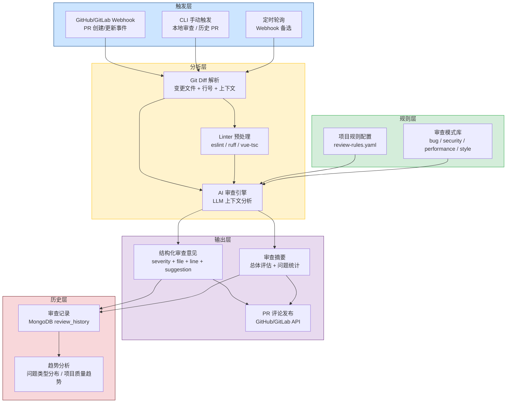
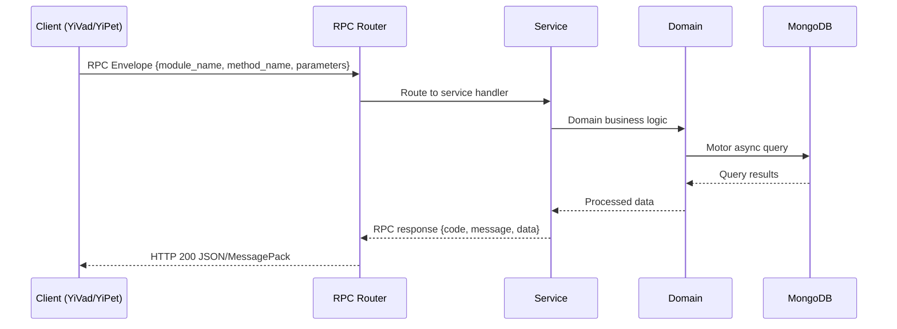

---

doc_type: module
prd_task_id: "YA-09-52"
title: "YA-09-52: AI 代码审查自动化 — LLM PR Review + GitHub 集成 — 开发方案"
status: 需求已编写
priority: P2
owner: 陈铭
roles: [engineer]
created: 2026-09-11
updated: 2026-09-14
project: YiAi
project_id: yiai
prd_month: "202609"
estimate_frontend: 2.0
source_prd: "165-需求-代码审查自动化.md"
source_okr: [yiai-001]

type: task
---

# YA-09-52: AI 代码审查自动化 — LLM PR Review + GitHub 集成

> **文档职责**：本文档定义**怎么做、为什么这么做、实际做成什么样**（HOW），不含产品目标与测试用例。

> 来源 PRD：[165-需求-代码审查自动化.md](../../prds/2026-09/165-需求-代码审查自动化.md)
> 需求编号：YA-09-52 · 优先级：P2 · 人天：2.0 · 状态：需求已编写
> 类型：功能 · 依赖：YA-09-03（Agent 循环）、YA-09-157（多 Agent 编排框架） · 前置需求：无

---

<a id="sec-1"></a>
## 一、架构概览 / Architecture Overview

YA-09-159: 代码审查自动化 — AI 驱动 PR 审查 + 多语言规则 + 严重度分级 + GitHub 集成



<a id="sec-2"></a>
## 二、文件清单 / File Manifest

| 文件 / File | 操作 | 说明 / Description |
|-------------|------|--------------------|
| `YiAi/src/services/xxx/service.py` | 新增 | Core service logic
| `YiAi/src/services/xxx/rpc_handler.py` | 新增 | RPC route handler
| `YiAi/tests/test_xxx.py` | 新增 | Unit tests

> Source PRD: 165-需求-代码审查自动化.md

<a id="sec-3"></a>
## 三、Python 签名与核心组件 / Python Signatures

### 3.1 核心组件

```python
from enum import Enum
from typing import Optional
from dataclasses import dataclass, field
from pathlib import Path
import yaml
class Severity(str, Enum):
    """审查意见严重度。"""
class ReviewCategory(str, Enum):
    """审查类别。"""
@dataclass
class ReviewRule:
    """单个审查规则。"""
@dataclass
class ProjectReviewConfig:
    """项目审查配置。"""
# 预定义审查规则
# 项目配置
def load_rules_from_yaml(project_name: str, yaml_path: str) -> ProjectReviewConfig:
    """从 YAML 文件加载自定义审查规则。"""
    if data.get("enabled_categories"):
```
### 3.2 组件 2

```python
import re
import subprocess
from pathlib import Path
from typing import Optional
from dataclasses import dataclass, field
from enum import Enum
class ChangeType(str, Enum):
    """变更类型。"""
@dataclass
class DiffHunk:
    """单个 diff hunk。"""
@dataclass
class FileChange:
    """文件变更。"""
@dataclass
class DiffResult:
    """Diff 解析结果。"""
class GitDiffParser:
    """Git Diff 解析器。
    """
    def __init__(self, repo_path: str = "."):
    def parse_diff(self, diff_text: str) -> DiffResult:
    def get_diff_from_git(
    def get_diff_from_pr(
        import requests
```
### 3.3 组件 3

```python
from typing import Optional
from dataclasses import dataclass, field
from shared.logging import get_logger
from services.code_review.rules import (
from services.code_review.diff_parser import FileChange, DiffResult, GitDiffParser
@dataclass
class ReviewComment:
    """审查意见。"""
@dataclass
class ReviewSummary:
    """审查摘要。"""
@dataclass
class ReviewResult:
    """审查结果。"""
class AIReviewer:
    """AI 代码审查引擎。
    """
## 项目信息
## 审查规则
## 审查标准
    def __init__(
    def _load_rules(self) -> list[ReviewRule]:
    async def review_diff(self, diff: DiffResult) -> ReviewResult:
        import uuid
        from datetime import datetime
```

<a id="sec-4"></a>
## 四、数据流 / Data Flow



**Call chain**: `Client -> RPC Router -> Service -> Domain -> MongoDB`  
**Response format**: `{code: 0, message: "ok", data: ...}`  
**Async model**: Full-chain `async/await`, Motor async MongoDB driver.  
**Error propagation**: Service exceptions caught by middleware -> standard error codes (1001-9999).

<a id="sec-5"></a>
## 五、实施路线图 / Roadmap

**预估人天 / Estimated**: 2.0

| 步骤 / Step | 操作 / Action | 路径 / Path | 验证 / Verification | 人天 / Days |
|-------------|---------------|-------------|---------------------|-------------|
| 1 | 定义审查规则和项目配置 | `rules.py` | 3 个项目配置正确，规则加载正常 | 0.08 |
| 2 | 实现 Git Diff 解析器 | `diff_parser.py` | 能正确解析 diff 输出，提取变更行和上下文 | 0.08 |
| 3 | 实现 Linter 集成（eslint + ruff） | `diff_parser.py` | 能运行项目 Linter 并获取结果 | 0.06 |
| 4 | 实现 AI 审查引擎（prompt 构建 + LLM 调用 + 结果解析） | `ai_reviewer.py` | 能生成结构化审查意见，JSON 解析正确 | 0.12 |
| 5 | 实现审查历史和趋势分析 | `review_history.py` | 记录能正确保存和查询，趋势计算正确 | 0.06 |
| 6 | 实现 RPC 端点和 Webhook 处理 | `review_routes.py` | API 调用正常，Webhook 能触发审查 | 0.07 |
| 7 | 编写测试用例 | `tests/` | 测试覆盖 diff 解析、规则匹配、AI 审查流程 | 0.03 |
| 风险 | 概率 | 影响 | 等级 | 缓解措施 | 应急预案 |
| AI 审查误报率过高 | 中 | 中 | 中 | 人工审查者确认 AI 意见，可标记为误报；配置严重度阈值 | 降低 AI 审查严重度，仅作为建议 |
| 大 PR diff 超出 LLM 上下文限制 | 中 | 中 | 中 | 分批审查（每批 3 个文件），超过限制的文件跳过 | 对大 PR 仅审查关键文件（如非测试文件） |
| LLM 响应格式不符合预期 | 中 | 中 | 中 | JSON 解析容错，支持从文本中提取 JSON | 返回空审查结果，记录错误日志 |
| Linter 运行失败（未安装或配置错误） | 低 | 低 | 低 | Linter 失败不阻塞 AI 审查，仅记录警告 | 手动运行 Linter |

<a id="sec-6"></a>
## 六、代码审查检查清单 / Review Checklist

- [ ] `ProjectReviewConfig` 包含 3 个项目的完整配置（YiVad, YiPet, YiAi）
- [ ] `DEFAULT_RULES` 包含 TypeScript、Python、Vue 三种语言的规则
- [ ] 每条规则定义了 `id`、`category`、`severity`、`language`、`description`
- [ ] `GitDiffParser` 能正确解析 `diff --git`、`@@ hunk @@`、文件变更
- [ ] `get_changed_lines_with_context` 正确标注每行的类型（added/deleted/context）
- [ ] `_detect_language` 根据文件扩展名正确识别语言
- [ ] `_run_linter` 对 TypeScript 运行 eslint，对 Python 运行 ruff，失败不抛异常
- [ ] `AIReviewer.REVIEW_PROMPT_TEMPLATE` 包含项目信息、审查规则、Linter 结果、代码变更
- [ ] `_parse_review_response` 对 JSON 解析失败有容错处理
- [ ] `_filter_files` 过滤忽略模式、不支持的语言、删除的文件、过大的文件
- [ ] `_generate_summary` 正确计算总体评估（approved/needs_work/requires_changes）
- [ ] `ReviewHistory` 的 `get_trend_analysis` 支持每日趋势和评估分布
- [ ] Webhook 端点验证签名，防止伪造请求
- [ ] `ruff` 代码规范通过
- [ ] `mypy` 类型检查通过
---
## 回归问题预测
| # | 问题 | 发现场景 | 根因 | 修复方式 |

<a id="sec-7"></a>
## 七、风险表 / Risk Table

| 风险 / Risk | 影响 / Impact | 缓解措施 / Mitigation | 应急预案 / Contingency |
|-------------|---------------|----------------------|------------------------|
| AI 审查误报率过高 | 中 | 中 | 中 |
| 大 PR diff 超出 LLM 上下文限制 | 中 | 中 | 中 |
| LLM 响应格式不符合预期 | 中 | 中 | 中 |
| Linter 运行失败（未安装或配置错误） | 低 | 低 | 低 |
| Webhook 认证失败 | 低 | 高 | 中 |
| 审查历史集合过大 | 低 | 低 | 低 |
| 场景 | 回滚方式 | 回滚时间 | 风险 |
| 审查结果误报率高 | 调整配置 `AUTO_REVIEW_STRICTNESS=low` 降低严重度 | < 1min | 低：仅影响审查意见 |
| AI 审查服务不可用 | 关闭自动审查 `AUTO_REVIEW_ENABLED=false` | < 1min | 低：恢复人工审查 |
| Webhook 处理异常 | 切换到定时轮询模式 | < 1min | 低：审查延迟增加 |
