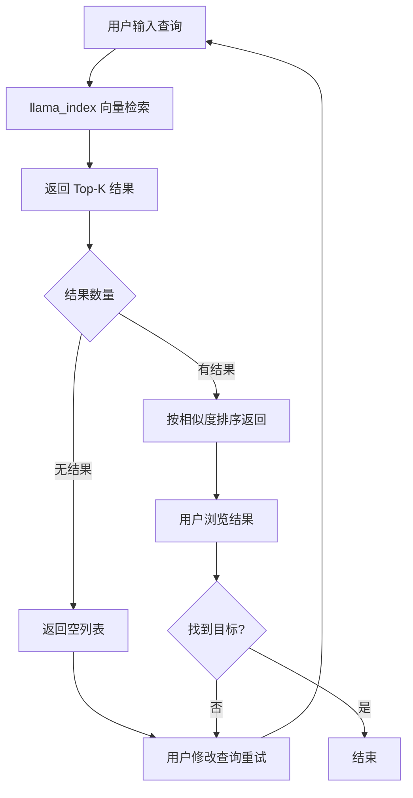
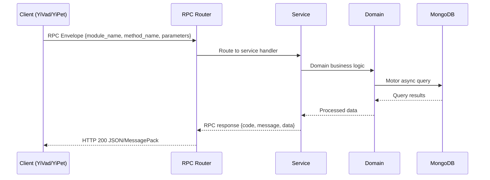

---

doc_type: module
prd_task_id: "YA-09-160"
title: "YA-09-160: 语义搜索增强 — 混合检索与智能排序 — 开发任务"
status: 需求已编写
priority: P2
owner: 陈铭
roles: [engineer]
created: 2026-09-11
updated: 2026-09-11
project: YiAi
project_id: yiai
prd_month: "202609"
estimate_frontend: 0.5
source_prd: "166-需求-语义搜索增强.md"
source_okr: [yiai-002]

type: task
---

# YA-09-160: 语义搜索增强 — 混合检索与智能排序

> **文档职责**：本文档定义**怎么做、为什么这么做、实际做成什么样**（HOW），不含产品目标与测试用例。

> 来源 PRD：[166-需求-语义搜索增强.md](../../prds/2026-09/166-需求-语义搜索增强.md)
> 需求编号：YA-09-160 · 优先级：P2 · 人天：0.5 · 状态：需求已编写
> 类型：功能 · 依赖：YA-09-11（ModelRuntime 抽象层）· 前置需求：无

---

<a id="sec-1"></a>
## 一、架构概览 / Architecture Overview

YA-09-160: 语义搜索增强 — 混合检索与智能排序



<a id="sec-2"></a>
## 二、文件清单 / File Manifest

| 文件 / File | 操作 | 说明 / Description |
|-------------|------|--------------------|
| `YiAi/src/services/xxx/service.py` | 新增 | Core service logic
| `YiAi/src/services/xxx/rpc_handler.py` | 新增 | RPC route handler
| `YiAi/tests/test_xxx.py` | 新增 | Unit tests

> Source PRD: 166-需求-语义搜索增强.md

<a id="sec-3"></a>
## 三、Python 签名与核心组件 / Python Signatures

### 3.1 核心组件

```python
from dataclasses import dataclass, field
from typing import Optional
from enum import Enum
import numpy as np
class QueryIntent(Enum):
class SearchStrategy(Enum):
@dataclass
class SearchResult:
@dataclass
class FacetCount:
@dataclass
class SearchResponse:
class HybridSearchEngine:
    """混合检索引擎"""
    def __init__(
        self.semantic = semantic_retriever
        self.keyword = keyword_retriever
        self.expander = query_expander
        self.intent = intent_classifier
        self.spell = spell_checker
    async def search(self, query: str, user_id: Optional[str] = None,
        import time
    def _rrf_fusion(self, semantic: list, keyword: list, k: int = 60) -> list[SearchResult]:
    async def _related_searches(self, query: str, results: list) -> list[str]:
        from collections import Counter
```
### 3.2 组件 2

```python
from dataclasses import dataclass, field
from typing import Optional
@dataclass
class ExpansionConfig:
class QueryExpander:
    """查询扩展服务"""
    # 内置中文同义词词典
    def __init__(self, config: ExpansionConfig = None, llm_service=None):
        self.config = config or ExpansionConfig()
        self.llm_service = llm_service
        self.synonyms = dict(self.DEFAULT_SYNONYMS)
        self._load_custom_synonyms()
    def _load_custom_synonyms(self):
        """加载自定义同义词词典"""
        import json
        from pathlib import Path
        if path.exists():
            self.synonyms.update(custom)
    def expand(self, query: str) -> list[str]:
        """扩展查询词"""
    async def expand_with_llm(self, query: str) -> list[str]:
```
### 3.3 组件 3

```python
import re
from typing import Optional
class QueryIntentClassifier:
    """查询意图分类器"""
    # 意图识别规则
    def classify(self, query: str) -> str:
        """基于规则 + LLM 的意图分类"""
            if re.search(pattern, query_lower):
                return "factual"
            if re.search(pattern, query_lower):
                return "comparative"
            if re.search(pattern, query_lower):
                return "procedural"
            if re.search(pattern, query_lower):
                return "conceptual"
        return "conceptual"  # 默认概念型
    async def classify_with_llm(self, query: str, llm_service) -> dict:
        """使用 LLM 进行细粒度意图分类"""
        import json
        return json.loads(result)
```

<a id="sec-4"></a>
## 四、数据流 / Data Flow



**Call chain**: `Client -> RPC Router -> Service -> Domain -> MongoDB`  
**Response format**: `{code: 0, message: "ok", data: ...}`  
**Async model**: Full-chain `async/await`, Motor async MongoDB driver.  
**Error propagation**: Service exceptions caught by middleware -> standard error codes (1001-9999).

<a id="sec-5"></a>
## 五、实施路线图 / Roadmap

**预估人天 / Estimated**: 0.5

| 步骤 / Step | 操作 / Action | 路径 / Path | 验证 / Verification | 人天 / Days |
|-------------|---------------|-------------|---------------------|-------------|
| 1 | 实现 SpellCorrector 拼写纠错 | 常见拼写错误可正确纠正 | 0.05 |
| 2 | 实现 QueryExpander 查询扩展 | 同义词/缩写可正确扩展 | 0.05 |
| 3 | 实现 QueryIntentClassifier 意图分类 | 各类查询意图正确识别 | 0.05 |
| 4 | 实现 HybridSearchEngine RRF 融合 | 语义+关键词结果正确融合 | 0.1 |
| 5 | 实现 PersonalRanker 个性化排序 | 不同角色用户排序有差异 | 0.05 |
| 6 | 实现 FacetAggregator 分面聚合 | 分面计数正确 | 0.05 |
| 7 | 实现 ResultClusterEngine 结果聚类 | 相似结果正确聚类 | 0.05 |
| 8 | 实现零结果处理策略 | 无结果时给出替代建议 | 0.05 |
| 9 | 集成到 RAG Service | 搜索 API 返回增强结果 | 0.05 |
| 风险 | 概率 | 影响 | 缓解措施 |
| 混合检索延迟增加 | 高 | 中 | 并行检索 + 缓存查询扩展结果 |
| RRF 融合效果不如预期 | 中 | 中 | 保留可配置切换到加权求和 |

<a id="sec-6"></a>
## 六、代码审查检查清单 / Review Checklist

- [ ] RRF 融合公式正确（k=60，1/(k+rank+1)）
- [ ] 语义检索和关键词检索并行执行（asyncio.gather）
- [ ] 拼写纠错前检查原始查询是否在词典中，避免误纠
- [ ] 查询扩展结果去重，不包含原查询中的词
- [ ] 个性化排序有角色兜底（默认角色=engineer）
- [ ] 分面聚合限制计算范围（Top-200）
- [ ] 结果聚类在文档数 < 5 时降级为简单分组
- [ ] 零结果时返回替代建议而非空列表
- [ ] 搜索延迟有超时控制（3s）
- [ ] 所有搜索组件有独立的单元测试
---
## 回归问题预测
| # | 预测问题 | 原因 | 验证方法 |
|---|---------|------|---------|
| 1 | RRF 融合后某些文档排名异常 | 语义和关键词排名差异过大 | 对比单独语义/关键词排名和融合排名 |
| 2 | 中文分词导致关键词检索遗漏 | jieba 分词将复合词拆分 | 测试复合词查询（如"知识图谱"）的召回率 |
| 3 | 拼写纠错将正确词误纠 | 词典包含与正确词相似的模式 | 在正常查询上验证纠错不触发 |
| 4 | 个性化排序在新用户上退化 | 空历史的 boost 计算为 0 | 验证新用户角色预设权重生效 |

<a id="sec-7"></a>
## 七、风险表 / Risk Table

| 风险 / Risk | 影响 / Impact | 缓解措施 / Mitigation | 应急预案 / Contingency |
|-------------|---------------|----------------------|------------------------|
| 混合检索延迟增加 | 高 | 中 | 并行检索 + 缓存查询扩展结果 |
| RRF 融合效果不如预期 | 中 | 中 | 保留可配置切换到加权求和 |
| 中文拼写纠错误判 | 中 | 中 | 仅纠正高频错误，展示"您是不是要找"建议 |
| 个性化排序冷启动 | 高 | 低 | 角色预设偏好兜底，新用户不显示个性化差异 |
| 分面聚合在大数据集上慢 | 低 | 中 | 限制聚合的文档数为 Top-200 |
| 查询扩展 LLM 调用超时 | 低 | 中 | 词典优先，LLM 异步缓存，超时降级 |
| # | 预测问题 | 原因 | 验证方法 |
| 1 | RRF 融合后某些文档排名异常 | 语义和关键词排名差异过大 | 对比单独语义/关键词排名和融合排名 |
| 2 | 中文分词导致关键词检索遗漏 | jieba 分词将复合词拆分 | 测试复合词查询（如"知识图谱"）的召回率 |
| 3 | 拼写纠错将正确词误纠 | 词典包含与正确词相似的模式 | 在正常查询上验证纠错不触发 |
