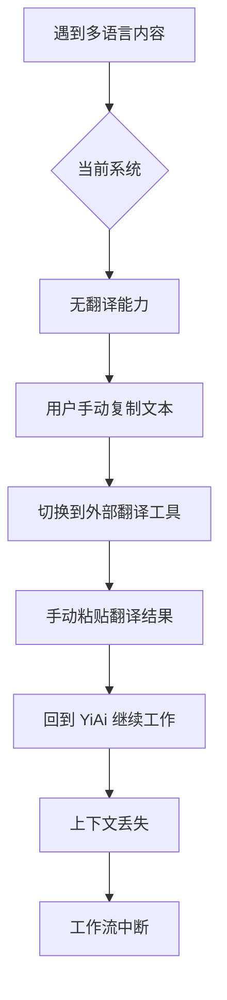
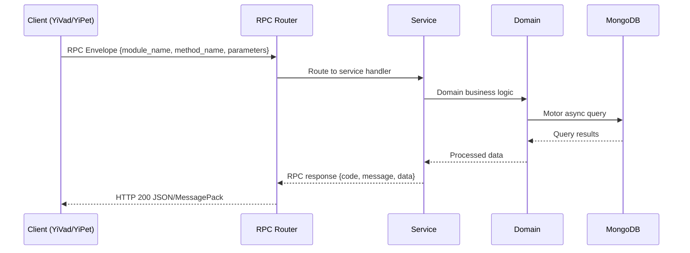

---

doc_type: module
prd_task_id: "YA-09-105"
title: "YA-09-105: LLM 实时翻译服务 — 多语言翻译 + 领域术语 — 开发方案"
status: 需求已编写
priority: P2
owner: 陈铭
roles: [engineer]
created: 2026-09-11
updated: 2026-09-14
project: YiAi
project_id: yiai
prd_month: "202609"
estimate_frontend: 0.5
source_prd: "167-需求-实时翻译服务.md"
source_okr: [yiai-002]

type: task
---

# YA-09-105: LLM 实时翻译服务 — 多语言翻译 + 领域术语

> **文档职责**：本文档定义**怎么做、为什么这么做、实际做成什么样**（HOW），不含产品目标与测试用例。

> 来源 PRD：[167-需求-实时翻译服务.md](../../prds/2026-09/167-需求-实时翻译服务.md)
> 需求编号：YA-09-105 · 优先级：P2 · 人天：0.5 · 状态：需求已编写
> 类型：功能 · 依赖：YA-09-11（ModelRuntime 抽象层）· 前置需求：无

---

<a id="sec-1"></a>
## 一、架构概览 / Architecture Overview

YA-09-161: 实时翻译服务 — 基于 LLM 的多语言翻译



<a id="sec-2"></a>
## 二、文件清单 / File Manifest

| 文件 / File | 操作 | 说明 / Description |
|-------------|------|--------------------|
| `YiAi/src/services/xxx/service.py` | 新增 | Core service logic
| `YiAi/src/services/xxx/rpc_handler.py` | 新增 | RPC route handler
| `YiAi/tests/test_xxx.py` | 新增 | Unit tests

> Source PRD: 167-需求-实时翻译服务.md

<a id="sec-3"></a>
## 三、Python 签名与核心组件 / Python Signatures

### 3.1 核心组件

```python
from dataclasses import dataclass, field
from enum import Enum
from typing import Optional, AsyncIterator
import hashlib
import json
import time
class Language(Enum):
class TranslationMode(Enum):
@dataclass
class TranslationRequest:
@dataclass
class TranslationResult:
class TranslationService:
    """翻译服务 — 基于 LLM 的多语言翻译"""
    def __init__(self, llm_service, lang_detector, translation_cache, glossary_manager):
        self.llm_service = llm_service
        self.lang_detector = lang_detector
        self.cache = translation_cache
        self.glossary = glossary_manager
    async def translate(self, request: TranslationRequest) -> TranslationResult:
    async def translate_streaming(self, request: TranslationRequest) -> AsyncIterator[str]:
    async def batch_translate(self, texts: list[str], source_lang: Language,
    def _build_prompt(self, text: str, source_lang: str, target_lang: str,
    def _cache_key(self, text: str, source_lang: str, target_lang: str) -> str:
    def _post_process(self, text: str, source_lang: str, target_lang: str) -> str:
```
### 3.2 组件 2

```python
import re
from typing import Optional
class LanguageDetector:
    """语言检测服务 — 基于字符集 + langdetect"""
    # 字符集范围
    def __init__(self):
        self._try_load_langdetect()
    def _try_load_langdetect(self):
        """尝试加载 langdetect 库"""
            from langdetect import detect, DetectorFactory
            self._langdetect = detect
            self._has_langdetect = True
            self._langdetect = None
            self._has_langdetect = False
    def detect(self, text: str) -> tuple[str, float]:
        """检测文本语言，返回 (语言代码, 置信度)"""
        if not text or not text.strip():
            return "en", 0.0
        # Step 1: 字符集分析
        if char_based[1] > 0.8:
    def _detect_by_chars(self, text: str) -> tuple[str, float]:
```
### 3.3 组件 3

```python
from dataclasses import dataclass
from datetime import datetime, timedelta
from pathlib import Path
import json
import time
@dataclass
class CacheConfig:
class TranslationCache:
    """翻译记忆缓存 — 精确匹配 + TTL 管理"""
    def __init__(self, config: CacheConfig = None):
        self.config = config or CacheConfig()
        self.cache_dir = Path(self.config.cache_dir)
        self.cache_dir.mkdir(parents=True, exist_ok=True)
        self._index: dict[str, dict] = {}
        self._load_index()
    def get(self, key: str) -> Optional[dict]:
        """获取缓存的翻译"""
        if key not in self._index:
            return None
        if not cache_path.exists():
    def set(self, key: str, data: dict):
    def _load_index(self):
    def _save_index(self):
    def _evict_oldest(self):
    def stats(self) -> dict:
```

<a id="sec-4"></a>
## 四、数据流 / Data Flow



**Call chain**: `Client -> RPC Router -> Service -> Domain -> MongoDB`  
**Response format**: `{code: 0, message: "ok", data: ...}`  
**Async model**: Full-chain `async/await`, Motor async MongoDB driver.  
**Error propagation**: Service exceptions caught by middleware -> standard error codes (1001-9999).

<a id="sec-5"></a>
## 五、实施路线图 / Roadmap

**预估人天 / Estimated**: 0.5

| 步骤 / Step | 操作 / Action | 路径 / Path | 验证 / Verification | 人天 / Days |
|-------------|---------------|-------------|---------------------|-------------|
| 1 | 实现 LanguageDetector 语言检测 | 中/英/日文本检测正确 | 0.05 |
| 2 | 实现 TranslationService 翻译核心 | zh↔en 翻译质量可接受 | 0.1 |
| 3 | 实现 TranslationCache 翻译记忆 | 缓存命中/过期/淘汰正确 | 0.05 |
| 4 | 实现 GlossaryManager 术语管理 | 术语表加载和覆盖生效 | 0.05 |
| 5 | 实现流式翻译 SSE 输出 | SSE 逐词输出正常 | 0.1 |
| 6 | 实现批量翻译 | 文档段落批量翻译正确 | 0.05 |
| 7 | 实现翻译质量评分 | 回译验证 + LLM 自评 | 0.05 |
| 8 | 添加翻译 API 端点 | POST /translate 正常响应 | 0.05 |
| 风险 | 概率 | 影响 | 缓解措施 |
| LLM 翻译质量低于专用引擎 | 中 | 中 | 术语表增强 + 可配置外部 API 兜底 |
| 语言检测对短文本不准确 | 中 | 低 | 置信度阈值 + 允许用户手动指定语言 |
| 翻译记忆缓存膨胀 | 中 | 中 | TTL 90 天 + 最大条目限制 + LRU 淘汰 |

<a id="sec-6"></a>
## 六、代码审查检查清单 / Review Checklist

- [ ] 翻译 prompt 包含语言对和术语表指令
- [ ] 语言检测支持 AUTO 模式和手动指定
- [ ] 翻译记忆缓存有 TTL 和容量限制
- [ ] 缓存 key 包含源语言和目标语言信息
- [ ] 流式翻译使用 AsyncIterator 正确释放资源
- [ ] 批量翻译不会因单条失败而中断全部
- [ ] 术语表加载失败时降级为无术语表翻译
- [ ] 翻译后处理修复中英文混排空格
- [ ] 翻译历史记录不包含敏感内容
- [ ] 所有语言对有对应的 prompt 模板
---
## 回归问题预测
| # | 预测问题 | 原因 | 验证方法 |
|---|---------|------|---------|
| 1 | 日文翻译质量明显低于中英翻译 | LLM 对日文训练数据较少 | 对比中英和日文翻译质量评分 |
| 2 | 翻译记忆缓存 key 冲突 | SHA256 碰撞（概率极低） | 缓存 key 追加语言对信息 |
| 3 | 长文本翻译 LLM 截断 | 超出上下文窗口 | 自动分段翻译 + 拼接 |
| 4 | 语言检测对混合语言文本误判 | 中英混排时字符集分析偏向中文 | 添加混合语言检测逻辑 |

<a id="sec-7"></a>
## 七、风险表 / Risk Table

| 风险 / Risk | 影响 / Impact | 缓解措施 / Mitigation | 应急预案 / Contingency |
|-------------|---------------|----------------------|------------------------|
| LLM 翻译质量低于专用引擎 | 中 | 中 | 术语表增强 + 可配置外部 API 兜底 |
| 语言检测对短文本不准确 | 中 | 低 | 置信度阈值 + 允许用户手动指定语言 |
| 翻译记忆缓存膨胀 | 中 | 中 | TTL 90 天 + 最大条目限制 + LRU 淘汰 |
| 流式翻译 SSE 连接中断 | 低 | 中 | 自动重连 + 断点续传 |
| 术语表冲突 | 低 | 低 | 优先级：用户自定义 > 领域 > 默认 |
| 批量翻译 LLM 超时 | 中 | 中 | 分段翻译 + 失败重试 3 次 |
| # | 预测问题 | 原因 | 验证方法 |
| 1 | 日文翻译质量明显低于中英翻译 | LLM 对日文训练数据较少 | 对比中英和日文翻译质量评分 |
| 2 | 翻译记忆缓存 key 冲突 | SHA256 碰撞（概率极低） | 缓存 key 追加语言对信息 |
| 3 | 长文本翻译 LLM 截断 | 超出上下文窗口 | 自动分段翻译 + 拼接 |
