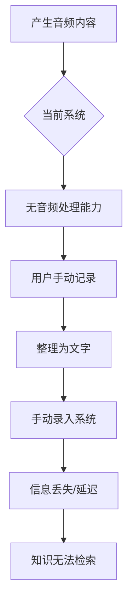
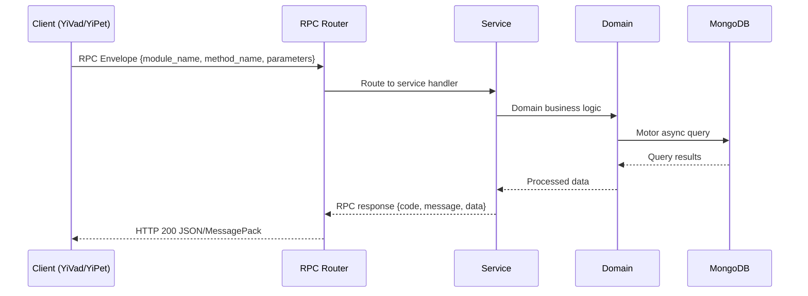

---

doc_type: module
prd_task_id: "YA-09-128"
title: "YA-09-128: 音频转录 — Whisper 集成 + 会议记录 — 开发方案"
status: 需求已编写
priority: P2
owner: 陈铭
roles: [engineer]
created: 2026-09-11
updated: 2026-09-14
project: YiAi
project_id: yiai
prd_month: "202609"
estimate_frontend: 0.5
source_prd: "168-需求-音频转录与处理.md"
source_okr: [yiai-002]

type: task
---

# YA-09-128: 音频转录 — Whisper 集成 + 会议记录

> **文档职责**：本文档定义**怎么做、为什么这么做、实际做成什么样**（HOW），不含产品目标与测试用例。

> 来源 PRD：[168-需求-音频转录与处理.md](../../prds/2026-09/168-需求-音频转录与处理.md)
> 需求编号：YA-09-128 · 优先级：P2 · 人天：0.5 · 状态：需求已编写
> 类型：功能 · 依赖：YA-09-11（ModelRuntime 抽象层）· 前置需求：无

---

<a id="sec-1"></a>
## 一、架构概览 / Architecture Overview

YA-09-162: 音频转录与处理 — Whisper 集成与会议记录



<a id="sec-2"></a>
## 二、文件清单 / File Manifest

| 文件 / File | 操作 | 说明 / Description |
|-------------|------|--------------------|
| `YiAi/src/services/xxx/service.py` | 新增 | Core service logic
| `YiAi/src/services/xxx/rpc_handler.py` | 新增 | RPC route handler
| `YiAi/tests/test_xxx.py` | 新增 | Unit tests

> Source PRD: 168-需求-音频转录与处理.md

<a id="sec-3"></a>
## 三、Python 签名与核心组件 / Python Signatures

### 3.1 核心组件

```python
from dataclasses import dataclass, field
from enum import Enum
from pathlib import Path
from typing import Optional, AsyncIterator
import json
import time
import tempfile
import subprocess
class AudioFormat(Enum):
class TranscriptionMode(Enum):
class ExportFormat(Enum):
@dataclass
class AudioSegment:
@dataclass
class TranscriptionRequest:
@dataclass
class TranscriptionResult:
class TranscriptionService:
    """音频转录服务 — 基于 Whisper 的语音识别"""
    def __init__(self, whisper_model_path: str = None, device: str = "auto"):
    def _load_model(self, model_size: str = "medium"):
            from faster_whisper import WhisperModel
            import whisper
    def validate_audio(self, file_data: bytes, filename: str) -> tuple[bool, str, dict]:
    async def transcribe(self, request: TranscriptionRequest) -> TranscriptionResult:
```
### 3.2 组件 2

```python
from dataclasses import dataclass
from typing import Optional
@dataclass
class AudioSearchResult:
class AudioSearchService:
    """音频搜索服务 — 转录后语义搜索"""
    def __init__(self, transcription_service, semantic_search, data_service):
        self.transcription = transcription_service
        self.semantic_search = semantic_search
        self.data_service = data_service
    async def search_audio(self, audio_path: str, query: str,
        """搜索音频内容：先转录，再语义搜索"""
        # Step 1: 转录音频
        from transcription_service import TranscriptionRequest, TranscriptionMode
        # Step 2: 在转录文本中语义搜索
        # Step 3: 构建搜索结果
        return audio_results
    async def index_audio(self, audio_path: str, metadata: dict = None) -> str:
        """将音频转录结果索引到知识库"""
        # 存储转录结果到 MongoDB
```
### 3.3 组件 3

```python
from dataclasses import dataclass, field
from typing import Optional
@dataclass
class MeetingNotes:
class MeetingNotesService:
    """会议记录服务 — 转录 + AI 摘要 + 行动项提取"""
    def __init__(self, transcription_service, llm_service):
        self.transcription = transcription_service
        self.llm_service = llm_service
    async def generate_meeting_notes(self, audio_path: str, title: str = "",
        """从会议录音生成会议记录"""
        # Step 1: 转录
        from transcription_service import TranscriptionRequest
        # Step 2: AI 摘要
        # Step 3: 提取行动项
        # Step 4: 提取关键点
        # Step 5: 提取参与者
        return MeetingNotes(
    async def _generate_summary(self, transcript: str) -> str:
        """生成会议摘要"""
    async def _extract_action_items(self, transcript: str) -> list[dict]:
            import json
    async def _extract_key_points(self, transcript: str) -> list[str]:
```

<a id="sec-4"></a>
## 四、数据流 / Data Flow



**Call chain**: `Client -> RPC Router -> Service -> Domain -> MongoDB`  
**Response format**: `{code: 0, message: "ok", data: ...}`  
**Async model**: Full-chain `async/await`, Motor async MongoDB driver.  
**Error propagation**: Service exceptions caught by middleware -> standard error codes (1001-9999).

<a id="sec-5"></a>
## 五、实施路线图 / Roadmap

**预估人天 / Estimated**: 0.5

| 步骤 / Step | 操作 / Action | 路径 / Path | 验证 / Verification | 人天 / Days |
|-------------|---------------|-------------|---------------------|-------------|
| 1 | 安装 faster-whisper + soundfile 依赖 | 模型可加载，WAV 文件可解码 | 0.05 |
| 2 | 实现音频格式验证和解码 | 各格式音频正确解码为 16kHz 单声道 | 0.05 |
| 3 | 实现 TranscriptionService 文件转录 | MP3 文件转录文本可读 | 0.1 |
| 4 | 实现 VAD 分段和长音频处理 | > 1 小时音频正确分段转录 | 0.05 |
| 5 | 实现字幕导出（SRT/VTT/Markdown） | 导出格式在播放器中正确显示 | 0.05 |
| 6 | 实现说话人分离（简易版） | 不同说话人段落正确标注 | 0.05 |
| 7 | 实现 MeetingNotes 会议记录 | 转录 → 摘要 → 行动项链路正常 | 0.05 |
| 8 | 实现 AudioSearch 音频搜索 | 转录后搜索返回正确结果 | 0.05 |
| 9 | 实现 WebSocket 实时转录 | 实时音频流逐段返回转录结果 | 0.05 |
| 风险 | 概率 | 影响 | 缓解措施 |
| Whisper 模型下载失败 | 中 | 高 | 预下载模型到本地，提供离线安装包 |
| 中文转录准确率低 | 中 | 中 | 使用 large-v3 模型 + 专业术语后处理 |

<a id="sec-6"></a>
## 六、代码审查检查清单 / Review Checklist

- [ ] 音频格式验证覆盖所有声明格式（WAV/MP3/OGG/FLAC/M4A/WebM）
- [ ] 大文件（> 500MB）在上传阶段即被拒绝
- [ ] VAD 分段包含最短段检查（> 300ms 避免空段）
- [ ] 长音频分段转录后正确合并时间戳
- [ ] 字幕导出格式符合 SRT/VTT 规范
- [ ] 说话人分离在无停顿时所有段归属同一说话人
- [ ] 实时转录 WebSocket 连接有超时和心跳检测
- [ ] 临时音频文件在使用后自动清理
- [ ] Whisper 模型支持懒加载，首次使用时才加载到内存
- [ ] 音频文件不记录到普通日志中（隐私保护）
---
## 回归问题预测
| # | 预测问题 | 原因 | 验证方法 |
|---|---------|------|---------|
| 1 | 多声道音频转录混乱 | 多声道未正确混合为单声道 | 使用立体声文件验证转录结果 |
| 2 | VAD 分段在连续说话时失效 | 能量检测无法区分连续语音中的停顿 | 测试连续说话无停顿的音频 |
| 3 | 转录结果中数字和专有名词错误 | Whisper 对数字和专有名词的识别率低 | 对比转录结果和原文 |
| 4 | 实时转录延迟累积 | 缓冲区未及时清理导致延迟增加 | 监控实时转录端到端延迟 |

<a id="sec-7"></a>
## 七、风险表 / Risk Table

| 风险 / Risk | 影响 / Impact | 缓解措施 / Mitigation | 应急预案 / Contingency |
|-------------|---------------|----------------------|------------------------|
| Whisper 模型下载失败 | 中 | 高 | 预下载模型到本地，提供离线安装包 |
| 中文转录准确率低 | 中 | 中 | 使用 large-v3 模型 + 专业术语后处理 |
| 大文件转录内存溢出 | 中 | 高 | VAD 分段限制每段 30 秒 + 流式处理 |
| 音频格式解码失败 | 中 | 中 | 支持 ffmpeg 降级转换，记录不支持格式 |
| 实时转录延迟过高 | 中 | 中 | 使用 small 模型，降低 VAD 敏感度 |
| 说话人分离准确率低 | 高 | 低 | 标记为"实验性"功能，后续集成专业方案 |
| # | 预测问题 | 原因 | 验证方法 |
| 1 | 多声道音频转录混乱 | 多声道未正确混合为单声道 | 使用立体声文件验证转录结果 |
| 2 | VAD 分段在连续说话时失效 | 能量检测无法区分连续语音中的停顿 | 测试连续说话无停顿的音频 |
| 3 | 转录结果中数字和专有名词错误 | Whisper 对数字和专有名词的识别率低 | 对比转录结果和原文 |
