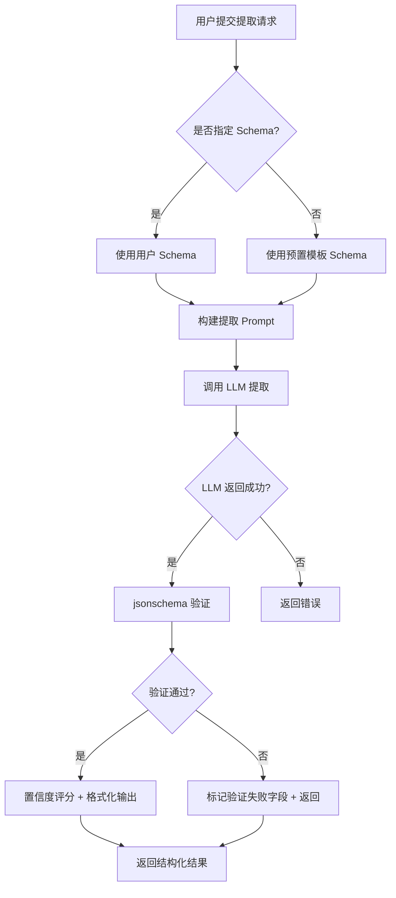
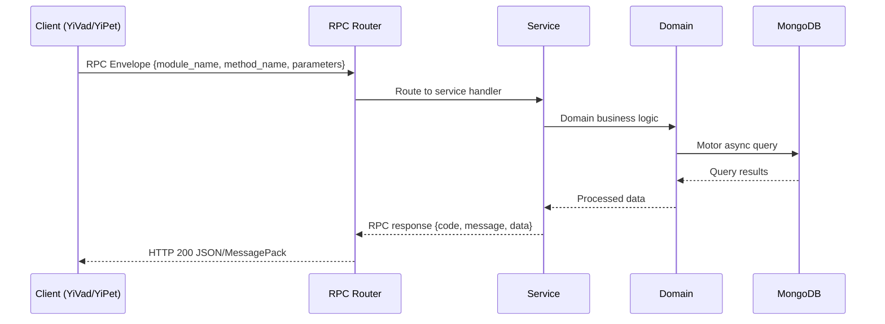

---

doc_type: module
prd_task_id: "YA-09-62"
title: "YA-09-62: 结构化数据提取 — LLM 从非结构化文本抽取实体 — 开发方案"
status: 需求已编写
priority: P2
owner: 陈铭
roles: [engineer]
created: 2026-09-11
updated: 2026-09-14
project: YiAi
project_id: yiai
prd_month: "202609"
estimate_frontend: 1.0
source_prd: "169-需求-结构化数据提取.md"
source_okr: [yiai-002]

type: task
---

# YA-09-62: 结构化数据提取 — LLM 从非结构化文本抽取实体

> **文档职责**：本文档定义**怎么做、为什么这么做、实际做成什么样**（HOW），不含产品目标与测试用例。

> 来源 PRD：[169-需求-结构化数据提取.md](../../prds/2026-09/169-需求-结构化数据提取.md)
> 需求编号：YA-09-62 · 优先级：P2 · 人天：1.0 · 状态：需求已编写
> 类型：功能 · 依赖：AI 聊天服务（chat_service）、ModelRuntime 抽象层

---

<a id="sec-1"></a>
## 一、架构概览 / Architecture Overview

YA-09-163: 结构化数据提取 — LLM 驱动的非结构化文本信息抽取



<a id="sec-2"></a>
## 二、文件清单 / File Manifest

| 文件 / File | 操作 | 说明 / Description |
|-------------|------|--------------------|
| `YiAi/src/services/xxx/service.py` | 新增 | Core service logic
| `YiAi/src/services/xxx/rpc_handler.py` | 新增 | RPC route handler
| `YiAi/tests/test_xxx.py` | 新增 | Unit tests

> Source PRD: 169-需求-结构化数据提取.md

<a id="sec-3"></a>
## 三、Python 签名与核心组件 / Python Signatures

### 3.1 核心组件

```python
from enum import Enum
from pydantic import BaseModel, Field
class OutputFormat(str, Enum):
class ExtractedField(BaseModel):
class ExtractionResult(BaseModel):
class ExtractionTemplate(BaseModel):
```
### 3.2 组件 2

```python
class EntityType(str, Enum):
```
### 3.3 组件 3

```python
def build_extraction_prompt(
    """构建提取 prompt 消息列表。"""
## JSON Schema
```

<a id="sec-4"></a>
## 四、数据流 / Data Flow



**Call chain**: `Client -> RPC Router -> Service -> Domain -> MongoDB`  
**Response format**: `{code: 0, message: "ok", data: ...}`  
**Async model**: Full-chain `async/await`, Motor async MongoDB driver.  
**Error propagation**: Service exceptions caught by middleware -> standard error codes (1001-9999).

<a id="sec-5"></a>
## 五、实施路线图 / Roadmap

**预估人天 / Estimated**: 1.0

| 步骤 / Step | 操作 / Action | 路径 / Path | 验证 / Verification | 人天 / Days |
|-------------|---------------|-------------|---------------------|-------------|
| 1 | 定义数据模型（ExtractionResult、ExtractionTemplate、EntityType） | `domain/extraction/models.py` | 模型字段完整，Pydantic 校验通过 | 0.05 |
| 2 | 实现 Schema 校验器（validate_schema + validate_result） | `domain/extraction/schema_validator.py` | 合法 Schema 通过，非法 Schema 返回错误列表 | 0.05 |
| 3 | 实现提取 Prompt 构建器 | `domain/extraction/prompt_builder.py` | 构建的 prompt 包含 Schema 和文本，格式正确 | 0.05 |
| 4 | 实现预置模板库（5 个模板） | `domain/extraction/templates.py` | 模板 Schema 合法，prompt_template 完整 | 0.05 |
| 5 | 实现输出格式化器（JSON/CSV/YAML） | `domain/extraction/formatter.py` | 三种格式输出正确，字段完整 | 0.05 |
| 6 | 实现提取服务 RPC 接口（extract + batch_extract + list_templates） | `services/extraction/extraction_service.py` | 单文档提取、批量提取、模板列表查询正常 | 0.15 |
| 7 | 实现 SSE 流式提取路由 | `server/routes/extraction_routes.py` | 流式输出每个字段的提取结果 | 0.05 |
| 8 | 回归测试 | 全模块 | 所有模板正常提取，Schema 校验正确，格式化输出正确 | 0.05 |
| 风险 | 概率 | 影响 | 等级 | 缓解措施 | 应急预案 |
| LLM 输出格式不合法（非 JSON 或字段缺失） | 中 | 中 | 中 | System prompt 强调输出格式，增加 `_extract_json_from_text` 正则提取 | 降级为原始文本输出，标记 extraction_failed=true |
| Schema 过于复杂导致 LLM 理解错误 | 低 | 中 | 低 | 限制 Schema 层级最大 3 层，字段数最大 20 个 | 建议用户拆分 Schema 为多个简单提取 |
| 大文本超出 context window | 中 | 中 | 中 | 文本截断至 8000 字符，超过部分提示用户 | 实现分段提取 + 结果合并 |

<a id="sec-6"></a>
## 六、代码审查检查清单 / Review Checklist

- [ ] `ExtractionResult` 模型字段完整（fields、confidence、validation_errors、token_usage、duration_ms）
- [ ] Schema 校验器正确处理合法/非法 Schema
- [ ] 提取 prompt 明确要求 JSON 格式输出
- [ ] 文本截断至 8000 字符，防止 context window 溢出
- [ ] `_extract_json_from_text` 正则提取兜底解析 LLM 输出
- [ ] 5 个预置模板 Schema 完整，prompt_template 语义清晰
- [ ] 输出格式化器支持 JSON/CSV/YAML 三种格式
- [ ] 批量提取接口正确处理空文档列表
- [ ] 置信度评分范围为 0.0-1.0
- [ ] `ruff` 代码规范通过
- [ ] `mypy` 类型检查通过
---
## 十二、回归问题预测
| # | 问题 | 发现场景 | 根因 | 修复方式 |
|---|------|---------|------|---------|
| 1 | LLM 输出 JSON 中包含注释或尾逗号 | 模型 `qwen3.5` 在 JSON 输出中偶尔添加 `// comment` 注释 | `json.loads` 不支持注释和尾逗号 | 使用 `json5` 或正则清理注释后再解析 |
| 2 | 中文 Schema 字段名导致 LLM 输出英文 key | 用户定义 Schema 中使用中文 field_name，LLM 输出英文 key | System prompt 未明确要求保持字段名一致 | 在 prompt 中增加 "field_name must match exactly the property name in the schema" |

<a id="sec-7"></a>
## 七、风险表 / Risk Table

| 风险 / Risk | 影响 / Impact | 缓解措施 / Mitigation | 应急预案 / Contingency |
|-------------|---------------|----------------------|------------------------|
| LLM 输出格式不合法（非 JSON 或字段缺失） | 中 | 中 | 中 |
| Schema 过于复杂导致 LLM 理解错误 | 低 | 中 | 低 |
| 大文本超出 context window | 中 | 中 | 中 |
| 置信度评分不准确 | 低 | 低 | 低 |
| 用户自定义 Schema 包含注入风险 | 低 | 中 | 低 |
| 回滚场景 | 回滚方式 | 影响范围 | 恢复时间 |
| 提取服务导致 LLM 调用异常增加 | 移除 RPC 路由，停止 extraction_service 注册 | 结构化提取功能 | 5min |
| 模板 Schema 存在缺陷导致提取错误 | 下线问题模板，修复后重新上线 | 特定模板用户 | 10min |
| SSE 流式提取导致连接泄漏 | 关闭 SSE 路由，保留非流式 extract 接口 | 流式提取功能 | 5min |
| 指标 | 采集方式 | 告警阈值 | 说明 |
