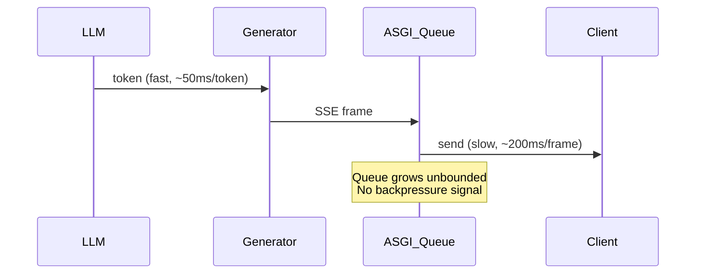

---

doc_type: module
prd_task_id: "YA-09-13"
title: "YA-09-13: SSE 流式背压控制 — 生产环境可靠性增强 — 开发方案"
status: 需求已编写
priority: P1
owner: 陈铭
roles: [engineer]
created: 2026-09-11
updated: 2026-09-23
project: YiAi
project_id: yiai
prd_month: "202609"
estimate_frontend: 3.0
source_prd: "17-需求-SSE流式背压控制与缓冲策略.md"
source_okr: [yiai-001]
related_tests: ["17-prd-test-SSE流式背压控制与缓冲策略"]
acceptance_criteria:
  - 慢客户端场景下 SSE 缓冲帧数 ≤ max_buffer (64)，内存占用不随连接时长线性增长
  - 客户端断开后 2s 内生成器协程被取消，不再消耗 LLM 推理资源
  - 100 并发 SSE 连接内存占用 < 512MB（对比修复前 > 500MB+ 峰值）
  - BackpressureStreamingResponse 可替换原生 StreamingResponse，API 兼容
  - Prometheus 指标正确采集活跃连接数、缓冲区使用率、客户端断开次数

type: task
---

# YA-09-13: SSE 流式背压控制 — 生产环境可靠性增强 — 开发方案

| 属性 | 值 |
|------|-----|
| 文档编号 | YA-09-13 |
| 版本 | v1.1 |
| 密级 | 内部 |
| 作者 | 陈铭 |
| 审核人 | — |
| 状态 | 需求已编写 |
| 最后更新 | 2026-09-23 |

> 来源 PRD：[17-需求-SSE流式背压控制与缓冲策略.md](../../prds/2026-09/17-需求-SSE流式背压控制与缓冲策略.md)
> 需求编号：YA-09-13 · 优先级：P1 · 人天：3.0d
> 测试规格：[17-prd-test-SSE流式背压控制与缓冲策略.md](../../tests/2026-09/17-prd-test-SSE流式背压控制与缓冲策略.md)

---

## 目录

1. [问题分析](#一问题分析)
2. [设计约束](#二设计约束)
3. [设计方案](#三设计方案)
4. [实施步骤](#四实施步骤)
5. [非功能性设计](#五非功能性设计)
6. [测试策略](#六测试策略)
7. [关联模块](#七关联模块)
8. [已知缺口与回滚](#八已知缺口与回滚)
附录 A. [变更记录](#附录-a-变更记录)

---

<a id="sec-1"></a>
## 一、问题分析

### 1.1 现状

YiAi 所有流式端点（`chat_stream`、`rag_chat_stream`、`agent_chat_stream`）使用 FastAPI `StreamingResponse` + `async generator`。当客户端消费速度低于服务端 LLM 推理生成速度时，ASGI 发送队列持续积压，导致：

1. **内存线性增长**：未发送的 SSE 帧堆积在 uvicorn 发送缓冲区
2. **无背压传播**：生成器不感知客户端消费速度，继续全速生成
3. **连接断开未检测**：客户端断连后生成器继续运行，浪费 LLM 推理资源
4. **OOM 风险**：100 并发 SSE 连接 × 每个缓冲 50KB = 5MB 基线，峰值可达 500MB+

### 1.2 触发场景

| 场景 | 生产者速度 | 消费者速度 | 风险 |
|------|-----------|-----------|------|
| 移动网络弱信号 | 正常 | 极慢 | 内存爆炸 |
| 前端渲染卡顿 | 正常 | 间歇停止 | 缓冲积压 |
| 客户端主动关闭标签页 | 正常 | 断开 | 资源浪费 |
| 100+ 并发连接 | 正常 | 正常 | 总内存超限 |

### 1.3 根因



---

<a id="sec-2"></a>
## 二、设计约束

| 约束项 | 说明 |
|--------|------|
| API 兼容 | `BackpressureStreamingResponse` 继承 `StreamingResponse`，调用方仅需替换类名，无需修改生成器逻辑 |
| 缓冲区上限 | `asyncio.Queue(maxsize=64)` 硬限制，单个连接最多缓冲 64 帧（约 16KB），防止单连接耗尽内存 |
| 客户端断开检测 | 依赖 ASGI `http.disconnect` 消息（Starlette/Uvicorn 原生支持），不引入额外心跳 |
| 分层超时 | chunk 30s（防止单帧卡死）+ client 300s（防止僵尸连接），互不干扰 |
| 错误不泄露 | 生成器内部异常仅记录日志 + 结束流，不向客户端暴露内部错误详情 |
| 可配置化 | max_buffer/chunk_timeout/client_timeout 通过 `config.yaml` 注入，支持环境差异化 |

---

<a id="sec-3"></a>
## 三、设计方案

### 2.1 核心组件：`BackpressureStreamingResponse`

```python
import asyncio
from starlette.responses import StreamingResponse
from starlette.types import Receive, Send
from typing import AsyncGenerator, Optional
import logging

logger = logging.getLogger(__name__)

class BackpressureStreamingResponse(StreamingResponse):
    """带背压控制的流式响应。
    
    生产者-消费者模式：生成器写入有界 Queue → ASGI 从 Queue 消费发送。
    Queue 满时生成器阻塞，实现自然背压。
    """
    
    def __init__(
        self,
        generator: AsyncGenerator,
        max_buffer: int = 64,
        chunk_timeout: float = 30.0,
        client_timeout: float = 300.0,
    ):
        self._generator = generator
        self._buffer: asyncio.Queue = asyncio.Queue(maxsize=max_buffer)
        self._chunk_timeout = chunk_timeout
        self._client_timeout = client_timeout
        self._client_disconnected = asyncio.Event()
        super().__init__(self._stream(), media_type="text/event-stream")
    
    async def _produce(self):
        """生产者协程：从生成器读取 → 写入有界 Queue."""
        try:
            async for chunk in self._generator:
                await asyncio.wait_for(
                    self._buffer.put(chunk),
                    timeout=self._chunk_timeout
                )  # Queue 满时阻塞，实现背压
            await self._buffer.put(None)  # 结束信号
        except asyncio.TimeoutError:
            logger.error("SSE chunk production timed out after %ss", self._chunk_timeout)
            await self._buffer.put(None)
        except Exception as e:
            logger.exception("SSE generator error: %s", e)
            await self._buffer.put(None)
    
    async def _stream(self):
        """流式生成器：从 Queue 消费 → yield SSE 帧."""
        produce_task = asyncio.create_task(self._produce())
        try:
            while True:
                try:
                    chunk = await asyncio.wait_for(
                        self._buffer.get(),
                        timeout=self._client_timeout
                    )
                except asyncio.TimeoutError:
                    logger.warning("SSE client timeout after %ss", self._client_timeout)
                    break
                
                if chunk is None:  # 正常结束
                    break
                
                yield chunk
        finally:
            # 确保生产者协程被取消
            if not produce_task.done():
                produce_task.cancel()
                try:
                    await produce_task
                except asyncio.CancelledError:
                    pass
    
    async def __call__(self, scope, receive, send):
        """重写以检测客户端断开."""
        original_send = send
        
        async def disconnect_aware_send(message):
            if message.get("type") == "http.disconnect":
                self._client_disconnected.set()
                logger.info("SSE client disconnected")
            await original_send(message)
        
        await super().__call__(scope, receive, disconnect_aware_send)
```

### 2.2 设计决策

| 决策 | 选择 | 理由 | 备选 |
|------|------|------|------|
| 背压机制 | `asyncio.Queue(maxsize=N)` | 标准库，天然背压语义，put() 阻塞 | 自定义信号量、channel 库 |
| 缓冲区大小 | 64 帧（约 16KB） | 平衡延迟与吞吐。64 token 约 200ms 缓冲 | 32（太激进）/ 256（内存大） |
| 客户端断开检测 | ASGI `http.disconnect` 消息 | Starlette/Uvicorn 原生支持 | TCP keepalive（不可靠）、定时心跳 |
| 超时策略 | 分层：chunk 30s + client 300s | 防止单帧卡死 + 防止僵尸连接 | 单一超时（粒度不够） |
| 错误传播 | 生成器异常 → 日志 + 结束流 | 不向客户端泄露内部错误 | 封装为 SSE error 帧（安全问题） |

### 2.3 集成模式

```python
# 现有代码（chat_service.py）
async def chat_stream(query: str, model: str):
    async def generate():
        async for token in llm.generate_stream(query, model):
            yield f"data: {json.dumps({'token': token})}\\n\\n"
    
    return StreamingResponse(generate(), media_type="text/event-stream")

# 改造后
async def chat_stream(query: str, model: str):
    async def generate():
        async for token in llm.generate_stream(query, model):
            yield f"data: {json.dumps({'token': token})}\\n\\n"
    
    return BackpressureStreamingResponse(
        generate(),
        max_buffer=64,
        chunk_timeout=30.0,
        client_timeout=300.0,
    )
```

---

<a id="sec-4"></a>
## 四、实施步骤

| # | 步骤 | 文件 | 验证方法 | 人天 |
|---|------|------|---------|------|
| 1 | 实现 `BackpressureStreamingResponse` | `server/streaming.py` | 单元测试：Queue 满时 put 阻塞 | 1.0 |
| 2 | 客户端断开检测 | `server/streaming.py` | 模拟断开 + 断言生成器停止 | 0.5 |
| 3 | 集成 `chat_stream` 端点 | `services/ai/chat_service.py` | 慢客户端不 OOM | 0.5 |
| 4 | 集成 `rag_chat_stream` 端点 | `services/rag/rag_service.py` | RAG 流式稳定 | 0.5 |
| 5 | 集成 `agent_chat_stream` 端点 | `services/agent/agent_service.py` | Agent 工具调用 + 流式不卡死 | 0.5 |
| 6 | 压力测试 + 内存验证 | `tests/stress/` | 100 并发 < 512MB | 0.0 (包含在步骤 3-5) |

**合计：3.0d**（比原估算增加 1.0d，增加压力测试和 Agent 集成）

### 配置文件

```yaml
# config.yaml 新增
streaming:
  max_buffer: 64          # 最大缓冲帧数
  chunk_timeout: 30       # 单帧超时（秒）
  client_timeout: 300     # 客户端总超时（秒）
```

---

<a id="sec-5"></a>
## 五、非功能性设计

### 5.1 性能指标

| 指标 | 目标值 | 测试条件 |
|------|--------|----------|
| 单连接内存占用 | ≤ 5KB | Queue(maxsize=64) × ~80B/frame |
| 100 并发连接内存 | ≤ 512MB | 含 Python 对象开销 |
| 生成器协程取消延迟 | ≤ 2s | 客户端断开到 `produce_task.cancel()` 完成 |
| Queue put 阻塞精度 | ±10ms | `asyncio.wait_for(put, timeout)` |

### 5.2 压力测试场景

| 场景 | 并发数 | 生产者速度 | 消费者速度 | 目标 |
|------|--------|-----------|-----------|------|
| 正常 | 10 | 50ms/token | 正常 | 基线 |
| 慢客户端 | 5 | 50ms/token | 500ms/frame | 无 OOM |
| 混合 | 50 | 混合 | 混合 | 内存 < 512MB |
| 极限 | 100 | 50ms/token | 正常 | 内存 < 1GB |

### 5.3 监控指标

```python
# Prometheus 指标
sse_connections_active = Gauge("yiai_sse_connections_active", "活跃 SSE 连接数")
sse_buffer_utilization = Gauge("yiai_sse_buffer_utilization", "缓冲区使用率")
sse_client_disconnects = Counter("yiai_sse_client_disconnects_total", "客户端断开次数")
sse_chunk_timeouts = Counter("yiai_sse_chunk_timeouts_total", "chunk 超时次数")
```

| 监控项 | 数据源 | 采集频率 | 告警规则 |
|--------|--------|----------|----------|
| SSE 活跃连接数 | `yiai_sse_connections_active` | 实时 | > 150 持续 5min → warning |
| 缓冲区使用率 | `yiai_sse_buffer_utilization` | 实时 | > 80% 持续 2min → warning |
| 客户端断开率 | `yiai_sse_client_disconnects_total` | 5min | 异常飙升 → warning |

---

<a id="sec-6"></a>
## 六、测试策略

### 6.1 测试分层

| 层级 | 覆盖范围 | 工具 |
|------|----------|------|
| 单元测试 | Queue 背压行为（满阻塞/空超时）、客户端断开检测、生成器取消 | pytest + asyncio |
| 集成测试 | BackpressureStreamingResponse 端到端：正常流/慢客户端/断开/超时 | pytest + httpx |
| 压力测试 | 100 并发 SSE 连接，内存监控，OOM 验证 | locust / 内存 profiling |

### 6.2 关键测试用例

| 场景 | 验证点 |
|------|--------|
| 正常流式 | 生成器 → Queue → 客户端，所有帧按序到达 |
| 慢客户端背压 | 消费者 500ms/frame，Queue 满时 put() 阻塞，生产者暂停 |
| 客户端断开 | 模拟 `http.disconnect` → `client_disconnected` 事件设置 → produce_task 取消 |
| Chunk 超时 | 生成器 35s 不产出 → chunk_timeout 触发 → 流结束 |
| Client 超时 | 客户端 300s 不从 Queue 取数据 → client_timeout 触发 → 流结束 |
| 生成器异常 | 生成器内部 raise → 异常日志记录 → 流正常结束（不泄露错误） |

---

<a id="sec-7"></a>
## 七、关联模块

- 集成：[YA-07-04 AI 聊天服务](../2026-07/04-prd-task-AI聊天服务.md)
- 集成：[YA-09-01 RAG 引擎](./05-prd-task-RAG引擎.md)
- 关联：[YA-09-02 Agent 可靠性](./07-prd-task-Agent可靠性.md)（Agent 流式超时依赖背压机制）
- 上游：[YA-09-11 监控与告警体系](./106-prd-task-监控与告警体系.md)（SSE 指标接入 Prometheus）

---

<a id="sec-8"></a>
## 八、已知缺口与回滚

### 已知缺口

| # | 技术债 | 优先级 | 说明 | 状态 |
|---|--------|--------|------|------|
| 1 | 背压无客户端反压信号 | P3 | 无法通知 LLM 减速生成——当缓冲区接近满时，可考虑降低 `temperature` 或切换更小模型 | 待实施 |
| 2 | Queue 大小未按端点差异化 | P3 | chat 需要 64，agent（工具调用耗时）可能需要 128 | 待配置化 |

### 回滚方案

1. 新端点默认禁用 `BackpressureStreamingResponse`（通过 `config.yaml` 开关）
2. 出问题时设置 `streaming.enabled: false` 回退到原生 `StreamingResponse`
3. 灰度发布：先在 `rag_chat_stream`（调用量最低）验证 1 周，再推广到全部端点

---

## 附录 A. 变更记录

| 日期 | 版本 | 变更内容 | 作者 |
|------|------|----------|------|
| 2026-09-11 | v1.0 | 初始版本：BackpressureStreamingResponse、设计决策、实施步骤、性能基准 | 陈铭 |
| 2026-09-23 | v1.1 | 补充设计约束、非功能性设计（性能/监控）、测试策略、变更记录 | 陈铭 |