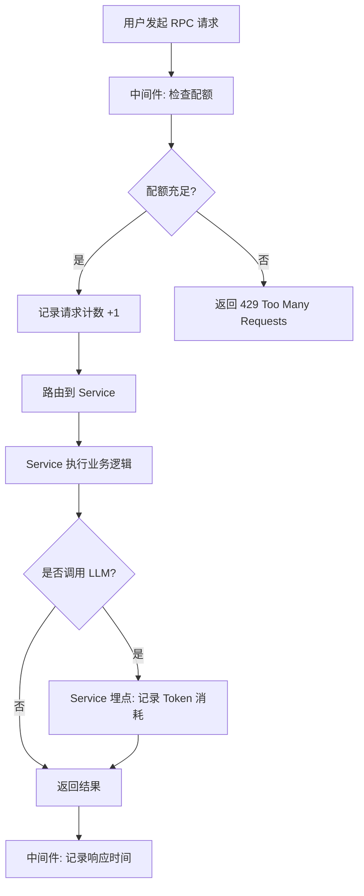
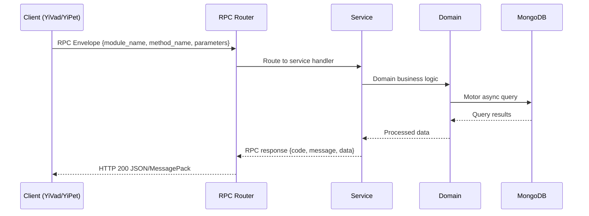

---

doc_type: module
prd_task_id: "YA-09-164"
title: "YA-09-164: 用量计费与配额管理 — 多维度资源追踪与配额控制 — 开发任务"
status: 需求已编写
priority: P2
owner: 陈铭
roles: [engineer]
created: 2026-09-11
updated: 2026-09-11
project: YiAi
project_id: yiai
prd_month: "202609"
estimate_frontend: 0.5
source_prd: "170-需求-用量计费与配额管理.md"
source_okr: [yiai-001]

type: task
---

# YA-09-164: 用量计费与配额管理 — 多维度资源追踪与配额控制

> **文档职责**：本文档定义**怎么做、为什么这么做、实际做成什么样**（HOW），不含产品目标与测试用例。

> 来源 PRD：[170-需求-用量计费与配额管理.md](../../prds/2026-09/170-需求-用量计费与配额管理.md)
> 需求编号：YA-09-164 · 优先级：P2 · 人天：0.5 · 状态：需求已编写
> 类型：基础设施 · 依赖：审计日志服务（audit_service）、用户管理服务（user_service）

---

<a id="sec-1"></a>
## 一、架构概览 / Architecture Overview

YA-09-164: 用量计费与配额管理 — 多维度资源追踪与配额控制



<a id="sec-2"></a>
## 二、文件清单 / File Manifest

| 文件 / File | 操作 | 说明 / Description |
|-------------|------|--------------------|
| `YiAi/src/services/xxx/service.py` | 新增 | Core service logic
| `YiAi/src/services/xxx/rpc_handler.py` | 新增 | RPC route handler
| `YiAi/tests/test_xxx.py` | 新增 | Unit tests

> Source PRD: 170-需求-用量计费与配额管理.md

<a id="sec-3"></a>
## 三、Python 签名与核心组件 / Python Signatures

### 3.1 核心组件

```python
from enum import Enum
from datetime import datetime
from pydantic import BaseModel, Field
class ResourceType(str, Enum):
class QuotaType(str, Enum):
class QuotaPeriod(str, Enum):
class UsageRecord(BaseModel):
    """用量记录（每次请求一条）。"""
class QuotaConfig(BaseModel):
    """配额配置。"""
class UsageSummary(BaseModel):
    """用量汇总（聚合查询结果）。"""
class UsageAlert(BaseModel):
    """用量告警。"""
class FreeTier(BaseModel):
    """免费层定义。"""
```
### 3.2 组件 2

```python
class UsageMiddleware:
    """用量追踪与配额检查中间件。"""
    async def check_quota(
        """检查配额是否充足。"""
        if quota.used + amount > quota.hard_limit:
            return QuotaCheckResult(
        if quota.used + amount > quota.soft_limit:
            # 软配额不拒绝，仅告警
        return QuotaCheckResult(allowed=True)
    async def record_usage(self, record: UsageRecord):
        """记录用量。"""
        # 写入 UsageRecord 文档
        # 原子更新配额计数器
```
### 3.3 组件 3

```python
class QuotaManager:
    """配额管理器 — 检查、扣除、重置。"""
    def __init__(self, db):
        self.quota_collection = db["usage_quotas"]
        self.usage_collection = db["usage_records"]
    async def check_and_deduct(
        """原子检查并扣除配额。"""
        if quota.used + amount > quota.hard_limit:
            return QuotaCheckResult(
        return QuotaCheckResult(allowed=True, current_usage=quota.used + amount, limit=quota.hard_limit)
    async def _get_effective_quota(
        """获取用户的有效配额（用户自定义 > 团队配额 > 默认配额）。"""
        # 1. 检查用户自定义配额
        if user_quota:
            return QuotaConfig(**user_quota)
        # 2. 检查团队配额
        if user and user.get("team_id"):
            if team_quota:
                return QuotaConfig(**team_quota)
        # 3. 返回默认配额
    def _get_default_quota(self, resource_type: ResourceType) -> QuotaConfig:
    async def _inc_usage(self, user_id: str, resource_type: ResourceType, amount: float):
    async def reset_quotas(self, period: QuotaPeriod):
    def _current_period_key(self) -> str:
```

<a id="sec-4"></a>
## 四、数据流 / Data Flow



**Call chain**: `Client -> RPC Router -> Service -> Domain -> MongoDB`  
**Response format**: `{code: 0, message: "ok", data: ...}`  
**Async model**: Full-chain `async/await`, Motor async MongoDB driver.  
**Error propagation**: Service exceptions caught by middleware -> standard error codes (1001-9999).

<a id="sec-5"></a>
## 五、实施路线图 / Roadmap

**预估人天 / Estimated**: 0.5

| 步骤 / Step | 操作 / Action | 路径 / Path | 验证 / Verification | 人天 / Days |
|-------------|---------------|-------------|---------------------|-------------|
| 1 | 定义数据模型（UsageRecord、QuotaConfig、FreeTier） | `domain/usage/models.py` | 模型字段完整，Pydantic 校验通过 | 0.05 |
| 2 | 实现配额管理器（check_and_deduct、reset） | `domain/usage/quota_manager.py` | 原子扣除正确，并发安全 | 0.10 |
| 3 | 实现用量中间件（请求拦截 + 配额检查） | `server/middleware/usage_middleware.py` | 超配额返回 429，正常请求放行 | 0.10 |
| 4 | 实现告警管理器（80%/90%/100% 阈值） | `domain/usage/alert_manager.py` | 达阈值触发告警记录 | 0.05 |
| 5 | 实现配额重置定时任务 | `domain/usage/quota_scheduler.py` | 每日 00:00 和每月 1 日正确重置 | 0.05 |
| 6 | 实现用量查询服务（summary/trend/export/quota_status） | `services/usage/usage_service.py` | 面板数据正确，导出格式正确 | 0.10 |
| 7 | 集成到 app.py（注册中间件 + 定时任务） | `server/app.py` | 中间件生效，定时任务运行 | 0.05 |
| 风险 | 概率 | 影响 | 等级 | 缓解措施 | 应急预案 |
| 配额检查增加请求延迟 | 中 | 中 | 中 | MongoDB 查询使用索引（user_id + resource_type），预期 < 1ms | 关配额检查中间件，恢复无限制模式 |
| 并发请求导致配额超扣 | 低 | 高 | 中 | MongoDB `$inc` 原子操作，条件检查 `used + amount <= hard_limit` | 定时任务矫正超扣数据 |
| 配额重置失败（定时任务异常） | 低 | 高 | 中 | 定时任务异常重试 + 手动重置接口 | 管理员手动调用重置 API |
| 用量记录写入失败（MongoDB 不可用） | 低 | 低 | 低 | 写入失败不影响请求，仅记录 ERROR 日志 | MongoDB 恢复后从应用日志补录 |

<a id="sec-6"></a>
## 六、代码审查检查清单 / Review Checklist

- [ ] `UsageRecord` 模型包含 user_id、resource_type、amount、timestamp、endpoint、model
- [ ] 配额检查使用 MongoDB `$inc` 原子操作
- [ ] 软配额（80%）触发告警，硬配额（100%）返回 429
- [ ] 响应头包含 `X-RateLimit-Remaining`、`X-RateLimit-Limit`、`X-RateLimit-Reset`
- [ ] 配额重置定时任务（每日 00:00 + 每月 1 日 00:00）
- [ ] 免费层配额定义合理（100 次/天，100000 token/天）
- [ ] 用量查询支持 summary/trend/export/quota_status
- [ ] 用量导出支持 JSON 和 CSV 格式
- [ ] 中间件不影响非配额请求（静态文件、健康检查）
- [ ] `ruff` 代码规范通过
- [ ] `mypy` 类型检查通过
---
## 十二、回归问题预测
| # | 问题 | 发现场景 | 根因 | 修复方式 |
|---|------|---------|------|---------|
| 1 | 未认证用户（anonymous）配额与认证用户共享计数器 | 匿名用户调用 API 被计入 `anonymous` 配额，但匿名用户可能是多个不同的人 | 中间件使用 `user_id = "anonymous"` 作为未认证用户的标识，所有匿名请求共享同一配额 | 对未认证用户，使用 IP 地址作为 user_id 进行配额区分 |
| 2 | 配额重置时 `$inc` 未重置 period_key 导致旧周期数据累积 | 新周期开始时，配额记录中 `used` 被重置为 0，但 `period_key` 仍为旧周期 | `reset_quotas` 只更新 `used=0`，未更新 `period_key` | 在重置时同时更新 `period_key` 为新周期值 |

<a id="sec-7"></a>
## 七、风险表 / Risk Table

| 风险 / Risk | 影响 / Impact | 缓解措施 / Mitigation | 应急预案 / Contingency |
|-------------|---------------|----------------------|------------------------|
| 配额检查增加请求延迟 | 中 | 中 | 中 |
| 并发请求导致配额超扣 | 低 | 高 | 中 |
| 配额重置失败（定时任务异常） | 低 | 高 | 中 |
| 用量记录写入失败（MongoDB 不可用） | 低 | 低 | 低 |
| 免费层配额设置不合理 | 中 | 中 | 中 |
| 回滚场景 | 回滚方式 | 影响范围 | 恢复时间 |
| 中间件导致所有请求被拒绝 | 移除中间件注册，恢复无限制模式 | 全部 API 请求 | 5min |
| 配额重置异常导致计数器混乱 | 停用定时任务，手动重置所有配额 | 配额数据 | 10min |
| 用量记录写入影响性能 | 关闭用量记录，仅保留配额检查 | 用量数据 | 5min |
| 指标 | 采集方式 | 告警阈值 | 说明 |
