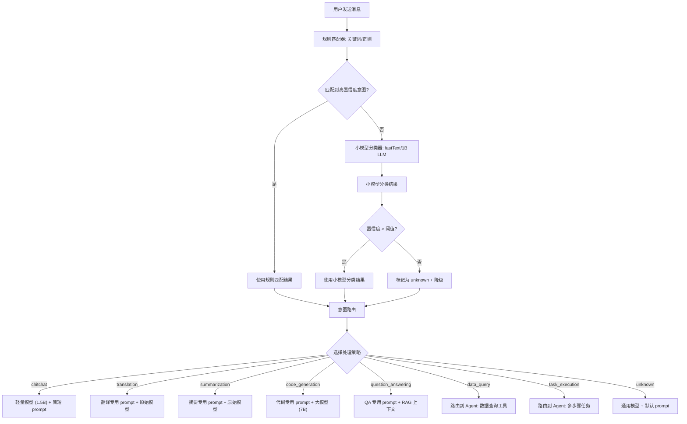
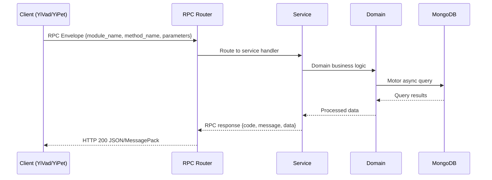

---

doc_type: module
prd_task_id: "YA-09-85"
title: "YA-09-85: 意图分类与路由 — LLM 分类器 + 智能分发 — 开发方案"
status: 需求已编写
priority: P2
owner: 陈铭
roles: [engineer]
created: 2026-09-11
updated: 2026-09-14
project: YiAi
project_id: yiai
prd_month: "202609"
estimate_frontend: 1.5
source_prd: "171-需求-意图分类与路由.md"
source_okr: [yiai-002]

type: task
---

# YA-09-85: 意图分类与路由 — LLM 分类器 + 智能分发

> **文档职责**：本文档定义**怎么做、为什么这么做、实际做成什么样**（HOW），不含产品目标与测试用例。

> 来源 PRD：[171-需求-意图分类与路由.md](../../prds/2026-09/171-需求-意图分类与路由.md)
> 需求编号：YA-09-85 · 优先级：P2 · 人天：1.5 · 状态：需求已编写
> 类型：功能 · 依赖：AI 聊天服务（chat_service）、ModelRuntime 抽象层、Agent 工具系统

---

<a id="sec-1"></a>
## 一、架构概览 / Architecture Overview

YA-09-165: 意图分类与路由 — 用户查询意图识别与智能路由



<a id="sec-2"></a>
## 二、文件清单 / File Manifest

| 文件 / File | 操作 | 说明 / Description |
|-------------|------|--------------------|
| `YiAi/src/services/xxx/service.py` | 新增 | Core service logic
| `YiAi/src/services/xxx/rpc_handler.py` | 新增 | RPC route handler
| `YiAi/tests/test_xxx.py` | 新增 | Unit tests

> Source PRD: 171-需求-意图分类与路由.md

<a id="sec-3"></a>
## 三、Python 签名与核心组件 / Python Signatures

### 3.1 核心组件

```python
from enum import Enum
from pydantic import BaseModel, Field
class IntentCategory(str, Enum):
    """意图类别。"""
class IntentResult(BaseModel):
    """意图分类结果。"""
class IntentRoute(BaseModel):
    """意图路由配置。"""
class RuleMatch(BaseModel):
    """规则匹配配置。"""
class IntentAnalytics(BaseModel):
    """意图分析数据。"""
```
### 3.2 组件 2

```python
import re
class RuleClassifier:
    """基于规则（关键词 + 正则）的意图分类器。"""
    def __init__(self):
        self.rules = self._build_rules()
    def _build_rules(self) -> dict[IntentCategory, list[tuple[re.Pattern, float]]]:
        """构建规则库。"""
        return {
    def classify(self, text: str) -> IntentResult | None:
        """规则匹配分类。返回分类结果或 None（规则未命中）。"""
                if pattern.search(text_lower):
                    if weight > best_confidence:
        if best_intent and best_confidence >= 0.80:
            return IntentResult(
        return None
```

<a id="sec-4"></a>
## 四、数据流 / Data Flow



**Call chain**: `Client -> RPC Router -> Service -> Domain -> MongoDB`  
**Response format**: `{code: 0, message: "ok", data: ...}`  
**Async model**: Full-chain `async/await`, Motor async MongoDB driver.  
**Error propagation**: Service exceptions caught by middleware -> standard error codes (1001-9999).

<a id="sec-5"></a>
## 五、实施路线图 / Roadmap

**预估人天 / Estimated**: 1.5

| 步骤 / Step | 操作 / Action | 路径 / Path | 验证 / Verification | 人天 / Days |
|-------------|---------------|-------------|---------------------|-------------|
| 1 | 定义数据模型（IntentCategory、IntentResult、IntentRoute） | `domain/intent/models.py` | 模型字段完整，枚举值定义正确 | 0.05 |
| 2 | 实现规则匹配器（8 类意图，50+ 条规则） | `domain/intent/rule_classifier.py` | 高频意图（寒暄/翻译/摘要）匹配准确率 > 80% | 0.05 |
| 3 | 实现小模型分类器（LLM + fastText 可选） | `domain/intent/model_classifier.py` | 小模型分类准确率 > 80% | 0.10 |
| 4 | 实现统一分类器（规则 → 模型 → 降级） | `domain/intent/classifier.py` | 三层分类器正确协作，降级逻辑正常 | 0.05 |
| 5 | 实现路由配置（8 种意图的模型/prompt/工具） | `domain/intent/routes.py` | 每种意图有独立的路由配置 | 0.05 |
| 6 | 实现意图路由器 | `domain/intent/router.py` | 按意图返回正确的处理配置 | 0.05 |
| 7 | 集成到 chat_service（分类 + 路由 + 日志） | `services/ai/chat_service.py` | 不同意图使用不同模型和 prompt | 0.10 |
| 8 | 实现意图分析服务 | `services/intent/intent_service.py` | 意图分布和分类器指标正常 | 0.05 |
| 风险 | 概率 | 影响 | 等级 | 缓解措施 | 应急预案 |
| 规则匹配误判导致错误路由 | 中 | 中 | 中 | 规则匹配仅在高置信度（>= 0.80）时使用，不确定时降级到模型分类 | 调整规则权重，添加误判规则到排除列表 |
| 小模型分类延迟过高 | 中 | 中 | 中 | 优先使用 fastText（< 5ms），小模型 LLM 作为兜底 | 关闭小模型分类，全部使用规则 + 降级 |
| 意图分类增加用户感知延迟 | 中 | 中 | 中 | 规则匹配 < 1ms，fastText < 5ms，小模型 LLM 200-500ms | 跳过分类，直接使用通用模型 |

<a id="sec-6"></a>
## 六、代码审查检查清单 / Review Checklist

- [ ] 规则匹配器覆盖 8 种意图，每种至少 3 条规则
- [ ] 规则匹配仅在 confidence >= 0.80 时生效
- [ ] 小模型分类器有超时保护（15s）
- [ ] 统一分类器三层降级逻辑正确（规则 → fastText → LLM → unknown）
- [ ] 路由配置为每种意图定义了独立的模型和 prompt
- [ ] 意图分类结果记录到 MongoDB 意图日志
- [ ] chat_service 集成不影响现有聊天流程
- [ ] 意图路由不影响 SSE 流式响应
- [ ] 意图分析服务提供分布和指标查询
- [ ] `ruff` 代码规范通过
- [ ] `mypy` 类型检查通过
---
## 十二、回归问题预测
| # | 问题 | 发现场景 | 根因 | 修复方式 |
|---|------|---------|------|---------|
| 1 | 规则匹配将代码查询误判为 data_query | 用户输入"帮我查一下 Python 中 list 的用法"，规则匹配到"查一下"关键词，判为 data_query | 规则 `re.compile(r"查(一下|询)?.*(数据|记录|文档|列表)")` 中"列表"匹配了 Python `list` | 在规则中添加排除词：`re.compile(r"查(一下|询)?.*(数据|记录|文档|数据库)")`，移除"列表" |
| 2 | 小模型分类器在 Ollama 未启动时阻塞 30s | 开发环境 Ollama 未启动时，聊天请求在分类阶段卡住 30s | `ModelClassifier.classify` 无超时设置 | 添加 `asyncio.wait_for(classify(...), timeout=5)` 包装，超时后降级为 unknown |

<a id="sec-7"></a>
## 七、风险表 / Risk Table

| 风险 / Risk | 影响 / Impact | 缓解措施 / Mitigation | 应急预案 / Contingency |
|-------------|---------------|----------------------|------------------------|
| 规则匹配误判导致错误路由 | 中 | 中 | 中 |
| 小模型分类延迟过高 | 中 | 中 | 中 |
| 意图分类增加用户感知延迟 | 中 | 中 | 中 |
| 路由配置不合理导致体验下降 | 低 | 中 | 低 |
| 多意图查询处理不完整 | 低 | 低 | 低 |
| 回滚场景 | 回滚方式 | 影响范围 | 恢复时间 |
| 分类器导致所有请求延迟增加 | 跳过分类步骤，直接使用通用模型 | 聊天服务 | 5min |
| 规则匹配大面积误判 | 关闭规则匹配，仅使用模型分类 | 意图分类 | 5min |
| 路由配置导致 Agent 误触发 | 关闭 Agent 路由，所有意图使用通用模型 | Agent 服务 | 5min |
| 指标 | 采集方式 | 告警阈值 | 说明 |
