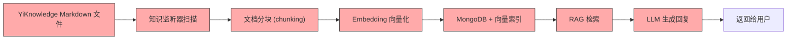
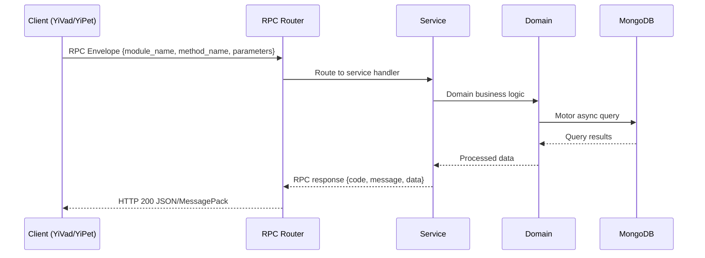

---

doc_type: module
prd_task_id: "YA-09-124"
title: "YA-09-124: 数据血缘追踪 — AI 生成内容端到端溯源 — 开发方案"
status: 需求已编写
priority: P2
owner: 陈铭
roles: [engineer]
created: 2026-09-11
updated: 2026-09-14
project: YiAi
project_id: yiai
prd_month: "202609"
estimate_frontend: 0.5
source_prd: "173-需求-数据血缘追踪.md"
source_okr: [yiai-001]

type: task
---

# YA-09-124: 数据血缘追踪 — AI 生成内容端到端溯源

> **文档职责**：本文档定义**怎么做、为什么这么做、实际做成什么样**（HOW），不含产品目标与测试用例。

> 来源 PRD：[173-需求-数据血缘追踪.md](../../prds/2026-09/173-需求-数据血缘追踪.md)
> 需求编号：YA-09-124 · 优先级：P2 · 人天：0.5 · 状态：需求已编写
> 类型：基础设施 · 依赖：数据服务（data_service）、RAG 引擎、聊天服务（chat_service）

---

<a id="sec-1"></a>
## 一、架构概览 / Architecture Overview

YA-09-167: 数据血缘追踪 — AI 生成内容的端到端溯源与影响分析



<a id="sec-2"></a>
## 二、文件清单 / File Manifest

| 文件 / File | 操作 | 说明 / Description |
|-------------|------|--------------------|
| `YiAi/src/services/xxx/service.py` | 新增 | Core service logic
| `YiAi/src/services/xxx/rpc_handler.py` | 新增 | RPC route handler
| `YiAi/tests/test_xxx.py` | 新增 | Unit tests

> Source PRD: 173-需求-数据血缘追踪.md

<a id="sec-3"></a>
## 三、Python 签名与核心组件 / Python Signatures

### 3.1 核心组件

```python
from enum import Enum
from pydantic import BaseModel, Field
from datetime import datetime
class DataNodeType(str, Enum):
class TransformationType(str, Enum):
class LineageRecord(BaseModel):
    """血缘记录: 记录一次数据转换。"""
class DataNode(BaseModel):
    """数据节点: 血缘图中的节点。"""
class LineageGraph(BaseModel):
    """血缘图: 查询结果。"""
```
### 3.2 组件 2

```python
import hashlib
import uuid
import time
from functools import wraps
from datetime import datetime
class LineageTracker:
    """数据血缘追踪器。记录每次数据转换的输入输出关系。"""
    def __init__(self):
        self.repo = LineageRepository()
    def generate_node_id(self) -> str:
        """生成唯一节点 ID。"""
        return f"node_{uuid.uuid4().hex[:12]}"
    def compute_content_hash(self, content: str) -> str:
        """计算内容哈希（SHA256）。"""
        return hashlib.sha256(content.encode("utf-8")).hexdigest()[:16]
    async def record(
        """记录一次数据转换的血缘关系。
        """
        # 保存所有节点（如果尚未存在）
        # 保存血缘记录
    async def trace_upstream(self, node_id: str, max_depth: int = 10) -> LineageGraph:
    async def trace_downstream(self, node_id: str, max_depth: int = 10) -> LineageGraph:
def trace_lineage(transformation_type: TransformationType):
    def decorator(func):
        @wraps(func)
```
### 3.3 组件 3

```python
class LineageService:
    """数据血缘服务。"""
    def __init__(self):
        self.tracker = LineageTracker()
        self.scorer = QualityScorer()
    async def trace_upstream(self, parameters: dict) -> dict:
        """RPC: 正向追溯——从数据节点追溯到源数据。
        """
        # 如果提供 data_ref，先查找对应的 node_id
        if not node_id and data_ref:
            if node:
        if not node_id:
            return {"code": 1001, "message": "node_id or data_ref is required", "data": None}
        return {
    async def trace_downstream(self, parameters: dict) -> dict:
        """RPC: 反向追溯——从数据节点追溯到所有衍生数据。
        """
        if not node_id and data_ref:
            if node:
        if not node_id:
    async def impact_analysis(self, parameters: dict) -> dict:
    async def compliance_delete(self, parameters: dict) -> dict:
    async def get_quality_report(self, parameters: dict) -> dict:
    def _summarize_graph(self, graph: LineageGraph) -> dict:
```

<a id="sec-4"></a>
## 四、数据流 / Data Flow



**Call chain**: `Client -> RPC Router -> Service -> Domain -> MongoDB`  
**Response format**: `{code: 0, message: "ok", data: ...}`  
**Async model**: Full-chain `async/await`, Motor async MongoDB driver.  
**Error propagation**: Service exceptions caught by middleware -> standard error codes (1001-9999).

<a id="sec-5"></a>
## 五、实施路线图 / Roadmap

**预估人天 / Estimated**: 0.5

| 步骤 / Step | 操作 / Action | 路径 / Path | 验证 / Verification | 人天 / Days |
|-------------|---------------|-------------|---------------------|-------------|
| 1 | 定义数据模型（LineageRecord、DataNode、LineageGraph、枚举） | `domain/lineage/models.py` | Pydantic 校验通过，枚举值完整 | 0.05 |
| 2 | 实现数据访问层（血缘记录 CRUD、节点管理、图查询） | `domain/lineage/lineage_repository.py` | MongoDB 读写正常，索引创建成功 | 0.05 |
| 3 | 实现血缘追踪器（record、trace_upstream、trace_downstream、装饰器） | `domain/lineage/lineage_tracker.py` | 追溯图结构正确，包含所有节点和边 | 0.08 |
| 4 | 实现质量评分器 | `services/lineage/quality_scorer.py` | 管线质量评分计算正确，全局报告格式正确 | 0.05 |
| 5 | 实现血缘服务 RPC（trace_upstream、trace_downstream、impact_analysis、compliance_delete、get_quality_report） | `services/lineage/lineage_service.py` | 所有 RPC 接口正常响应 | 0.12 |
| 6 | 集成到现有管线（RAG 检索、LLM 生成时记录血缘） | chat_service、rag_service | 每次 RAG 检索和 LLM 生成自动创建血缘记录 | 0.08 |
| 7 | 回归测试 | 全模块 | 聊天/RAG 服务正常，血缘记录创建无误 | 0.07 |
| 风险 | 概率 | 影响 | 等级 | 缓解措施 | 应急预案 |
| 血缘记录数据膨胀 | 中 | 中 | 中 | 设置 TTL 索引（90 天），定期清理旧记录 | 手动清理历史数据 |
| 血缘记录增加请求延迟 | 低 | 低 | 低 | 异步记录（fire-and-forget），不阻塞主流程 | 关闭血缘记录功能 |
| 追溯深度过大导致性能问题 | 低 | 中 | 低 | 默认 max_depth=10，限制最大深度 20 | 降低默认深度 |
| 图查询结果不完整（遗漏节点） | 中 | 中 | 中 | 关键节点使用唯一 data_ref 索引，避免重复创建 | 手动修复缺失的血缘记录 |

<a id="sec-6"></a>
## 六、代码审查检查清单 / Review Checklist

- [ ] `LineageRecord` 模型字段完整（record_id、transformation_type、inputs、outputs、metadata、quality_score）
- [ ] `DataNode` 模型包含 content_hash（用于变更检测）
- [ ] `DataNodeType` 和 `TransformationType` 枚举覆盖所有管线环节
- [ ] `trace_upstream` 和 `trace_downstream` 使用 BFS 遍历，有深度限制
- [ ] 血缘记录异步写入，不阻塞主流程
- [ ] `impact_analysis` 正确提取受影响的 LLM 回复
- [ ] `compliance_delete` 默认 `reverify` 模式，避免误删
- [ ] 质量评分器正确处理空管线
- [ ] MongoDB 索引覆盖 `node_id`、`data_ref`、`inputs`、`outputs`
- [ ] `ruff` 代码规范通过
- [ ] `mypy` 类型检查通过
---
## 十二、回归问题预测
| # | 问题 | 发现场景 | 根因 | 修复方式 |
|---|------|---------|------|---------|
| 1 | 相同 chunk 重复创建节点 | 同一文档被多次 RAG 检索，每次创建新的 chunk 节点 | 未使用 content_hash 去重 | 创建节点前检查 content_hash，相同则复用已有节点 |
| 2 | 追溯时环形依赖导致死循环 | 两个血缘记录互相引用（A 输入 B，B 输入 A） | 数据写入错误或并发导致 | BFS 遍历时使用 visited 集合，避免重复访问 |

<a id="sec-7"></a>
## 七、风险表 / Risk Table

| 风险 / Risk | 影响 / Impact | 缓解措施 / Mitigation | 应急预案 / Contingency |
|-------------|---------------|----------------------|------------------------|
| 血缘记录数据膨胀 | 中 | 中 | 中 |
| 血缘记录增加请求延迟 | 低 | 低 | 低 |
| 追溯深度过大导致性能问题 | 低 | 中 | 低 |
| 图查询结果不完整（遗漏节点） | 中 | 中 | 中 |
| 合规删除误删数据 | 低 | 高 | 中 |
| 回滚场景 | 回滚方式 | 影响范围 | 恢复时间 |
| 血缘记录导致性能下降 | 关闭血缘记录功能（配置开关） | 血缘追踪功能 | 2min |
| 合规删除误操作 | 恢复被标记的节点（从备份） | 数据节点 | 30min |
| 血缘服务异常 | 移除 RPC 路由 | 血缘查询功能 | 5min |
| 指标 | 采集方式 | 告警阈值 | 说明 |
