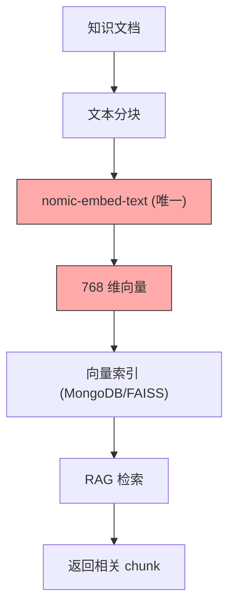
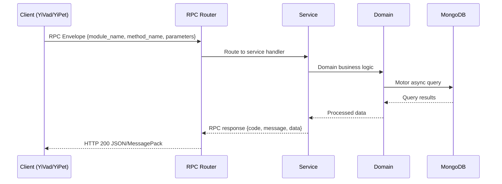

---

doc_type: module
prd_task_id: "YA-09-90"
title: "YA-09-90: 自定义 Embedding 模型 — 微调模型注册 + 评估 + 热替换 — 开发方案"
status: 需求已编写
priority: P2
owner: 陈铭
roles: [engineer]
created: 2026-09-11
updated: 2026-09-14
project: YiAi
project_id: yiai
prd_month: "202609"
estimate_frontend: 1.5
source_prd: "174-需求-自定义Embedding模型.md"
source_okr: [yiai-001]

type: task
---

# YA-09-90: 自定义 Embedding 模型 — 微调模型注册 + 评估 + 热替换

> **文档职责**：本文档定义**怎么做、为什么这么做、实际做成什么样**（HOW），不含产品目标与测试用例。

> 来源 PRD：[174-需求-自定义Embedding模型.md](../../prds/2026-09/174-需求-自定义Embedding模型.md)
> 需求编号：YA-09-90 · 优先级：P2 · 人天：1.5 · 状态：需求已编写
> 类型：功能 · 依赖：RAG 引擎、模型注册中心（#166）、Ollama API

---

<a id="sec-1"></a>
## 一、架构概览 / Architecture Overview

YA-09-168: 自定义 Embedding 模型 — 微调模型注册、评估与热替换



<a id="sec-2"></a>
## 二、文件清单 / File Manifest

| 文件 / File | 操作 | 说明 / Description |
|-------------|------|--------------------|
| `YiAi/src/services/xxx/service.py` | 新增 | Core service logic
| `YiAi/src/services/xxx/rpc_handler.py` | 新增 | RPC route handler
| `YiAi/tests/test_xxx.py` | 新增 | Unit tests

> Source PRD: 174-需求-自定义Embedding模型.md

<a id="sec-3"></a>
## 三、Python 签名与核心组件 / Python Signatures

### 3.1 核心组件

```python
from enum import Enum
from pydantic import BaseModel, Field
from datetime import datetime
class EmbeddingDimension(str, Enum):
class EmbeddingModelInfo(BaseModel):
    """Embedding 模型信息。"""
class EmbeddingEvaluation(BaseModel):
    """Embedding 模型评估结果。"""
class IndexRebuildTask(BaseModel):
    """索引重建任务。"""
class EmbeddingCacheEntry(BaseModel):
    """Embedding 缓存条目。"""
```
### 3.2 组件 2

```python
import hashlib
from collections import OrderedDict
from threading import Lock
class EmbeddingCache:
    """LRU Embedding 缓存，按模型隔离。"""
    def __init__(self, max_size_per_model: int = 10000):
        self.max_size_per_model = max_size_per_model
        self._caches: dict[str, OrderedDict] = {}  # model_name -> OrderedDict
        self._lock = Lock()
    def _get_cache(self, model_name: str) -> OrderedDict:
        """获取指定模型的缓存，如果不存在则创建。"""
        if model_name not in self._caches:
            self._caches[model_name] = OrderedDict()
        return self._caches[model_name]
    def _hash_text(self, text: str) -> str:
        """计算文本哈希。"""
        return hashlib.sha256(text.encode("utf-8")).hexdigest()
    def get(self, model_name: str, text: str) -> list[float] | None:
        """获取缓存的 Embedding 向量。"""
            if entry is not None:
    def set(self, model_name: str, text: str, embedding: list[float]):
    def invalidate_model(self, model_name: str):
    def get_stats(self, model_name: str = None) -> dict:
```
### 3.3 组件 3

```python
class DimensionChecker:
    """检查 Embedding 模型维度与现有向量索引的兼容性。"""
    def __init__(self):
        self.repo = LineageRepository()  # 复用血缘仓库访问向量索引
    async def check_compatibility(
        """检查维度兼容性。
        """
        if collection_name:
            if current_dim is not None and current_dim != model_dimension:
        else:
            # 检查所有集合
                if current_dim is not None and current_dim != model_dimension:
        return {
    async def _get_collection_dimension(self, collection_name: str) -> int | None:
        """获取集合的向量维度。"""
        # 从向量索引元数据中获取维度
        return meta.get("dimension") if meta else None
    async def _get_current_default_dimension(self) -> int | None:
        """获取当前默认 Embedding 模型的维度。"""
        # 从模型注册中心获取
    async def _list_vector_collections(self) -> list[str]:
    async def _count_documents(self, collection_name: str) -> int:
```

<a id="sec-4"></a>
## 四、数据流 / Data Flow



**Call chain**: `Client -> RPC Router -> Service -> Domain -> MongoDB`  
**Response format**: `{code: 0, message: "ok", data: ...}`  
**Async model**: Full-chain `async/await`, Motor async MongoDB driver.  
**Error propagation**: Service exceptions caught by middleware -> standard error codes (1001-9999).

<a id="sec-5"></a>
## 五、实施路线图 / Roadmap

**预估人天 / Estimated**: 1.5

| 步骤 / Step | 操作 / Action | 路径 / Path | 验证 / Verification | 人天 / Days |
|-------------|---------------|-------------|---------------------|-------------|
| 1 | 定义数据模型（EmbeddingModelInfo、EmbeddingEvaluation、IndexRebuildTask、EmbeddingCacheEntry） | `domain/embedding/models.py` | Pydantic 校验通过 | 0.03 |
| 2 | 实现 Embedding 缓存（LRU + 按模型隔离） | `domain/embedding/embedding_cache.py` | 缓存命中/未命中逻辑正确，LRU 淘汰生效 | 0.05 |
| 3 | 实现维度兼容检查器 | `domain/embedding/dimension_checker.py` | 维度一致返回 compatible=true，不一致返回 affected 列表 | 0.05 |
| 4 | 实现模型注册与维度管理 | `domain/embedding/embedding_registry.py` | 注册成功，维度信息正确 | 0.05 |
| 5 | 实现模型评估器（检索准确率、聚类质量、语义相似度） | `services/embedding/embedding_evaluator.py` | 评估报告包含三项指标，分值 0-1 | 0.08 |
| 6 | 实现索引重建器（后台任务、进度追踪） | `services/embedding/index_rebuilder.py` | 重建任务启动、进度查询、完成通知正常 | 0.08 |
| 7 | 实现 Embedding 服务 RPC（register、evaluate、compare、switch、rebuild、progress、cache_stats、quality_monitor） | `services/embedding/embedding_service.py` | 所有 RPC 接口正常响应 | 0.10 |
| 8 | 回归测试 | 全模块 | RAG 检索正常，Embedding 切换后索引重建完成 | 0.06 |
| 风险 | 概率 | 影响 | 等级 | 缓解措施 | 应急预案 |
| 索引重建期间 RAG 检索质量下降 | 中 | 中 | 中 | 重建期间旧索引持续服务，仅切换瞬间有短暂降级 | 在低峰期执行重建 |
| 维度不兼容导致查询失败 | 中 | 高 | 高 | 注册时自动检查维度，不兼容时阻止直接切换 | 回滚到旧模型 |
| Embedding 缓存内存溢出 | 低 | 中 | 低 | LRU 淘汰 + 容量限制（10000/模型） | 降低缓存容量，手动清理 |

<a id="sec-6"></a>
## 六、代码审查检查清单 / Review Checklist

- [ ] `EmbeddingModelInfo` 包含 dimension、max_tokens、normalization 字段
- [ ] `EmbeddingCache` 按模型名称隔离，切换模型时失效旧缓存
- [ ] `DimensionChecker` 正确检测维度不兼容
- [ ] `IndexRebuilder` 支持进度追踪和断点续传
- [ ] 缓存命中率统计正确
- [ ] 模型切换时自动检查维度兼容性
- [ ] 索引重建完成后更新集合元数据
- [ ] 评估器支持检索准确率、聚类质量、语义相似度三个维度
- [ ] LRU 缓存淘汰策略正确
- [ ] `ruff` 代码规范通过
- [ ] `mypy` 类型检查通过
---
## 十二、回归问题预测
| # | 问题 | 发现场景 | 根因 | 修复方式 |
|---|------|---------|------|---------|
| 1 | 不同模型缓存共享导致错误命中 | 切换 Embedding 模型后，缓存仍返回旧模型的向量 | 缓存 key 仅使用 text_hash，未包含 model_name | 缓存 key 改为 `{model_name}:{text_hash}` |
| 2 | 索引重建期间文档被修改导致不一致 | 重建进行到 50% 时，用户新增了文档 | 新增文档仍使用旧模型 Embedding，重建完成后未更新 | 重建完成后执行增量同步，处理重建期间变更的文档 |

<a id="sec-7"></a>
## 七、风险表 / Risk Table

| 风险 / Risk | 影响 / Impact | 缓解措施 / Mitigation | 应急预案 / Contingency |
|-------------|---------------|----------------------|------------------------|
| 索引重建期间 RAG 检索质量下降 | 中 | 中 | 中 |
| 维度不兼容导致查询失败 | 中 | 高 | 高 |
| Embedding 缓存内存溢出 | 低 | 中 | 低 |
| 评估基准数据集不具代表性 | 低 | 中 | 低 |
| 重建任务失败中断 | 低 | 中 | 低 |
| 回滚场景 | 回滚方式 | 影响范围 | 恢复时间 |
| 新 Embedding 模型检索质量低于预期 | 切换回旧模型，旧索引未被删除 | RAG 检索 | 10min |
| 索引重建失败 | 恢复旧索引，新索引废弃 | 向量索引 | 20min |
| 缓存导致内存问题 | 减小缓存容量或关闭缓存 | Embedding 性能 | 2min |
| 指标 | 采集方式 | 告警阈值 | 说明 |
