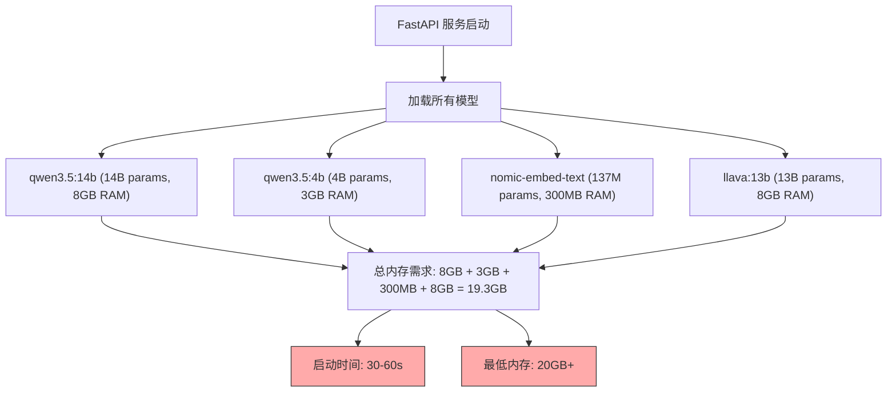
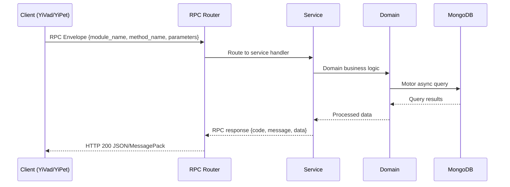

---

doc_type: module
prd_task_id: "YA-09-169"
title: "YA-09-169: 边缘部署优化 — 资源受限环境下的轻量级运行方案 — 开发任务"
status: 需求已编写
priority: P2
owner: 陈铭
roles: [engineer]
created: 2026-09-11
updated: 2026-09-11
project: YiAi
project_id: yiai
prd_month: "202609"
estimate_frontend: 0.5
source_prd: "175-需求-边缘部署优化.md"
source_okr: [yiai-002]

type: task
---

# YA-09-169: 边缘部署优化 — 资源受限环境下的轻量级运行方案

> **文档职责**：本文档定义**怎么做、为什么这么做、实际做成什么样**（HOW），不含产品目标与测试用例。

> 来源 PRD：[175-需求-边缘部署优化.md](../../prds/2026-09/175-需求-边缘部署优化.md)
> 需求编号：YA-09-169 · 优先级：P2 · 人天：0.5 · 状态：需求已编写
> 类型：基础设施 · 依赖：Ollama API、模型注册中心（#166）、系统监控

---

<a id="sec-1"></a>
## 一、架构概览 / Architecture Overview

YA-09-169: 边缘部署优化 — 资源受限环境下的轻量级运行方案



<a id="sec-2"></a>
## 二、文件清单 / File Manifest

| 文件 / File | 操作 | 说明 / Description |
|-------------|------|--------------------|
| `YiAi/src/services/xxx/service.py` | 新增 | Core service logic
| `YiAi/src/services/xxx/rpc_handler.py` | 新增 | RPC route handler
| `YiAi/tests/test_xxx.py` | 新增 | Unit tests

> Source PRD: 175-需求-边缘部署优化.md

<a id="sec-3"></a>
## 三、Python 签名与核心组件 / Python Signatures

### 3.1 核心组件

```python
from enum import Enum
from pydantic import BaseModel, Field
class ResourceProfile(str, Enum):
class QuantizationLevel(str, Enum):
class EdgeProfile(BaseModel):
    """边缘部署 Profile 配置。"""
class SystemResources(BaseModel):
    """系统资源信息。"""
class OTAModelUpdate(BaseModel):
    """OTA 模型更新任务。"""
```
### 3.2 组件 2

```python
import os
import psutil
class ResourceDetector:
    """自动检测系统资源。"""
    async def detect(self) -> SystemResources:
        """检测当前系统资源。"""
        # CPU 信息
        # 内存信息
        # 磁盘信息
        # GPU 检测
        # 温度检测
        # 交换空间
        return SystemResources(
    async def _detect_gpu(self) -> tuple[bool, int]:
        """检测 GPU 可用性。"""
            import torch
            if torch.cuda.is_available():
                # 获取第一个 GPU 的显存
                return True, mem // (1024 * 1024)
        # 尝试检测 NVIDIA Jetson
    async def _detect_temperature(self) -> float:
```
### 3.3 组件 3

```python
class ProfileManager:
    """Profile 管理器：根据资源选择部署 Profile。"""
    def __init__(self):
        self.detector = ResourceDetector()
        self._current_profile: EdgeProfile | None = None
    async def select_profile(self, force_profile: str = None) -> EdgeProfile:
        """选择最优 Profile。
        """
        if force_profile:
            self._current_profile = PROFILES[profile]
            return self._current_profile
        if available_mb < 1500:
        elif available_mb < 3500:
        elif available_mb < 7000:
        else:
        self._current_profile = PROFILES[profile]
        return self._current_profile
    async def get_current_profile(self) -> EdgeProfile | None:
        """获取当前生效的 Profile。"""
        return self._current_profile
    async def get_recommended_model(self, task_type: str) -> str | None:
    async def is_within_budget(self, model_size_mb: int) -> bool:
```

<a id="sec-4"></a>
## 四、数据流 / Data Flow



**Call chain**: `Client -> RPC Router -> Service -> Domain -> MongoDB`  
**Response format**: `{code: 0, message: "ok", data: ...}`  
**Async model**: Full-chain `async/await`, Motor async MongoDB driver.  
**Error propagation**: Service exceptions caught by middleware -> standard error codes (1001-9999).

<a id="sec-5"></a>
## 五、实施路线图 / Roadmap

**预估人天 / Estimated**: 0.5

| 步骤 / Step | 操作 / Action | 路径 / Path | 验证 / Verification | 人天 / Days |
|-------------|---------------|-------------|---------------------|-------------|
| 1 | 定义数据模型（EdgeProfile、SystemResources、OTAModelUpdate、ResourceProfile） | `domain/edge/models.py` | Pydantic 校验通过 | 0.03 |
| 2 | 实现资源检测器（CPU/Memory/GPU/Disk/温度） | `domain/edge/resource_detector.py` | 检测结果与实际系统资源一致 | 0.05 |
| 3 | 实现 Profile 管理器（4 个 Profile 定义、自动选择、内存预算检查） | `domain/edge/profile_manager.py` | 不同内存量选择正确 Profile，推荐模型合理 | 0.05 |
| 4 | 实现模型管理器（懒加载、预热、卸载、内存估算） | `domain/edge/model_manager.py` | 懒加载正确，预热不阻塞，内存预算内运行 | 0.08 |
| 5 | 实现边缘健康监控（温度、内存压力、磁盘） | `domain/edge/edge_health_monitor.py` | 健康检查返回正确指标 | 0.05 |
| 6 | 实现 OTA 更新器（下载、校验、热替换、清理） | `services/edge/ota_updater.py` | 更新流程完整，进度可追踪 | 0.08 |
| 7 | 实现边缘服务 RPC（resources、profile、models、prewarm、ota、health） | `services/edge/edge_service.py` | 所有 RPC 接口正常响应 | 0.10 |
| 8 | 集成到启动流程（main.py 启动时检测资源、选择 Profile） | `main.py` | 启动时自动选择 Profile，日志输出资源信息 | 0.03 |
| 9 | 回归测试 | 全模块 | 各 Profile 下模型正确加载，推理正常 | 0.03 |
| 风险 | 概率 | 影响 | 等级 | 缓解措施 | 应急预案 |
| 量化模型质量下降超出预期 | 中 | 中 | 中 | 每个 Profile 提供多级量化选项，用户可自行选择 | 切换到更高量化级别（如 Q5 替代 Q4） |
| 内存预算超限导致 OOM | 中 | 高 | 高 | 懒加载 + 内存预算检查 + 模型卸载 | 启用交换空间，限制并发请求 |

<a id="sec-6"></a>
## 六、代码审查检查清单 / Review Checklist

- [ ] `ResourceDetector` 正确检测 CPU、内存、GPU、磁盘、温度
- [ ] 4 个 Profile（2GB/4GB/8GB/16GB）定义完整，推荐模型合理
- [ ] Profile 自动选择逻辑正确（根据 available_memory）
- [ ] 环境变量 `YIAI_RESOURCE_PROFILE` 可覆盖自动选择
- [ ] `ModelManager` 懒加载不阻塞主流程
- [ ] 模型内存估算准确（优先从 Ollama 获取实际大小）
- [ ] 内存预算检查在加载模型前执行
- [ ] `OTAUpdater` 下载、校验、切换、清理四步流程完整
- [ ] OTA 更新失败时保留旧模型
- [ ] 边缘健康监控包含温度、内存压力、磁盘指标
- [ ] `ruff` 代码规范通过
- [ ] `mypy` 类型检查通过
---
## 十二、回归问题预测
| # | 问题 | 发现场景 | 根因 | 修复方式 |
|---|------|---------|------|---------|
| 1 | 容器环境中资源检测不准确 | Docker 容器中 `psutil` 检测到宿主机资源而非容器限制 | Docker 使用 cgroups 限制资源，`psutil` 默认读取宿主机 | 检测 cgroups v1/v2 限制，取 `psutil` 和 cgroups 中较小值 |

<a id="sec-7"></a>
## 七、风险表 / Risk Table

| 风险 / Risk | 影响 / Impact | 缓解措施 / Mitigation | 应急预案 / Contingency |
|-------------|---------------|----------------------|------------------------|
| 量化模型质量下降超出预期 | 中 | 中 | 中 |
| 内存预算超限导致 OOM | 中 | 高 | 高 |
| CPU 推理速度无法接受 | 高 | 高 | 高 |
| 温度过高导致设备降频/关机 | 中 | 高 | 中 |
| OTA 更新中断导致模型损坏 | 低 | 高 | 中 |
| 边缘设备磁盘空间不足 | 低 | 中 | 低 |
| 回滚场景 | 回滚方式 | 影响范围 | 恢复时间 |
| 量化模型质量不满足需求 | 切换到更高量化级别或原始模型 | 推理质量 | 10min |
| OTA 更新后模型异常 | 回滚到旧版本模型 | 单个模型服务 | 5min |
| Profile 选择错误导致 OOM | 强制指定更高内存 Profile | 整体服务 | 3min |
