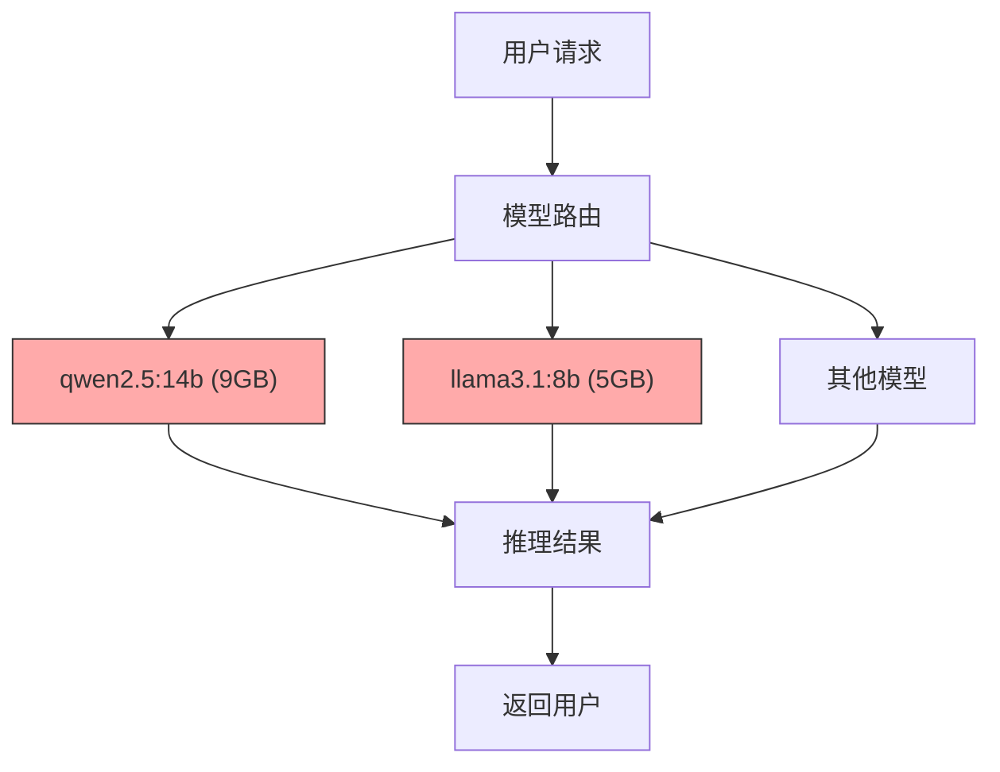
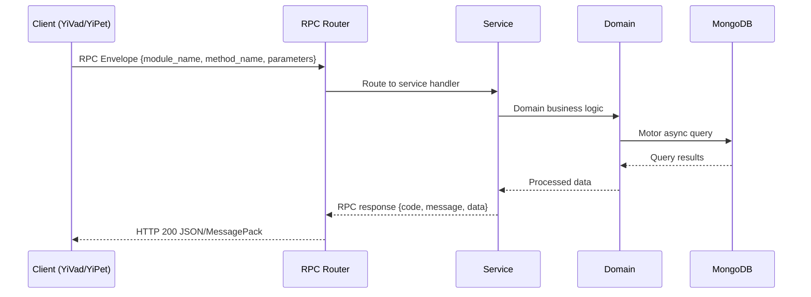

---

doc_type: module
prd_task_id: "YA-09-136"
title: "YA-09-136: 知识蒸馏 — 大模型→小模型 + 精度保持 — 开发方案"
status: 需求已编写
priority: P2
owner: 陈铭
roles: [engineer]
created: 2026-09-11
updated: 2026-09-14
project: YiAi
project_id: yiai
prd_month: "202609"
estimate_frontend: 1.0
source_prd: "176-需求-知识蒸馏与模型压缩.md"
source_okr: [yiai-002]

type: task
---

# YA-09-136: 知识蒸馏 — 大模型→小模型 + 精度保持

> **文档职责**：本文档定义**怎么做、为什么这么做、实际做成什么样**（HOW），不含产品目标与测试用例。

> 来源 PRD：[176-需求-知识蒸馏与模型压缩.md](../../prds/2026-09/176-需求-知识蒸馏与模型压缩.md)
> 需求编号：YA-09-136 · 优先级：P2 · 人天：1.0 · 状态：需求已编写
> 类型：功能 · 依赖：模型注册与版本管理（#166）、Ollama API、Fine-tuning 能力

---

<a id="sec-1"></a>
## 一、架构概览 / Architecture Overview

YA-09-170: 知识蒸馏与模型压缩 — 大模型到小模型的知识迁移与精度保持



<a id="sec-2"></a>
## 二、文件清单 / File Manifest

| 文件 / File | 操作 | 说明 / Description |
|-------------|------|--------------------|
| `YiAi/src/services/xxx/service.py` | 新增 | Core service logic
| `YiAi/src/services/xxx/rpc_handler.py` | 新增 | RPC route handler
| `YiAi/tests/test_xxx.py` | 新增 | Unit tests

> Source PRD: 176-需求-知识蒸馏与模型压缩.md

<a id="sec-3"></a>
## 三、Python 签名与核心组件 / Python Signatures

### 3.1 核心组件

```python
from enum import Enum
from pydantic import BaseModel, Field
from datetime import datetime
class DistillationStrategy(str, Enum):
class DistillationStatus(str, Enum):
class TeacherModel(BaseModel):
    """教师模型信息。"""
class StudentModel(BaseModel):
    """学生模型信息。"""
class DistillationDataset(BaseModel):
    """蒸馏数据集。"""
class DistillationEvaluation(BaseModel):
    """蒸馏评估结果。"""
class DistillationJob(BaseModel):
    """蒸馏任务。"""
```
### 3.2 组件 2

```python
import asyncio
import hashlib
from datetime import datetime
class DistillationDatasetGenerator:
    """蒸馏数据集生成器：使用教师模型在多样化 Prompt 上生成响应。"""
    def __init__(self):
        self.prompt_categories = [
    async def generate_dataset(
        """生成蒸馏数据集。
        """
            # 批量调用教师模型推理
        return DistillationDataset(
    async def _generate_prompts(self, category: str, count: int) -> list[dict]:
        """为指定类别生成 Prompt 列表。"""
        # 从模板库中随机选择并填充变量生成 Prompt
        return prompts
    async def _batch_teacher_inference(
        """批量调用教师模型推理。"""
                self._single_inference(teacher_model, p["text"], temperature, collect_logits)
        return responses
    async def _single_inference(
        import ollama
```
### 3.3 组件 3

```python
class ModelComparator:
    """教师-学生模型对比器。"""
    async def compare_models(
        """对比教师和学生模型的规格和性能。
        """
        return {
    async def _get_model_info(self, model_name: str) -> TeacherModel:
        """获取模型规格信息。"""
        import ollama
        # 从 Ollama 模型信息中提取规格
        # 估算内存和延迟
        return TeacherModel(
```

<a id="sec-4"></a>
## 四、数据流 / Data Flow



**Call chain**: `Client -> RPC Router -> Service -> Domain -> MongoDB`  
**Response format**: `{code: 0, message: "ok", data: ...}`  
**Async model**: Full-chain `async/await`, Motor async MongoDB driver.  
**Error propagation**: Service exceptions caught by middleware -> standard error codes (1001-9999).

<a id="sec-5"></a>
## 五、实施路线图 / Roadmap

**预估人天 / Estimated**: 1.0

| 步骤 / Step | 操作 / Action | 路径 / Path | 验证 / Verification | 人天 / Days |
|-------------|---------------|-------------|---------------------|-------------|
| 1 | 定义数据模型（TeacherModel、StudentModel、DistillationDataset、DistillationEvaluation、DistillationJob） | `domain/distillation/models.py` | Pydantic 校验通过，枚举完整 | 0.05 |
| 2 | 实现蒸馏数据集生成器（Prompt 模板、批量教师推理、Logit 收集） | `domain/distillation/dataset_generator.py` | 生成 500 条数据集，教师响应完整 | 0.15 |
| 3 | 实现模型对比器（参数量、磁盘、内存、延迟对比） | `domain/distillation/model_comparator.py` | 对比报告准确，数据来源正确 | 0.08 |
| 4 | 实现蒸馏评估器（BLEU、ROUGE-L、BERTScore、KL 散度） | `domain/distillation/evaluator.py` | 评分范围 0-1，与人工评估一致 | 0.12 |
| 5 | 实现训练管理器（Ollama Modelfile 生成、学生模型创建） | `services/distillation/training_manager.py` | 学生模型创建成功，可被 Ollama 加载 | 0.15 |
| 6 | 实现质量验证器（精度保留率验证、阈值检查、报告生成） | `services/distillation/quality_validator.py` | 质量报告完整，阈值判断正确 | 0.08 |
| 7 | 实现蒸馏服务 RPC（create_job、progress、compare、evaluate、deploy、list、quality_report） | `services/distillation/distillation_service.py` | 所有 RPC 接口正常响应 | 0.20 |
| 8 | 实现热切换部署（模型路由更新、场景绑定） | distillation_service + model_router | 切换后请求路由到学生模型，延迟下降 | 0.10 |
| 9 | 回归测试 | 全模块 | 聊天服务正常，蒸馏任务完整执行 | 0.07 |
| 风险 | 概率 | 影响 | 等级 | 缓解措施 | 应急预案 |
| 蒸馏后模型质量下降严重 | 中 | 高 | 高 | 设置质量阈值（>90%），不达标不部署 | 回退到教师模型 |
| 数据集质量不足导致蒸馏效果差 | 中 | 中 | 中 | Prompt 模板覆盖 8 个类别，多样化生成 | 补充领域特定 Prompt |

<a id="sec-6"></a>
## 六、代码审查检查清单 / Review Checklist

- [ ] `DistillationStrategy` 枚举包含三种策略：response_only、logit_based、response_and_logit
- [ ] `DistillationStatus` 枚举覆盖完整生命周期：generating、training、evaluating、ready、rejected、deployed
- [ ] 数据集生成器 Prompt 模板覆盖 8 个类别
- [ ] 批量教师推理使用 `asyncio.gather` 并发，有 batch_size 限制
- [ ] 评估器实现 BLEU、ROUGE-L、BERTScore、KL 散度四项指标
- [ ] 质量验证器阈值可配置，默认 0.9
- [ ] 热切换部署按场景路由，不影响其他场景
- [ ] 蒸馏任务异步执行，进度可查询
- [ ] 模型对比器数据来源准确（Ollama show API）
- [ ] `ruff` 代码规范通过
- [ ] `mypy` 类型检查通过
---
## 十二、回归问题预测
| # | 问题 | 发现场景 | 根因 | 修复方式 |
|-----|------|---------|------|---------|
| 1 | 学生模型生成内容与教师风格差异大 | 蒸馏后用户反馈回复风格不一致 | 仅使用响应蒸馏，未包含 Logit 蒸馏 | 启用 response_and_logit 策略，增加软标签训练 |
| 2 | 某类别 Prompt 过少导致该场景质量差 | coding 场景蒸馏后质量远低于其他场景 | Prompt 模板中 coding 类别模板不足 | 扩充 coding 类别 Prompt 模板 |

<a id="sec-7"></a>
## 七、风险表 / Risk Table

| 风险 / Risk | 影响 / Impact | 缓解措施 / Mitigation | 应急预案 / Contingency |
|-------------|---------------|----------------------|------------------------|
| 蒸馏后模型质量下降严重 | 中 | 高 | 高 |
| 数据集质量不足导致蒸馏效果差 | 中 | 中 | 中 |
| 学生模型在某些场景表现差但总体达标 | 中 | 中 | 中 |
| 蒸馏流程耗时长（500 条数据需 30-60min） | 中 | 低 | 低 |
| Ollama 不支持 Logit 输出 | 低 | 中 | 低 |
| 热切换时请求中断 | 低 | 中 | 低 |
| 回滚场景 | 回滚方式 | 影响范围 | 恢复时间 |
| 蒸馏模型质量不达标 | 删除学生模型，清除路由规则 | 蒸馏场景 | 5min |
| 热切换后用户反馈质量下降 | 更新路由规则，将优先级设为低于教师模型 | 受影响场景 | 2min |
| 蒸馏流程失败 | 删除失败任务，清理中间数据 | 蒸馏任务 | 3min |
