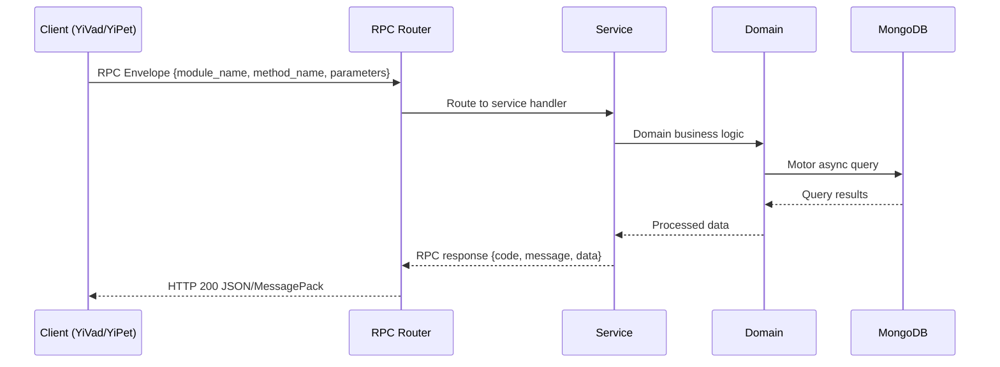

---

doc_type: module
prd_task_id: "YA-09-131"
title: "YA-09-131: 对话摘要与回顾 — 自动总结 + 跨会话上下文 — 开发方案"
status: 需求已编写
priority: P2
owner: 陈铭
roles: [engineer]
created: 2026-09-11
updated: 2026-09-14
project: YiAi
project_id: yiai
prd_month: "202609"
estimate_frontend: 0.5
source_prd: "177-需求-对话摘要与回顾.md"
source_okr: [yiai-001]

type: task
---

# YA-09-131: 对话摘要与回顾 — 自动总结 + 跨会话上下文

> **文档职责**：本文档定义**怎么做、为什么这么做、实际做成什么样**（HOW），不含产品目标与测试用例。

> 来源 PRD：[177-需求-对话摘要与回顾.md](../../prds/2026-09/177-需求-对话摘要与回顾.md)
> 需求编号：YA-09-131 · 优先级：P2 · 人天：0.5 · 状态：需求已编写
> 类型：功能 · 依赖：聊天服务（chat_service）、会话管理（sessions）、LLM 推理

---

<a id="sec-1"></a>
## 一、架构概览 / Architecture Overview

YA-09-171: 对话摘要与回顾 — 会话自动总结、跨会话上下文延续与摘要导出


<a id="sec-2"></a>
## 二、文件清单 / File Manifest

| 文件 / File | 操作 | 说明 / Description |
|-------------|------|--------------------|
| `YiAi/src/services/xxx/service.py` | 新增 | Core service logic
| `YiAi/src/services/xxx/rpc_handler.py` | 新增 | RPC route handler
| `YiAi/tests/test_xxx.py` | 新增 | Unit tests

> Source PRD: 177-需求-对话摘要与回顾.md

<a id="sec-3"></a>
## 三、Python 签名与核心组件 / Python Signatures

### 3.1 核心组件

```python
from enum import Enum
from pydantic import BaseModel, Field
from datetime import datetime
class SummaryStatus(str, Enum):
class ActionItem(BaseModel):
    """行动项。"""
class Decision(BaseModel):
    """决策记录。"""
class ConversationSummary(BaseModel):
    """对话摘要。"""
class SessionRecap(BaseModel):
    """会话回顾提示。"""
class CrossSessionContext(BaseModel):
    """跨会话上下文。"""
```
### 3.2 组件 2

```python
import json
import asyncio
from datetime import datetime
class SummaryGenerator:
    """对话摘要生成器。"""
    def __init__(self):
        self.repo = SummaryRepository()
    async def generate_summary(
        """生成对话摘要。
        """
        # 预处理消息
        # 构建对话文本
        # 调用 LLM 生成摘要
                # 存储摘要
                return summary
                if attempt == self.MAX_RETRIES - 1:
                    # 最后一次尝试失败，使用自由文本兜底
                    return await self._fallback_summary(session_key, conversation_text, model)
    async def generate_incremental_summary(
        """生成增量摘要（用于长会话中途触发）。
    def _preprocess_messages(self, messages: list[dict]) -> list[dict]:
    def _build_conversation_text(self, messages: list[dict]) -> str:
    async def _call_llm(self, conversation_text: str, model: str = None) -> str:
        import ollama
    def _parse_json_response(self, raw_response: str) -> dict:
```
### 3.3 组件 3

```python
class ContextLinker:
    """跨会话上下文关联器。"""
    def __init__(self):
        self.repo = SummaryRepository()
    async def find_related_sessions(
        """查找与当前会话相关的历史会话。
        """
        # 1. 获取当前会话的 Embedding
        # 2. 获取用户的所有历史会话摘要
        # 3. 计算相似度
            if hist_summary.session_key == session_key:
            if similarity >= self.SIMILARITY_THRESHOLD:
        # 4. 按相似度排序，取 Top-N
        # 5. 提取共同话题
            if sess_summary:
        return CrossSessionContext(
    def _build_session_text(self, summary: ConversationSummary) -> str:
        """构建用于 Embedding 的会话文本。"""
        return " ".join(parts)
    async def _embed_text(self, text: str) -> list[float]:
        import ollama
    def _cosine_similarity(self, a: list[float], b: list[float]) -> float:
```

<a id="sec-4"></a>
## 四、数据流 / Data Flow



**Call chain**: `Client -> RPC Router -> Service -> Domain -> MongoDB`  
**Response format**: `{code: 0, message: "ok", data: ...}`  
**Async model**: Full-chain `async/await`, Motor async MongoDB driver.  
**Error propagation**: Service exceptions caught by middleware -> standard error codes (1001-9999).

<a id="sec-5"></a>
## 五、实施路线图 / Roadmap

**预估人天 / Estimated**: 0.5

| 步骤 / Step | 操作 / Action | 路径 / Path | 验证 / Verification | 人天 / Days |
|-------------|---------------|-------------|---------------------|-------------|
| 1 | 定义数据模型（ConversationSummary、SessionRecap、CrossSessionContext、Decision、ActionItem） | `domain/summary/models.py` | Pydantic 校验通过，枚举完整 | 0.03 |
| 2 | 实现摘要生成器（Prompt 构建、LLM 调用、JSON 解析、重试、兜底） | `domain/summary/summary_generator.py` | 生成结构化摘要，JSON 字段完整 | 0.08 |
| 3 | 实现摘要数据访问层（CRUD、全文搜索、反馈更新） | `domain/summary/summary_repository.py` | MongoDB 读写正常，搜索返回正确结果 | 0.04 |
| 4 | 实现跨会话关联器（Embedding 相似度、上下文链） | `domain/summary/context_linker.py` | 相关会话检测准确率 > 80% | 0.05 |
| 5 | 实现导出服务（Markdown 生成、PDF 转换） | `services/summary/export_service.py` | Markdown 格式正确，PDF 可渲染 | 0.04 |
| 6 | 实现摘要服务 RPC（generate_summary、get_recap、search、export、feedback、cross_context） | `services/summary/summary_service.py` | 所有 RPC 接口正常响应 | 0.06 |
| 风险 | 概率 | 影响 | 等级 | 缓解措施 | 应急预案 |
| LLM 生成的 JSON 格式不稳定 | 中 | 中 | 中 | 低温度（0.3），3 次重试，自由文本兜底 | 手动编辑摘要 |
| 摘要质量差（遗漏关键信息） | 中 | 中 | 中 | 用户反馈机制，质量评分 | 用户手动补充摘要 |
| 跨会话关联误判 | 中 | 低 | 低 | 相似度阈值 0.7，用户可手动调整 | 用户手动关联/取消关联 |
| 摘要生成耗时影响会话关闭体验 | 低 | 低 | 低 | 异步生成，关闭时立即返回，摘要后台生成 | 关闭时同步生成（降级） |
| 超长会话摘要生成超时 | 低 | 中 | 低 | 长会话中途增量摘要，关闭时合并 | 截断消息，仅摘要最近 50 轮 |

<a id="sec-6"></a>
## 六、代码审查检查清单 / Review Checklist

- [ ] `ConversationSummary` 包含 overview、key_topics、decisions、action_items、open_questions、timeline
- [ ] `Decision` 和 `ActionItem` 模型字段完整
- [ ] 摘要生成器 Prompt 包含 JSON 格式约束和示例
- [ ] 摘要生成器支持最多 3 次重试
- [ ] 摘要生成器支持 JSON 解析失败时的自由文本兜底
- [ ] 跨会话关联器使用 Embedding 相似度，阈值 0.7
- [ ] 导出服务支持 Markdown 和 PDF 格式
- [ ] 摘要搜索支持关键词和话题过滤
- [ ] 用户反馈接口支持 positive/negative/neutral
- [ ] `ruff` 代码规范通过
- [ ] `mypy` 类型检查通过
---
## 十二、回归问题预测
| # | 问题 | 发现场景 | 根因 | 修复方式 |
|-----|------|---------|------|---------|
| 1 | 摘要生成对非中英文对话效果差 | 用户使用混合语言对话 | Prompt 仅针对中文优化 | 在 Prompt 中添加语言检测和多语言支持 |
| 2 | 关联合并摘要时信息丢失 | 长会话（>100 轮）关闭时合并增量摘要 | 增量摘要之间缺乏衔接 | 合并时使用 LLM 再次总结增量摘要 |

<a id="sec-7"></a>
## 七、风险表 / Risk Table

| 风险 / Risk | 影响 / Impact | 缓解措施 / Mitigation | 应急预案 / Contingency |
|-------------|---------------|----------------------|------------------------|
| LLM 生成的 JSON 格式不稳定 | 中 | 中 | 中 |
| 摘要质量差（遗漏关键信息） | 中 | 中 | 中 |
| 跨会话关联误判 | 中 | 低 | 低 |
| 摘要生成耗时影响会话关闭体验 | 低 | 低 | 低 |
| 超长会话摘要生成超时 | 低 | 中 | 低 |
| 回滚场景 | 回滚方式 | 影响范围 | 恢复时间 |
| 摘要生成服务异常 | 关闭摘要功能（配置开关） | 摘要功能不可用 | 2min |
| 摘要质量差导致用户投诉 | 降低摘要功能优先级，仅显示自由文本概述 | 摘要体验 | 5min |
| 跨会话关联导致性能问题 | 关闭自动关联，仅支持手动关联 | 跨会话功能 | 2min |
| 指标 | 采集方式 | 告警阈值 | 说明 |
