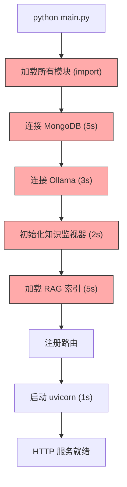
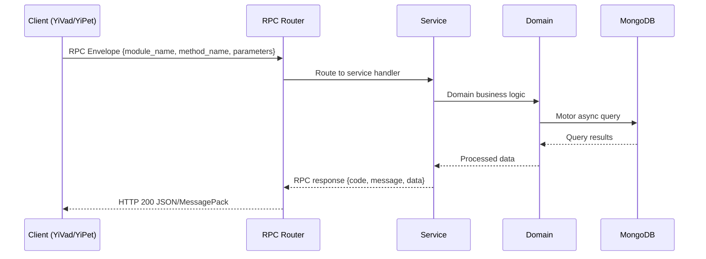

---

doc_type: module
prd_task_id: "YA-09-172"
title: "YA-09-172: 冷启动优化 — FastAPI 启动加速、懒加载与并行初始化 — 开发任务"
status: 需求已编写
priority: P2
owner: 陈铭
roles: [engineer]
created: 2026-09-11
updated: 2026-09-11
project: YiAi
project_id: yiai
prd_month: "202609"
estimate_frontend: 0.3
source_prd: "178-需求-冷启动优化.md"
source_okr: [yiai-001]

type: task
---

# YA-09-172: 冷启动优化 — FastAPI 启动加速、懒加载与并行初始化

> **文档职责**：本文档定义**怎么做、为什么这么做、实际做成什么样**（HOW），不含产品目标与测试用例。

> 来源 PRD：[178-需求-冷启动优化.md](../../prds/2026-09/178-需求-冷启动优化.md)
> 需求编号：YA-09-172 · 优先级：P2 · 人天：0.3 · 状态：需求已编写
> 类型：基础设施 · 依赖：FastAPI 应用主体、服务模块注册、MongoDB 连接、Ollama 连接

---

<a id="sec-1"></a>
## 一、架构概览 / Architecture Overview

YA-09-172: 冷启动优化 — FastAPI 启动加速、懒加载与并行初始化



<a id="sec-2"></a>
## 二、文件清单 / File Manifest

| 文件 / File | 操作 | 说明 / Description |
|-------------|------|--------------------|
| `YiAi/src/services/xxx/service.py` | 新增 | Core service logic
| `YiAi/src/services/xxx/rpc_handler.py` | 新增 | RPC route handler
| `YiAi/tests/test_xxx.py` | 新增 | Unit tests

> Source PRD: 178-需求-冷启动优化.md

<a id="sec-3"></a>
## 三、Python 签名与核心组件 / Python Signatures

### 3.1 核心组件

```python
from enum import Enum
from pydantic import BaseModel, Field
from datetime import datetime
import time
class ComponentStatus(str, Enum):
class ComponentInfo(BaseModel):
    """组件信息。"""
class StartupReport(BaseModel):
    """启动报告。"""
class LazyModule(BaseModel):
    """懒加载模块描述。"""
```
### 3.2 组件 2

```python
import importlib
import time
from typing import Any
class LazyLoader:
    """模块懒加载器：延迟导入和初始化，减少启动时间。"""
    def __init__(self):
        self._modules: dict[str, LazyModule] = {}
        self._instances: dict[str, Any] = {}
    def register(
        """注册一个懒加载模块。
        """
        self._modules[key] = LazyModule(
    def get(self, module_path: str, class_name: str) -> Any:
        """获取模块实例（首次访问时懒加载）。
        """
        if key in self._instances:
            return self._instances[key]
        # 懒加载：首次访问时导入和初始化
        self._instances[key] = instance
        if key in self._modules:
    def get_initialized(self, module_path: str, class_name: str) -> Any | None:
    def is_initialized(self, module_path: str, class_name: str) -> bool:
    async def warmup(self, priority: int = None):
    def _topological_sort(self, modules: list[LazyModule]) -> list[LazyModule]:
        def visit(mod: LazyModule):
```
### 3.3 组件 3

```python
import asyncio
import time
from concurrent.futures import ThreadPoolExecutor
class ParallelInitializer:
    """并行初始化器：使用 asyncio.gather + 线程池并行初始化组件。"""
    def __init__(self):
        self.lazy_loader = LazyLoader()
        self.components: dict[str, ComponentInfo] = {}
        self._executor = ThreadPoolExecutor(max_workers=4)
    async def initialize_all(self, components: list[dict]) -> StartupReport:
        """并行初始化所有组件。
        """
        # 初始化无依赖的组件
        # 并行初始化无依赖组件
            self.components[comp["name"]] = ComponentInfo(
        # 初始化有依赖的组件（依赖已就绪后并行）
            if deps.issubset(ready_names):
                self.components[comp["name"]] = ComponentInfo(
        if dep_tasks:
        # 生成启动报告
    async def _init_component(self, comp: dict):
    def get_component_status(self, name: str) -> ComponentStatus:
    def all_ready(self) -> bool:
```

<a id="sec-4"></a>
## 四、数据流 / Data Flow



**Call chain**: `Client -> RPC Router -> Service -> Domain -> MongoDB`  
**Response format**: `{code: 0, message: "ok", data: ...}`  
**Async model**: Full-chain `async/await`, Motor async MongoDB driver.  
**Error propagation**: Service exceptions caught by middleware -> standard error codes (1001-9999).

<a id="sec-5"></a>
## 五、实施路线图 / Roadmap

**预估人天 / Estimated**: 0.3

| 步骤 / Step | 操作 / Action | 路径 / Path | 验证 / Verification | 人天 / Days |
|-------------|---------------|-------------|---------------------|-------------|
| 1 | 定义数据模型（ComponentInfo、StartupReport、LazyModule） | `domain/startup/models.py` | Pydantic 校验通过 | 0.02 |
| 2 | 实现懒加载器（延迟导入、模块缓存、预热、拓扑排序） | `domain/startup/lazy_loader.py` | 懒加载模块首次访问时初始化，缓存命中 | 0.05 |
| 3 | 实现并行初始化器（asyncio.gather + 线程池、依赖管理） | `domain/startup/parallel_initializer.py` | MongoDB + Ollama 并行初始化，总耗时 < max(单独耗时) | 0.06 |
| 4 | 实现健康检查服务（存活探针、就绪探针、组件状态） | `server/health/health_service.py` | /health/liveness 返回 alive，/health/readiness 返回组件状态 | 0.04 |
| 5 | 实现启动基准测试（记录、比较、退化检测） | `domain/startup/startup_benchmark.py` | 启动时间记录到 JSON，退化检测正确 | 0.04 |
| 6 | 改造 main.py（Lifespan 事件、懒加载注册、路由适配） | `main.py` | HTTP 服务在 2s 内可访问，组件在后台初始化 | 0.06 |
| 7 | 回归测试 | 全模块 | 所有 RPC 接口正常，聊天/RAG 功能正常 | 0.03 |
| 风险 | 概率 | 影响 | 等级 | 缓解措施 | 应急预案 |
| 懒加载导致首次请求延迟高 | 中 | 中 | 中 | 后台预热高优先级模块，首次请求前已完成初始化 | 对高优先级模块禁用懒加载 |
| 并行初始化资源竞争 | 低 | 中 | 低 | 限制并发数（max_workers=4），依赖管理 | 降级为串行初始化 |
| 循环依赖导致初始化死锁 | 低 | 高 | 中 | 拓扑排序检测循环依赖，记录警告 | 手动指定初始化顺序 |
| 健康检查误判 | 低 | 中 | 低 | 就绪探针检查所有关键组件，存活探针仅检查进程 | 手动验证组件状态 |

<a id="sec-6"></a>
## 六、代码审查检查清单 / Review Checklist

- [ ] `LazyLoader` 支持注册、获取、预热、拓扑排序
- [ ] `LazyLoader.get()` 在首次访问时导入模块，之后命中缓存
- [ ] `ParallelInitializer` 支持 asyncio.gather + 线程池混合
- [ ] `ParallelInitializer` 正确处理依赖关系
- [ ] `HealthService.liveness()` 仅检查进程存活
- [ ] `HealthService.readiness()` 检查所有组件状态
- [ ] 未初始化组件返回 503 + Retry-After
- [ ] `StartupBenchmark` 记录和比较启动时间
- [ ] 退化检测阈值设置为 10%
- [ ] `main.py` 使用 Lifespan 事件管理启动和关闭
- [ ] `ruff` 代码规范通过
- [ ] `mypy` 类型检查通过
---
## 十二、回归问题预测
| # | 问题 | 发现场景 | 根因 | 修复方式 |
|-----|------|---------|------|---------|
| 1 | 懒加载模块在首次请求时超时 | 用户首次调用 RAG 搜索，等待 5s+ | 懒加载触发 LLM 模型加载（耗时） | 将 LLM 模型加载提前到预热阶段 |

<a id="sec-7"></a>
## 七、风险表 / Risk Table

| 风险 / Risk | 影响 / Impact | 缓解措施 / Mitigation | 应急预案 / Contingency |
|-------------|---------------|----------------------|------------------------|
| 懒加载导致首次请求延迟高 | 中 | 中 | 中 |
| 并行初始化资源竞争 | 低 | 中 | 低 |
| 循环依赖导致初始化死锁 | 低 | 高 | 中 |
| 健康检查误判 | 低 | 中 | 低 |
| 启动基准数据损坏 | 低 | 低 | 低 |
| 回滚场景 | 回滚方式 | 影响范围 | 恢复时间 |
| 懒加载导致功能异常 | 恢复全量导入的 main.py | 启动速度 | 2min |
| 并行初始化导致组件初始化顺序错乱 | 改为串行初始化（配置开关） | 启动速度 | 1min |
| 健康检查就绪探针误判 | 关闭就绪探针，仅保留存活探针 | K8s 部署 | 1min |
| 指标 | 采集方式 | 告警阈值 | 说明 |
