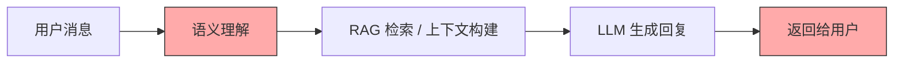
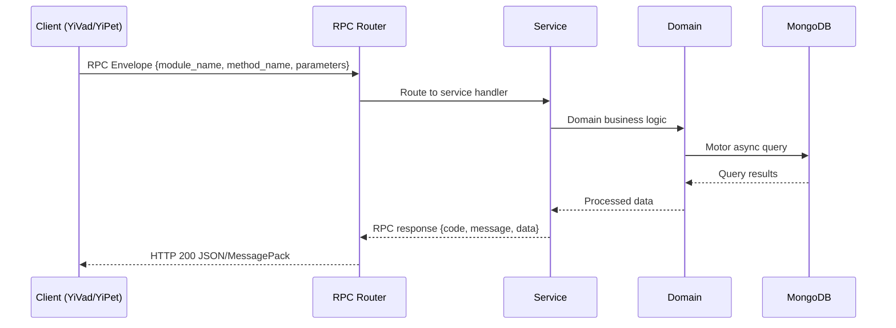

---

doc_type: module
prd_task_id: "YA-09-140"
title: "YA-09-140: 对话情感分析 — 实时情绪识别 + 自适应响应 — 开发方案"
status: 需求已编写
priority: P2
owner: 陈铭
roles: [engineer]
created: 2026-09-11
updated: 2026-09-14
project: YiAi
project_id: yiai
prd_month: "202609"
estimate_frontend: 0.5
source_prd: "179-需求-对话情感分析.md"
source_okr: [yiai-002]

type: task
---

# YA-09-140: 对话情感分析 — 实时情绪识别 + 自适应响应

> **文档职责**：本文档定义**怎么做、为什么这么做、实际做成什么样**（HOW），不含产品目标与测试用例。

> 来源 PRD：[179-需求-对话情感分析.md](../../prds/2026-09/179-需求-对话情感分析.md)
> 需求编号：YA-09-140 · 优先级：P2 · 人天：0.5 · 状态：需求已编写
> 类型：功能 · 依赖：聊天服务（chat_service）、LLM 推理、会话管理（sessions）

---

<a id="sec-1"></a>
## 一、架构概览 / Architecture Overview

YA-09-173: 对话情感分析 — 实时情绪识别、自适应响应与情感趋势追踪



<a id="sec-2"></a>
## 二、文件清单 / File Manifest

| 文件 / File | 操作 | 说明 / Description |
|-------------|------|--------------------|
| `YiAi/src/services/xxx/service.py` | 新增 | Core service logic
| `YiAi/src/services/xxx/rpc_handler.py` | 新增 | RPC route handler
| `YiAi/tests/test_xxx.py` | 新增 | Unit tests

> Source PRD: 179-需求-对话情感分析.md

<a id="sec-3"></a>
## 三、Python 签名与核心组件 / Python Signatures

### 3.1 核心组件

```python
from enum import Enum
from pydantic import BaseModel, Field
from datetime import datetime
class SentimentLabel(str, Enum):
class SentimentTrend(str, Enum):
class SentimentResult(BaseModel):
    """单条消息的情感分析结果。"""
class SentimentState(BaseModel):
    """会话情感状态（仅内存，不持久化）。"""
class AdaptivePrompt(BaseModel):
    """自适应 System Prompt。"""
class SentimentAnalytics(BaseModel):
    """聚合情感分析数据（脱敏存储）。"""
```
### 3.2 组件 2

```python
import asyncio
import time
class SentimentAnalyzer:
    """情感分析器：使用专用模型进行实时情感分析，LLM 作为补充。"""
    # 情感标签的正负面映射
    def __init__(self):
        self._model_loaded = False
    async def analyze(self, text: str) -> SentimentResult:
        """分析单条消息的情感。
        """
        # 1. 尝试专用模型（低延迟）
            if result.confidence >= self.CONFIDENCE_THRESHOLD:
                return result
        # 2. 降级为 LLM 分类
            return result
        # 3. 规则兜底
        return result
    async def _model_analyze(self, text: str) -> SentimentResult:
        """使用专用情感模型分析。"""
        # 使用 Ollama 加载的情感分类模型
        import ollama
    async def _llm_analyze(self, text: str) -> SentimentResult:
        import ollama
        import json
```
### 3.3 组件 3

```python
from collections import deque
class SentimentTracker:
    """情感状态追踪器：追踪会话中的情感变化趋势。"""
    def __init__(self):
        # 仅内存存储: {session_key: SentimentState}
        self._sessions: dict[str, SentimentState] = {}
    def track(self, session_key: str, result: SentimentResult) -> SentimentState:
        """记录一次情感分析结果，更新会话状态。
        """
        if session_key not in self._sessions:
            self._sessions[session_key] = SentimentState(
        # 添加新结果
        if len(state.history) > self.WINDOW_SIZE:
        # 更新连续负面计数
        if result.label in SentimentAnalyzer.NEGATIVE_LABELS:
        else:
        # 更新趋势
        # 更新满意度预测
        # 检查升级触发
        if state.consecutive_negative >= self.ESCALATION_THRESHOLD:
    def _calculate_trend(self, history: list[SentimentResult]) -> SentimentTrend:
        def positive_ratio(results):
    def _predict_satisfaction(self, history: list[SentimentResult]) -> float:
    def get_state(self, session_key: str) -> SentimentState | None:
    def clear_session(self, session_key: str):
```

<a id="sec-4"></a>
## 四、数据流 / Data Flow



**Call chain**: `Client -> RPC Router -> Service -> Domain -> MongoDB`  
**Response format**: `{code: 0, message: "ok", data: ...}`  
**Async model**: Full-chain `async/await`, Motor async MongoDB driver.  
**Error propagation**: Service exceptions caught by middleware -> standard error codes (1001-9999).

<a id="sec-5"></a>
## 五、实施路线图 / Roadmap

**预估人天 / Estimated**: 0.5

| 步骤 / Step | 操作 / Action | 路径 / Path | 验证 / Verification | 人天 / Days |
|-------------|---------------|-------------|---------------------|-------------|
| 1 | 定义数据模型（SentimentLabel、SentimentTrend、SentimentResult、SentimentState、AdaptivePrompt、SentimentAnalytics） | `domain/sentiment/models.py` | Pydantic 校验通过，枚举完整 | 0.02 |
| 2 | 实现情感分析器（专用模型 + LLM 分类 + 规则兜底） | `domain/sentiment/sentiment_analyzer.py` | 准确率 > 80%，延迟 < 100ms（模型） | 0.06 |
| 3 | 实现情感状态追踪器（趋势计算、连续负面检测、满意度预测） | `domain/sentiment/sentiment_tracker.py` | 趋势计算正确，连续负面检测准确 | 0.04 |
| 4 | 实现 Prompt 适配器（5 种情感标签的自适应 Prompt） | `domain/sentiment/prompt_adapter.py` | 每种标签生成对应的修饰语 | 0.04 |
| 5 | 实现升级检测器 | `domain/sentiment/escalation_detector.py` | 连续 5 轮负面触发升级建议 | 0.03 |
| 6 | 实现情感分析服务 RPC（analyze、adaptive_prompt、trend、escalation、analytics） | `services/sentiment/sentiment_service.py` | 所有 RPC 接口正常响应 | 0.06 |
| 7 | 集成到聊天服务（chat_service 调用情感分析 + 自适应 Prompt） | `chat_service.py` | 聊天回复包含情感自适应的语气 | 0.03 |
| 8 | 回归测试 | 全模块 | 聊天服务正常，情感数据仅内存 | 0.02 |
| 风险 | 概率 | 影响 | 等级 | 缓解措施 | 应急预案 |
| 情感分析误判（正面判为负面） | 中 | 中 | 中 | 置信度阈值（0.7），低置信度退回 LLM 分类 | 允许用户关闭情感自适应功能 |
| 情感分析增加聊天延迟 | 中 | 中 | 中 | 专用模型延迟 < 50ms，LLM 分类仅低置信度触发 | 降级为规则匹配（< 1ms） |
| 情感数据隐私泄露 | 低 | 高 | 中 | 仅内存处理，不持久化到消息记录 | 清除所有情感状态内存 |

<a id="sec-6"></a>
## 六、代码审查检查清单 / Review Checklist

- [ ] `SentimentLabel` 包含 5 种标签：positive、neutral、negative、frustrated、confused
- [ ] `SentimentTrend` 包含 4 种趋势：improving、declining、stable、fluctuating
- [ ] 情感分析器支持三级降级：专用模型 -> LLM -> 规则
- [ ] 置信度阈值 0.7，低于阈值退回 LLM
- [ ] 情感状态追踪器仅内存存储，不持久化
- [ ] 连续负面计数正确，5 轮触发升级
- [ ] Prompt 适配器为每种情感标签提供不同的修饰语
- [ ] 升级检测器根据情感模式提供针对性建议
- [ ] 聚合统计数据脱敏后存储
- [ ] `ruff` 代码规范通过
- [ ] `mypy` 类型检查通过
---
## 十二、回归问题预测
| # | 问题 | 发现场景 | 根因 | 修复方式 |
|-----|------|---------|------|---------|
| 1 | 情感分析误判中文讽刺/反语 | 用户说"真是太棒了（讽刺）"被判为 positive | 情感模型对中文反语理解差 | 增加上下文分析，结合前几轮情感判断 |
| 2 | 中英混合消息分析不准确 | 用户消息中英混杂 | 专用模型仅支持单一语言 | 先用语言检测拆分，分别分析后合并 |

<a id="sec-7"></a>
## 七、风险表 / Risk Table

| 风险 / Risk | 影响 / Impact | 缓解措施 / Mitigation | 应急预案 / Contingency |
|-------------|---------------|----------------------|------------------------|
| 情感分析误判（正面判为负面） | 中 | 中 | 中 |
| 情感分析增加聊天延迟 | 中 | 中 | 中 |
| 情感数据隐私泄露 | 低 | 高 | 中 |
| 过度共情导致回复冗长 | 低 | 低 | 低 |
| 情感分析模型不可用 | 低 | 中 | 低 |
| 回滚场景 | 回滚方式 | 影响范围 | 恢复时间 |
| 情感分析延迟过高 | 关闭情感分析功能（配置开关） | 聊天情感自适应 | 2min |
| 情感分析误判率高 | 提高置信度阈值至 0.9 | 情感分析覆盖范围 | 1min |
| 升级建议过于频繁 | 提高升级阈值至 8 轮 | 升级建议 | 1min |
| 指标 | 采集方式 | 告警阈值 | 说明 |
