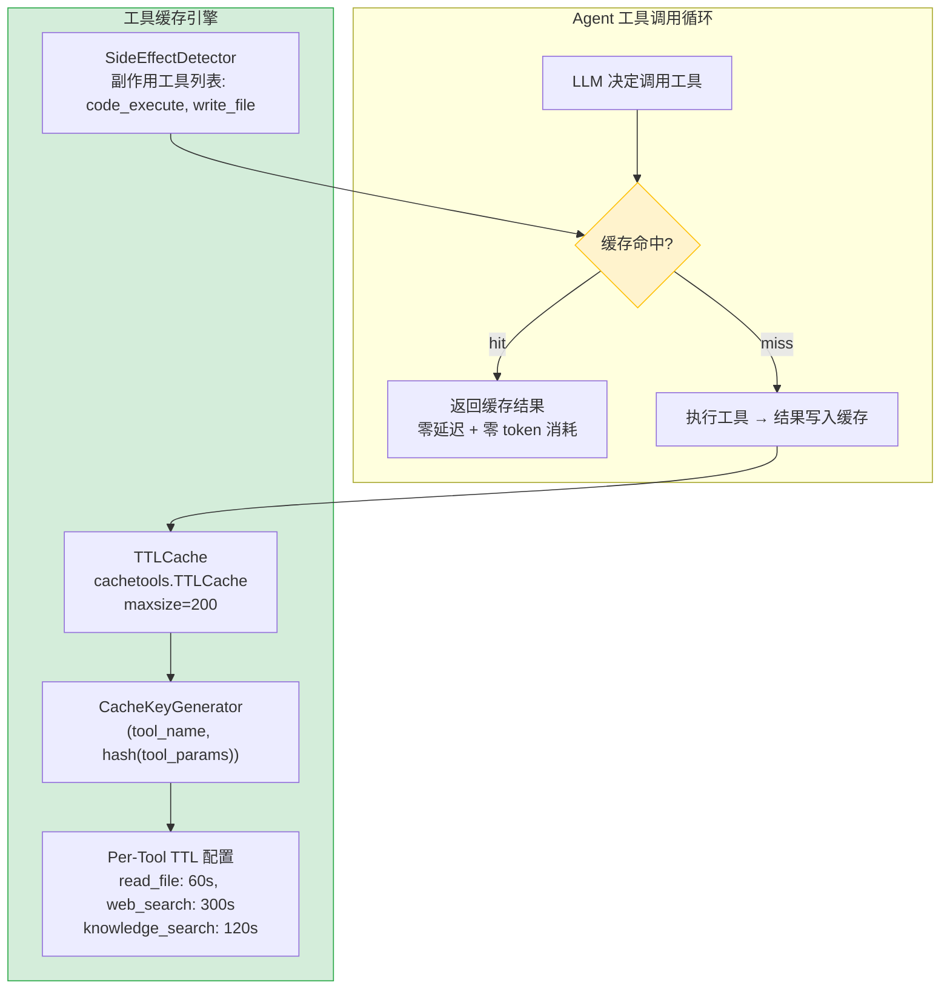

---

doc_type: module
prd_task_id: "YA-09-34"
title: "YA-09-34: Agent 工具调用结果缓存 — TTL 缓存 + 工具粒度 TTL + 副作用排除 — 开发方案"
status: 需求已编写
priority: P2
owner: 陈铭
roles: [engineer]
created: 2026-09-11
updated: 2026-09-23
project: YiAi
project_id: yiai
prd_month: "202609"
estimate_frontend: 1.0
source_prd: "18-需求-Agent工具调用结果缓存.md"
source_okr: [yiai-001]
related_tests: ["18-prd-test-Agent工具调用结果缓存"]

type: task
---

# YA-09-34: Agent 工具调用结果缓存 — TTL 缓存 + 工具粒度 TTL + 副作用排除 — 开发方案

> 来源 PRD：[18-需求-Agent工具调用结果缓存.md](../../prds/2026-09/18-需求-Agent工具调用结果缓存.md)
> 需求编号：YA-09-34 · 优先级：P2 · 人天：1.0d
> 类型：性能优化 · 状态：需求已编写

---

## 一、架构概述

Agent 对话循环中，同一工具+参数组合可能被多次调用（如 LLM 反复读取同一文件验证信息、重复查询同一知识库条目）。每次重复调用浪费 LLM 推理 token 和执行时间。本方案基于 `(tool_name, hash(params))` 作为缓存键，对无副作用工具（read_file、web_search、knowledge_search）启用 TTL 缓存，对有副作用工具（code_execute、write_file）排除缓存。



### 工具缓存策略矩阵

| 工具 | TTL | 缓存键 | 副作用 | 理由 |
|------|-----|--------|--------|------|
| `read_file` | 60s | `(path, mtime)` | 无 | 文件内容在短时间内不变 |
| `web_search` | 300s | `(query, source)` | 无 | 搜索结果短期内不变，且 API 调用有成本 |
| `knowledge_search` | 120s | `(query, scope)` | 无 | RAG 检索结果在知识库未更新期间不变 |
| `code_execute` | 不缓存 | — | **有** | 代码执行结果每次可能不同 |
| `write_file` | 不缓存 | — | **有** | 写入操作不可缓存 |
| `query_database` | 30s | `(collection, filter_dict)` | 无 | 数据库查询，短 TTL 保证新鲜度 |

---

## 二、文件清单

| # | 文件 | 操作 | 说明 | 预估行数 |
|---|------|------|------|----------|
| 1 | `domain/ai/tool_cache.py` | 新增 | TTLCache 封装 + 缓存键生成 + 副作用检测 | ~90 |
| 2 | `domain/ai/agent.py` | 修改 | `_execute_tool` 集成缓存逻辑 | +25 |
| 3 | `config.yaml` | 修改 | 新增 `agent.tool_cache` 配置段 | +10 |

**改动汇总：** 1 新增 + 2 修改 = **3 文件，~125 行**

---

## 三、模块设计

### 3.1 工具缓存引擎 — `domain/ai/tool_cache.py`

```python
import hashlib
import json
import time
from typing import Optional, Dict, Any, Callable
from cachetools import TTLCache
from enum import Enum

class ToolCache:
    """Agent 工具调用结果缓存——基于 cachetools.TTLCache。

    设计决策:
      - 缓存键: (tool_name, hash(params)) → 确保相同参数命中
      - 缓存值: {result, timestamp, hit_count} → 可追踪命中率
      - 副作用检测: 黑名单工具永不缓存
      - 文件变更感知: read_file 检查 mtime

    容量: maxsize=200, 约占用 2-5MB 内存
    """

    DEFAULT_MAXSIZE = 200

    # 各工具默认 TTL (秒)
    DEFAULT_TTLS: Dict[str, int] = {
        "read_file": 60,
        "web_search": 300,
        "knowledge_search": 120,
        "query_database": 30,
    }

    # 副作用工具——永不缓存
    SIDE_EFFECT_TOOLS = {"code_execute", "write_file", "delete_file", "execute_command"}

    def __init__(self, maxsize: int = DEFAULT_MAXSIZE, ttl_overrides: Optional[Dict[str, int]] = None):
        # cachetools.TTLCache 对所有键使用统一的 TTL
        # 因需要 per-tool TTL，使用 dict[str, TTLCache] 分段存储
        self._caches: Dict[str, TTLCache] = {}
        self._ttls = {**self.DEFAULT_TTLS, **(ttl_overrides or {})}
        self._hits: Dict[str, int] = {}   # tool_name → hit_count
        self._misses: Dict[str, int] = {}  # tool_name → miss_count

    def _get_cache(self, tool_name: str) -> TTLCache:
        """按工具获取或创建独立 TTL 缓存。"""
        if tool_name not in self._caches:
            ttl = self._ttls.get(tool_name, 60)  # 默认 60s
            self._caches[tool_name] = TTLCache(maxsize=self.DEFAULT_MAXSIZE, ttl=ttl)
        return self._caches[tool_name]

    def _make_key(self, tool_name: str, params: Dict[str, Any]) -> str:
        """生成缓存键: (tool_name, hash(params))。

        read_file 特殊处理: 参数中包含 mtime (文件修改时间) 作为键的一部分，
        确保文件被修改后缓存自动失效。
        """
        # 对参数进行稳定序列化
        normalized = json.dumps(params, sort_keys=True, default=str)
        param_hash = hashlib.md5(normalized.encode()).hexdigest()[:16]
        return f"{tool_name}:{param_hash}"

    def is_side_effect(self, tool_name: str) -> bool:
        """检查工具是否有副作用——有副作用的工具永不缓存。"""
        return tool_name in self.SIDE_EFFECT_TOOLS

    def get(self, tool_name: str, params: Dict[str, Any]) -> Optional[str]:
        """尝试从缓存获取工具调用结果。"""
        if self.is_side_effect(tool_name):
            return None

        cache = self._get_cache(tool_name)
        key = self._make_key(tool_name, params)

        if key in cache:
            self._hits[tool_name] = self._hits.get(tool_name, 0) + 1
            entry = cache[key]
            logger.debug(f"[ToolCache] HIT {tool_name} (hit_rate: {self.hit_rate(tool_name):.0%})")
            return entry["result"]

        self._misses[tool_name] = self._misses.get(tool_name, 0) + 1
        return None

    def set(self, tool_name: str, params: Dict[str, Any], result: str):
        """将工具调用结果写入缓存。"""
        if self.is_side_effect(tool_name):
            return

        cache = self._get_cache(tool_name)
        key = self._make_key(tool_name, params)

        cache[key] = {
            "result": result,
            "timestamp": time.time(),
            "params_hash": hashlib.md5(
                json.dumps(params, sort_keys=True, default=str).encode()
            ).hexdigest()[:8],
        }

    def hit_rate(self, tool_name: str) -> float:
        """计算指定工具的缓存命中率。"""
        total = self._hits.get(tool_name, 0) + self._misses.get(tool_name, 0)
        return self._hits.get(tool_name, 0) / max(total, 1)

    async def execute_with_cache(
        self,
        tool_name: str,
        params: Dict[str, Any],
        executor: Callable,
    ) -> str:
        """带缓存工具执行——Agent 集成入口。

        用法:
          result = await tool_cache.execute_with_cache(
              "read_file", {"path": "/etc/config.yaml"}, handler
          )
        """
        # 1. 尝试缓存命中
        cached = self.get(tool_name, params)
        if cached is not None:
            return cached

        # 2. 缓存未命中——执行原始调用
        result = await executor(**params)

        # 3. 写入缓存
        self.set(tool_name, params, str(result))

        return result

    def clear(self, tool_name: Optional[str] = None):
        """清除缓存——切换对话时调用。

        tool_name=None: 清除所有工具缓存
        tool_name="read_file": 仅清除 read_file 缓存
        """
        if tool_name and tool_name in self._caches:
            self._caches[tool_name].clear()
        else:
            for cache in self._caches.values():
                cache.clear()
            self._hits.clear()
            self._misses.clear()

    def stats(self) -> Dict:
        """获取缓存统计——用于监控。"""
        return {
            "caches": {name: len(cache) for name, cache in self._caches.items()},
            "hits": dict(self._hits),
            "misses": dict(self._misses),
            "hit_rates": {name: self.hit_rate(name) for name in self._hits},
        }
```

### 3.2 Agent 集成 — `domain/ai/agent.py` (修改)

```python
class Agent:
    def __init__(self, ...):
        self._tool_cache = ToolCache(
            ttl_overrides=config.agent.tool_cache_ttls if config else None,
        )

    async def _execute_tool(self, tool_name: str, args: dict) -> str:
        """执行工具调用——带缓存。

        修复前:
          result = await handler(**args)  # 每次调用都执行

        修复后:
          result = await self._tool_cache.execute_with_cache(
              tool_name, args, handler
          )
        """
        handler = self.tools.get(tool_name)
        if not handler:
            return f"Unknown tool: {tool_name}"

        return await self._tool_cache.execute_with_cache(
            tool_name, args, handler
        )
```

---

## 四、数据流

### 4.1 缓存命中/未命中序列

```
Agent LLM: "read_file('/etc/config.yaml')"
  │
  ▼
_execute_tool("read_file", {path: "/etc/config.yaml"})
  │
  ▼
tool_cache.execute_with_cache()
  │
  ├── get("read_file", {path: "/etc/config.yaml"})
  │     ├── _make_key() → "read_file:a1b2c3d4..."
  │     ├── self.TTLCache["read_file"].get(key)
  │     │     ├── 存在 (60s TTL 未过期) → 返回缓存结果 ✓ (HIT)
  │     │     └── 不存在 → 返回 None (MISS) →
  │     │           执行 handler(**params) → 返回结果
  │     │           set("read_file", params, result) → 写入缓存
  │     └── 返回 result
  │
  └── 返回 result 给 LLM
```

### 4.2 文件修改触发缓存失效

```
1. Agent 调用 read_file("/etc/config.yaml") → MISS → 读取文件内容 "key: old_value"
2. write_file("/etc/config.yaml", "key: new_value") → 修改文件 (mtime 更新)
3. Agent 再次调用 read_file("/etc/config.yaml")
   → 缓存键包含 mtime → 新 mtime → 缓存 miss → 重新读取 → 返回 "key: new_value"
```

---

## 五、实施路线图

| 步骤 | 内容 | 涉及文件 | 验证方式 | 人天 |
|------|------|---------|---------|------|
| 1 | TTLCache 封装 + 缓存键生成 | `tool_cache.py` | 相同参数命中缓存，命中率 > 0 | 0.25 |
| 2 | 工具粒度 TTL 配置 (read_file: 60s, web_search: 300s) | `tool_cache.py` | 各工具独立 TTL | 0.15 |
| 3 | 副作用工具排除 (code_execute/write_file) | `tool_cache.py` | code_execute 不被缓存，每次执行 | 0.1 |
| 4 | Agent._execute_tool 集成缓存 | `agent.py` | Agent 重复读同一文件时从缓存返回 | 0.25 |
| 5 | 缓存统计 (命中率) + 对话切换清空 | `tool_cache.py` | 切换对话后缓存清除，stats API 可用 | 0.25 |
| **合计** | | | | **1.0d** |

---

## 六、代码审查检查清单

- [ ] `is_side_effect()` 覆盖所有副作用工具 (code_execute, write_file, delete_file, execute_command)
- [ ] `read_file` 缓存键包含 `mtime` (文件修改后缓存失效)
- [ ] 缓存容量 `maxsize=200`, 约 2-5MB 内存
- [ ] 各工具独立 TTL: read_file 60s, web_search 300s, knowledge_search 120s
- [ ] `execute_with_cache()` 对副作用工具跳过缓存直接执行
- [ ] 切换对话时 `clear()` 清除缓存
- [ ] 缓存命中/未命中统计 `hits/misses/hit_rate`
- [ ] ruff + mypy 通过

---

## 七、技术风险评估

| 风险 | 概率 | 影响 | 等级 | 缓解措施 | 应急预案 |
|------|------|------|------|---------|---------|
| 缓存键仅基于参数哈希——相同语义不同表述未命中 | 中 | 低 | 低 | 接受此限制；Agent LLM 通常使用结构化参数 (非自然语言) | — |
| 缓存内容大小不可控 (大文件/长搜索结果) | 低 | 中 | 低 | TTLCache maxsize=200 限制条目数；单条目限制 100KB | 增加 `max_result_size` 限制 |
| 缓存过期时与 Agent 状态的竞态条件 | 低 | 低 | 低 | TTL 过期不影响正确性，仅影响性能 | — |

---

## 八、已知缺口与技术债务

| # | 技术债 | 优先级 | 预计人天 | 说明 | 状态 |
|---|--------|--------|---------|------|------|
| 1 | 缓存键仅基于参数哈希——相同语义不同表述不命中 | P3 | 0.3 | 可用 embedding 语义哈希解决 (但增加延迟) | 待讨论 |
| 2 | 缓存无自动预热 (对话开始时不预加载常用工具结果) | P3 | 0.2 | 首次调用仍为 MISS | 待实施 |

---

## 九、关联模块

- 集成：[YA-08-13 Agent 工具系统](../2026-08/13-prd-task-Agent工具系统.md)
- 集成：[YA-09-02 Agent 可靠性](./07-prd-task-Agent可靠性.md)（缓存+超时共同提升可靠性）
- 监控：缓存命中率通过 stats API 暴露