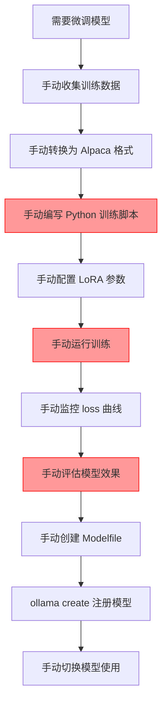
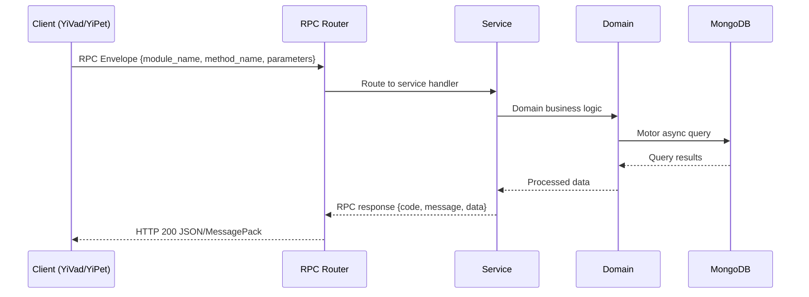

---

doc_type: module
prd_task_id: "YA-09-129"
title: "YA-09-129: LoRA 微调 — 参数高效 + 数据集管理 — 开发方案"
status: 需求已编写
priority: P2
owner: 陈铭
roles: [engineer]
created: 2026-09-11
updated: 2026-09-14
project: YiAi
project_id: yiai
prd_month: "202609"
estimate_frontend: 0.5
source_prd: "180-需求-参数高效微调.md"
source_okr: [yiai-002]

type: task
---

# YA-09-129: LoRA 微调 — 参数高效 + 数据集管理

> **文档职责**：本文档定义**怎么做、为什么这么做、实际做成什么样**（HOW），不含产品目标与测试用例。

> 来源 PRD：[180-需求-参数高效微调.md](../../prds/2026-09/180-需求-参数高效微调.md)
> 需求编号：YA-09-129 · 优先级：P2 · 人天：0.5 · 状态：需求已编写
> 类型：功能实现 · 依赖：YA-09-11（ModelRuntime 抽象层）、YA-09-166（模型注册与版本管理）

---

<a id="sec-1"></a>
## 一、架构概览 / Architecture Overview

YA-09-174: 参数高效微调 — LoRA/QLoRA 微调支持、数据集准备、训练监控、模型评估与注册



<a id="sec-2"></a>
## 二、文件清单 / File Manifest

| 文件 / File | 操作 | 说明 / Description |
|-------------|------|--------------------|
| `YiAi/src/services/xxx/service.py` | 新增 | Core service logic
| `YiAi/src/services/xxx/rpc_handler.py` | 新增 | RPC route handler
| `YiAi/tests/test_xxx.py` | 新增 | Unit tests

> Source PRD: 180-需求-参数高效微调.md

<a id="sec-3"></a>
## 三、Python 签名与核心组件 / Python Signatures

### 3.1 核心组件

```python
from dataclasses import dataclass
from typing import Optional, AsyncIterator
from enum import Enum
class FineTuningMethod(str, Enum):
class DatasetFormat(str, Enum):
@dataclass
class TrainingConfig:
@dataclass
class TrainingProgress:
class FineTuningService:
    def __init__(self, model_registry: ModelRegistry):
        self.registry = model_registry
        self._active_tasks: dict[str, TrainingTask] = {}
    async def prepare_dataset(
        """从数据源准备微调数据集"""
        return DatasetInfo(
    async def start_training(
        """启动微调训练，通过 SSE 推送进度"""
        self._active_tasks[task_id] = task
    async def _run_unsloth_training(
        import subprocess
        import json
    async def evaluate(
    async def export_to_ollama(
```
### 3.2 组件 2

```python
class DatasetPreparationService:
    async def collect_from_sessions(
        """从会话数据收集微调样本"""
                if msg["role"] == "user" and i + 1 < len(session["messages"]):
                    if next_msg["role"] == "assistant":
        return samples
    async def collect_from_bugs(
        """从 Bug 报告收集分类样本"""
        return samples
    def convert_to_alpaca(self, samples: list[dict]) -> list[dict]:
        """转换为 Alpaca 格式"""
        return [
    def convert_to_sharegpt(self, samples: list[dict]) -> list[dict]:
        """转换为 ShareGPT 格式"""
        return [
```

<a id="sec-4"></a>
## 四、数据流 / Data Flow



**Call chain**: `Client -> RPC Router -> Service -> Domain -> MongoDB`  
**Response format**: `{code: 0, message: "ok", data: ...}`  
**Async model**: Full-chain `async/await`, Motor async MongoDB driver.  
**Error propagation**: Service exceptions caught by middleware -> standard error codes (1001-9999).

<a id="sec-5"></a>
## 五、实施路线图 / Roadmap

**预估人天 / Estimated**: 0.5

| 步骤 / Step | 操作 / Action | 路径 / Path | 验证 / Verification | 人天 / Days |
|-------------|---------------|-------------|---------------------|-------------|
| 1 | 安装 Unsloth 依赖 | `requirements.txt` | `from unsloth import FastLanguageModel` | 0.05 |
| 2 | 实现数据集准备工具 | `services/ai/dataset_preparation.py` | 从会话/Bug 收集数据 | 0.1 |
| 3 | 实现 Unsloth 微调脚本 | `scripts/fine_tune.py` | QLoRA 微调 7B 模型 < 8GB | 0.1 |
| 4 | 实现 FineTuningService | `services/ai/fine_tuning_service.py` | 启动训练 + SSE 推送 | 0.1 |
| 5 | 实现模型评估 | `services/ai/model_evaluation.py` | Perplexity/ROUGE 计算 | 0.05 |
| 6 | 实现 Ollama 导出 | `FineTuningService.export_to_ollama` | Modelfile 生成 + ollama create | 0.05 |
| 7 | 实现 API 路由 | `api/routes/fine_tuning.py` | 创建/监控/评估 API | 0.05 |
| 风险 | 概率 | 影响 | 缓解措施 |
| 本地显存不足以微调 7B 模型 | 中 | 高 | QLoRA 4-bit 量化将显存需求降至 6-8GB |
| Unsloth 与 Python 版本不兼容 | 低 | 中 | 提供 Docker 镜像，固定 Python 3.10 + CUDA 版本 |
| 训练时间过长（数小时） | 高 | 中 | 支持 checkpoint 断点续训，训练失败后可恢复 |
| 微调后模型性能不如基础模型 | 中 | 中 | 保留基础模型作为 fallback，微调模型需通过评估才可部署 |

<a id="sec-6"></a>
## 六、代码审查检查清单 / Review Checklist

- [ ] Unsloth 微调脚本支持 LoRA 和 QLoRA 两种模式
- [ ] 数据集准备工具支持从会话和 Bug 收集数据
- [ ] 数据集支持 Alpaca 和 ShareGPT 两种格式
- [ ] 数据集自动分割为 train/val/test
- [ ] 训练进度通过 SSE 实时推送（loss、step、lr、GPU 内存）
- [ ] 训练支持 checkpoint 保存和断点续训
- [ ] 模型评估计算 Perplexity 和 ROUGE-L
- [ ] 评估结果包含相比基础模型的提升百分比
- [ ] 微调模型通过 Modelfile 导出到 Ollama
- [ ] 微调模型注册到 ModelRegistry
- [ ] A/B 对比评估复用现有盲测框架
- [ ] 单元测试覆盖数据集准备、评估计算、Modelfile 生成
---
## 回归问题预测
| # | 预测问题 | 原因 | 验证方法 |
|---|---------|------|---------|
| 1 | Unsloth 微调脚本在 macOS (Apple Silicon) 上因 CUDA 依赖失败 | Unsloth 核心依赖 CUDA，macOS 上没有 CUDA，需要 MLX 或 CPU fallback | 在 macOS 上运行微调，验证有明确的错误提示或 MLX fallback |
| 2 | 数据集从会话收集时，消息内容包含 Markdown 代码块，Alpaca 格式的 JSON 序列化失败 | 消息内容中的代码块包含未转义的特殊字符，JSON 序列化时报错 | 收集包含代码块的会话数据，验证数据集准备成功 |

<a id="sec-7"></a>
## 七、风险表 / Risk Table

| 风险 / Risk | 影响 / Impact | 缓解措施 / Mitigation | 应急预案 / Contingency |
|-------------|---------------|----------------------|------------------------|
| 本地显存不足以微调 7B 模型 | 中 | 高 | QLoRA 4-bit 量化将显存需求降至 6-8GB |
| Unsloth 与 Python 版本不兼容 | 低 | 中 | 提供 Docker 镜像，固定 Python 3.10 + CUDA 版本 |
| 训练时间过长（数小时） | 高 | 中 | 支持 checkpoint 断点续训，训练失败后可恢复 |
| 微调后模型性能不如基础模型 | 中 | 中 | 保留基础模型作为 fallback，微调模型需通过评估才可部署 |
| 数据集质量差导致微调效果差 | 中 | 高 | 提供数据质量检查工具，过滤低质量样本 |
| # | 预测问题 | 原因 | 验证方法 |
| 1 | Unsloth 微调脚本在 macOS (Apple Silicon) 上因 CUDA 依赖失败 | Unsloth 核心依赖 CUDA，macOS 上没有 CUDA，需要 MLX 或 CPU fallback | 在 macOS 上运行微调，验证有明确的错误提示或 MLX fallback |
| 2 | 数据集从会话收集时，消息内容包含 Markdown 代码块，Alpaca 格式的 JSON 序列化失败 | 消息内容中的代码块包含未转义的特殊字符，JSON 序列化时报错 | 收集包含代码块的会话数据，验证数据集准备成功 |
| 3 | 训练过程中 Ollama 服务因 GPU 显存被微调占用而无法响应推理请求 | 微调训练占用了全部 GPU 显存，Ollama 无法加载模型进行推理 | 微调训练期间尝试调用 Ollama API，验证有明确的错误提示或请求排队 |
| 4 | 微调模型导出时，LoRA 权重合并失败导致 Ollama 模型加载后输出乱码 | LoRA 权重合并过程中精度丢失或合并顺序错误 | 导出微调模型后使用相同 prompt 对比基础模型和微调模型的输出，验证微调模型输出正常 |
