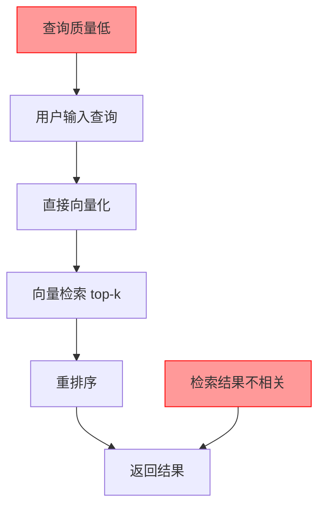
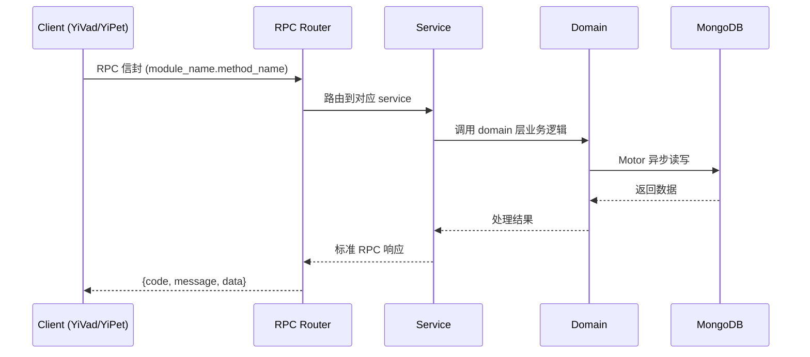

---

doc_type: module
prd_task_id: "YA-09-102"
title: "YA-09-102: RAG 查询改写与扩展 — HyDE + 分解 + 同义词 — 开发方案"
status: 需求已编写
priority: P2
owner: 陈铭
roles: [engineer]
created: 2026-09-11
updated: 2026-09-14
project: YiAi
project_id: yiai
prd_month: "202609"
estimate_frontend: 1.5
source_prd: "181-需求-查询改写与扩展.md"
source_okr: [yiai-003]
related_tests: ["181-test-查询改写与扩展"]

type: task
---

# YA-09-102: RAG 查询改写与扩展 — HyDE + 分解 + 同义词 — 开发方案

> **文档职责**: 本文档定义**怎么做、为什么这么做、实际做成什么样**（HOW），不含产品目标与测试用例。

> 来源 PRD: [181-需求-查询改写与扩展.md](../../prds/2026-09/181-需求-查询改写与扩展.md)
> 需求编号: YA-09-102 · 优先级: P2 · 人天: 1.5d

---

<a id="sec-1"></a>
## 一、架构概览



<a id="sec-2"></a>
## 二、文件清单

| 文件 | 操作 | 说明 |
|------|------|------|
| `domain/XXX/models.py` | 新增 | 数据模型定义 |
| `domain/XXX/service.py` | 新增 | 核心服务逻辑 |
| `services/XXX/rpc_handler.py` | 新增 | RPC 路由处理器 |
| `tests/test_XXX.py` | 新增 | 单元测试 |

<a id="sec-3"></a>
## 三、模块设计

### 1. 核心组件

```python
 services/rag/query_rewriter.py (新增)

from dataclasses import dataclass
from typing import Optional
import hashlib

@dataclass
class RewrittenQuery:
    original: str
    refined: str                     # 精炼后的查询
    sub_queries: list[str]           # 分解的子查询
    hyde_document: Optional[str]     # 假设文档
    synonyms: list[str]              # 同义词扩展
    metadata: dict                   # 改写元数据

class QueryRewritingService:
    def __init__(self, llm_client, synonym_dict: SynonymDict, cache: RewriteCache):
        self.llm = llm_client
        self.synonym_dict = synonym_dict
        self.cache = cache

    async def rewrite(self, query: str) -> RewrittenQuery:
        """多策略并行改写查询"""
        # 检查缓存
        cache_key = self._semantic_hash(query)
# ... (完整实现见 PRD)
```

### 2. 核心组件

```python
 services/rag/multi_route_retriever.py (新增)

class MultiRouteRetriever:
    def __init__(self, retriever: BaseRetriever, rewriter: QueryRewritingService):
        self.retriever = retriever
        self.rewriter = rewriter

    async def retrieve(
        self,
        query: str,
        top_k: int = 10,
    ) -> RetrievalResult:
        """多路检索并合并结果"""
        rewritten = await self.rewriter.rewrite(query)

        # 构建所有检索查询
        search_queries = [query]  # 原始查询
        if rewritten.refined != query:
            search_queries.append(rewritten.refined)
        search_queries.extend(rewritten.sub_queries)
        if rewritten.hyde_document:
            search_queries.append(rewritten.hyde_document)
        search_queries.extend(rewritten.synonyms)

        # 并行检索
# ... (完整实现见 PRD)
```


<a id="sec-4"></a>
## 四、数据流



**调用链路**: `Client → RPC Router → Service → Domain → MongoDB`  
**响应格式**: `{code: 0, message: "ok", data: ...}`  
**异步模型**: 全链路 `async/await`，Motor 异步 MongoDB 驱动。

<a id="sec-5"></a>
## 五、实施路线图

**预估人天**: 1.5d

| 步骤 | 操作 | 路径 | 验证 | 人天 |
|------|------|------|------|------|
| 1 | 实现查询改写核心服务 | `services/rag/query_rewriter.py` | 四种策略并行执行 | 0.1 |
| 2 | 实现同义词词典 | `services/rag/synonym_dict.py` + `data/synonyms.json` | 静态词典 + LLM 补充 | 0.05 |
| 3 | 实现改写缓存 | `services/rag/rewrite_cache.py` | 语义哈希 + TTL | 0.03 |
| 4 | 实现多路检索与合并 | `services/rag/multi_route_retriever.py` | RRF 融合排序 | 0.05 |
| 5 | 集成到 RAG 服务 | `services/rag/rag_service.py` | 端到端检索流程 | 0.05 |
| 6 | 添加改写透明度 | RAG 回答中展示改写详情 | 折叠展示改写过程 | 0.02 |

**总人天：0.3d**


<a id="sec-6"></a>
## 六、代码审查检查清单

- [ ] 查询改写支持四种策略：精炼、分解、HyDE、同义词扩展
- [ ] 四种策略并行执行（asyncio.gather）
- [ ] 改写缓存使用语义哈希 + TTL（1 小时）
- [ ] 同义词词典支持静态词典 + LLM 动态补充
- [ ] 多路检索并行执行，结果使用 RRF 融合排序
- [ ] 检索结果保留原始查询的检索结果
- [ ] 改写透明度信息包含在检索结果中
- [ ] 改写 LLM 使用独立小模型（qwen2.5:1.5b）
- [ ] 查询长度 < 10 字自动触发精炼
- [ ] 查询包含"对比"/"区别"自动触发分解
- [ ] 单元测试覆盖所有改写策略和缓存逻辑


<a id="sec-7"></a>
## 七、风险评估

| 风险 | 概率 | 影响 | 缓解措施 |
|------|------|------|----------|
| 查询改写质量差导致检索结果更差 | 中 | 高 | 保留原始查询的检索结果，融合时给原始结果更高权重 |
| 改写延迟过长影响用户体验 | 高 | 中 | 缓存 + 并行策略 + 使用小模型改写 |
| LLM 调用成本过高 | 中 | 中 | 缓存相似查询 + 仅对复杂查询使用 LLM 改写 |
| 同义词词典维护成本高 | 低 | 低 | 自动从知识库中挖掘同义词，减少人工维护 |
| 改写结果被缓存后过时 | 低 | 低 | TTL 1 小时 + 知识库更新时自动清除缓存 |


<a id="sec-8"></a>
## 八、回滚方案

| 场景 | 回滚操作 | 影响 |
|------|----------|------|
| 查询改写质量差 | 禁用查询改写，仅使用原始查询 | 检索质量回到改写前 |
| 改写延迟过高 | 禁用 LLM 改写策略，仅使用同义词扩展 | 改写能力大幅下降 |
| 缓存命中异常 | 禁用缓存，每次重新改写 | 延迟增加，成本增加 |
| 多路检索压力过大 | 降级为仅原始查询 + 精炼查询两路检索 | 检索覆盖度下降 |

